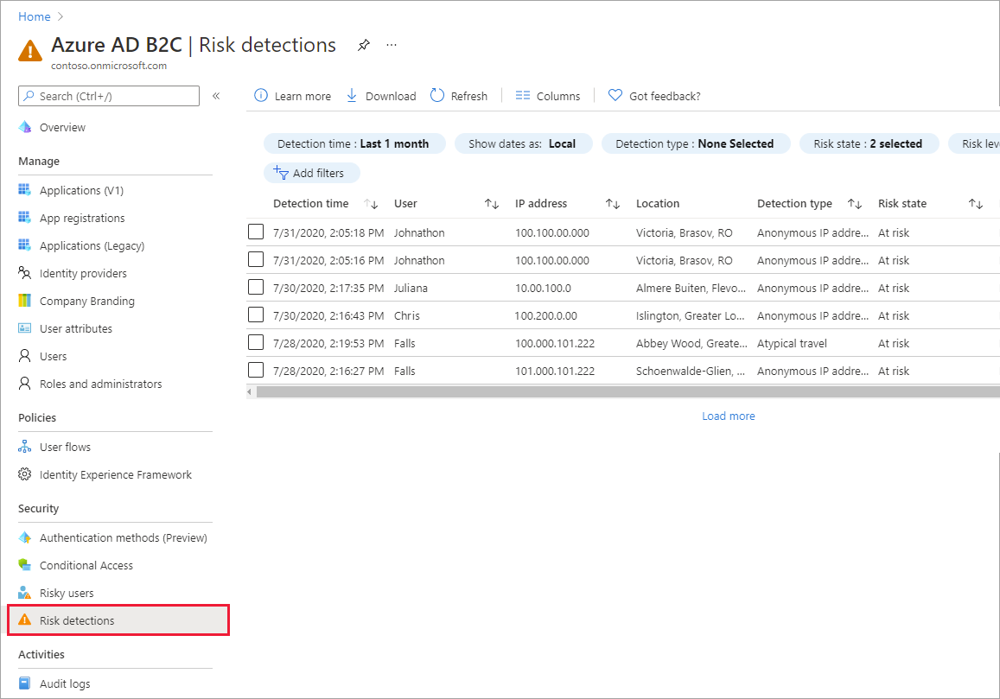

# Examiner les risques avec Identity Protection dans Azure AD B2C

[!INCLUDE [b2c-public-preview-feature](../../includes/active-directory-b2c-public-preview.md)]

Identity Protection assure la détection des risques en continu pour votre locataire Azure AD B2C. Le service permet aux organisations de découvrir, d’examiner et de corriger les risques basés sur l’identité. Identity Protection est fourni avec des rapports sur les risques qui peuvent être utilisés pour examiner les risques liés à l’identité dans les locataires Azure AD B2C. Dans cet article, vous allez apprendre à examiner et à atténuer les risques.

## Vue d’ensemble

Azure AD B2C Identity Protection fournit deux rapports. Le rapport *Utilisateurs à risque* permet aux administrateurs de savoir quels utilisateurs sont à risque et de connaître les détails relatifs aux détections. Le rapport *Détections de risque* fournit des informations sur chaque détection de risque, notamment le type, les autres risques déclenchés au même moment, l’emplacement de la tentative de connexion et bien plus encore.

Chaque rapport démarre avec une liste de toutes les détections pour la période indiquée en haut du rapport. Les rapports peuvent être filtrés à l’aide des filtres situés dans la partie supérieure du rapport. Les administrateurs peuvent choisir de télécharger les données ou d’utiliser [l’API MS Graph et le Kit de développement logiciel (SDK) Microsoft Graph PowerShell](../active-directory/identity-protection/howto-identity-protection-graph-api.md) pour exporter les données en continu.

## Limitations et considérations relatives au service

Lorsque vous utilisez Identity Protection, tenez compte des éléments suivants :

- Identity Protection est activé par défaut.
- Identity Protection est disponible pour les identités locales et sociales, telles que Google ou Facebook. Pour les identités sociales, l’accès conditionnel doit être activé. La détection est limitée, car les informations d’identification des comptes sociaux sont gérées par le fournisseur d’identité externe.
- Dans les locataires Azure AD B2C, seul un sous-ensemble des [détections de risque d’Azure AD Identity Protection](../active-directory/identity-protection/overview-identity-protection.md) est disponible. Les détections de risque suivantes sont prises en charge par Azure AD B2C :  

|Type de détection des risques  |Description  |
|---------|---------|
| Voyage inhabituel     | Connexion à partir d’un emplacement inhabituel par rapport aux dernières connexions de l’utilisateur.        |
|Adresse IP anonyme     | Connexion à partir d’une adresse IP anonyme (par exemple : navigateur Tor, VPN anonymes).        |
|Adresse IP liée à un programme malveillant     | Connexion à partir d’une adresse IP liée à un programme malveillant.         |
|Propriétés de connexion inhabituelles     | Connexion avec des propriétés inhabituelles pour l’utilisateur concerné.        |
|L’administrateur a confirmé que cet utilisateur est compromis    | Un administrateur a indiqué qu’un utilisateur a été compromis.             |
|Pulvérisation de mots de passe     | Connexion par le biais d’une attaque par pulvérisation de mots de passe.      |
|Azure AD Threat Intelligence     | Les sources de renseignements sur les menaces internes et externes de Microsoft ont identifié un modèle d’attaque connu.        |

## Niveau tarifaire

Azure AD B2C Premium P2 est requis pour certaines fonctionnalités d’Identity Protection. Si nécessaire, [passez au niveau tarifaire Azure AD B2C Premium P2](./billing.md). Le tableau suivant récapitule les fonctionnalités d’Identity Protection et le niveau tarifaire requis.  

|Fonctionnalité   |P1   |P2|
|----------|:-----------:|:------------:|
|Rapport sur les utilisateurs à risque     |&#x2713; |&#x2713; |
|Détails du rapport sur les utilisateurs à risque  | |&#x2713; |
|Correction du rapport sur les utilisateurs à risque    | &#x2713; |&#x2713; |
|Rapport sur les détections de risques   |&#x2713;|&#x2713;|
|Détails du rapport sur les détections de risque  ||&#x2713;|
|Téléchargement du rapport |  &#x2713;| &#x2713;|
|Accès à l’API MS Graph |  &#x2713;| &#x2713;|

## Prérequis

[!INCLUDE [active-directory-b2c-customization-prerequisites](../../includes/active-directory-b2c-customization-prerequisites.md)]

## Examiner des utilisateurs à risque

Les informations indiquées dans le rapport Utilisateurs à risque permettent aux administrateurs de trouver :

- Quels sont les utilisateurs à risques ? Pour qui les risques ont-ils été corrigés ou éliminés ?
- Détails sur les détections
- Historique de toutes les connexions à risque
- Historique des risques
 
Les administrateurs peuvent ensuite choisir d’agir sur ces événements. Les administrateurs peuvent choisir d’effectuer les opérations suivantes :

- Réinitialiser le mot de passe de l’utilisateur
- Confirmer la compromission de l’utilisateur
- Ignorer le risque lié à l’utilisateur
- Empêcher l’utilisateur de se connecter
- Effectuer d’autres examens au moyen d’Azure ATP

### Consultation du rapport sur les utilisateurs à risque

1. Connectez-vous au [portail Azure](https://portal.azure.com/).

1. Sélectionnez l’icône **Annuaire et abonnement** dans la barre d’outils du portail, puis sélectionnez le répertoire qui contient votre locataire Azure AD B2C.

1. Sous **Services Azure**, sélectionnez **Azure AD B2C**. Vous pouvez également utiliser la zone de recherche pour rechercher et sélectionner **Azure AD B2C**.

1. Sous **Sécurité**, sélectionnez **Utilisateurs à risque (préversion)** .

   

    La sélection d’entrées individuelles développe une fenêtre de détails sous les détections. L’affichage des détails permet aux administrateurs d’investiguer et d’effectuer des actions lors de chaque détection.

    

## Rapport sur les détections de risques

Le rapport sur les détections de risque contient des données filtrables correspondant aux 90 derniers jours (3 mois).

Les informations indiquées dans le rapport des détections de risques permettent aux administrateurs de trouver :

- Des informations sur chaque détection de risques, y compris le type
- Les autres risques déclenchés au même moment
- L’emplacement de la tentative de connexion

Les administrateurs peuvent ensuite choisir de revenir au rapport des risques ou des connexions de l’utilisateur pour effectuer des actions en fonction des informations recueillies.

### Consultation du rapport sur les détections de risque

1. Dans le portail Azure, recherchez et sélectionnez **Azure AD B2C**.
1. Sous **Sécurité**, sélectionnez **Détections de risque (préversion)** .

   

## Étapes suivantes

- [Ajouter l’accès conditionnel à un flux d’utilisateur](conditional-access-user-flow.md)