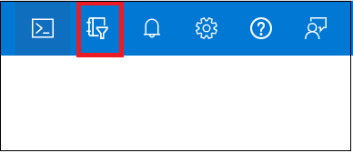
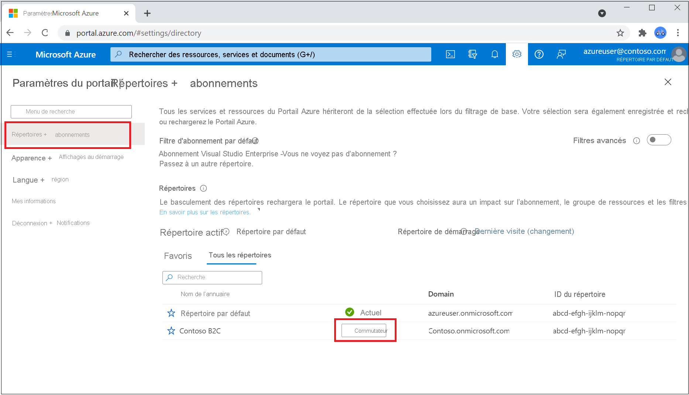

# Tutoriel : Créer un locataire Azure Active Directory B2C

Pour que vos applications puissent interagir avec Azure Active Directory B2C (Azure AD B2C), elles doivent être inscrites dans un locataire que vous gérez. 

> [!NOTE]
> Vous pouvez créer jusqu’à 20 locataires par abonnement. Cette limite aide à se prémunir contre les menaces visant vos ressources, telles que les attaques par déni de service, et est appliquée à la fois dans le portail Azure et dans l’API de création de locataire sous-jacente. Si vous avez besoin de créer plus de 20 locataires, contactez le [Support Microsoft](support-options.md).
> 
> Si vous souhaitez réutiliser un nom de locataire que vous avez essayé de supprimer, mais que vous voyez s’afficher l’erreur « Déjà utilisé par un autre annuaire » quand vous entrez le nom de domaine, vous devez [suivre d’abord ces étapes pour supprimer complètement le locataire](./faq.yml?tabs=app-reg-ga#how-do-i-delete-my-azure-ad-b2c-tenant-). Vous devez disposer au moins d’un rôle d’administrateur d’abonnements. Après avoir supprimé le locataire, vous devrez peut-être également vous déconnecter et vous reconnecter pour pouvoir réutiliser le nom de domaine.

Dans cet article, vous apprendrez comment :

> [!div class="checklist"]
> * Créer un client Azure AD B2C
> * Lier votre locataire à votre abonnement
> * Passer à l’annuaire contenant votre locataire Azure AD B2C
> * Ajouter la ressource Azure AD B2C en tant que **favori** dans le portail Azure

Vous découvrirez comment inscrire une application dans le didacticiel suivant.

## Prérequis

- Un abonnement Azure. Si vous n’en avez pas, créez un [compte gratuit](https://azure.microsoft.com/free/?WT.mc_id=A261C142F) avant de commencer.

- Un compte Azure est nécessaire, auquel au moins le rôle [Contributeur](../role-based-access-control/built-in-roles.md) au sein de l’abonnement ou d’un groupe de ressources de l’abonnement a été attribué. 

## Créer un client Azure AD B2C

1. Connectez-vous au [portail Azure](https://portal.azure.com/). 

1. Passez au répertoire qui contient votre abonnement :
    1. Sélectionnez l’icône du filtre **Annuaires + abonnements** dans la barre d’outils du portail Azure. 
    
        

    1. Recherchez l’annuaire qui contient votre abonnement et sélectionnez le bouton **Changer** à côté de ce dernier. Le changement d’annuaire permet de recharger le portail.

        

1. Ajoutez **Microsoft.AzureActiveDirectory** comme fournisseur de ressources pour l’abonnement Azure que vous utilisez ([En savoir plus](../azure-resource-manager/management/resource-providers-and-types.md?WT.mc_id=Portal-Microsoft_Azure_Support#register-resource-provider-1)) :

    1. Dans le portail Azure, recherchez et sélectionnez **Abonnements**.
    2. Sélectionnez votre abonnement, puis dans le menu gauche, sélectionnez **Fournisseurs de ressources**. Si vous ne voyez pas le menu de gauche, sélectionnez l’icône **Afficher le menu de <nom de votre abonnement>** dans la partie supérieure gauche de la page pour l’ouvrir.
    3. Assurez-vous que la ligne **Microsoft.AzureActiveDirectory** affiche l’état **Inscrit**. Si ce n’est pas le cas, sélectionnez la ligne, puis sélectionnez **S’inscrire**.

1. Dans le menu du Portail Azure ou dans la page **Accueil**, sélectionnez **Créer une ressource**.

   

1. Recherchez **Azure Active Directory B2C**, puis sélectionnez **Créer**.
2. Cliquez sur **Créer un nouveau client Azure Active Directory B2C**.

    

1. Dans la page **Créer un annuaire**, entrez les informations suivantes :

   - **Nom de l’organisation** : entrez un nom pour votre locataire Azure AD B2C.
   - **Nom de domaine initial** : entrez un nom de domaine pour votre locataire Azure AD B2C.
   - **Pays ou région** : sélectionnez votre pays ou votre région dans la liste. Il ne sera pas possible de changer cette sélection ultérieurement.
   - **Abonnement** : sélectionnez votre abonnement dans la liste.
   - **Groupe de ressources** : sélectionnez ou recherchez le groupe de ressources qui contiendra le locataire.

    

1. Sélectionnez **Revoir + créer**.
1. Passez en revue les paramètres de votre annuaire. Sélectionnez ensuite **Créer**. Découvrez-en plus sur le [dépannage des erreurs de déploiement](../azure-resource-manager/templates/common-deployment-errors.md).

Vous pouvez lier plusieurs locataires Azure AD B2C à un seul abonnement Azure pour la facturation. Pour lier un locataire, vous devez être administrateur du locataire Azure AD B2C et vous devez disposer d’au moins le rôle Contributeur dans l’abonnement Azure. Consultez [Lier un locataire Azure AD B2C à un abonnement](billing.md#link-an-azure-ad-b2c-tenant-to-a-subscription).

## Sélectionner l’annuaire de votre locataire B2C

Pour commencer à utiliser votre nouveau locataire Azure AD B2C, vous devez passer à l’annuaire qui contient le locataire :
1. Sélectionnez l’icône du filtre **Annuaires + abonnements** dans la barre d’outils du portail Azure.
1. Sous l’onglet **Tous les annuaires**, recherchez l’annuaire qui contient votre locataire Azure AD B2C, puis sélectionnez le bouton **Changer** à côté de celui-ci.

Si, de prime abord, vous ne voyez pas votre nouveau locataire Azure B2C dans la liste, actualisez la fenêtre de votre navigateur ou déconnectez-vous, puis reconnectez-vous. Ensuite, sélectionnez l’icône du filtre **Annuaires + abonnements** dans la barre d’outils du portail Azure.

## Ajouter Azure AD B2C en tant que favori (facultatif)

Cette étape facultative vous permet de sélectionner plus facilement votre locataire Azure AD B2C dans les tutoriels suivants et ultérieurs.

Au lieu de rechercher *Azure AD B2C* dans **Tous les services** chaque fois que vous souhaitez utiliser votre locataire, vous pouvez à la place marquer la ressource comme favori. Vous pouvez ensuite la sélectionner dans la section **Favoris** du menu du portail pour accéder rapidement à votre locataire Azure AD B2C.

Vous ne devez effectuer cette opération qu’une seule fois. Avant d’effectuer ces étapes, assurez-vous d’avoir basculé vers l’annuaire contenant votre locataire Azure AD B2C comme décrit dans la section précédente, [Sélectionner l’annuaire de votre locataire B2C](#select-your-b2c-tenant-directory).

1. Connectez-vous au [portail Azure](https://portal.azure.com).
1. Dans le menu du portail Azure, sélectionnez **Tous les services**.
1. Dans la zone de recherche **Tous les services**, recherchez **Azure AD B2C**, pointez sur le résultat de la recherche, puis sélectionnez l’icône en étoile dans l’info-bulle. **Azure AD B2C** apparaît maintenant dans le portail Azure sous **Favoris**.
1. Si vous souhaitez modifier la position de votre nouveau favori, accédez au menu Portail Azure, sélectionnez **Azure AD B2C**, puis faites-le glisser vers le haut ou vers le haut jusqu’à la position souhaitée.

    

## Étapes suivantes

Dans cet article, vous avez appris à effectuer les opérations suivantes :

> [!div class="checklist"]
> * Créer un client Azure AD B2C
> * Lier votre locataire à votre abonnement
> * Passer à l’annuaire contenant votre locataire Azure AD B2C
> * Ajouter la ressource Azure AD B2C en tant que **favori** dans le portail Azure

Ensuite, découvrez comment inscrire une application web dans votre nouveau locataire.

> [!div class="nextstepaction"]
> [Inscrire vos applications >](tutorial-register-applications.md)
