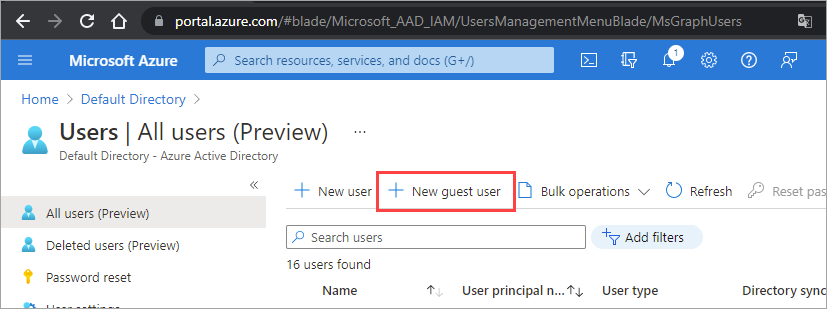
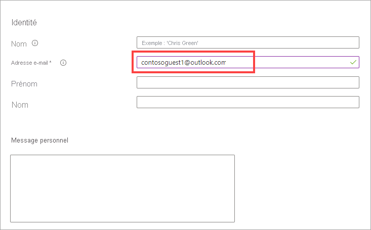
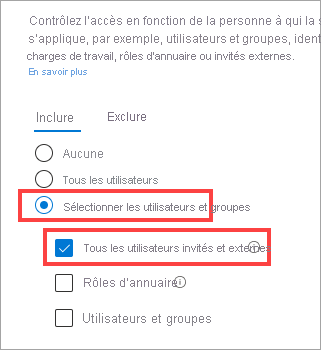
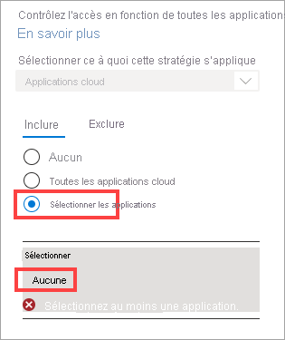
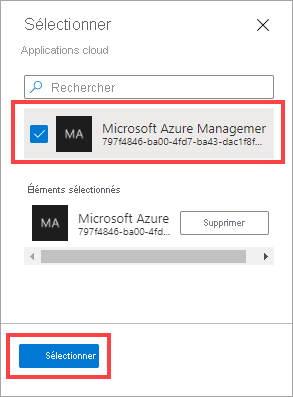
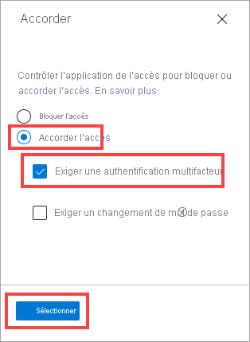
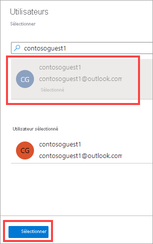
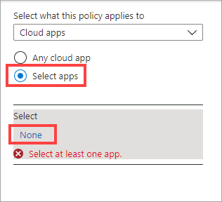

# Tutoriel : Appliquer l’authentification multifacteur pour les utilisateurs invités B2B

Lors d’une collaboration avec des utilisateurs invités B2B externes, il est judicieux de protéger vos applications avec des stratégies d’authentification multifacteur. Les utilisateurs externes doivent donc avoir plus qu’un simple nom d’utilisateur et mot de passe pour accéder à vos ressources. Dans Azure Active Directory (Azure AD), vous pouvez atteindre cet objectif avec une stratégie d’accès conditionnel exigeant une authentification multifacteur pour l’accès. Ces stratégies peuvent être appliquées au niveau du locataire, d’une application ou d’un utilisateur individuel invité, de la même façon qu’elles peuvent être activées pour les membres de votre propre organisation.

Exemple :

1. Un administrateur ou un employé de la société A invite un utilisateur invité à utiliser une application cloud ou locale qui est configurée pour exiger l’authentification multifacteur pour l’accès.
1. L’utilisateur invité se connecte avec sa propre identité professionnelle, scolaire ou sociale.
1. L’utilisateur est invité à effectuer une demande d’authentification multifacteur. 
1. L’utilisateur configure l’authentification multifacteur avec la société A et choisit son option d’authentification multifacteur. L’utilisateur est autorisé à accéder à l’application.

Ce didacticiel présente les procédures suivantes :

> [!div class="checklist"]
> - Tester l’expérience de connexion avant la configuration de l’authentification multifacteur.
> - Créer une stratégie d’accès conditionnel qui exige l’authentification multifacteur pour l’accès à une application cloud dans votre environnement. Dans ce tutoriel, nous allons utiliser l’application de gestion Microsoft Azure pour illustrer le processus.
> - Utilisez l’outil What If pour simuler la connexion d’authentification multifacteur.
> - Testez votre stratégie d’accès conditionnel.
> - Supprimez l’utilisateur de test et la stratégie.

Si vous n’avez pas d’abonnement Azure, créez un [compte gratuit](https://azure.microsoft.com/free/?WT.mc_id=A261C142F) avant de commencer.

## Prérequis

Pour suivre le scénario décrit dans ce didacticiel, vous avez besoin de ce qui suit :

- **Accès à l’édition Azure AD Premium**, qui inclut des fonctionnalités de stratégie d’accès conditionnel. Pour appliquer l’authentification multifacteur, vous devez créer une stratégie d’accès conditionnel Azure AD. Notez que les stratégies d’authentification multifacteur sont toujours appliquées à votre organisation, que le partenaire ait ou non des fonctionnalités d’authentification multifacteur. Si vous configurez l’authentification multifacteur pour votre organisation, vous devez veiller à avoir suffisamment de licences Azure AD Premium pour vos utilisateurs invités. 
- **Un compte e-mail externe valide** que vous pouvez ajouter à votre annuaire de locataires en tant qu’utilisateur invité et vous servir pour la connexion. Si vous ne savez pas comment créer un compte Invité, consultez [Ajouter un utilisateur invité B2B dans le portail Azure](add-users-administrator.md).

## Créer un utilisateur invité de test dans Azure AD

1. Connectez-vous au [Portail Azure](https://portal.azure.com/) en tant qu’administrateur Azure AD.
2. Sélectionnez **Azure Active Directory** dans le volet de gauche.
3. Sous **Gérer**, sélectionnez **Utilisateurs**.
4. Sélectionnez **Nouvel utilisateur invité**.

    

5. Sous **Nom d’utilisateur**, entrez l’adresse e-mail de l’utilisateur externe. Vous pouvez éventuellement inclure un message d’accueil.

    

6. Sélectionnez **Inviter** pour envoyer automatiquement l’invitation à l’utilisateur invité. Un message **Utilisateur invité avec succès** apparaît.
7. Après avoir envoyé l’invitation, le compte d’utilisateur est automatiquement ajouté au répertoire en tant qu’invité.

## Tester l’expérience de connexion avant la configuration de l’authentification multifacteur

1. Utilisez votre nom d’utilisateur de test et votre mot de passe pour vous connecter à votre [portail Azure](https://portal.azure.com/).
1. Notez que vous pouvez accéder au portail Azure avec seulement vos informations d’identification de connexion. Aucune autre authentification supplémentaire n’est nécessaire.
1. Déconnectez-vous.

## Créer une stratégie d’accès conditionnel exigeant l’authentification multifacteur

1. Connectez-vous au [portail Azure](https://portal.azure.com/) en tant qu’administrateur de sécurité ou administrateur de l’accès conditionnel.
2. Dans le portail Azure, sélectionnez **Azure Active Directory**.
3. Dans la page **Azure Active Directory**, dans la section **Sécurité**, sélectionnez **Accès conditionnel**.
4. Dans la page **Accès conditionnel**, dans la barre d’outils en haut, sélectionnez **Nouvelle stratégie**.
5. Dans la page **Nouveau**, dans la zone de texte **Nom**, tapez **Exiger l’authentification multifacteur pour l’accès au portail B2B**.
6. Dans la section **Affectations**, sélectionnez **Utilisateurs et groupes**.
7. Dans la page **Utilisateurs et groupes**, choisissez **Sélectionner des utilisateurs et groupes** et sélectionnez **Tous les utilisateurs invités et externes**.

    
9. Sélectionnez **Terminé**.
10. Dans la page **Nouveau**, dans la section **Affectations**, sélectionnez **Applications cloud**.
11. Dans la page **Applications cloud**, choisissez **Sélectionner les applications**, puis **Sélectionner**.

    

12. Dans la page **Sélectionner**, choisissez **Gestion Microsoft Azure**, puis **Sélectionner**.

    

13. Dans la page **Applications cloud**, sélectionnez **Terminé**.
14. Dans la page **Nouveau**, dans la section **Contrôles d’accès**, sélectionnez **Accorder**.
15. Dans la page **Accorder**, choisissez **Accorder l’accès**, cochez la case **Exiger une authentification multifacteur**, puis choisissez **Sélectionner**.

    

16. Sous **Activer une stratégie**, sélectionnez **Activé**.

    

17. Sélectionnez **Create** (Créer).

## Utiliser l’option What If pour simuler une connexion

1. Dans la page **Accès conditionnel - Stratégies**, sélectionnez **What If**.

    

2. Sélectionnez **Utilisateur**, choisissez votre utilisateur invité de test, puis **Sélectionner**.

    

3. Sélectionnez **Applications cloud**.
4. Dans la page **Applications cloud**, choisissez **Sélectionner les applications**, puis cliquez sur **Sélectionner**. Dans la liste des applications, sélectionnez **Gestion Microsoft Azure**, puis cliquez sur **Sélectionner**.

    

5. Dans la page **Applications cloud**, sélectionnez **Terminé**.
6. Sélectionnez **What If** et vérifiez que votre nouvelle stratégie apparaît sous **Résultats de l’évaluation** sous l’onglet **Stratégies qui vont s’appliquer**.

    

## Tester votre stratégie d’accès conditionnel

1. Utilisez votre nom d’utilisateur de test et votre mot de passe pour vous connecter à votre [portail Azure](https://portal.azure.com/).
2. Vous devez voir une demande pour des méthodes d’authentification supplémentaires. Notez qu’un certain temps peut être nécessaire pour que la stratégie entre en vigueur.

    

3. Déconnectez-vous.

## Nettoyer les ressources

Quand vous n’en avez plus besoin, supprimez l’utilisateur de test et la stratégie d’accès conditionnel de test.

1. Connectez-vous au [Portail Azure](https://portal.azure.com/) en tant qu’administrateur Azure AD.
2. Sélectionnez **Azure Active Directory** dans le volet de gauche.
3. Sous **Gérer**, sélectionnez **Utilisateurs**.
4. Sélectionnez l’utilisateur invité, puis sélectionnez **Supprimer l’utilisateur**.
5. Sélectionnez **Azure Active Directory** dans le volet de gauche.
6. Sous **Sécurité**, sélectionnez **Accès conditionnel**.
7. Dans la liste **Nom de la stratégie**, sélectionnez le menu contextuel (...) pour votre stratégie de test, puis **Supprimer**. Sélectionnez **Oui** pour confirmer.

## Étapes suivantes

Dans ce tutoriel, vous avez créé une stratégie d’accès conditionnel exigeant que les utilisateurs invités utilisent l’authentification multifacteur lors de la connexion à une de vos applications cloud. Pour plus d’informations sur l’ajout d’utilisateurs invités pour la collaboration, consultez [Ajouter des utilisateurs Azure Active Directory B2B Collaboration dans le portail Azure](add-users-administrator.md).
