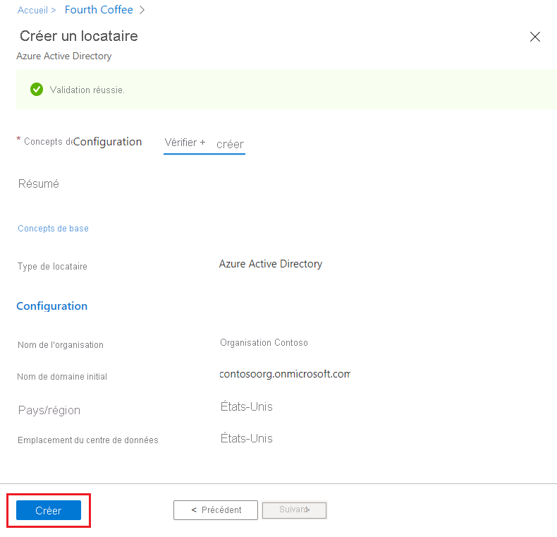
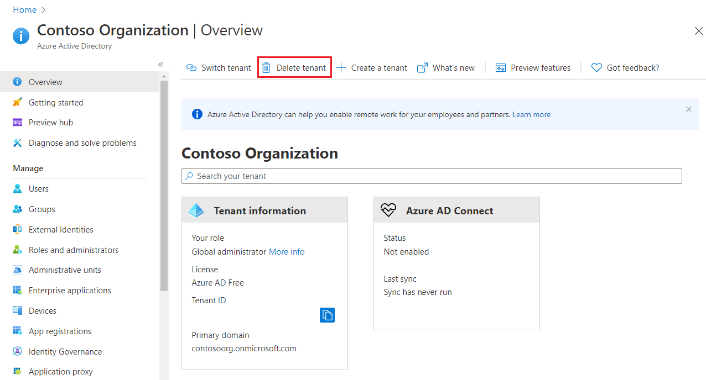

# Démarrage rapide : Créer un locataire dans Azure Active Directory

Vous pouvez effectuer toutes vos tâches d’administration à l’aide du portail Azure Active Directory (Azure AD), notamment la création d’un locataire pour votre organisation. 

Dans ce guide de démarrage rapide, vous découvrez comment accéder au portail Azure et à Azure Active Directory, et comment créer un locataire de base pour votre organisation.

Si vous n’avez pas d’abonnement Azure, créez un [compte gratuit](https://azure.microsoft.com/free/) avant de commencer.

## Créer un locataire pour votre organisation

Une fois connecté au portail Azure, vous pouvez créer un locataire pour votre organisation. Votre nouveau locataire représente votre organisation et vous permet de gérer une instance particulière des services cloud de Microsoft pour vos utilisateurs internes et externes.

### Pour créer un locataire

1. Connectez-vous au [portail Azure](https://portal.azure.com/) de votre organisation.

1. Dans le menu du portail Azure, sélectionnez **Azure Active Directory**.  

    <kbd></kbd>  

1. Sélectionnez **Créer un locataire**.

1. Sous l’onglet Informations de base, sélectionnez le type de locataire que vous souhaitez créer : **Azure Active Directory** ou **Azure Active Directory (B2C)** .

1. Sélectionnez **Suivant : Configuration** pour passer à l’onglet Configuration.

    <kbd></kbd>

1.  Sous l’onglet Configuration, entrez les informations suivantes :
    
    - Tapez _Contoso Organization_ dans la zone **Nom de l’organisation**.

    - Tapez _Contosoorg_ dans la zone **Nom de domaine initial**.

    - Laissez l’option _États-Unis_ dans la zone **Pays ou région**.

1. Sélectionnez **Suivant : Vérifier + créer**. Vérifiez les informations que vous avez entrées et, si elles sont correctes, sélectionnez **Créer**.

    <kbd></kbd>

Votre nouveau locataire est créé avec le domaine contoso.onmicrosoft.com.

## Votre compte d’utilisateur dans le nouveau locataire

Quand vous créez un locataire Azure AD, vous devenez le premier utilisateur de ce locataire. En tant que premier utilisateur, vous recevez automatiquement le rôle [Administrateur général](../roles/permissions-reference.md#global-administrator). Consultez votre compte d’utilisateur en accédant à la page [**Utilisateurs**](https://portal.azure.com/#blade/Microsoft_AAD_IAM/UsersManagementMenuBlade/MsGraphUsers).

Par défaut, vous figurez aussi comme [contact technique](/microsoft-365/admin/manage/change-address-contact-and-more?view=o365-worldwide#what-do-these-fields-mean) pour le locataire. Vous pouvez modifier les informations de contact technique dans [**Propriétés**](https://portal.azure.com/#blade/Microsoft_AAD_IAM/ActiveDirectoryMenuBlade/Properties).

> [!WARNING]
> Vérifiez que votre annuaire a au moins deux comptes disposant des privilèges d’administrateur général. Ceci vous aidera dans le cas où un administrateur général est verrouillé. Pour plus d’informations, consultez l’article [Gérer les comptes d’accès d’urgence dans Azure AD](../roles/security-emergency-access.md).

## Nettoyer les ressources

Si vous ne prévoyez pas de continuer à utiliser cette application, vous pouvez supprimer le locataire en effectuant les étapes suivantes :

- Vérifiez que vous êtes connecté à l’annuaire que vous voulez supprimer via le filtre **Répertoire + abonnement** dans le portail Azure. Si nécessaire, passez à l’annuaire cible.
- Sélectionnez **Azure Active Directory** puis, dans la page **Contoso - Vue d’ensemble**, sélectionnez **Supprimer l’annuaire**.

    Le locataire et ses informations associées sont supprimés.

    <kbd></kbd>

## Étapes suivantes

- Pour modifier ou ajouter des noms de domaine supplémentaires, consultez [Guide pratique pour ajouter un nom de domaine personnalisé à Azure Active Directory](add-custom-domain.md).

- Pour ajouter des utilisateurs, consultez [Ajouter ou supprimer un nouvel utilisateur](add-users-azure-active-directory.md)

- Pour ajouter des groupes et des membres, consultez [Créer un groupe de base et ajouter des membres](active-directory-groups-create-azure-portal.md)

- Découvrez l’[accès en fonction du rôle avec Privileged Identity Management](../../role-based-access-control/best-practices.md) et l’[accès conditionnel](../../role-based-access-control/conditional-access-azure-management.md) permettant de gérer l’accès aux ressources et aux applications de votre organisation.

- En savoir plus sur Azure AD, notamment sur [les informations de base des licences, la terminologie et les fonctionnalités associées](active-directory-whatis.md).