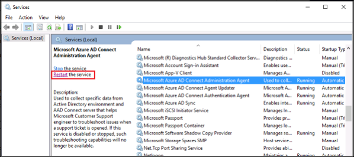

# <a name="what-is-the-azure-ad-connect-admin-agent"></a>Présentation de l’agent d’administration Azure AD Connect 
L’agent d’administration Azure AD Connect est un nouveau composant d’Azure Active Directory Connect qui peut être installé sur un serveur Azure Active Directory Connect. Il est utilisé pour collecter des données spécifiques à partir de votre environnement Active Directory qui permettent à un ingénieur du support Microsoft de résoudre les problèmes quand vous créez une demande de support. 

>[!NOTE]
>L’agent d’administration n’est pas installé et activé par défaut.  Vous devez installer l’agent afin de collecter des données pour aider au traitement des demandes de support.

Une fois installé, l’agent d’administration Azure AD Connect attend des demandes spécifiques de données d’Azure Active Directory, obtient les données demandées auprès de l’environnement de synchronisation et les envoie à Azure Active Directory, où elles sont présentées à l’ingénieur du support Microsoft. 

Les informations que l’agent d’administration Azure AD Connect récupère à partir de votre environnement ne sont pas stockées de quelque façon que ce soit : elles sont uniquement affichées à l’intention de l’ingénieur du support Microsoft pour l’aider à examiner et résoudre les problèmes des demandes de support liées à Azure Active Directory Connect que vous avez créées. L’agent d’administration Azure AD Connect n’est pas installé par défaut sur le serveur Azure AD Connect. 

## <a name="install-the-azure-ad-connect-administration-agent-on-the-azure-ad-connect-server"></a>Installer l’agent d’administration Azure AD Connect sur le serveur Azure AD Connect 

Configuration requise :
1.    Azure AD Connect est installé sur le serveur
2.    Azure AD Connect Health est installé sur le serveur


Les fichiers binaires de l’agent d’administration Azure AD Connect sont placés sur le serveur AAD Connect. Pour installer l’agent, procédez comme suit :

1.    Ouvrez PowerShell en mode Administrateur
2.    Accédez au répertoire où se trouve l’application, cd "C:\Program Files\Microsoft Azure Active Directory Connect\Tools".
3.    Exécuter ConfigureAdminAgent.ps1

Quand vous y êtes invité, entrez vos informations d’identification d’administrateur général Azure AD. Il doit s’agir des mêmes informations d’identification que celles entrées lors de l’installation d’Azure AD Connect.

Une fois que l’agent est installé, vous verrez les deux nouveaux programmes suivants dans la liste « Ajout/Suppression de programmes » du Panneau de configuration de votre serveur : 


## <a name="what-data-in-my-sync-service-is-shown-to-the-microsoft-service-engineer"></a>Quelles sont les données de mon service de synchronisation qui sont présentées à l’ingénieur du service Microsoft ? 
Quand vous créez une demande de support, l’ingénieur du support Microsoft peut voir, pour un utilisateur donné, les données pertinentes dans Active Directory, l’espace de connecteur Active Directory sur le serveur Azure Active Directory Connect, l’espace de connecteur Azure Active Directory sur le serveur Azure Active Directory Connect et le métaverse sur le serveur Azure Active Directory Connect. 

L’ingénieur du support Microsoft ne peut modifier aucune donnée dans votre système et ne peut voir aucun mot de passe. 

## <a name="what-if-i-dont-want-the-microsoft-support-engineer-to-access-my-data"></a>Que faire si je ne veux pas que l’ingénieur du support Microsoft accède à mes données ? 
Une fois que l’agent est installé, si vous ne souhaitez pas que l’ingénieur du service Microsoft accède à vos données pour un appel au support, vous pouvez désactiver la fonctionnalité en modifiant le fichier de configuration de service, comme décrit ci-dessous : 

1. Ouvrez **C:\Program Files\Microsoft Azure AD Connect Administration Agent\AzureADConnectAdministrationAgentService.exe.config** dans le Bloc-notes.
2. Désactivez le paramètre **UserDataEnabled** comme indiqué ci-dessous. Si le paramètre **UserDataEnabled** existe et a la valeur true, affectez-lui la valeur false. Si le paramètre n’existe pas, ajoutez-le comme indiqué ci-dessous.    

    ```xml
    <appSettings>
      <add key="TraceFilename" value="ADAdministrationAgent.log" />
      <add key="UserDataEnabled" value="false" />
    </appSettings>
    ```

3. Enregistrez le fichier de configuration.
4. Redémarrez le service de l’agent d’administration Azure AD Connect comme indiqué ci-dessous



## <a name="next-steps"></a>Étapes suivantes
En savoir plus sur l’ [intégration de vos identités locales avec Azure Active Directory](whatis-hybrid-identity.md).
