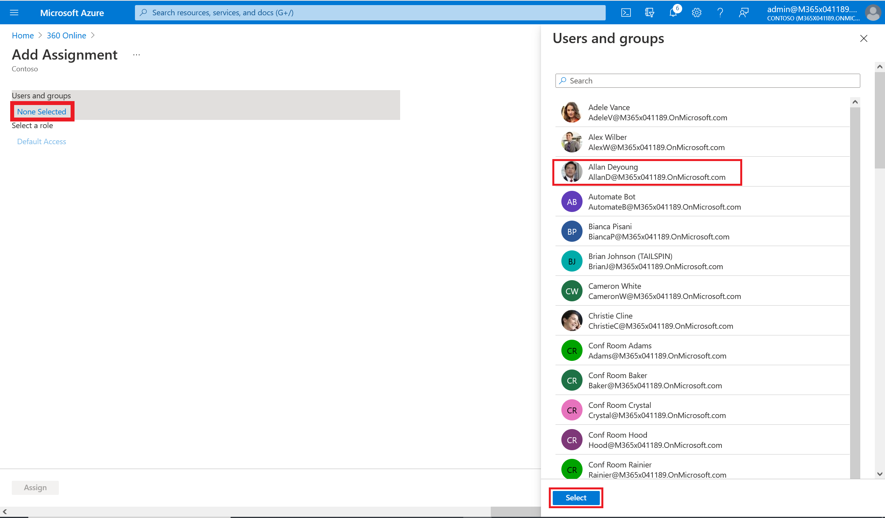

# Démarrage rapide : Affecter des utilisateurs à une application qui utilise Azure AD comme fournisseur d’identité

Dans le guide de démarrage rapide précédent, vous avez configuré les propriétés d’une application. Lorsque vous avez défini les propriétés, vous avez configuré l’expérience pour les utilisateurs affectés et non affectés. Ce guide de démarrage rapide vous guide tout au long du processus d’affectation d’utilisateurs à l’application.

## Prérequis

Pour affecter des utilisateurs à une application que vous avez ajoutée à votre locataire Azure AD, vous avez besoin des éléments suivants :

- Compte Azure avec un abonnement actif. [Créez un compte gratuitement](https://azure.microsoft.com/free/?WT.mc_id=A261C142F).
- Un des rôles suivants : Administrateur général, Administrateur d’application cloud, Administrateur d’application ou propriétaire du principal de service.
- Facultatif : effectuer [Voir vos applications](view-applications-portal.md).
- Facultatif : effectuer [Ajouter une application](add-application-portal.md).
- Facultatif : effectuer [Configurer une application](add-application-portal-configure.md).

>[!IMPORTANT]
>Pour tester les étapes de ce guide de démarrage rapide, utilisez un environnement de non-production.

## Affecter des utilisateurs à une application
1. Dans le portail Azure AD, sélectionnez **Applications d’entreprise**. Ensuite, recherchez et sélectionnez l’application que vous souhaitez configurer.
2. Dans le menu de navigation gauche, sélectionnez **Utilisateurs et groupes**.
   > [!NOTE]
   > Certaines des applications Microsoft 365 demandent d’utiliser PowerShell. 
3. Sélectionnez le bouton **Ajouter un utilisateur**.
4. Dans le volet **Ajouter une attribution**, sélectionnez **Utilisateurs et groupes**.
5. Sélectionnez l’utilisateur ou le groupe que vous souhaitez affecter à l’application. Vous pouvez également commencer à taper le nom de l’utilisateur ou du groupe dans la zone de recherche. Vous pouvez choisir plusieurs utilisateurs et groupes. Vos sélections s’affichent sous **Éléments sélectionnés**.
    > [!IMPORTANT]
    > Lorsque vous affectez un groupe à une application, seuls les utilisateurs du groupe y ont accès. L’affectation n’est pas en cascade vers les groupes imbriqués.

    > [!NOTE]
    > L’attribution basée sur le groupe requiert Azure Active Directory Premium édition P1 ou P2. L’attribution basée sur le groupe est uniquement prise en charge pour les groupes de sécurité. Les appartenances aux groupes imbriqués et aux groupes Microsoft 365 ne sont pas prises en charge actuellement. Pour d’autres conditions de gestion des licences relatives aux composants traités dans le présent article, consultez la [page sur la tarification d’Azure Active Directory](https://azure.microsoft.com/pricing/details/active-directory). 
6. Lorsque vous avez terminé, choisissez **Sélectionner**.
   
7. Dans le volet **Utilisateurs et groupes**, sélectionnez un ou plusieurs utilisateurs ou groupes dans la liste, puis cliquez sur le bouton **Sélectionner** en bas du volet.
8. Si l’application prend cette fonctionnalité en charge, vous pouvez attribuer un rôle à l’utilisateur ou au groupe. Dans le volet **Ajouter une attribution**, choisissez **Sélectionner un rôle**. Ensuite, dans le volet **Sélectionner un rôle**, choisissez un rôle à appliquer aux utilisateurs ou groupes sélectionnés, puis cliquez sur **OK** en bas du volet. 
    > [!NOTE]
    > Si l’application ne prend pas en charge la sélection des rôles, le rôle d’accès par défaut est attribué. Dans ce cas, l’application gère le niveau d’accès des utilisateurs.
9. Dans le volet **Ajouter une affectation**, sélectionnez le bouton **Affecter** en bas du volet.

Vous pouvez désaffecter des utilisateurs ou des groupes avec la même procédure. Sélectionnez l’utilisateur ou le groupe que vous souhaitez désaffecter, puis sélectionnez **Supprimer**. Certaines des applications Microsoft 365 et Office 365 nécessitent l’utilisation de PowerShell. 

## Nettoyer les ressources

Une fois le guide de démarrage rapide terminé, vous pouvez supprimer l’application afin de nettoyer votre locataire de test. La suppression de l’application est traitée dans le dernier guide de démarrage rapide de cette série : consultez [Supprimer une application](delete-application-portal.md).

## Étapes suivantes

Passez à l’article suivant pour découvrir comment configurer l’authentification unique pour une application.
> [!div class="nextstepaction"]
> [Configurer l’authentification unique SAML](add-application-portal-setup-sso.md)

OR

> [!div class="nextstepaction"]
> [Configurer l’authentification unique OIDC](add-application-portal-setup-oidc-sso.md)
