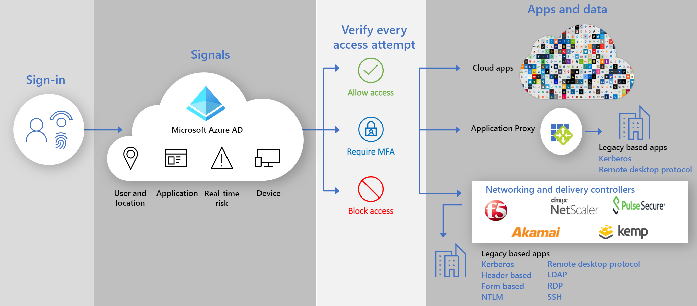

# Sécuriser l’accès hybride : Sécuriser des applications héritées avec Azure Active Directory

Vous pouvez désormais protéger vos applications d’authentification héritées locales et dans le cloud en les connectant à Azure Active Directory (AD) avec :

- [Proxy d’application Azure AD](#secure-hybrid-access-through-azure-ad-application-proxy)

- [Partenaires sécurisés d’accès hybride](#secure-hybrid-access-through-azure-ad-partner-integrations)

Vous pouvez mener à bien vos transitions et renforcer la sécurité de l’ensemble de vos applications grâce à des fonctionnalités de Azure AD telles que Azure AD [Conditional Access](../conditional-access/overview.md) et [Azure AD Identity Protection](../identity-protection/overview-identity-protection.md). En ayant Azure AD comme fournisseur d’identité (IDP), vous pouvez utiliser des méthodes d’authentification et d’autorisation modernes comme [l’authentification unique (SSO)](what-is-single-sign-on.md) et [l’authentification multifacteur (MFA)](../authentication/concept-mfa-howitworks.md) pour sécuriser vos applications héritées locales.

## Sécurisation de l’accès hybride via le proxy d’application Azure AD
  
À l’aide du [Proxy d'application](../app-proxy/what-is-application-proxy.md), vous pouvez fournir un [accès à distance sécurisé](../app-proxy/application-proxy-add-on-premises-application.md) à vos applications web locales. Vos utilisateurs n’ont pas besoin d’utiliser un VPN. Les utilisateurs bénéficient d’une connexion facile à leurs applications à partir de n’importe quel appareil après une [authentification unique](../app-proxy/application-proxy-config-sso-how-to.md#how-to-configure-single-sign-on). Le proxy d’application fournit l’accès à distance en tant que service et vous permet de [facilement publier vos applications locales](../app-proxy/application-proxy-add-on-premises-application.md) à des utilisateurs en dehors du réseau d’entreprise. Il vous permet de mettre à l’échelle votre gestion des accès cloud sans avoir à modifier vos applications locales. [Planifiez le déploiement d’un proxy d’application Azure AD](../app-proxy/application-proxy-deployment-plan.md) comme étape suivante.

## Sécuriser l’accès hybride via des intégrations de partenaires Azure AD  

En plus du [proxy d’application Azure AD](../app-proxy/what-is-application-proxy.md), les partenaires Microsoft avec des fournisseurs tiers pour activer l’accès sécurisé à vos applications et applications locales qui utilisent l’authentification héritée.

Les partenaires suivants proposent des solutions prédéfinies pour prendre en charge les **stratégies d’accès conditionnel par application** et fournissent des instructions détaillées pour l’intégration à Azure AD. 

- [Akamai Enterprise Application Access](../saas-apps/akamai-tutorial.md)

- [Citrix Application Delivery Controller (ADC)](../saas-apps/citrix-netscaler-tutorial.md)  

- [Répartiteur d’accès Datawiza](../manage-apps/datawiza-with-azure-ad.md)Datawiza Access Broker

- [F5 Big-IP APM ADC](../manage-apps/f5-aad-integration.md)

- [VPN F5 Big-IP APM](../manage-apps/f5-aad-password-less-vpn.md)

- [Kemp](../saas-apps/kemp-tutorial.md)

- [Perimeter 81](../saas-apps/perimeter-81-tutorial.md)

- [Plateforme d’authentification Silverfort](../manage-apps/silverfort-azure-ad-integration.md)

- [Strata](../saas-apps/maverics-identity-orchestrator-saml-connector-tutorial.md)

Les partenaires suivants proposent des solutions prédéfinies et des conseils détaillés pour l’intégration avec Azure AD.

- [Cisco AnyConnect](../saas-apps/cisco-anyconnect.md)

- [Fortinet](../saas-apps/fortigate-ssl-vpn-tutorial.md)

- [Palo Alto Networks Global Protect](../saas-apps/paloaltoadmin-tutorial.md)

- [Pulse Secure Pulse Connect Secure (PCS)](../saas-apps/pulse-secure-pcs-tutorial.md)

- [Pulse Secure Virtual Traffic Manager (VTM)](../saas-apps/pulse-secure-virtual-traffic-manager-tutorial.md)

- [Zscaler Private Access (ZPA)](../saas-apps/zscalerprivateaccess-tutorial.md)
