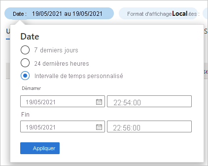
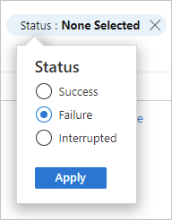

# Démarrage rapide : Analyser les connexions à l’aide du journal des connexions Azure AD 

Les informations contenues dans le journal des connexions Azure AD vous permettent de comprendre la cause de l’échec de la connexion d’un utilisateur. Ce démarrage rapide montre comment localiser un échec de connexion à l’aide du journal des connexions.

## Prérequis

Pour suivre le scénario décrit dans ce démarrage rapide, vous avez besoin de ce qui suit :

- **Accès à un locataire Azure AD** : si vous n’avez pas accès à un locataire Azure AD, consultez [Créez votre compte gratuit Azure dès aujourd’hui](https://azure.microsoft.com/free/?WT.mc_id=A261C142F). 
- **Un compte d’essai nommé Isabella Simonsen** : si vous ignorez comment créer un compte d’essai, voir [Ajouter des utilisateurs basés sur le cloud](../fundamentals/add-users-azure-active-directory.md#add-a-new-user).

## Provoquer un échec de connexion

L’objectif de cette étape est de créer un enregistrement d’échec de connexion dans le journal des connexions Azure AD.

**Pour effectuer cette étape :**

1. Connectez-vous à votre [portail Azure](https://portal.azure.com/) en tant que Isabella Simonsen en utilisant un mot de passe incorrect.

2. Attendez 5 minutes pour vous assurer de trouver un enregistrement de la connexion dans le journal des connexions. Pour plus d’informations, consultez [Rapports d’activité](reference-reports-latencies.md#activity-reports).

## Rechercher l’échec de connexion

Cette section décrit les étapes à suivre pour analyser un échec de connexion :

- **Filtrer les connexions** : supprimez tous les enregistrements non pertinents pour votre analyse. Par exemple, définissez un filtre pour afficher uniquement les enregistrements d’un utilisateur spécifique.
- **Rechercher des informations supplémentaires sur l’erreur** : en plus des informations que vous pouvez trouver dans le journal des connexions, vous pouvez rechercher l’erreur à l’aide de l’[outil de recherche d’erreur de connexion](https://login.microsoftonline.com/error). Cet outil peut vous fournir des informations supplémentaires sur une erreur de connexion. 

**Pour examiner l’échec de connexion :**

1. Accédez au [journal des connexions](https://portal.azure.com/#blade/Microsoft_AAD_IAM/ActiveDirectoryMenuBlade/SignIns).

2. Pour afficher uniquement les enregistrements relatifs à Isabella Simonsen :

    a. Dans la barre d’outils, cliquez sur **Ajouter des filtres**.
    
       

    b. Dans la liste **Choisir un champ**, sélectionnez **Utilisateur**, puis cliquez sur **Appliquer**.

    c. Dans la zone de texte **Nom d’utilisateur**, tapez **Isabella Simonsen**, puis cliquez sur **Appliquer**.

    d. Dans la barre d’outils, cliquez sur **Actualiser**.

3. Pour analyser le problème, cliquez sur **Dépannage et assistance**.

       

4. Copiez le **code d’erreur de connexion**.

       

5. Collez le code d’erreur dans la zone de texte de l’[outil de recherche d’erreur de connexion](https://login.microsoftonline.com/error), puis cliquez sur **Soumettre**.

Examinez le résultat de l’exécution de l’outil et déterminez s’il fournit des informations supplémentaires.

## Tests supplémentaires

Maintenant que vous savez comment rechercher une entrée par son nom dans le journal des connexions, vous devez également essayer de trouver l’enregistrement à l’aide des filtres suivants :

- **Date** : essayez de trouver Isabella en spécifiant un **début** et une **fin**.

    

- **État** : essayez de trouver Isabella en utilisant **État : Échec**.

    

## Nettoyer les ressources

Lorsque vous n’en avez plus besoin, supprimez l’utilisateur de test. Si vous ignorez comment supprimer un utilisateur Azure AD, voir [Supprimer des utilisateurs d’Azure AD](../fundamentals/add-users-azure-active-directory.md#delete-a-user).

## Étapes suivantes

> [!div class="nextstepaction"]
> [Présentation des rapports Azure Active Directory](overview-reports.md)
