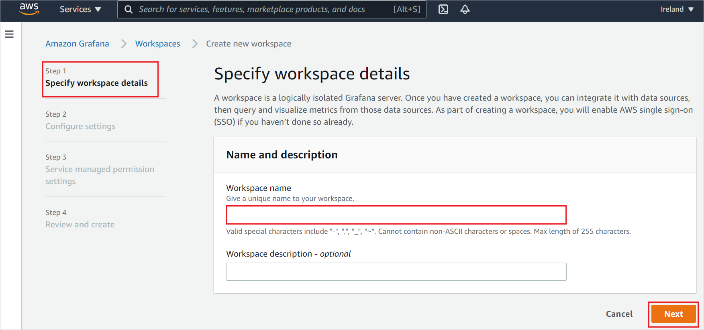
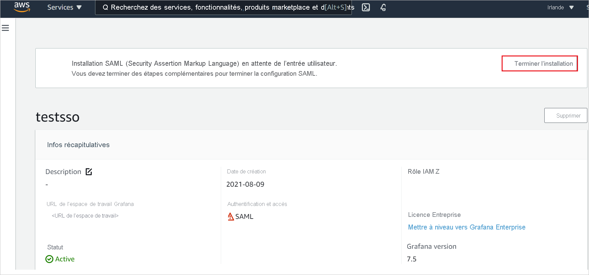

# Tutoriel : Intégration de l’authentification unique Azure Active Directory à Amazon Managed Grafana

Dans ce tutoriel, vous allez découvrir comment intégrer Amazon Managed Grafana à Azure Active Directory (Azure AD). Quand vous intégrez Amazon Managed Grafana à Azure AD, vous pouvez :

* Contrôler dans Azure AD qui a accès à Amazon Managed Grafana.
* Permettre à vos utilisateurs de se connecter automatiquement à Amazon Managed Grafana avec leur compte Azure AD.
* Gérer vos comptes à un emplacement central : le Portail Azure.

## Prérequis

Pour commencer, vous devez disposer de ce qui suit :

* Un abonnement Azure AD Si vous ne disposez d’aucun abonnement, vous pouvez obtenir [un compte gratuit](https://azure.microsoft.com/free/)
* [Compte gratuit](https://aws.amazon.com/free/) Amazon Web Services (AWS).
* Abonnement Amazon Managed Grafana pour lequel l’authentification unique (SSO) est activée.

## Description du scénario

Dans ce tutoriel, vous allez configurer et tester l’authentification unique Azure AD dans un environnement de test.

* Amazon Managed Grafana prend en charge l’authentification unique lancée par le **fournisseur de services**.
* Amazon Managed Grafana prend en charge l’attribution d’utilisateurs **Juste-à-temps**.

## Ajouter Amazon Managed Grafana à partir de la galerie

Pour configurer l’intégration d’Amazon Managed Grafana à Azure AD, vous devez ajouter Amazon Managed Grafana depuis la galerie à votre liste d’applications SaaS gérées.

1. Connectez-vous au portail Azure avec un compte professionnel ou scolaire ou avec un compte personnel Microsoft.
1. Dans le panneau de navigation gauche, sélectionnez le service **Azure Active Directory**.
1. Accédez à **Applications d’entreprise**, puis sélectionnez **Toutes les applications**.
1. Pour ajouter une nouvelle application, sélectionnez **Nouvelle application**.
1. Dans la section **Ajouter à partir de la galerie**, tapez **Amazon Managed Grafana** dans la zone de recherche.
1. Sélectionnez **Amazon Managed Grafana** dans le panneau des résultats, puis ajoutez l’application. Patientez quelques secondes pendant que l’application est ajoutée à votre locataire.

## Configurer et tester l’authentification unique Azure AD pour Amazon Managed Grafana

Configurez et testez l’authentification unique Azure AD avec Amazon Managed Grafana pour un utilisateur de test nommé **B.Simon**. Pour que l’authentification unique fonctionne, vous devez établir une relation entre un utilisateur Azure AD et l’utilisateur Amazon Managed Grafana.

Pour configurer et tester l’authentification unique Azure AD avec Amazon Managed Grafana, effectuez les étapes suivantes :

1. **[Configurer l’authentification unique Azure AD](#configure-azure-ad-sso)** pour permettre à vos utilisateurs d’utiliser cette fonctionnalité.
    1. **[Créer un utilisateur de test Azure AD](#create-an-azure-ad-test-user)** pour tester l’authentification unique Azure AD avec B. Simon.
    1. **[Affecter l’utilisateur de test Azure AD](#assign-the-azure-ad-test-user)** pour permettre à B. Simon d’utiliser l’authentification unique Azure AD.
1. **[Configurer l’authentification Amazon Managed Grafana](#configure-amazon-managed-grafana-sso)** pour configurer les paramètres de l’authentification unique côté application.
    1. **[Créer un utilisateur de test Amazon Managed Grafana](#create-amazon-managed-grafana-test-user)** pour avoir un équivalent de B.Simon dans Amazon Managed Grafana lié à sa représentation dans Azure AD.
1. **[Tester l’authentification unique](#test-sso)** pour vérifier si la configuration fonctionne.

## Configurer l’authentification unique Azure AD

Effectuez les étapes suivantes pour activer l’authentification unique Azure AD dans le Portail Azure.

1. Dans le portail Azure, dans la page d’intégration de l’application **Amazon Managed Grafana**, recherchez la section **Gérer** et sélectionnez **Authentification unique**.
1. Dans la page **Sélectionner une méthode d’authentification unique**, sélectionnez **SAML**.
1. Dans la page **Configurer l’authentification unique avec SAML**, cliquez sur l’icône de crayon de **Configuration SAML de base** afin de modifier les paramètres.

   

1. Dans la section **Configuration SAML de base**, effectuez les étapes suivantes :

    a. Dans la zone de texte **Identificateur (ID d’entité)** , saisissez une URL au format suivant : `https://<namespace>.grafana-workspace.<region>.amazonaws.com/saml/metadata`

    b. Dans la zone de texte **URL de connexion**, saisissez une URL au format suivant : `https://<namespace>.grafana-workspace.<region>.amazonaws.com/login/saml`

    > [!NOTE]
    > Il ne s’agit pas de valeurs réelles. Mettez à jour ces valeurs avec l’identificateur et l’URL de connexion réels. Pour obtenir ces valeurs, contactez l’[équipe du support technique d’Amazon Managed Grafana](https://aws.amazon.com/contact-us/). Vous pouvez également consulter les modèles figurant à la section **Configuration SAML de base** dans le portail Azure.

1. L’application Amazon Managed Grafana attend les assertions SAML dans un format spécifique, ce qui vous oblige à ajouter des mappages d’attributs personnalisés à votre configuration d’attributs de jetons SAML. La capture d’écran suivante montre la liste des attributs par défaut.

    

1. En plus de ce qui précède, l’application Amazon Managed Grafana s’attend à ce que quelques attributs supplémentaires, indiqués ci-après, soient passés dans la réponse SAML. Ces attributs sont également préremplis, mais vous pouvez les examiner pour voir s’ils répondent à vos besoins.
    
    | Nom | Attribut source |
    | ----------| --------- |
    | displayName | user.displayname |
    | mail | user.userprincipalname |

1. Dans la page **Configurer l’authentification unique avec SAML**, dans la section **Certificat de signature SAML**, recherchez **XML de métadonnées de fédération** et sélectionnez **Télécharger** pour télécharger le certificat et l’enregistrer sur votre ordinateur.

    

1. Dans la section **Configurer Amazon Managed Grafana**, copiez la ou les URL appropriées en fonction de vos besoins.

    

### Créer un utilisateur de test Azure AD

Dans cette section, vous allez créer un utilisateur de test appelé B. Simon dans le portail Azure.

1. Dans le volet gauche du Portail Azure, sélectionnez **Azure Active Directory**, **Utilisateurs**, puis **Tous les utilisateurs**.
1. Sélectionnez **Nouvel utilisateur** dans la partie supérieure de l’écran.
1. Dans les propriétés **Utilisateur**, effectuez les étapes suivantes :
   1. Dans le champ **Nom**, entrez `B.Simon`.  
   1. Dans le champ **Nom de l’utilisateur**, entrez username@companydomain.extension. Par exemple : `B.Simon@contoso.com`.
   1. Cochez la case **Afficher le mot de passe**, puis notez la valeur affichée dans le champ **Mot de passe**.
   1. Cliquez sur **Créer**.

### Affecter l’utilisateur de test Azure AD

Dans cette section, vous allez autoriser B.Simon à utiliser l’authentification unique Azure en lui accordant l’accès à Amazon Managed Grafana.

1. Dans le portail Azure, sélectionnez **Applications d’entreprise**, puis **Toutes les applications**.
1. Dans la liste des applications, sélectionnez **Amazon Managed Grafana**.
1. Dans la page de vue d’ensemble de l’application, recherchez la section **Gérer** et sélectionnez **Utilisateurs et groupes**.
1. Sélectionnez **Ajouter un utilisateur**, puis **Utilisateurs et groupes** dans la boîte de dialogue **Ajouter une attribution**.
1. Dans la boîte de dialogue **Utilisateurs et groupes**, sélectionnez **B. Simon** dans la liste Utilisateurs, puis cliquez sur le bouton **Sélectionner** au bas de l’écran.
1. Si vous attendez qu’un rôle soit attribué aux utilisateurs, vous pouvez le sélectionner dans la liste déroulante **Sélectionner un rôle** . Si aucun rôle n’a été configuré pour cette application, vous voyez le rôle « Accès par défaut » sélectionné.
1. Dans la boîte de dialogue **Ajouter une attribution**, cliquez sur le bouton **Attribuer**.

## Configurer l’authentification unique Amazon Managed Grafana

1. Connectez-vous à votre console Amazon Managed Grafana en tant qu’administrateur.

1. Cliquez sur **Créer un espace de travail**. 

    

1. Dans la page **Specify workspace details** (Spécifier les détails de l’espace de travail), tapez un nom d’espace de travail (**Workspace name**) unique, puis cliquez sur **Next** (Suivant).

    

1. Dans la page **Configure settings** (Configurer les paramètres), cochez la case **Security Assertion Markup Language (SAML)** et activez **Service managed** (Géré par le service) comme type d’autorisation, puis cliquez sur **Next** (Suivant).

    

1. Dans **Service managed permission settings** (Paramètres d’autorisation gérée par le service), sélectionnez **Current account** (Compte actuel), puis cliquez sur **Next** (Suivant).

    

1. Dans la page **Review and create** (Vérifier et créer), vérifiez tous les détails de l’espace de travail, puis cliquez sur **Create workspace** (Créer l’espace de travail).

    

1. Après avoir créé l’espace de travail, cliquez sur **Complete setup** (Terminer l’installation) pour terminer la configuration SAML.

    

1. Dans la page **Security Assertion Markup Language(SAML)** , effectuez les étapes suivantes.

    

    1. Copiez la valeur du champ **Service provider identifier(Entity ID)** (Identificateur de fournisseur de service (ID d’entité)) et collez-la dans la zone de texte **Identificateur** de la section **Configuration SAML de base** sur le portail Azure.

    1. Copiez la valeur du champ **Service provider reply URL (Assertion consumer service URL)** (URL de réponse du fournisseur de services (URL ACS)) et collez-la dans la zone de texte **URL de réponse** de la section **Configuration SAML de base** sur le portail Azure.

    1. Copiez la valeur du champ **Service provider login URL** (URL de connexion du fournisseur de services), puis collez-la dans la zone de texte **URL de connexion** de la section **Configuration SAML de base** du portail Azure.

    1. Dans le Bloc-notes, ouvrez le fichier **XML de métadonnées de fédération** téléchargé à partir du portail Azure, puis chargez le fichier XML en cliquant sur l’option **Choose file** (Choisir un fichier).

    1. Dans la section **Assertion mapping** (Mappage d’assertion), renseignez les valeurs requises en fonction de vos besoins.

    1. Cliquez sur **Save SAML configuration** (Enregistrer la configuration SAML).

### Créer un utilisateur de test Amazon Managed Grafana

Dans cette section, un utilisateur appelé Britta Simon est créé dans Amazon Managed Grafana. Amazon Managed Grafana prend en charge l’attribution d’utilisateurs juste-à-temps, qui est activée par défaut. Vous n’avez aucune opération à effectuer dans cette section. S’il n’existe pas encore d’utilisateur dans Amazon Managed Grafana, un utilisateur est créé après l’authentification.

## Tester l’authentification unique (SSO) 

Dans cette section, vous allez tester votre configuration de l’authentification unique Azure AD avec les options suivantes. 

* Cliquez sur **Tester cette application** dans le portail Azure. Vous êtes alors redirigé vers l’URL de connexion à Amazon Managed Grafana, où vous pouvez lancer le flux de connexion. 

* Accédez directement à l’URL de connexion à Amazon Managed Grafana et lancez le flux de connexion.

* Vous pouvez utiliser Mes applications de Microsoft. Un clic sur la vignette Amazon Managed Grafana dans Mes applications vous redirige vers l’URL de connexion à Amazon Managed Grafana. Pour plus d’informations sur Mes applications, consultez [Présentation de Mes applications](https://support.microsoft.com/account-billing/sign-in-and-start-apps-from-the-my-apps-portal-2f3b1bae-0e5a-4a86-a33e-876fbd2a4510).

## Étapes suivantes

Après avoir configuré Amazon Managed Grafana, vous pouvez appliquer le contrôle de session, qui protège contre l’exfiltration et l’infiltration des données sensibles de votre organisation en temps réel. Le contrôle de session est étendu à partir de l’accès conditionnel. [Découvrez comment appliquer un contrôle de session avec Microsoft Cloud App Security](/cloud-app-security/proxy-deployment-aad).