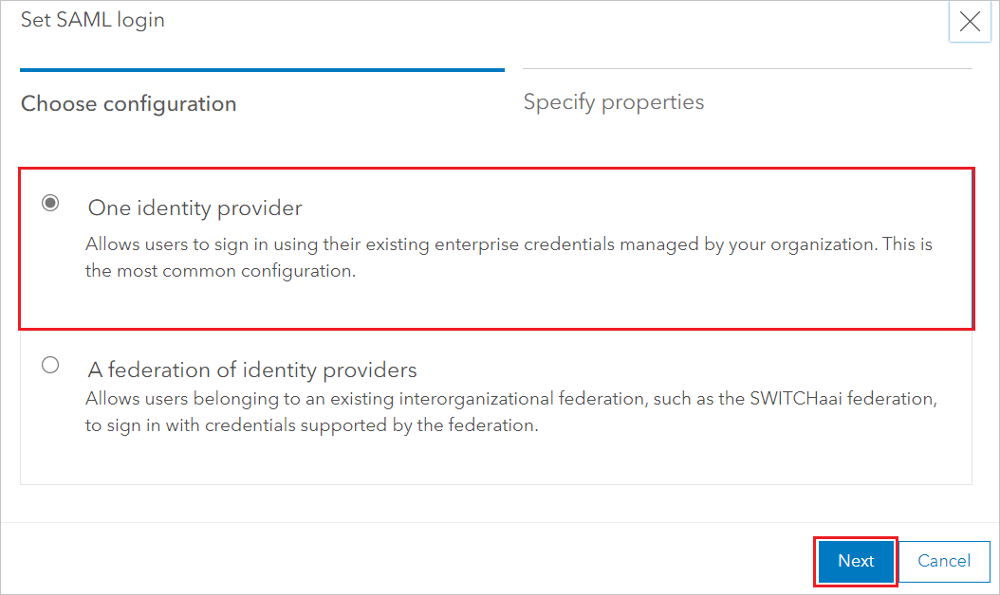
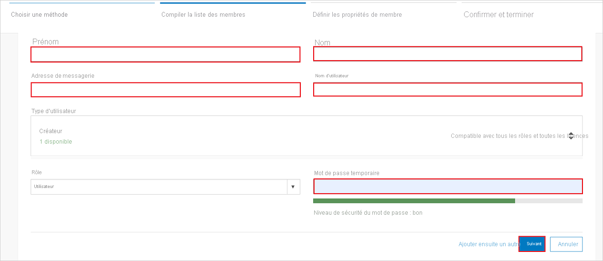

# Didacticiel : Intégration d’Azure Active Directory à ArcGIS Online

Dans ce tutoriel, vous allez découvrir comment intégrer ArcGIS Online à Azure Active Directory (Azure AD). Quand vous intégrez ArcGIS Online à Azure AD, vous pouvez :

* Contrôler qui dans Azure AD a accès à ArcGIS Online.
* Permettre à vos utilisateurs de se connecter automatiquement à ArcGIS Online avec leur compte Azure AD.
* Gérer vos comptes à un emplacement central : le Portail Azure.

## Prérequis

Pour commencer, vous devez disposer de ce qui suit :

* Un abonnement Azure AD Si vous ne disposez d’aucun abonnement, vous pouvez obtenir [un compte gratuit](https://azure.microsoft.com/free/).
* Un abonnement ArcGIS Online pour lequel l’authentification unique (SSO) est activée

> [!NOTE]
> Cette intégration peut également être utilisée à partir de l’environnement cloud US Government Azure AD. Cette application est disponible dans la Galerie d’applications cloud US Government Azure AD et peut être configurée de la même façon que dans le cloud public.

## Description du scénario

Dans ce didacticiel, vous configurez et testez l’authentification unique Azure AD dans un environnement de test.

* ArcGIS Online prend en charge l’authentification unique lancée par le **fournisseur de services**.

## Ajouter ArcGIS Online à partir de la galerie

Pour configurer l’intégration d’ArcGIS Online à Azure AD, vous devez ajouter ArcGIS Online à partir de la galerie à votre liste d’applications SaaS gérées.

1. Connectez-vous au portail Azure avec un compte professionnel ou scolaire ou avec un compte personnel Microsoft.
1. Dans le panneau de navigation gauche, sélectionnez le service **Azure Active Directory**.
1. Accédez à **Applications d’entreprise**, puis sélectionnez **Toutes les applications**.
1. Pour ajouter une nouvelle application, sélectionnez **Nouvelle application**.
1. Dans la section **Ajouter à partir de la galerie**, tapez **ArcGIS Online** dans la zone de recherche.
1. Sélectionnez **ArcGIS Online** dans le volet de résultats, puis ajoutez l’application. Patientez quelques secondes pendant que l’application est ajoutée à votre locataire.

## Configurer et tester l’authentification unique Azure AD pour ArcGIS Online

Configurez et testez l’authentification unique Azure AD auprès d’ArcGIS Online à l’aide d’un utilisateur de test nommé **B.Simon**. Pour que l’authentification unique fonctionne, vous devez établir un lien entre un utilisateur Azure AD et l’utilisateur ArcGIS Online associé.

Pour configurer et tester l’authentification unique Azure AD auprès d’ArcGIS Online, effectuez les étapes suivantes :

1. **[Configurer l’authentification unique Azure AD](#configure-azure-ad-sso)** pour permettre à vos utilisateurs d’utiliser cette fonctionnalité.
    1. **[Créer un utilisateur de test Azure AD](#create-an-azure-ad-test-user)** pour tester l’authentification unique Azure AD avec B. Simon.
    1. **[Affecter l’utilisateur de test Azure AD](#assign-the-azure-ad-test-user)** pour permettre à B. Simon d’utiliser l’authentification unique Azure AD.
1. **[Configurer l’authentification unique ArcGIS Online](#configure-arcgis-online-sso)** pour configurer les paramètres de l’authentification unique côté application.
    1. **[Créer un utilisateur de test ArcGIS Online](#create-arcgis-online-test-user)** pour disposer, dans ArcGIS Online, d’un équivalent de B.Simon lié à la représentation Azure AD de l’utilisateur.
1. **[Tester l’authentification unique](#test-sso)** pour vérifier si la configuration fonctionne.

## Configurer l’authentification unique Azure AD

Effectuez les étapes suivantes pour activer l’authentification unique Azure AD dans le Portail Azure.

1. Dans le portail Azure, accédez à la page d’intégration de l’application **ArcGIS Server**, recherchez la section **Gérer** et sélectionnez **Authentification unique**.
1. Dans la page **Sélectionner une méthode d’authentification unique**, sélectionnez **SAML**.
1. Dans la page **Configurer l’authentification unique avec SAML**, cliquez sur l’icône de crayon de **Configuration SAML de base** afin de modifier les paramètres.

   

4. Dans la section **Configuration SAML de base**, effectuez les étapes suivantes :

    a. Dans la zone de texte **URL de connexion**, saisissez une URL au format suivant : `https://<companyname>.maps.arcgis.com`

    b. Dans la zone de texte **Identificateur (ID d’entité)** , saisissez une URL au format suivant : `<companyname>.maps.arcgis.com`

    > [!NOTE]
    > Il ne s’agit pas de valeurs réelles. Mettez à jour ces valeurs avec l’URL de connexion et l’identificateur réels. Pour obtenir ces valeurs, contactez [l’équipe du support ArcGIS Online](https://support.esri.com/en/). Vous pouvez également consulter les modèles figurant à la section **Configuration SAML de base** dans le portail Azure.

5. Sur la page **Configurer l’authentification unique avec SAML**, dans la section **Certificat de signature SAML**, cliquez sur **Télécharger** pour télécharger le fichier **XML de métadonnées de fédération** en fonction des options définies selon vos besoins, puis enregistrez-le sur votre ordinateur.

    

6. Pour automatiser la configuration dans **ArcGIS Online**, vous devez installer **l’extension de navigateur My Apps Secure Sign-in** en cliquant sur **Install the extension** (Installer l’extension).

    

7. Après l’ajout de l’extension au navigateur, cliquez sur **Setup ArcGIS Online** (Configurer ArcGIS Online) pour être orienté vers l’application ArcGIS Online. À partir de là, indiquez les informations d’identification de l’administrateur pour vous connecter à ArcGIS Online. Cette extension de navigateur configure automatiquement l’application pour vous et automatise les étapes de la section **Configurer l’authentification unique ArcGIS Online**.

### Créer un utilisateur de test Azure AD 

Dans cette section, vous allez créer un utilisateur de test appelé B. Simon dans le portail Azure.

1. Dans le volet gauche du Portail Azure, sélectionnez **Azure Active Directory**, **Utilisateurs**, puis **Tous les utilisateurs**.
1. Sélectionnez **Nouvel utilisateur** dans la partie supérieure de l’écran.
1. Dans les propriétés **Utilisateur**, effectuez les étapes suivantes :
   1. Dans le champ **Nom**, entrez `B.Simon`.  
   1. Dans le champ **Nom de l’utilisateur**, entrez username@companydomain.extension. Par exemple : `B.Simon@contoso.com`.
   1. Cochez la case **Afficher le mot de passe**, puis notez la valeur affichée dans le champ **Mot de passe**.
   1. Cliquez sur **Créer**.

### Affecter l’utilisateur de test Azure AD

Dans cette section, vous allez autoriser B.Simon à utiliser l’authentification unique Azure en accordant l’accès à ArcGIS Online.

1. Dans le portail Azure, sélectionnez **Applications d’entreprise**, puis **Toutes les applications**.
1. Dans la liste des applications, sélectionnez **ArcGIS Online**.
1. Dans la page de vue d’ensemble de l’application, recherchez la section **Gérer** et sélectionnez **Utilisateurs et groupes**.
1. Sélectionnez **Ajouter un utilisateur**, puis **Utilisateurs et groupes** dans la boîte de dialogue **Ajouter une attribution**.
1. Dans la boîte de dialogue **Utilisateurs et groupes**, sélectionnez **B. Simon** dans la liste Utilisateurs, puis cliquez sur le bouton **Sélectionner** au bas de l’écran.
1. Si vous attendez qu’un rôle soit attribué aux utilisateurs, vous pouvez le sélectionner dans la liste déroulante **Sélectionner un rôle** . Si aucun rôle n’a été configuré pour cette application, vous voyez le rôle « Accès par défaut » sélectionné.
1. Dans la boîte de dialogue **Ajouter une attribution**, cliquez sur le bouton **Attribuer**.

## Configurer l’authentification unique ArcGIS Online

1. Si vous souhaitez configurer manuellement ArcGIS Online, ouvrez une nouvelle fenêtre de navigateur web, connectez-vous à votre site d’entreprise ArcGIS en tant qu’administrateur et procédez comme suit :

2. Cliquez sur **Edit Settings** (Modifier les paramètres).

    

3. Cliquez sur **Sécurité**.

    

4. Sous **Enterprise Logins** (Informations de connexion entreprise), cliquez sur **Set Identity Provider** (Définir un fournisseur d’identité).

    

5. Dans la page de configuration **Set Identity Provider** , procédez comme suit :

    

    a. Dans la zone de texte **Name** (Nom), tapez le nom de votre organisation.

    b. Pour **Metadata for the Enterprise Identity Provider will be supplied using**, sélectionnez **A File**.

    c. Pour télécharger votre fichier de métadonnées, cliquez sur **Choose file**.

    d. Cliquez sur **Set Identity Provider** (Définir un fournisseur d’identité).

### Créer un utilisateur de test ArcGIS Online

Pour permettre aux utilisateurs Azure AD de se connecter à ArcGIS Online, vous devez les attribuer dans ArcGIS Online.  
Pour ArcGIS Online, cette attribution s’effectue manuellement.

**Pour approvisionner un compte d’utilisateur, procédez comme suit :**

1. Connectez-vous à votre locataire **ArcGIS** .

2. Cliquez sur **Invite Members** (Inviter des membres).

    

3. Sélectionnez **Add members automatically without sending an email** (Ajouter des membres automatiquement sans envoyer d’e-mail), puis cliquez sur **Next** (Suivant).

    

4. Dans la page de boîte de dialogue **Members** , procédez comme suit :

    

     a. Entrez **l’adresse e-mail**, le **prénom** et le **nom** du compte Azure AD valide que vous voulez provisionner.

     b. Cliquez sur **Add And Review** (Ajouter et vérifier).
5. Passez en revue les données que vous avez entrées, puis cliquez sur **Add Members** (Ajouter des membres).

    

    > [!NOTE]
    > Le titulaire du compte Azure Active Directory reçoit un message électronique contenant un lien à suivre pour confirmer son compte et l’activer.

## Tester l’authentification unique (SSO)

Dans cette section, vous allez tester votre configuration de l’authentification unique Azure AD avec les options suivantes. 

* Cliquez sur **Tester cette application** dans le portail Azure. Cette opération redirige vers l’URL de connexion à ArcGIS Online, d’où vous pouvez lancer le processus de connexion. 

* Accédez directement à l’URL de connexion ArcGIS Online et lancez le processus de connexion.

* Vous pouvez utiliser Mes applications de Microsoft. Un clic sur la vignette ArcGIS Online dans Mes applications vous redirige vers l’URL de connexion ArcGIS Online. Pour plus d’informations sur Mes applications, consultez [Présentation de Mes applications](https://docs.microsoft.com/azure/active-directory/active-directory-saas-access-panel-introduction).

## Étapes suivantes

Après avoir configuré ArcGIS Online, vous pouvez appliquer le contrôle de session, qui protège contre l’exfiltration et l’infiltration des données sensibles de votre organisation en temps réel. Le contrôle de session est étendu à partir de l’accès conditionnel. [Découvrez comment appliquer un contrôle de session avec Microsoft Cloud App Security](https://docs.microsoft.com/cloud-app-security/proxy-deployment-any-app).
