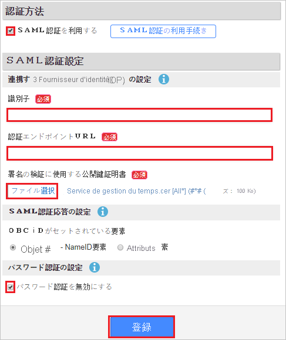
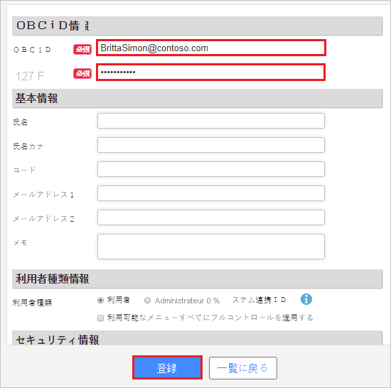

# Didacticiel : Intégration d’Attendance Management Services avec Azure Active Directory

Dans ce tutoriel, vous allez apprendre à intégrer Attendance Management Services avec Azure Active Directory (Azure AD). Lorsque vous intégrez Attendance Management Services à Azure AD, vous pouvez :

* Contrôler, dans Azure AD, a accès à Attendance Management Services.
* Autoriser la connexion automatique de vos utilisateurs à Attendance Management Services avec leur compte Azure AD.
* Gérer vos comptes à un emplacement central : le Portail Azure.

## Prérequis

Pour configurer l’intégration d’Attendance Management Services avec Azure AD, vous avez besoin des éléments suivants :

* Un abonnement Azure AD Si vous n’avez pas d’environnement Azure AD, vous pouvez obtenir un [compte gratuit](https://azure.microsoft.com/free/).
* Un abonnement Attendance Management Services pour lequel l’authentification unique est activée

## Description du scénario

Dans ce didacticiel, vous configurez et testez l’authentification unique Azure AD dans un environnement de test.

* Attendance Management Services prend en charge l’authentification unique initiée par le **fournisseur de service**.

## Ajouter Attendance Management Services à partir de la galerie

Pour configurer l’intégration d’Attendance Management Services avec Azure AD, vous devez ajouter Attendance Management Services à votre liste d’applications SaaS gérées à partir de la galerie.

1. Connectez-vous au portail Azure avec un compte professionnel ou scolaire ou avec un compte personnel Microsoft.
1. Dans le panneau de navigation gauche, sélectionnez le service **Azure Active Directory**.
1. Accédez à **Applications d’entreprise**, puis sélectionnez **Toutes les applications**.
1. Pour ajouter une nouvelle application, sélectionnez **Nouvelle application**.
1. Dans la section **Ajouter à partir de la galerie**, tapez **Attendance Management Services** dans la zone de recherche.
1. Sélectionnez **Attendance Management Services** dans le volet de résultats, puis ajoutez l’application. Patientez quelques secondes pendant que l’application est ajoutée à votre locataire.

## Configurer et tester l’authentification unique Azure AD pour Attendance Management Services

Configurez et testez l’authentification unique Azure AD avec Attendance Management Services pour un utilisateur de test nommé **B.Simon**. Pour que l’authentification unique fonctionne, vous devez établir un lien entre un utilisateur Azure AD et l’utilisateur associé dans Attendance Management Services.

Pour configurer et tester l’authentification unique Azure AD avec Attendance Management Services, procédez comme suit :

1. **[Configurer l’authentification unique Azure AD](#configure-azure-ad-sso)** pour permettre à vos utilisateurs d’utiliser cette fonctionnalité.
    1. **[Créer un utilisateur de test Azure AD](#create-an-azure-ad-test-user)** pour tester l’authentification unique Azure AD avec B. Simon.
    1. **[Affecter l’utilisateur de test Azure AD](#assign-the-azure-ad-test-user)** pour permettre à B. Simon d’utiliser l’authentification unique Azure AD.
1. **[Configurer l’authentification unique Attendance Management Services](#configure-attendance-management-services-sso)** pour définir les paramètres d’authentification unique côté application.
    1. **[Créer un utilisateur de test Attendance Management Services](#create-attendance-management-services-test-user)** pour avoir un équivalent de B.Simon dans Attendance Management Services lié à la représentation Azure AD associée.
1. **[Tester l’authentification unique](#test-sso)** pour vérifier si la configuration fonctionne.

## Configurer l’authentification unique Azure AD

Effectuez les étapes suivantes pour activer l’authentification unique Azure AD dans le Portail Azure.

1. Dans le Portail Azure, dans la page d’intégration de l’application **Attendance Management Services**, recherchez la section **Gérer**, puis sélectionnez **Authentification unique**.
1. Dans la page **Sélectionner une méthode d’authentification unique**, sélectionnez **SAML**.
1. Dans la page **Configurer l’authentification unique avec SAML**, cliquez sur l’icône de crayon de **Configuration SAML de base** afin de modifier les paramètres.

   

4. Dans la section **Configuration SAML de base**, effectuez les étapes suivantes :

    a. Dans la zone de texte **Identificateur (ID d’entité)** , saisissez une URL au format suivant : `https://id.obc.jp/<TENANT_INFORMATION>/`

    b. Dans la zone de texte **URL de connexion**, saisissez une URL au format suivant : `https://id.obc.jp/<TENANT_INFORMATION>/`

    > [!NOTE]
    > Il ne s’agit pas de valeurs réelles. Mettez à jour ces valeurs avec l’identificateur et l’URL de connexion réels. Contactez l’[équipe de support technique d’Attendance Management Services](https://www.obcnet.jp/) pour obtenir ces valeurs. Vous pouvez également consulter les modèles figurant à la section **Configuration SAML de base** dans le portail Azure.

5. Dans la page **Configurer l’authentification unique avec SAML**, dans la section **Certificat de signature SAML**, cliquez sur **Télécharger** pour télécharger le **Certificat (Base64)** en fonction des options définies par rapport à vos besoins, puis enregistrez-le sur votre ordinateur.

    

6. Dans la section **Configurer Attendance Management Services**, copiez la ou les URL appropriées en fonction de vos besoins.

    

### Créer un utilisateur de test Azure AD

Dans cette section, vous allez créer un utilisateur de test appelé B. Simon dans le portail Azure.

1. Dans le volet gauche du Portail Azure, sélectionnez **Azure Active Directory**, **Utilisateurs**, puis **Tous les utilisateurs**.
1. Sélectionnez **Nouvel utilisateur** dans la partie supérieure de l’écran.
1. Dans les propriétés **Utilisateur**, effectuez les étapes suivantes :
   1. Dans le champ **Nom**, entrez `B.Simon`.  
   1. Dans le champ **Nom de l’utilisateur**, entrez username@companydomain.extension. Par exemple : `B.Simon@contoso.com`.
   1. Cochez la case **Afficher le mot de passe**, puis notez la valeur affichée dans le champ **Mot de passe**.
   1. Cliquez sur **Créer**.

### Affecter l’utilisateur de test Azure AD

Dans cette section, vous allez autoriser B.Simon à utiliser l’authentification unique Azure en lui accordant l’accès à Attendance Management Services.

1. Dans le portail Azure, sélectionnez **Applications d’entreprise**, puis **Toutes les applications**.
1. Dans la liste des applications, sélectionnez **Attendance Management Services**.
1. Dans la page de vue d’ensemble de l’application, recherchez la section **Gérer** et sélectionnez **Utilisateurs et groupes**.
1. Sélectionnez **Ajouter un utilisateur**, puis **Utilisateurs et groupes** dans la boîte de dialogue **Ajouter une attribution**.
1. Dans la boîte de dialogue **Utilisateurs et groupes**, sélectionnez **B. Simon** dans la liste Utilisateurs, puis cliquez sur le bouton **Sélectionner** au bas de l’écran.
1. Si vous attendez qu’un rôle soit attribué aux utilisateurs, vous pouvez le sélectionner dans la liste déroulante **Sélectionner un rôle** . Si aucun rôle n’a été configuré pour cette application, vous voyez le rôle « Accès par défaut » sélectionné.
1. Dans la boîte de dialogue **Ajouter une attribution**, cliquez sur le bouton **Attribuer**.

## Configurer l’authentification unique Attendance Management Services

1. Dans une autre fenêtre de navigateur, connectez-vous au site d’entreprise Attendance Management Services en tant qu’administrateur.

1. Cliquez sur **SAML authentication** sous la **section Security management**.

    

1. Procédez comme suit :

    

    a. Sélectionnez **Use SAML authentication**.

    b. Dans la zone de texte **Identificateur**, collez la valeur **Identificateur Azure AD** que vous avez copiée à partir du portail Azure.

    c. Dans la zone de texte **Authentication endpoint URL** (URL du point de terminaison d’authentification), collez la valeur **URL de connexion** que vous avez copiée sur le portail Azure.

    d. Cliquez sur **Select a file** pour charger le certificat que vous avez téléchargé à partir d’Azure AD.

    e. Sélectionnez **Disable password authentication**.

    f. Cliquez sur **Inscription**.

### Créer un utilisateur de test Attendance Management Services

Pour permettre aux utilisateurs d’Azure AD de se connecter à Attendance Management Services, vous devez les approvisionner dans Attendance Management Services. Dans le cas d’Attendance Management Services, l’approvisionnement est une tâche manuelle.

**Pour approvisionner un compte d’utilisateur, procédez comme suit :**

1. Connectez-vous au site d’entreprise Attendance Management Services en tant qu’administrateur.

1. Cliquez sur **User management** sous la **section Security management**.

    

1. Cliquez sur **New rules login**.

    

1. Dans la section **OBCiD information**, procédez comme suit :

    

    a. Dans la zone de texte **OBCiD**, tapez l’adresse e-mail de l’utilisateur, par exemple, `BrittaSimon@contoso.com`.

    b. Dans la zone de texte **Password** (Mot de passe), tapez le mot de passe de l’utilisateur.

    c. Cliquez sur **Registration**.

## Tester l’authentification unique (SSO)

Dans cette section, vous allez tester votre configuration de l’authentification unique Azure AD avec les options suivantes. 

* Cliquez sur **Tester cette application** dans le portail Azure. Cette opération redirige vers l’URL de connexion à Attendance Management Services, d’où vous pouvez lancer le flux de connexion. 

* Accédez directement à l’URL de connexion Attendance Management Services pour lancer le flux de connexion.

* Vous pouvez utiliser Mes applications de Microsoft. Quand vous cliquez sur la vignette Attendance Management Services dans Mes applications, une redirection est effectuée vers l’URL de connexion à Attendance Management Services. Pour plus d’informations sur Mes applications, consultez [Présentation de Mes applications](https://support.microsoft.com/account-billing/sign-in-and-start-apps-from-the-my-apps-portal-2f3b1bae-0e5a-4a86-a33e-876fbd2a4510).

## Étapes suivantes

Après avoir configuré Attendance Management Services, vous pouvez appliquer le contrôle de session qui protège l’exfiltration et l’infiltration des données sensibles de votre organisation en temps réel. Le contrôle de session est étendu à partir de l’accès conditionnel. [Découvrez comment appliquer un contrôle de session avec Microsoft Cloud App Security](/cloud-app-security/proxy-deployment-aad).