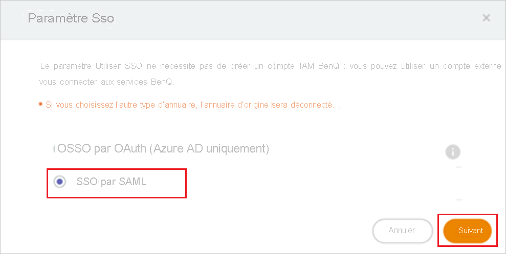
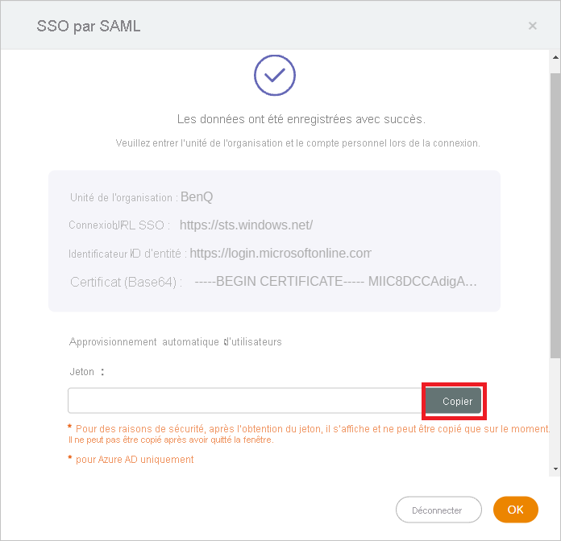

# Tutoriel : Configurer BenQ IAM pour l’approvisionnement automatique d’utilisateurs

Ce tutoriel décrit les étapes à effectuer dans BenQ IAM et Azure Active Directory (Azure AD) pour configurer l’approvisionnement automatique d’utilisateurs. Une fois configuré, Azure AD approvisionne et déprovisionne automatiquement les utilisateurs et les groupes pour [BenQ IAM](https://service-portal.benq.com/login) à l’aide du service d’approvisionnement Azure AD. Pour découvrir les informations importantes sur ce que fait ce service, comment il fonctionne et consulter le forum aux questions, reportez-vous à l’article [Automatiser l’attribution et l’annulation de l’attribution des utilisateurs dans les applications SaaS avec Azure Active Directory](../app-provisioning/user-provisioning.md). 

## Fonctionnalités prises en charge
> [!div class="checklist"]
> * Créer des utilisateurs dans BenQ IAM
> * Supprimer des utilisateurs dans BenQ IAM quand ils n’ont plus besoin d’accès
> * Garder les attributs utilisateur synchronisés entre Azure AD et BenQ IAM
> * [Authentification unique](benq-iam-tutorial.md) auprès de BenQ IAM (recommandé)

## Prérequis

Le scénario décrit dans ce tutoriel part du principe que vous disposez des prérequis suivants :

* [Un locataire Azure AD](../develop/quickstart-create-new-tenant.md) 
* Un compte d’utilisateur dans Azure AD avec l’[autorisation](../roles/permissions-reference.md) de configurer l’approvisionnement (par exemple, Administrateur d’application, Administrateur d’application cloud, Propriétaire d’application ou Administrateur général).
* Un compte d’administrateur avec BenQ IAM. Vous pouvez vous inscrire pour obtenir un compte d’administrateur BenQ sur [BenQ IAM](https://service-portaltest.benq.com/login).

## Étape 1. Planifier votre déploiement de l’approvisionnement
1. En savoir plus sur le [fonctionnement du service d’approvisionnement](../app-provisioning/user-provisioning.md).
2. Déterminez qui sera dans l’[étendue pour l’approvisionnement](../app-provisioning/define-conditional-rules-for-provisioning-user-accounts.md).
3. Déterminez les données à [mapper entre Azure AD et BenQ IAM](../app-provisioning/customize-application-attributes.md).

## Étape 2. Configurer BenQ IAM pour prendre en charge l’approvisionnement avec Azure AD

1. Connectez-vous à [BenQ IAM](https://service-portaltest.benq.com/login) avec un compte administrateur BenQ et cliquez sur **SSO Setting** dans la section de gestion des comptes.
    

2. Sélectionnez **SSO by SAML** comme paramètre SSO dans la fenêtre contextuelle, puis cliquez sur Next. 
    

3. Suivez [le tutoriel relatif à l’intégration de l’authentification unique Azure AD à BenQ IAM](benq-iam-tutorial.md) pour compléter les paramètres obligatoires.

4. Après avoir terminé les paramètres SSO by SAML, vous verrez un message de réussite comme indiqué dans l’image ci-dessous. Cliquez sur **Create Token** dans la section Automated User Provisioning.
    

5. Copiez le jeton dans un endroit sûr. Ce jeton sera utilisé dans le portail Azure à l’**étape 5**.
    

## Étape 3. Ajouter BenQ IAM à partir de la galerie d’applications Azure AD

Ajoutez BenQ IAM à partir de la galerie d’applications Azure AD pour commencer à gérer l’approvisionnement pour BenQ IAM. Si vous avez déjà configuré BenQ IAM pour l’authentification unique, vous pouvez utiliser la même application. Toutefois, il est recommandé de créer une application distincte lors du test initial de l’intégration. En savoir plus sur l’ajout d’une application à partir de la galerie [ici](../manage-apps/add-application-portal.md). 

## Étape 4. Définir qui sera dans l’étendue pour l’approvisionnement 

Le service d’approvisionnement Azure AD vous permet de définir l’étendue des utilisateurs approvisionnés en fonction de l’affectation à l’application et/ou en fonction des attributs de l’utilisateur/groupe. Si vous choisissez de définir l’étendue de l’approvisionnement pour votre application en fonction de l’attribution, vous pouvez utiliser les étapes de [suivantes](../manage-apps/assign-user-or-group-access-portal.md) pour affecter des utilisateurs et des groupes à l’application. Si vous choisissez de définir l’étendue de l’approvisionnement en fonction uniquement des attributs de l’utilisateur ou du groupe, vous pouvez utiliser un filtre d’étendue comme décrit [ici](../app-provisioning/define-conditional-rules-for-provisioning-user-accounts.md). 

* Lorsque vous attribuez des utilisateurs et des groupes à BenQ IAM, vous devez sélectionner un rôle autre que **Accès par défaut**. Les utilisateurs disposant du rôle Accès par défaut sont exclus de l’approvisionnement et sont marqués comme non autorisés dans les journaux de configuration. Si le seul rôle disponible dans l’application est le rôle d’accès par défaut, vous pouvez [mettre à jour le manifeste de l’application](../develop/howto-add-app-roles-in-azure-ad-apps.md) pour ajouter des rôles supplémentaires. 

* Commencez progressivement. Testez avec un petit ensemble d’utilisateurs et de groupes avant d’effectuer un déploiement général. Lorsque l’étendue de l’approvisionnement est définie sur les utilisateurs et les groupes attribués, vous pouvez contrôler cela en affectant un ou deux utilisateurs ou groupes à l’application. Lorsque l’étendue est définie sur tous les utilisateurs et groupes, vous pouvez spécifier un [filtre d’étendue basé sur l’attribut](../app-provisioning/define-conditional-rules-for-provisioning-user-accounts.md). 

## Étape 5. Configurer l’approvisionnement automatique d’utilisateurs dans BenQ IAM 

Cette section vous guide tout au long des étapes de configuration du service d’approvisionnement d’Azure AD pour créer, mettre à jour et désactiver des utilisateurs et/ou des groupes dans TestApp en fonction des assignations d’utilisateurs et/ou de groupes dans Azure AD.

### Pour configurer l’approvisionnement automatique d’utilisateurs pour BenQ IAM dans Azure AD :

1. Connectez-vous au [portail Azure](https://portal.azure.com). Sélectionnez **Applications d’entreprise**, puis **Toutes les applications**.

    

2. Dans la liste des applications, sélectionnez **BenQ IAM**.

    

3. Sélectionnez l’onglet **Approvisionnement**.

    

4. Définissez le **Mode d’approvisionnement** sur **Automatique**.

    

5. Sous la section **Informations d’identification de l’administrateur**, entrez l’URL de locataire et le jeton secret de BenQ IAM. Cliquez sur **Tester la connexion** pour vérifier qu’Azure AD peut se connecter à BenQ IAM. Si la connexion échoue, vérifiez que votre compte BenQ IAM dispose des autorisations d’administrateur et réessayez.

    

6. Dans le champ **E-mail de notification**, entrez l’adresse e-mail de la personne ou du groupe qui doit recevoir les notifications d’erreur de provisionnement et sélectionnez la case à cocher **Envoyer une notification par e-mail en cas de défaillance**.

    

7. Sélectionnez **Enregistrer**.

8. Sous la section **Mappages**, sélectionnez **Synchroniser les utilisateurs Azure Active Directory avec BenQ IAM**.

9. Dans la section **Mappages des attributs**, passez en revue les attributs utilisateur qui sont synchronisés entre Azure AD et BenQ IAM. Les attributs sélectionnés en tant que propriétés de **Correspondance** sont utilisés pour faire correspondre les comptes d’utilisateur dans BenQ IAM pour les opérations de mise à jour. Si vous choisissez de changer l’[attribut cible correspondant](../app-provisioning/customize-application-attributes.md), vous devez vérifier que l’API BenQ IAM prend en charge le filtrage des utilisateurs en fonction de cet attribut. Cliquez sur le bouton **Enregistrer** pour valider les modifications.

   |Attribut|Type|Pris en charge pour le filtrage|
   |---|---|---|
   |userName|String|&check;
   |externalId|String|
   |active|Boolean|
   |displayName|String|

10. Pour configurer des filtres d’étendue, reportez-vous aux instructions suivantes fournies dans [Approvisionnement d’applications basé sur les attributs avec filtres d’étendue](../app-provisioning/define-conditional-rules-for-provisioning-user-accounts.md).

11. Pour activer le service d’approvisionnement Azure AD pour BenQ IAM, affectez au paramètre **Statut d’approvisionnement** la valeur **Activé** dans la section **Paramètres**.

    

12. Définissez les utilisateurs et/ou groupes que vous souhaitez approvisionner sur BenQ IAM en choisissant les valeurs souhaitées dans **Étendue** dans la section **Paramètres**.

    

13. Lorsque vous êtes prêt à effectuer l’approvisionnement, cliquez sur **Enregistrer**.

    

Cette opération démarre le cycle de synchronisation initiale de tous les utilisateurs et groupes définis dans **Étendue** dans la section **Paramètres**. Le cycle de synchronisation initiale prend plus de temps que les cycles de synchronisation suivants, qui se produisent toutes les 40 minutes environ tant que le service de provisionnement Azure AD est en cours d’exécution. 

## Étape 6. Surveiller votre déploiement
Une fois que vous avez configuré l’approvisionnement, utilisez les ressources suivantes pour surveiller votre déploiement :

1. Utilisez les [journaux d’approvisionnement](../reports-monitoring/concept-provisioning-logs.md) pour déterminer quels utilisateurs ont été configurés avec succès ou échoué.
2. Consultez la [barre de progression](../app-provisioning/application-provisioning-when-will-provisioning-finish-specific-user.md) pour afficher l’état du cycle d’approvisionnement et quand il se termine
3. Si la configuration de l’approvisionnement semble se trouver dans un état non sain, l’application passe en quarantaine. Pour en savoir plus sur les états de quarantaine, cliquez [ici](../app-provisioning/application-provisioning-quarantine-status.md).

## Ressources supplémentaires

* [Gestion de l’approvisionnement de comptes d’utilisateur pour les applications d’entreprise](../app-provisioning/configure-automatic-user-provisioning-portal.md)
* [Qu’est-ce que l’accès aux applications et l’authentification unique avec Azure Active Directory ?](../manage-apps/what-is-single-sign-on.md)

## Étapes suivantes

* [Découvrez comment consulter les journaux d’activité et obtenir des rapports sur l’activité d’approvisionnement](../app-provisioning/check-status-user-account-provisioning.md)
