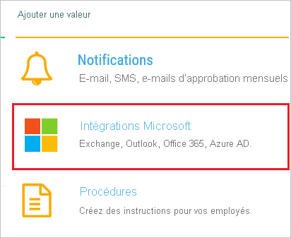
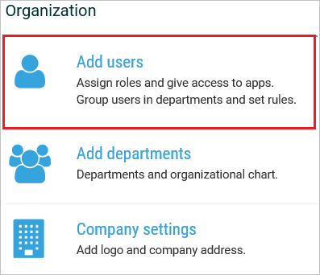
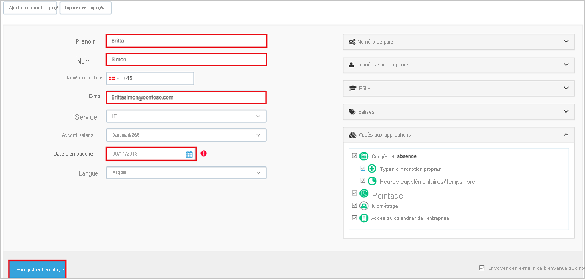

# Didacticiel : Intégration de Azure Active Directory à BitaBIZ

Dans ce tutoriel, vous allez apprendre à intégrer BitaBIZ à Azure Active Directory (Azure AD). Quand vous intégrez BitaBIZ à Azure AD, vous pouvez :

* Contrôler dans Azure AD qui a accès à BitaBIZ.
* Permettre à vos utilisateurs de se connecter automatiquement à BitaBIZ avec leur compte Azure AD.
* Gérer vos comptes à un emplacement central : le Portail Azure.

## Prérequis

Pour configurer l’intégration de Azure AD avec BitaBIZ, vous avez besoin des éléments suivants :

* Un abonnement Azure AD Si vous n’avez pas d’environnement Azure AD, vous pouvez obtenir un [compte gratuit](https://azure.microsoft.com/free/).
* Un abonnement BitaBIZ pour lequel l’authentification unique est activée.

## Description du scénario

Dans ce didacticiel, vous configurez et testez l’authentification unique Azure AD dans un environnement de test.

* BitaBIZ prend en charge l’authentification unique lancée par **le fournisseur de services et le fournisseur d’identité**.
* BitaBIZ prend en charge l’[attribution automatisée d’utilisateurs](bitabiz-provisioning-tutorial.md).

## Ajouter BitaBIZ depuis la galerie

Pour configurer l’intégration de BitaBIZ avec Azure AD, vous devez ajouter BitaBIZ, disponible dans la galerie, à votre liste d’applications SaaS gérées.

1. Connectez-vous au portail Azure avec un compte professionnel ou scolaire ou avec un compte personnel Microsoft.
1. Dans le panneau de navigation gauche, sélectionnez le service **Azure Active Directory**.
1. Accédez à **Applications d’entreprise**, puis sélectionnez **Toutes les applications**.
1. Pour ajouter une nouvelle application, sélectionnez **Nouvelle application**.
1. Dans la section **Ajouter à partir de la galerie**, tapez **BitaBIZ** dans la zone de recherche.
1. Sélectionnez **BitaBIZ** dans le volet de résultats, puis ajoutez l’application. Patientez quelques secondes pendant que l’application est ajoutée à votre locataire.

## Configurer et tester l’authentification unique Azure AD pour BitaBIZ

Configurez et testez l’authentification unique Azure AD avec BitaBIZ à l’aide d’un utilisateur test appelé **B.Simon**. Pour que l’authentification unique fonctionne, vous devez établir un lien entre un utilisateur Azure AD et l’utilisateur associé dans BitaBIZ.

Pour configurer et tester l’authentification unique Azure AD avec BitaBIZ, effectuez les étapes suivantes :

1. **[Configurer l’authentification unique Azure AD](#configure-azure-ad-sso)** pour permettre à vos utilisateurs d’utiliser cette fonctionnalité.
    1. **[Créer un utilisateur de test Azure AD](#create-an-azure-ad-test-user)** pour tester l’authentification unique Azure AD avec Britta Simon.
    1. **[Affecter l’utilisateur de test Azure AD](#assign-the-azure-ad-test-user)** pour permettre à Britta Simon d’utiliser l’authentification unique Azure AD.
2. **[Configurer l’authentification unique BitaBIZ](#configure-bitabiz-sso)** pour configurer les paramètres de l’authentification unique côté application.
    1. **[Créer un utilisateur de test BitaBIZ](#create-bitabiz-test-user)** pour avoir un équivalent de Britta Simon dans BitaBIZ lié à la représentation Azure AD associée.
1. **[Tester l’authentification unique](#test-sso)** pour vérifier si la configuration fonctionne.

## Configurer l’authentification unique Azure AD

Effectuez les étapes suivantes pour activer l’authentification unique Azure AD dans le Portail Azure.

1. Dans le portail Azure, accédez à la page d’intégration de l’application **BitaBIZ**, recherchez la section **Gérer** et sélectionnez **Authentification unique**.
1. Dans la page **Sélectionner une méthode d’authentification unique**, sélectionnez **SAML**.
1. Dans la page **Configurer l’authentification unique avec SAML**, cliquez sur l’icône de crayon de **Configuration SAML de base** afin de modifier les paramètres.

   

4. Dans la section **Configuration SAML de base** , si vous souhaitez configurer l’application en mode **Initié par le fournisseur d’identité**, effectuez les étapes ci-dessous :

    Dans la zone de texte **Identificateur**, tapez une URL au format suivant : `https://www.bitabiz.com/<INSTANCE_ID>`

    > [!NOTE]
    > La valeur dans l’URL ci-dessus est uniquement à des fins de démonstration. Mettez à jour la valeur avec l’identificateur réel. La procédure est expliquée plus loin dans le didacticiel.

5. Si vous souhaitez configurer l’application en **mode démarré par le fournisseur de services**, cliquez sur **Définir des URL supplémentaires**, puis effectuez les étapes suivantes :

    Dans la zone de texte **URL de connexion**, tapez l’URL : `https://www.bitabiz.com/dashboard`

6. Dans la page **Configurer l’authentification unique avec SAML**, dans la section **Certificat de signature SAML**, cliquez sur **Télécharger** pour télécharger le **Certificat (Base64)** en fonction des options définies par rapport à vos besoins, puis enregistrez-le sur votre ordinateur.

    

7. Dans la section **Configurer BitaBIZ**, copiez la ou les URL appropriées en fonction de vos besoins.

    

### Créer un utilisateur de test Azure AD

Dans cette section, vous allez créer un utilisateur de test appelé B. Simon dans le portail Azure.

1. Dans le volet gauche du Portail Azure, sélectionnez **Azure Active Directory**, **Utilisateurs**, puis **Tous les utilisateurs**.
1. Sélectionnez **Nouvel utilisateur** dans la partie supérieure de l’écran.
1. Dans les propriétés **Utilisateur**, effectuez les étapes suivantes :
   1. Dans le champ **Nom**, entrez `B.Simon`.  
   1. Dans le champ **Nom de l’utilisateur**, entrez username@companydomain.extension. Par exemple : `B.Simon@contoso.com`.
   1. Cochez la case **Afficher le mot de passe**, puis notez la valeur affichée dans le champ **Mot de passe**.
   1. Cliquez sur **Créer**.

### Affecter l’utilisateur de test Azure AD

Dans cette section, vous allez autoriser B.Simon à utiliser l’authentification unique Azure en lui accordant l’accès à BitaBIZ.

1. Dans le portail Azure, sélectionnez **Applications d’entreprise**, puis **Toutes les applications**.
1. Dans la liste des applications, sélectionnez **BitaBIZ**.
1. Dans la page de vue d’ensemble de l’application, recherchez la section **Gérer** et sélectionnez **Utilisateurs et groupes**.
1. Sélectionnez **Ajouter un utilisateur**, puis **Utilisateurs et groupes** dans la boîte de dialogue **Ajouter une attribution**.
1. Dans la boîte de dialogue **Utilisateurs et groupes**, sélectionnez **B. Simon** dans la liste Utilisateurs, puis cliquez sur le bouton **Sélectionner** au bas de l’écran.
1. Si vous attendez qu’un rôle soit attribué aux utilisateurs, vous pouvez le sélectionner dans la liste déroulante **Sélectionner un rôle** . Si aucun rôle n’a été configuré pour cette application, vous voyez le rôle « Accès par défaut » sélectionné.
1. Dans la boîte de dialogue **Ajouter une attribution**, cliquez sur le bouton **Attribuer**.

## Configurer l’authentification unique BitaBIZ

1. Dans une autre fenêtre de navigateur web, connectez-vous à votre client BitaBIZ en tant qu’administrateur.

2. Cliquez sur **CONFIGURATION ADMINISTRATEUR**.

    

3. Cliquez sur **Intégrations Microsoft** sous la section **Ajouter une valeur**.

    

4. Faites défiler jusqu’à la section **Microsoft Azure AD (activer l’authentification unique)** et procédez comme suit :

    

    a. Copiez la valeur de la zone de texte **Entity ID** (« Identificateur » dans Azure AD) et collez-la dans la zone de texte **Identificateur** de la section **Configuration SAML de base** dans le portail Azure. 

    b. Dans la zone de texte **Azure AD Single Sign-On Service URL** (URL du service d’authentification unique Azure AD), collez la valeur **URL de connexion** que vous avez copiée à partir du portail Azure.

    c. Dans la zone de texte **Azure AD SAML Entity ID** (ID d’entité SAML Azure AD), collez l’**Identificateur Azure AD** que vous avez copié dans le portail Azure.

    d. Ouvrez dans le Bloc-notes votre fichier **Certificate(Base64)** téléchargé, copiez son contenu dans le Presse-papiers, puis collez-le dans la zone de texte **Certificat de signature Azure AD (encodé Base64)** .

    e. Ajoutez le nom de domaine de messagerie de votre entreprise, ici « mycompany.com » dans la zone de texte **Nom de domaine** pour attribuer l’authentification unique aux utilisateurs de votre société avec ce domaine de messagerie (NON OBLIGATOIRE).

    f. Cochez la case **Authentification unique activée** pour le compte BitaBIZ.

    g. Cliquez sur **Enregistrer la configuration Azure AD** pour enregistrer et activer la configuration de l’authentification unique.

### Créer un utilisateur de test BitaBIZ

Pour permettre aux utilisateurs Azure AD de se connecter à BitaBIZ, vous devez les attribuer dans BitaBIZ.  
En l’occurrence, cet approvisionnement est une tâche manuelle.

**Pour approvisionner un compte d’utilisateur, procédez comme suit :**

1. Connectez-vous à votre site d’entreprise BitaBIZ en tant qu’administrateur.

2. Cliquez sur **CONFIGURATION ADMINISTRATEUR**.

    

3. Cliquez sur **Ajouter des utilisateurs** sous la section **Organisation**.

    

4. Cliquez sur **Ajouter un nouvel employé**.

    

5. Dans la boîte de dialogue **Ajouter un nouvel employé**, effectuez les étapes suivantes :

    

    a. Dans la zone de texte **Prénom**, tapez le prénom de l’utilisateur, par exemple Britta.

    b. Dans la zone de texte **Nom de famille**, tapez le nom de l’utilisateur, par exemple Simon.

    c. Dans la zone de texte **Email** (E-mail), tapez l’adresse e-mail d’un utilisateur, par exemple, Brittasimon@contoso.com.

    d. Sélectionnez une date dans **Date d’emploi**.

    e. Il existe d’autres attributs non obligatoires pouvant être configurés pour l’utilisateur. Veuillez consulter le [document de configuration d’un nouvel employé](https://help.bitabiz.dk/manage-or-set-up-your-account/on-boarding-employees/new-employee) pour plus d’informations.

    f. Cliquez sur **Enregistrer un employé**.

    > [!NOTE]
    > Le titulaire du compte Azure Active Directory reçoit un e-mail contenant un lien à suivre pour confirmer son compte et l’activer.

> [!NOTE]
>BitaBIZ prend également en charge l’attribution automatique d’utilisateurs. Vous trouverez plus d’informations sur la configuration de cette fonctionnalité [ici](./bitabiz-provisioning-tutorial.md).

## Tester l’authentification unique (SSO)

Dans cette section, vous allez tester votre configuration de l’authentification unique Azure AD avec les options suivantes. 

#### Lancée par le fournisseur de services :

* Cliquez sur **Tester cette application** dans le portail Azure. Vous êtes alors redirigé vers l’URL d’authentification BitaBIZ, à partir de laquelle vous pouvez lancer le processus de connexion.  

* Accédez directement à l’URL d’authentification BitaBIZ pour lancer le processus de connexion.

#### Lancée par le fournisseur d’identité :

* Cliquez sur **Tester cette application** dans le portail Azure, ce qui vous permet d’être automatiquement connecté à l’application BitaBIZ pour laquelle vous avez configuré l’authentification unique. 

Vous pouvez aussi utiliser Mes applications de Microsoft pour tester l’application dans n’importe quel mode. Quand vous cliquez sur la vignette BitaBIZ dans Mes applications, si le mode Fournisseur de services est configuré, vous êtes redirigé vers la page d’authentification de l’application pour lancer le processus de connexion.Si le mode Fournisseur d’identité est configuré, vous êtes automatiquement connecté à l’application BitaBIZ pour laquelle vous avez configuré l’authentification unique. Pour plus d’informations sur Mes applications, consultez [Présentation de Mes applications](../user-help/my-apps-portal-end-user-access.md).

## Étapes suivantes

Une fois que vous avez configuré BitaBIZ, vous pouvez appliquer le contrôle de session, qui protège contre l’exfiltration et l’infiltration des données sensibles de votre organisation en temps réel. Le contrôle de session est étendu à partir de l’accès conditionnel. [Découvrez comment appliquer un contrôle de session avec Microsoft Cloud App Security](/cloud-app-security/proxy-deployment-aad).
