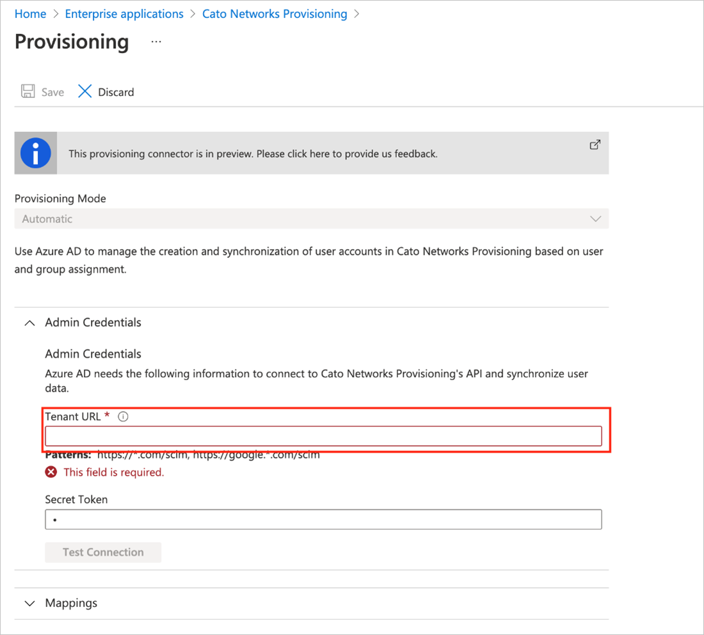
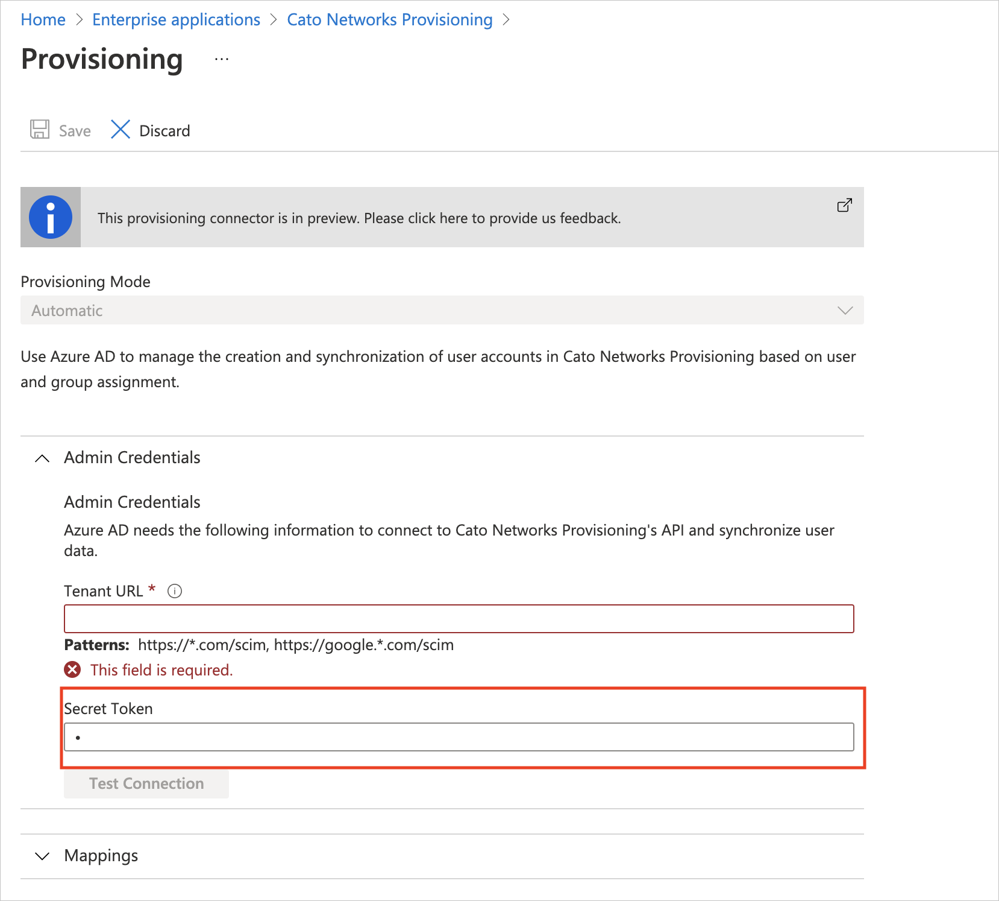

# Tutoriel : Configurer Cato Networks pour l’attribution automatique d’utilisateurs

Ce tutoriel décrit les étapes à suivre dans Cato Networks et Azure Active Directory (Azure AD) pour configurer l’attribution automatique d’utilisateurs. Une fois configuré, Azure AD attribue et désattribue automatiquement les utilisateurs et les groupes pour [Cato Networks](https://www.catonetworks.com/) en utilisant le service de provisionnement Azure AD. Pour découvrir les informations importantes sur ce que fait ce service, comment il fonctionne et consulter le forum aux questions, reportez-vous à l’article [Automatiser l’attribution et l’annulation de l’attribution des utilisateurs dans les applications SaaS avec Azure Active Directory](../app-provisioning/user-provisioning.md). 

## Fonctionnalités prises en charge
> [!div class="checklist"]
> * Créer des utilisateurs dans Cato Networks
> * Supprimer les utilisateurs dans Cato Networks quand ils ne nécessitent plus d’accès
> * Maintenir la synchronisation des attributs utilisateur entre Azure AD et Cato Networks
> * Provisionner des groupes et des appartenances aux groupes dans Cato Networks

## Prérequis

Le scénario décrit dans ce tutoriel part du principe que vous disposez des prérequis suivants :

* [Un locataire Azure AD](../develop/quickstart-create-new-tenant.md) 
* Un compte d’utilisateur dans Azure AD avec l’[autorisation](../roles/permissions-reference.md) de configurer l’approvisionnement (par exemple, administrateur d’application, administrateur d’application Cloud, propriétaire d’application ou administrateur général). 
* Un compte [Cato Networks](https://www.catonetworks.com/).
* Un compte administrateur dans Cato Networks avec des autorisations d’administrateur.
* Une licence avec un nombre suffisant d’utilisateurs.

## Étape 1. Planifier votre déploiement de l’approvisionnement
1. En savoir plus sur le [fonctionnement du service d’approvisionnement](../app-provisioning/user-provisioning.md).
1. Déterminez qui sera dans l’[étendue pour l’approvisionnement](../app-provisioning/define-conditional-rules-for-provisioning-user-accounts.md).
1. Déterminez les données à [mapper entre Azure AD et Cato Networks](../app-provisioning/customize-application-attributes.md). 

## Étape 2. Configurer Cato Networks pour prendre en charge le provisionnement avec Azure AD

1. Connectez-vous à votre compte dans [Cato Management Application](https://cc2.catonetworks.com).
1. Dans le menu de navigation, sélectionnez **Configuration > Global Settings**, puis développez la section **VPN Settings**.
        
1. Développez la section **SCIM Provisioning**, puis activez le provisionnement SCIM en cliquant sur **Enable SCIM Provisioning**.
         
1. Copiez l’URL de base et le jeton du porteur de Cato Management Application dans l’application SCIM dans le portail Azure :
   1. Dans Cato Management Application (dans la section **SCIM Provisioning**), copiez l’URL de base.
   1. Dans l’application Cato Networks SCIM dans le portail Azure, sous l’onglet **Provisionnement**, collez l’URL de base dans le champ **URL du locataire**.
        
   1. Dans Cato Management Application (dans la section **SCIM Provisioning**), cliquez sur **Generate Token** et copiez le jeton du porteur.
   1. Dans l’application Cato Networks SCIM dans le portail Azure, collez le jeton du porteur dans le champ **Jeton secret**.
        
1. Dans Cato Management Application (dans la section **SCIM Provisioning**), cliquez sur **Save**. Le provisionnement SCIM entre votre compte Cato et Azure AD est configuré. 
        
1. Testez la connexion entre l’application Azure SCIM et le cloud Cato. Dans l’application Cato Networks SCIM dans le portail Azure, sous l’onglet **Provisionnement**, cliquez sur **Tester la connexion**.         
                                  

## Étape 3. Ajouter Cato Networks à partir de la galerie d’applications Azure AD

Ajoutez Cato Networks à partir de la galerie d’applications Azure AD pour commencer à gérer le provisionnement dans Cato Networks. En savoir plus sur l’ajout d’une application à partir de la galerie [ici](../manage-apps/add-application-portal.md). 

## Étape 4. Définir qui sera dans l’étendue pour l’approvisionnement 

Le service d’approvisionnement Azure AD vous permet de définir l’étendue des utilisateurs approvisionnés en fonction de l’affectation à l’application et/ou en fonction des attributs de l’utilisateur/groupe. Si vous choisissez de définir l’étendue de l’approvisionnement pour votre application en fonction de l’attribution, vous pouvez utiliser les étapes de [suivantes](../manage-apps/assign-user-or-group-access-portal.md) pour affecter des utilisateurs et des groupes à l’application. Si vous choisissez de définir l’étendue de l’approvisionnement en fonction uniquement des attributs de l’utilisateur ou du groupe, vous pouvez utiliser un filtre d’étendue comme décrit [ici](../app-provisioning/define-conditional-rules-for-provisioning-user-accounts.md). 

* Quand vous attribuez des utilisateurs et des groupes à Cato Networks, vous devez sélectionner un rôle différent du rôle **Accès par défaut**. Les utilisateurs disposant du rôle Accès par défaut sont exclus de l’approvisionnement et sont marqués comme non autorisés dans les journaux de configuration. Si le seul rôle disponible sur l’application est le rôle d’accès par défaut, vous pouvez [mettre à jour le manifeste d’application](../develop/howto-add-app-roles-in-azure-ad-apps.md) pour ajouter plus de rôles. 

* Commencez progressivement. Testez avec un petit ensemble d’utilisateurs et de groupes avant d’effectuer un déploiement général. Quand l’étendue du provisionnement est définie sur les utilisateurs et les groupes attribués, vous pouvez contrôler le provisionnement en attribuant un ou deux utilisateurs ou groupes à l’application. Lorsque l’étendue est définie sur tous les utilisateurs et groupes, vous pouvez spécifier un [filtre d’étendue basé sur l’attribut](../app-provisioning/define-conditional-rules-for-provisioning-user-accounts.md). 

## Étape 5. Configurer l’attribution automatique d’utilisateurs pour Cato Networks 

Cette section vous guide tout au long des étapes de configuration du service de provisionnement Azure AD pour créer, mettre à jour et désactiver des utilisateurs et/ou des groupes dans Cato Networks en fonction des attributions d’utilisateurs et/ou de groupes dans Azure AD.

### Pour configurer l’attribution automatique d’utilisateurs pour Cato Networks dans Azure AD :

1. Connectez-vous au [portail Azure](https://portal.azure.com). Sélectionnez **Applications d’entreprise**, puis **Toutes les applications**.

    

1. Dans la liste des applications, sélectionnez **Cato Networks**.

    

1. Sélectionnez l’onglet **Approvisionnement**.

    

1. Définissez le **Mode d’approvisionnement** sur **Automatique**.

    

1. Sous la section **Informations d’identification de l’administrateur**, entrez l’URL de locataire et le jeton secret de Cato Networks. Cliquez sur **Tester la connexion** pour vérifier qu’Azure AD peut se connecter à Cato Networks. Si la connexion échoue, vérifiez que votre compte Cato Networks dispose d’autorisations d’administrateur, puis réessayez.

    

1. Dans le champ **E-mail de notification**, entrez l’adresse e-mail de la personne ou du groupe qui doit recevoir les notifications d’erreur de provisionnement et sélectionnez la case à cocher **Envoyer une notification par e-mail en cas de défaillance**.

    

1. Sélectionnez **Enregistrer**.

1. Dans la section **Mappages**, sélectionnez **Synchroniser les utilisateurs Azure Active Directory avec Cato Networks**.

1. Dans la section **Mappages des attributs**, passez en revue les attributs d’utilisateur qui sont synchronisés entre Azure AD et Cato Networks. Les attributs sélectionnés comme propriétés de **Correspondance** sont utilisés pour faire correspondre les comptes d’utilisateur dans Cato Networks dans le cadre des opérations de mise à jour. Si vous choisissez de modifier l’[attribut cible correspondant](../app-provisioning/customize-application-attributes.md), vous devez vérifier que l’API Cato Networks prend en charge le filtrage des utilisateurs en fonction de cet attribut. Cliquez sur le bouton **Enregistrer** pour valider les modifications.

   |Attribut|Type|Pris en charge pour le filtrage|
   |---|---|---|
   |userName|String|&check;
   |emails[type eq "work"].value|String|
   |active|Boolean|
   |externalId|String|
   |name.givenName|String|
   |name.familyName|String|
   |phoneNumbers[type eq "work"].value|String|

1. Dans la section **Mappages**, sélectionnez **Synchroniser les groupes Azure Active Directory avec Cato Networks**.

1. Dans la section **Mappages des attributs**, passez en revue les attributs de groupe qui sont synchronisés entre Azure AD et Cato Networks. Les attributs sélectionnés comme propriétés de **Correspondance** sont utilisés pour faire correspondre les groupes dans Cato Networks dans le cadre des opérations de mise à jour. Cliquez sur le bouton **Enregistrer** pour valider les modifications.

      |Attribut|Type|Pris en charge pour le filtrage|
      |---|---|---|
      |displayName|String|&check;
      |externalId|String|
      |membres|Informations de référence|

1. Pour configurer des filtres d’étendue, reportez-vous aux instructions suivantes fournies dans [Approvisionnement d’applications basé sur les attributs avec filtres d’étendue](../app-provisioning/define-conditional-rules-for-provisioning-user-accounts.md).

1. Pour activer le service de provisionnement Azure AD pour Cato Networks, définissez le paramètre **État de l’approvisionnement** sur **Activé** dans la section **Paramètres**.

    

1. Définissez les utilisateurs et/ou les groupes que vous souhaitez provisionner pour Cato Networks en choisissant les valeurs souhaitées dans **Étendue** de la section **Paramètres**.

    

1. Lorsque vous êtes prêt à effectuer l’approvisionnement, cliquez sur **Enregistrer**.

    

Cette opération démarre le cycle de synchronisation initiale de tous les utilisateurs et groupes définis dans **Étendue** dans la section **Paramètres**. Le cycle de synchronisation initiale prend plus de temps que les cycles suivants, qui se produisent toutes les 40 minutes environ tant que le service d’approvisionnement Azure AD est en cours d’exécution. 

## Étape 6. Surveiller votre déploiement
Une fois que vous avez configuré l’approvisionnement, utilisez les ressources suivantes pour surveiller votre déploiement :

* Utilisez les [journaux d’approvisionnement](../reports-monitoring/concept-provisioning-logs.md) pour déterminer quels utilisateurs ont été configurés avec succès ou échoué.
* Consultez la [barre de progression](../app-provisioning/application-provisioning-when-will-provisioning-finish-specific-user.md) pour afficher l’état du cycle d’approvisionnement et sa progression.
* Si la configuration de l’approvisionnement semble se trouver dans un état non sain, l’application passe en quarantaine. Pour en savoir plus sur les états de quarantaine, cliquez [ici](../app-provisioning/application-provisioning-quarantine-status.md).  

## Plus de ressources

* [Gestion de l’approvisionnement de comptes d’utilisateur pour les applications d’entreprise](../app-provisioning/configure-automatic-user-provisioning-portal.md)
* [Qu’est-ce que l’accès aux applications et l’authentification unique avec Azure Active Directory ?](../manage-apps/what-is-single-sign-on.md)

## Étapes suivantes

* [Découvrez comment consulter les journaux d’activité et obtenir des rapports sur l’activité d’approvisionnement](../app-provisioning/check-status-user-account-provisioning.md)