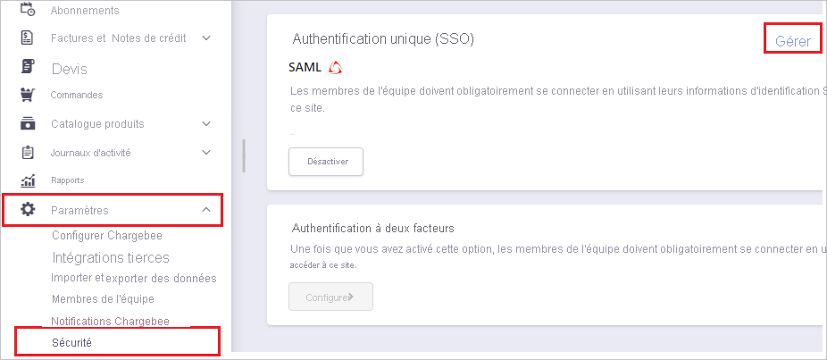
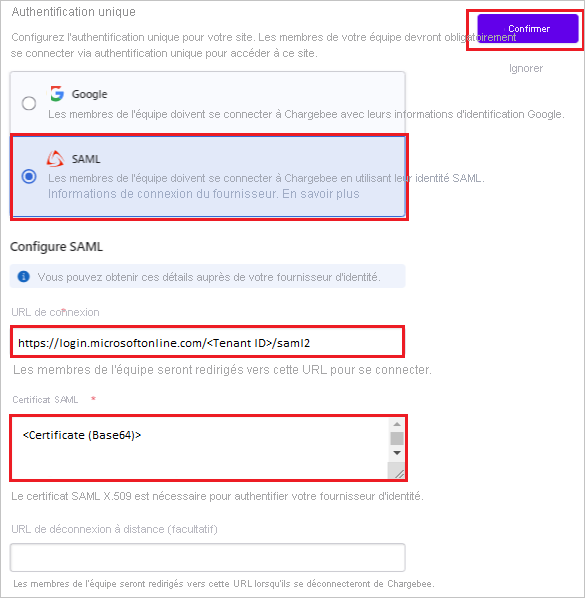
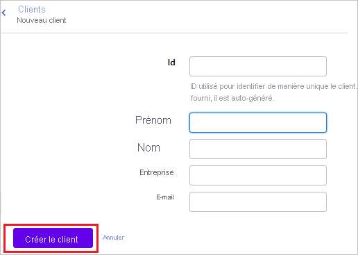

# Tutoriel : Intégration de l’authentification unique Azure AD à Chargebee

Dans ce didacticiel, vous allez apprendre à intégrer Chargebee à Azure Active Directory (Azure AD). Quand vous intégrez Chargebee à Azure AD, vous pouvez :

* Contrôler qui a accès à Chargebee dans Azure AD.
* Permettre à vos utilisateurs de se connecter automatiquement à Chargebee avec leur compte Azure AD.
* Gérer vos comptes à un emplacement central : le Portail Azure.

## Prérequis

Pour commencer, vous devez disposer de ce qui suit :

* Un abonnement Azure AD Si vous ne disposez d’aucun abonnement, vous pouvez obtenir [un compte gratuit](https://azure.microsoft.com/free/).
* Un abonnement Chargebee pour lequel l’authentification unique (SSO) est activée.

## Description du scénario

Dans ce tutoriel, vous allez configurer et tester l’authentification unique Azure AD dans un environnement de test.

* Chargebee prend en charge l’authentification unique lancée par le **fournisseur de services et le fournisseur d’identité**.

## Ajouter Chargebee à partir de la galerie

Pour configurer l'intégration de Chargebee avec Azure AD, vous devez ajouter Chargebee, disponible depuis la galerie, à votre liste d'applications SaaS gérées.

1. Connectez-vous au portail Azure avec un compte professionnel ou scolaire ou avec un compte personnel Microsoft.
1. Dans le panneau de navigation gauche, sélectionnez le service **Azure Active Directory**.
1. Accédez à **Applications d’entreprise**, puis sélectionnez **Toutes les applications**.
1. Pour ajouter une nouvelle application, sélectionnez **Nouvelle application**.
1. Dans la section **Ajouter à partir de la galerie**, tapez **Chargebee** dans la zone de recherche.
1. Sélectionnez **Chargebee** dans le volet de résultats, puis ajoutez l’application. Patientez quelques secondes pendant que l’application est ajoutée à votre locataire.

## Configurer et tester l’authentification unique Azure AD pour Chargebee

Configurez et testez l’authentification unique Azure AD avec Chargebee à l’aide d’un utilisateur de test appelé **B.Simon**. Pour que l’authentification unique fonctionne, vous devez établir un lien entre un utilisateur Azure AD et l’utilisateur associé dans Chargebee.

Pour configurer et tester l’authentification unique Azure AD avec Chargebee, effectuez les étapes suivantes :

1. **[Configurer l’authentification unique Azure AD](#configure-azure-ad-sso)** pour permettre à vos utilisateurs d’utiliser cette fonctionnalité.
    1. **[Créer un utilisateur de test Azure AD](#create-an-azure-ad-test-user)** pour tester l’authentification unique Azure AD avec B. Simon.
    1. **[Affecter l’utilisateur de test Azure AD](#assign-the-azure-ad-test-user)** pour permettre à B. Simon d’utiliser l’authentification unique Azure AD.
2. **[Configurer l’authentification unique Chargebee](#configure-chargebee-sso)** pour configurer les paramètres de l’authentification unique côté application.
    1. **[Créer un utilisateur de test Chargebee](#create-chargebee-test-user)** pour obtenir dans Chargebee un équivalent de B. Simon lié à la représentation Azure AD associée.
3. **[Tester l’authentification unique](#test-sso)** pour vérifier si la configuration fonctionne.

## Configurer l’authentification unique Azure AD

Effectuez les étapes suivantes pour activer l’authentification unique Azure AD dans le Portail Azure.

1. Dans le portail Azure, accédez à la page d’intégration de l’application **Chargebee**, recherchez la section **Gérer**, puis sélectionnez **Authentification unique**.
1. Dans la page **Sélectionner une méthode d’authentification unique**, sélectionnez **SAML**.
1. Dans la page **Configurer l’authentification unique avec SAML**, cliquez sur l’icône de crayon pour **Configuration SAML de base** afin de modifier les paramètres.

   

1. Dans la section **Configuration SAML de base**, si vous souhaitez configurer l’application en mode lancé par le **fournisseur d’identité**, effectuez les étapes suivantes :

    a. Dans la zone de texte **Identificateur**, tapez une URL au format suivant : `https://<domainname>.chargebee.com`

    b. Dans la zone de texte **URL de réponse**, tapez une URL au format suivant : `https://app.chargebee.com/saml/<domainname>/acs`

1. Si vous souhaitez configurer l’application en **mode démarré par le fournisseur de services**, cliquez sur **Définir des URL supplémentaires**, puis effectuez les étapes suivantes :

    Dans la zone de texte **URL de connexion**, tapez une URL au format suivant : `https://<domainname>.chargebee.com`

    > [!NOTE]
    > `<domainname>` est le nom du domaine que l’utilisateur crée après avoir revendiqué le compte. En cas d’autres informations, contactez [l’équipede support client Chargebee](mailto:support@chargebee.com). Vous pouvez également consulter les modèles figurant à la section **Configuration SAML de base** dans le portail Azure.

4. Dans la page **Configurer l’authentification unique avec SAML**, dans la section **Certificat de signature SAML**, recherchez **Certificat (Base64)** , puis sélectionnez **Télécharger** pour télécharger le certificat et l’enregistrer sur votre ordinateur.

    

6. Dans la section **Configurer Chargebee**, copiez l’URL ou les URL appropriées en fonction de vos besoins.

    

### Créer un utilisateur de test Azure AD

Dans cette section, vous allez créer un utilisateur de test appelé B. Simon dans le portail Azure.

1. Dans le volet gauche du Portail Azure, sélectionnez **Azure Active Directory**, **Utilisateurs**, puis **Tous les utilisateurs**.
1. Sélectionnez **Nouvel utilisateur** dans la partie supérieure de l’écran.
1. Dans les propriétés **Utilisateur**, effectuez les étapes suivantes :
   1. Dans le champ **Nom**, entrez `B.Simon`.  
   1. Dans le champ **Nom de l’utilisateur**, entrez username@companydomain.extension. Par exemple : `B.Simon@contoso.com`.
   1. Cochez la case **Afficher le mot de passe**, puis notez la valeur affichée dans le champ **Mot de passe**.
   1. Cliquez sur **Créer**.

### Affecter l’utilisateur de test Azure AD

Dans cette section, vous allez autoriser B. Simon à utiliser l’authentification unique Azure en lui accordant l’accès à Chargebee.

1. Dans le portail Azure, sélectionnez **Applications d’entreprise**, puis **Toutes les applications**.
1. Dans la liste des applications, sélectionnez **Chargebee**.
1. Dans la page de vue d’ensemble de l’application, recherchez la section **Gérer** et sélectionnez **Utilisateurs et groupes**.
1. Sélectionnez **Ajouter un utilisateur**, puis **Utilisateurs et groupes** dans la boîte de dialogue **Ajouter une attribution**.
1. Dans la boîte de dialogue **Utilisateurs et groupes**, sélectionnez **B. Simon** dans la liste Utilisateurs, puis cliquez sur le bouton **Sélectionner** au bas de l’écran.
1. Si vous attendez une valeur de rôle dans l’assertion SAML, dans la boîte de dialogue **Sélectionner un rôle**, sélectionnez le rôle approprié pour l’utilisateur dans la liste, puis cliquez sur le bouton **Sélectionner** en bas de l’écran.
1. Dans la boîte de dialogue **Ajouter une attribution**, cliquez sur le bouton **Attribuer**.

## Configurer l’authentification unique Chargebee

1. Ouvrez une nouvelle fenêtre de navigateur web et connectez-vous à votre site d’entreprise Chargebee en tant qu’administrateur.

4. Sur le côté gauche du menu, cliquez sur **Paramètres** > **Sécurité** > **Gérer**.

    

5. Sur la fenêtre contextuelle **Authentification unique**, effectuez les étapes suivantes :

    

    a. Sélectionnez **SAML**.

    b. Dans la zone de texte **URL de connexion**, collez la valeur d’**URL de connexion** que vous avez copiée sur le Portail Azure.

    c. Ouvrez le certificat encodé en Base64 dans le bloc-notes, copiez son contenu et collez-le dans la zone de texte **Certificat SAML**.

    d. Cliquez sur **Confirmer**.

### Créer un utilisateur de test Chargebee

Pour pouvoir se connecter à Chargebee, les utilisateurs d’Azure AD doivent être provisionnés dans Chargebee. Dans Chargebee, l’approvisionnement est une tâche manuelle.

**Pour approvisionner un compte d’utilisateur, procédez comme suit :**

1. Ouvrez une autre fenêtre de navigateur web, puis connectez-vous à Chargebee en tant qu’administrateur de la sécurité.

2. Sur le côté gauche du menu, cliquez sur **Clients**, puis accédez à **Créer un client**.

    

3. Sur la page **Nouveau client**, renseignez les champs respectifs indiqués ci-dessous et cliquez sur **Créer un client** pour créer un utilisateur.

    

## Tester l’authentification unique (SSO) 

Dans cette section, vous allez tester votre configuration de l’authentification unique Azure AD avec les options suivantes. 

#### Lancée par le fournisseur de services :

* Cliquez sur **Tester cette application** dans le portail Azure. Vous êtes alors redirigé vers l’URL de connexion de Chargebee, à partir de laquelle vous pouvez lancer le flux de connexion.  

* Accédez directement à l’URL de connexion de Chargebee pour lancer le flux de connexion.

#### Lancée par le fournisseur d’identité :

* Cliquez sur **Tester cette application** dans le portail Azure. Vous êtes alors automatiquement connecté automatiquement à l’instance de Chargebee pour laquelle vous avez configuré l’authentification unique. 

Vous pouvez aussi utiliser Mes applications de Microsoft pour tester l’application dans n’importe quel mode. Si, quand vous cliquez sur la vignette Chargebee dans Mes applications, le mode Fournisseur de services est configuré, vous êtes redirigé vers la page de connexion de l’application pour initier le flux de connexion ; s’il s’agit du mode Fournisseur d’identité, vous êtes automatiquement connecté à l’instance de Chargebee pour laquelle vous avez configuré l’authentification unique. Pour plus d’informations sur Mes applications, consultez [Présentation de Mes applications](../user-help/my-apps-portal-end-user-access.md).

## Étapes suivantes

Après avoir configuré Chargebee, vous pouvez appliquer le contrôle de session, qui protège contre l’exfiltration et l’infiltration des données sensibles de votre organisation en temps réel. Le contrôle de session est étendu à partir de l’accès conditionnel. [Découvrez comment appliquer un contrôle de session avec Microsoft Defender for Cloud Apps](/cloud-app-security/proxy-deployment-aad).
