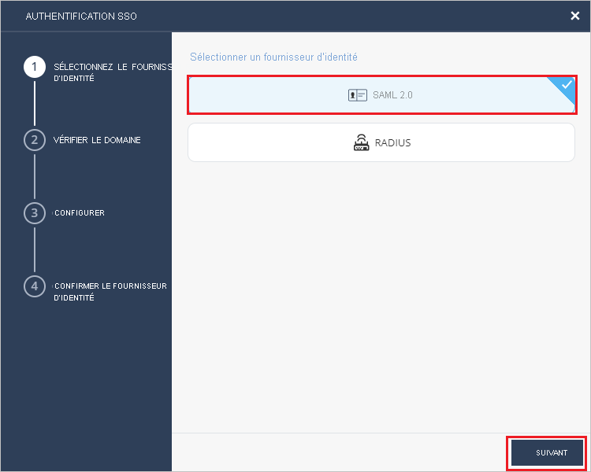
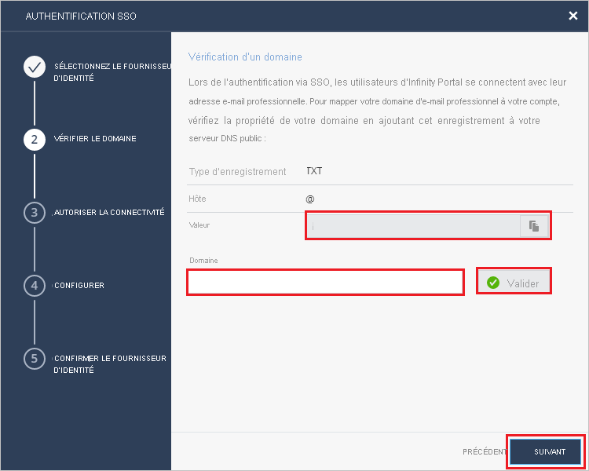
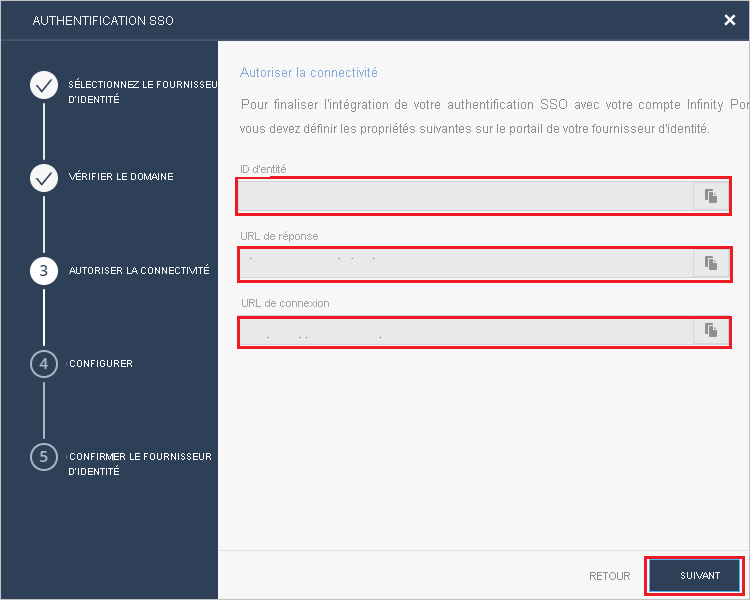
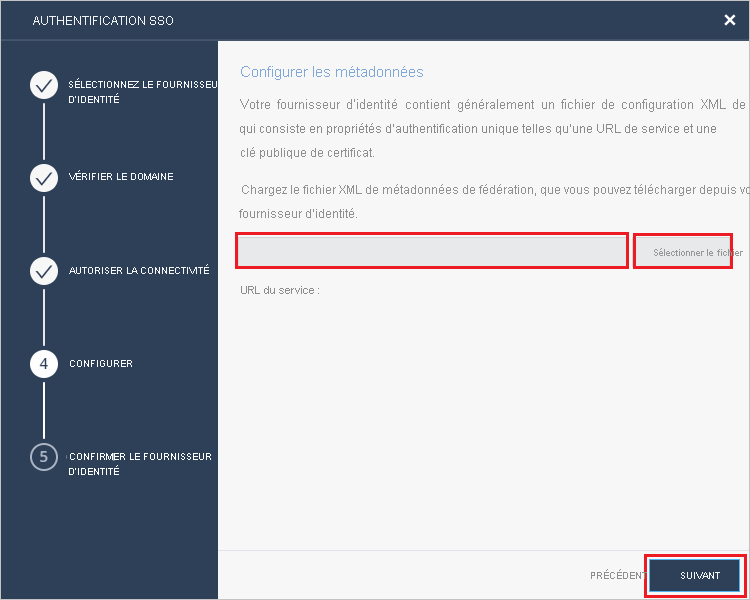

# Tutoriel : Intégration de l’authentification unique Azure AD à Check Point Infinity Portal

Dans ce tutoriel, vous allez apprendre à intégrer Check Point Infinity Portal à Azure Active Directory (Azure AD). Quand vous intégrez Check Point Infinity Portal à Azure AD, vous pouvez :

* Contrôler dans Azure AD qui a accès à Check Point Infinity Portal.
* Permettre à vos utilisateurs de se connecter automatiquement à Check Point Infinity Portal avec leur compte Azure AD.
* Gérer vos comptes à un emplacement central : le Portail Azure.

## Prérequis

Pour commencer, vous devez disposer de ce qui suit :

* Un abonnement Azure AD Si vous ne disposez d’aucun abonnement, vous pouvez obtenir [un compte gratuit](https://azure.microsoft.com/free/).
* Un abonnement Check Point Infinity Portal pour lequel l’authentification unique est activée

## Description du scénario

Dans ce tutoriel, vous allez configurer et tester l’authentification unique Azure AD dans un environnement de test.

* Check Point Infinity Portal prend en charge l’authentification unique initiée par le **fournisseur de services**.

* Check Point Infinity Portal prend en charge l’attribution d’utilisateurs **juste-à-temps**.

> [!NOTE]
> L’identificateur de cette application étant une valeur de chaîne fixe, une seule instance peut être configurée dans un locataire.

## Ajouter Check Point Infinity Portal à partir de la galerie

Pour configurer l’intégration de Check Point Infinity Portal dans Azure AD, vous devez ajouter Check Point Infinity Portal à partir de la galerie à votre liste d’applications SaaS gérées.

1. Connectez-vous au portail Azure avec un compte professionnel ou scolaire ou avec un compte personnel Microsoft.
1. Dans le panneau de navigation gauche, sélectionnez le service **Azure Active Directory**.
1. Accédez à **Applications d’entreprise**, puis sélectionnez **Toutes les applications**.
1. Pour ajouter une nouvelle application, sélectionnez **Nouvelle application**.
1. Dans la section **Ajouter à partir de la galerie**, saisissez **Check Point Infinity Portal** dans la zone de recherche.
1. Sélectionnez **Check Point Infinity Portal** dans le volet de résultats, puis ajoutez l’application. Patientez quelques secondes pendant que l’application est ajoutée à votre locataire.

## Configurer et tester l’authentification unique Azure AD pour Check Point Infinity Portal

Configurez et testez l’authentification unique Azure AD avec Check Point Infinity Portal à l’aide d’un utilisateur de test appelé **B.Simon**. Pour que l’authentification unique fonctionne, vous devez établir un lien entre un utilisateur Azure AD et l’utilisateur associé dans Check Point Infinity Portal.

Pour configurer et tester l’authentification unique Azure AD avec Check Point Infinity Portal, procédez comme suit :

1. **[Configurer l’authentification unique Azure AD](#configure-azure-ad-sso)** pour permettre à vos utilisateurs d’utiliser cette fonctionnalité.
    1. **[Créer un utilisateur de test Azure AD](#create-an-azure-ad-test-user)** pour tester l’authentification unique Azure AD avec B. Simon.
    1. **[Affecter l’utilisateur de test Azure AD](#assign-the-azure-ad-test-user)** pour permettre à B. Simon d’utiliser l’authentification unique Azure AD.
1. **[Configurer l’authentification unique de Check Point Infinity Portal](#configure-check-point-infinity-portal-sso)** pour configurer les paramètres de l’authentification unique côté application.
    1. **[Créer un utilisateur de test Check Point Infinity Portal](#create-check-point-infinity-portal-test-user)** pour avoir un équivalent de B.Simon dans Check Point Infinity Portal lié à la représentation Azure AD de l’utilisateur.
1. **[Tester l’authentification unique](#test-sso)** pour vérifier si la configuration fonctionne.

## Configurer l’authentification unique Azure AD

Effectuez les étapes suivantes pour activer l’authentification unique Azure AD dans le Portail Azure.

1. Dans le portail Azure, accédez à la page d’intégration de l’application **Check Point Infinity Portal**, recherchez la section **Gérer** et sélectionnez **Authentification unique**.
1. Dans la page **Sélectionner une méthode d’authentification unique**, sélectionnez **SAML**.
1. Dans la page **Configurer l’authentification unique avec SAML**, cliquez sur l’icône de crayon de **Configuration SAML de base** afin de modifier les paramètres.

   

1. Dans la section **Configuration SAML de base**, effectuez les étapes suivantes :

    a. Dans la zone de texte **Identificateur**, saisissez l’une des valeurs suivantes :

    | Environnement | Identificateur |
    |-------------| -------------|
    | EU/US | `cloudinfra.checkpoint.com` |
    | AP | `ap.portal.checkpoint.com` |
    |

    b. Dans la zone de texte **URL de réponse**, tapez l’une des URL suivantes :

    | Environnement | URL de réponse |
    |-------------| -------------|
    | EU/US | `https://portal.checkpoint.com/` |
    | AP | `https://ap.portal.checkpoint.com/` |
    |

    c. Dans la zone de texte **Sign on URL** (URL d’authentification), tapez l’une des URL suivantes :

    | Environnement | URL d’authentification |
    |-------------| -------------|
    | EU/US | `https://portal.checkpoint.com/` |
    | AP | `https://ap.portal.checkpoint.com/` |
    |

1. Dans la page **Configurer l’authentification unique avec SAML**, dans la section **Certificat de signature SAML**, recherchez **XML de métadonnées de fédération** et sélectionnez **Télécharger** pour télécharger le certificat et l’enregistrer sur votre ordinateur.

    

1. Dans la section **Configurer Check Point Infinity Portal**, copiez les URL appropriées en fonction de vos besoins.

    

Il existe deux moyens d’autoriser les utilisateurs :

* Configurer les rôles utilisateur de l’application Check Point Infinity Portal dans le portail Azure AD

* Configurer les rôles utilisateur de l’application Check Point Infinity Portal dans Check Point Infinity Portal

#### Configurer les rôles utilisateur de l’application Check Point Infinity Portal dans le portail Azure AD

Dans cette section, vous allez créer les rôles Administrateur et Lecture seule dans le portail Azure.

1. Dans le volet gauche du portail Azure, sélectionnez successivement **Inscription d’application**, **Toutes les applications** et l’application **Check Point Infinity Portal**.

2. Dans le volet gauche, sélectionnez **Rôles d’application**, cliquez sur **Créer un rôle d’application** et suivez ces étapes :

   a. Dans le champ **Nom d’affichage**, entrez **Administrateur**.

   b. Dans le champ **Types de membres autorisés**, choisissez **Utilisateurs/groupes**.
   
   c. Dans le champ **Valeur**, entrez **administrateur**.

   d. Dans le champ **Description**, entrez **Rôle Administrateur de Check Point Infinity Portal**.

   e. Assurez-vous que l’option **Activer ce rôle d’application** est sélectionnée.

   f. Cliquez sur **Appliquer**.

   g. Cliquez une nouvelle fois sur **Créer un rôle d’application**.

   h. Dans le champ **Nom d’affichage**, entrez **Lecture seule**.

   i. Dans le champ **Types de membres autorisés**, choisissez **Utilisateurs/groupes**.

   j. Dans le champ **Valeur**, entrez **lecture seule**.

   k. Dans le champ **Description**, entrez **Rôle Lecture seule de Check Point Infinity Portal**.

   l. Assurez-vous que l’option **Activer ce rôle d’application** est sélectionnée.

   m. Cliquez sur **Appliquer**.

#### Configurer les rôles utilisateur de l’application Check Point Infinity Portal dans Check Point Infinity Portal

Cette configuration s’applique uniquement aux groupes affectés à l’application Check Point Infinity Portal dans Azure AD.

Dans cette section, vous allez créer un ou plusieurs groupes d’utilisateurs qui auront les rôles Global et Service pour les groupes Azure AD appropriés.

* Copiez l’ID du groupe affecté pour l’utiliser avec le groupe d’utilisateurs Check Point Infinity Portal.
* Pour la configuration des groupes d’utilisateurs, reportez-vous à [Infinity Portal Admin Guide](https://sc1.checkpoint.com/documents/Infinity_Portal/WebAdminGuides/EN/Infinity-Portal-Admin-Guide/Default.htm#cshid=user_groups).

### Créer un utilisateur de test Azure AD

Dans cette section, vous allez créer un utilisateur de test appelé B. Simon dans le portail Azure.

1. Dans le volet gauche du Portail Azure, sélectionnez **Azure Active Directory**, **Utilisateurs**, puis **Tous les utilisateurs**.
1. Sélectionnez **Nouvel utilisateur** dans la partie supérieure de l’écran.
1. Dans les propriétés **Utilisateur**, effectuez les étapes suivantes :
   1. Dans le champ **Nom**, entrez `B.Simon`.  
   1. Dans le champ **Nom de l’utilisateur**, entrez username@companydomain.extension. Par exemple : `B.Simon@contoso.com`.
   1. Cochez la case **Afficher le mot de passe**, puis notez la valeur affichée dans le champ **Mot de passe**.
   1. Cliquez sur **Créer**.

### Affecter l’utilisateur de test Azure AD

Dans cette section, vous allez autoriser B.Simon à utiliser l’authentification unique Azure en lui accordant l’accès à Check Point Infinity Portal.

1. Dans le portail Azure, sélectionnez **Applications d’entreprise**, puis **Toutes les applications**.
1. Dans la liste des applications, sélectionnez **Check Point Infinity Portal**.
1. Dans la page de vue d’ensemble de l’application, recherchez la section **Gérer** et sélectionnez **Utilisateurs et groupes**.
1. Sélectionnez **Ajouter un utilisateur**, puis **Utilisateurs et groupes** dans la boîte de dialogue **Ajouter une attribution**.
1. Dans la boîte de dialogue **Utilisateurs et groupes**, sélectionnez **B. Simon** dans la liste Utilisateurs, puis cliquez sur le bouton **Sélectionner** au bas de l’écran.
1. Si vous attendez qu’un rôle soit attribué aux utilisateurs, vous pouvez le sélectionner dans la liste déroulante **Sélectionner un rôle** . Si aucun rôle n’a été configuré pour cette application, vous voyez le rôle « Accès par défaut » sélectionné.
1. Dans la boîte de dialogue **Ajouter une attribution**, cliquez sur le bouton **Attribuer**.

## Configurer l’authentification unique de Check Point Infinity Portal

1. Connectez-vous au site d’entreprise Check Point Infinity Portal en tant qu’administrateur.

2. Accédez à **Global Settings** (Paramètres globaux) > **Account Settings** (Paramètres du compte), puis cliquez sur **Define** (Définir) sous SSO Authentication (Authentification unique).
   
    

3. Dans la page **SSO Authentication** (Authentification unique), sélectionnez **SAML 2.0** comme **IDENTITY PROVIDER** (Fournisseur d’identité), puis cliquez sur **NEXT** (Suivant).
     
   

4. Dans la section **VERIFY DOMAIN**(Vérifier le domaine), procédez comme suit :

   
 
   a. Copiez les valeurs des enregistrements DNS et ajoutez-les aux valeurs DNS du serveur DNS de votre entreprise. 

   b. Entrez le nom de domaine de votre entreprise dans le champ **Domain** (Domaine) et cliquez sur **Validate** (Valider). 

   c. Attendez que Check Point approuve la mise à jour de l’enregistrement DNS, ce qui peut prendre jusqu’à 30 minutes. 

   d. Cliquez sur **NEXT** (Suivant) une fois le nom de domaine validé. 

5. Dans la section **ALLOW CONNECTIVITY** (Autoriser la connectivité), procédez comme suit :
    
    

   a. Copiez la valeur du champ **Entity ID** (ID d’entité), puis collez-la dans la zone de texte **Identificateur Azure AD** de la section Configuration SAML de base du portail Azure.

   b. Copiez la valeur du champ **Reply URL**, puis collez-la dans la zone de texte **URL de réponse** de la section Configuration SAML de base du portail Azure.

   c. Copiez la valeur du champ **Sign on URL** (URL de connexion), puis collez-la dans la zone de texte **URL de connexion** de la section Configuration SAML de base du portail Azure.
      
   d. Cliquez sur **NEXT**.

6. Dans la section **CONFIGURE** (Configurer), cliquez sur **Select File** (Sélectionner un fichier) et chargez le fichier **XML des métadonnées de fédération** que vous avez téléchargé à partir du portail Azure, puis cliquez sur **NEXT** (Suivant). 

    

7. Dans la section **CONFIRM IDENTITY PROVIDER** (Confirmer le fournisseur d’identité), passez en revue les configurations, puis cliquez sur **SUBMIT** (Envoyer).
     
    

### Créer un utilisateur de test Check Point Infinity Portal

Dans cette section, un utilisateur appelé Britta Simon est créé dans Check Point Infinity Portal. Check Point Infinity Portal prend en charge l’attribution d’utilisateurs juste-à-temps, option qui est activée par défaut. Vous n’avez aucune opération à effectuer dans cette section. Grâce à cela, s’il n’existe pas encore d’utilisateur dans Check Point Infinity Portal, il en est créé un après l’authentification.

## Tester l’authentification unique (SSO) 

Dans cette section, vous allez tester votre configuration de l’authentification unique Azure AD avec les options suivantes. 

* Cliquez sur **Tester cette application** dans le portail Azure. Vous êtes alors redirigé vers l’URL de connexion de Check Point Infinity Portal, à partir de laquelle vous pouvez lancer le flux de connexion. 

* Accédez directement à l’URL de connexion de Check Point Infinity Portal pour initier le flux de connexion.

* Vous pouvez utiliser Mes applications de Microsoft. Quand vous cliquez sur la vignette Check Point Infinity Portal dans Mes applications, vous êtes redirigé vers l’URL de connexion de Check Point Infinity Portal. Pour plus d’informations sur Mes applications, consultez [Présentation de Mes applications](https://support.microsoft.com/account-billing/sign-in-and-start-apps-from-the-my-apps-portal-2f3b1bae-0e5a-4a86-a33e-876fbd2a4510).

## Étapes suivantes

Une fois que vous avez configuré Check Point Infinity Portal, vous pouvez appliquer le contrôle de session, qui protège contre l’exfiltration et l’infiltration des données sensibles de votre organisation en temps réel. Le contrôle de session est étendu à partir de l’accès conditionnel. [Découvrez comment appliquer un contrôle de session avec Microsoft Defender for Cloud Apps](/cloud-app-security/proxy-deployment-any-app).
