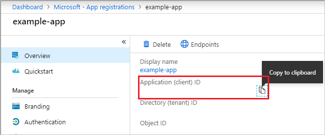
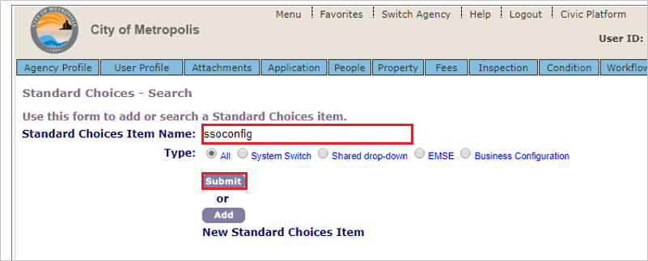
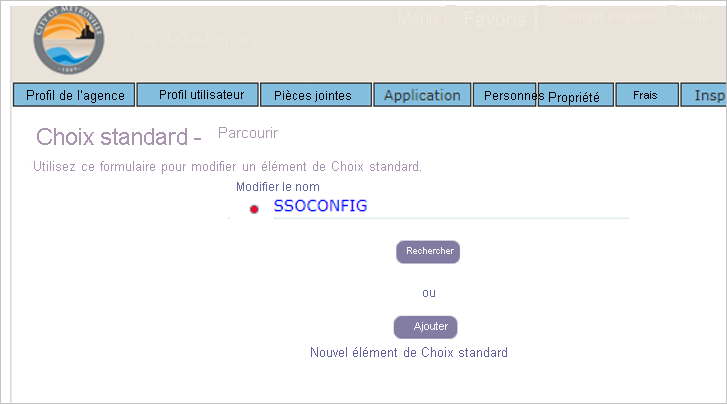

# Tutoriel : Intégration de l’authentification unique Azure AD à Civic Platform

Dans ce tutoriel, vous allez découvrir comment intégrer Civic Platform à Azure Active Directory (Azure AD). Quand vous intégrez Civic Platform à Azure AD, vous pouvez :

* Contrôler qui a accès à Civic Platform dans Azure AD.
* Permettre à vos utilisateurs de se connecter automatiquement à Civic Platform avec leur compte Azure AD.
* Gérer vos comptes à un emplacement central : le Portail Azure.

## Prérequis

Pour commencer, vous devez disposer de ce qui suit :

* Un abonnement Azure AD Si vous ne disposez d’aucun abonnement, vous pouvez obtenir [un compte gratuit](https://azure.microsoft.com/free/).
* Un abonnement Civic Platform pour lequel l’authentification unique (SSO) est activée

## Description du scénario

Dans ce tutoriel, vous allez configurer et tester l’authentification unique Azure AD dans un environnement de test.

* Civic Platform prend en charge l’authentification unique lancée par le **fournisseur de services**.

> [!NOTE]
> L’identificateur de cette application étant une valeur de chaîne fixe, une seule instance peut être configurée dans un locataire.

## Ajouter Civic Platform à partir de la galerie

Pour configurer l’intégration de Civic Platform à Azure AD, vous devez ajouter Civic Platform depuis la galerie à votre liste d’applications SaaS gérées.

1. Connectez-vous au portail Azure avec un compte professionnel ou scolaire ou avec un compte personnel Microsoft.
1. Dans le panneau de navigation gauche, sélectionnez le service **Azure Active Directory**.
1. Accédez à **Applications d’entreprise**, puis sélectionnez **Toutes les applications**.
1. Pour ajouter une nouvelle application, sélectionnez **Nouvelle application**.
1. Dans la section **Ajouter à partir de la galerie**, tapez **Civic Platform** dans la zone de recherche.
1. Sélectionnez **Civic Platform** dans le volet de résultats, puis ajoutez l’application. Patientez quelques secondes pendant que l’application est ajoutée à votre locataire.

## Configurer et tester l’authentification unique Azure AD pour Civic Platform

Configurez et testez l’authentification unique Azure AD avec Civic Platform pour un utilisateur de test nommé **B.Simon**. Pour que l’authentification unique fonctionne, vous devez établir un lien entre un utilisateur Azure AD et l’utilisateur Civic Platform associé.

Pour configurer et tester l’authentification unique Azure AD avec Civic Platform, effectuez les étapes suivantes :

1. **[Configurer l’authentification unique Azure AD](#configure-azure-ad-sso)** pour permettre à vos utilisateurs d’utiliser cette fonctionnalité.
    1. **[Créer un utilisateur de test Azure AD](#create-an-azure-ad-test-user)** pour tester l’authentification unique Azure AD avec B. Simon.
    1. **[Affecter l’utilisateur de test Azure AD](#assign-the-azure-ad-test-user)** pour permettre à B. Simon d’utiliser l’authentification unique Azure AD.
1. **[Configurer l’authentification unique Civic Platform](#configure-civic-platform-sso)** pour configurer les paramètres de l’authentification unique côté application.
    1. **[Créer un utilisateur de test Civic Platform](#create-civic-platform-test-user)** pour avoir un équivalent de B.Simon dans Civic Platform lié à la représentation Azure AD associée.
1. **[Tester l’authentification unique](#test-sso)** pour vérifier si la configuration fonctionne.

## Configurer l’authentification unique Azure AD

Effectuez les étapes suivantes pour activer l’authentification unique Azure AD dans le Portail Azure.

1. Dans le portail Azure, accédez à la page d’intégration de l’application **Civic Platform**, recherchez la section **Gérer** et sélectionnez **Authentification unique**.
1. Dans la page **Sélectionner une méthode d’authentification unique**, sélectionnez **SAML**.
1. Dans la page **Configurer l’authentification unique avec SAML**, cliquez sur l’icône de crayon pour **Configuration SAML de base** afin de modifier les paramètres.

   

1. Dans la section **Configuration SAML de base**, effectuez les étapes suivantes :

    a. Dans la zone de texte **Identificateur (ID d’entité)**, tapez la valeur : `civicplatform.accela.com`

    b. Dans la zone de texte **URL de connexion**, saisissez une URL au format suivant : `https://<SUBDOMAIN>.accela.com`

    > [!NOTE]
    > La valeur d’URL de connexion n’est pas réelle. Mettez à jour cette valeur avec l’URL de connexion réelle. Pour obtenir cette valeur, contactez [l’équipe du support Civic Platform](mailto:skale@accela.com). Vous pouvez également consulter les modèles figurant à la section **Configuration SAML de base** dans le portail Azure.

1. Dans la page **Configurer l’authentification unique avec SAML**, dans la section **Certificat de signature SAML**, cliquez sur le bouton Copier pour copier l’**URL des métadonnées de fédération d’application**, puis enregistrez-la sur votre ordinateur.

    

1. Accédez à **Azure Active Directory** > **Inscriptions des applications** dans Azure AD et sélectionnez votre application.

1. Copier l’**ID de l’annuaire (locataire)** et stockez-le dans le Bloc-notes.

    

1. Copiez l’**ID d’application** et stockez-le dans le Bloc-notes.

   

1. Accédez à **Azure Active Directory** > **Inscriptions des applications** dans Azure AD et sélectionnez votre application. Cliquez sur **Certificats et secrets**.

1. Sélectionnez **Clés secrètes client -> Nouvelle clé secrète client**.

1. Fournissez une description et la durée du secret. Quand vous avez terminé, sélectionnez **Ajouter**.

   > [!NOTE]
   > Une fois la clé secrète client enregistrée, la valeur de la clé secrète client s’affiche. Copiez cette valeur car vous ne pourrez pas récupérer la clé ultérieurement.

   

### Créer un utilisateur de test Azure AD

Dans cette section, vous allez créer un utilisateur de test appelé B. Simon dans le portail Azure.

1. Dans le volet gauche du Portail Azure, sélectionnez **Azure Active Directory**, **Utilisateurs**, puis **Tous les utilisateurs**.
1. Sélectionnez **Nouvel utilisateur** dans la partie supérieure de l’écran.
1. Dans les propriétés **Utilisateur**, effectuez les étapes suivantes :
   1. Dans le champ **Nom**, entrez `B.Simon`.  
   1. Dans le champ **Nom de l’utilisateur**, entrez username@companydomain.extension. Par exemple : `B.Simon@contoso.com`.
   1. Cochez la case **Afficher le mot de passe**, puis notez la valeur affichée dans le champ **Mot de passe**.
   1. Cliquez sur **Créer**.

### Affecter l’utilisateur de test Azure AD

Dans cette section, vous allez autoriser B.Simon à utiliser l’authentification unique Azure en lui accordant l’accès à Civic Platform.

1. Dans le portail Azure, sélectionnez **Applications d’entreprise**, puis **Toutes les applications**.
1. Dans la liste des applications, sélectionnez **Civic Platform**.
1. Dans la page de vue d’ensemble de l’application, recherchez la section **Gérer** et sélectionnez **Utilisateurs et groupes**.
1. Sélectionnez **Ajouter un utilisateur**, puis **Utilisateurs et groupes** dans la boîte de dialogue **Ajouter une attribution**.
1. Dans la boîte de dialogue **Utilisateurs et groupes**, sélectionnez **B. Simon** dans la liste Utilisateurs, puis cliquez sur le bouton **Sélectionner** au bas de l’écran.
1. Si vous attendez une valeur de rôle dans l’assertion SAML, dans la boîte de dialogue **Sélectionner un rôle**, sélectionnez le rôle approprié pour l’utilisateur dans la liste, puis cliquez sur le bouton **Sélectionner** en bas de l’écran.
1. Dans la boîte de dialogue **Ajouter une attribution**, cliquez sur le bouton **Attribuer**.

## Configurer l’authentification unique Civic Platform

1. Ouvrez une nouvelle fenêtre de navigateur web et connectez-vous à votre site d’entreprise Atlassian Cloud en tant qu’administrateur.

1. Cliquez sur **Standard Choices** (Choix standard).

    

1. Créez un choix standard **ssoconfig**.

1. Recherchez **ssoconfig** et envoyez.

    

1. Développez SSOCONFIG en cliquant sur le point rouge.

    

1. Fournissez les informations de configuration liées à l’authentification unique à l’étape suivante :

    

    1. Dans le champ **applicationid**, entrez la valeur de l’**ID d’application** que vous avez copiée à partir du portail Azure.

    1. Dans le champ **clientSecret**, entrez la valeur du **Secret** que vous avez copiée à partir du portail Azure.

    1. Dans le champ **directoryId**, entrez la valeur de l’**ID de l’annuaire (locataire)** que vous avez copiée à partir du portail Azure.

    1. Entrez le idpName. Par exemple : `Azure`.

### Créer un utilisateur de test Civic Platform

Dans cette section, vous créez un utilisateur appelé B.Simon dans Civic Platform. Collaborez avec l’équipe de support technique Civic Platform pour ajouter des utilisateurs dans [Civic Platform](mailto:skale@accela.com). Les utilisateurs doivent être créés et activés avant que vous utilisiez l’authentification unique.

## Tester l’authentification unique (SSO) 

Dans cette section, vous allez tester votre configuration de l’authentification unique Azure AD avec les options suivantes. 

* Cliquez sur **Tester cette application** dans le portail Azure. Vous êtes alors redirigé vers l’URL d’authentification Civic Platform, d’où vous pouvez lancer le processus de connexion. 

* Accédez directement à l’URL d’authentification Civic Platform pour lancer le processus de connexion.

* Vous pouvez utiliser Mes applications de Microsoft. Quand vous cliquez sur la vignette Civic Platform dans Mes applications, vous êtes redirigé vers l’URL d’authentification Civic Platform. Pour plus d’informations sur Mes applications, consultez [Présentation de Mes applications](../user-help/my-apps-portal-end-user-access.md).

## Étapes suivantes

Après avoir configuré Civic Platform, vous pouvez appliquer le contrôle de session, qui protège contre l’exfiltration et l’infiltration des données sensibles de votre organisation en temps réel. Le contrôle de session est étendu à partir de l’accès conditionnel. [Découvrez comment appliquer un contrôle de session avec Microsoft Cloud App Security](/cloud-app-security/proxy-deployment-aad).