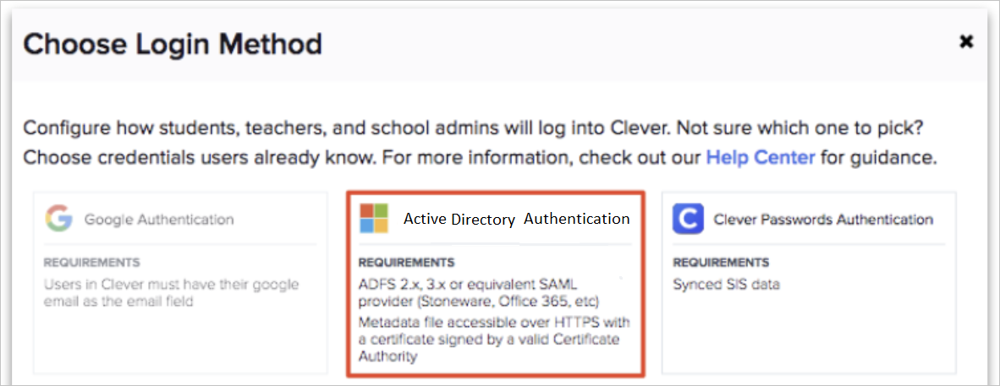
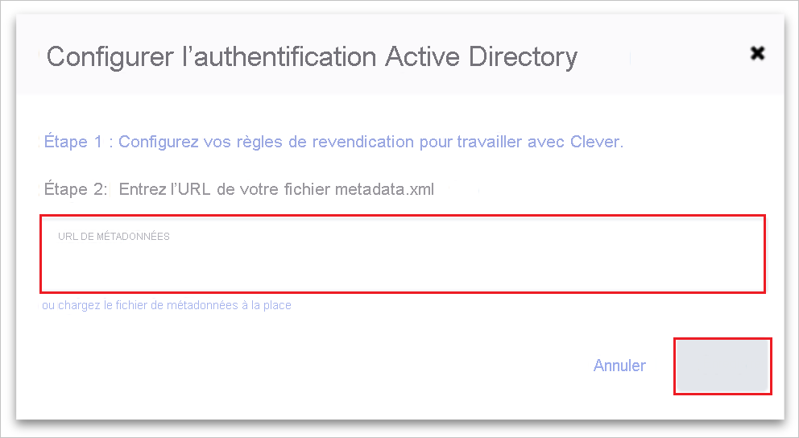

# Tutoriel : Intégration de l’authentification unique Azure Active Directory à Clever

Dans ce tutoriel, vous allez découvrir comment intégrer Clever à Azure Active Directory (Azure AD). Quand vous intégrez Clever à Azure AD, vous pouvez :

* Contrôler dans Azure AD qui a accès à Clever.
* Permettre à vos utilisateurs de se connecter automatiquement à Clever avec leur compte Azure AD.
* Gérer vos comptes à un emplacement central : le Portail Azure.

## Prérequis

Pour commencer, vous devez disposer de ce qui suit :

* Un abonnement Azure AD Si vous ne disposez d’aucun abonnement, vous pouvez obtenir [un compte gratuit](https://azure.microsoft.com/free/).
* Un abonnement Clever pour lequel l’authentification unique est activée

## Description du scénario

Dans ce tutoriel, vous allez configurer et tester l’authentification unique Azure AD dans un environnement de test.

* Clever prend en charge l’authentification unique (SSO) lancée par le **fournisseur de services**.

> [!NOTE]
> L’identificateur de cette application étant une valeur de chaîne fixe, une seule instance peut être configurée dans un locataire.

## Ajouter Clever depuis la galerie

Pour configurer l’intégration de Clever avec Azure AD, vous devez ajouter Clever, disponible dans la galerie, à votre liste d’applications SaaS gérées.

1. Connectez-vous au portail Azure avec un compte professionnel ou scolaire ou avec un compte personnel Microsoft.
1. Dans le panneau de navigation gauche, sélectionnez le service **Azure Active Directory**.
1. Accédez à **Applications d’entreprise**, puis sélectionnez **Toutes les applications**.
1. Pour ajouter une nouvelle application, sélectionnez **Nouvelle application**.
1. Dans la section **Ajouter à partir de la galerie**, tapez **Clever** dans la zone de recherche.
1. Sélectionnez **Clever** dans le volet de résultats, puis ajoutez l’application. Patientez quelques secondes pendant que l’application est ajoutée à votre locataire.

## Configurer et tester l’authentification unique Azure AD pour Clever

Configurez et testez l’authentification unique Azure AD avec Clever à l’aide d’un utilisateur de test appelé **B.Simon**. Pour que l’authentification unique fonctionne, vous devez établir un lien entre un utilisateur Azure AD et l’utilisateur Clever associé.

Pour configurer et tester l’authentification unique Azure AD avec Clever, effectuez les étapes suivantes :

1. **[Configurer l’authentification unique Azure AD](#configure-azure-ad-sso)** pour permettre à vos utilisateurs d’utiliser cette fonctionnalité.
    1. **[Créer un utilisateur de test Azure AD](#create-an-azure-ad-test-user)** pour tester l’authentification unique Azure AD avec B. Simon.
    1. **[Affecter l’utilisateur de test Azure AD](#assign-the-azure-ad-test-user)** pour permettre à B. Simon d’utiliser l’authentification unique Azure AD.
1. **[Configurer l’authentification unique Clever](#configure-clever-sso)** pour configurer les paramètres de l’authentification unique côté application.
    1. **[Créer utilisateur de test Clever](#create-clever-test-user)** pour avoir un équivalent de B.Simon dans Clever lié à la représentation Azure AD associée.
1. **[Tester l’authentification unique](#test-sso)** pour vérifier si la configuration fonctionne.

## Configurer l’authentification unique Azure AD

Effectuez les étapes suivantes pour activer l’authentification unique Azure AD dans le Portail Azure.

1. Dans le portail Azure, accédez à la page d’intégration de l’application **Clever**, recherchez la section **Gérer** et sélectionnez **Authentification unique**.
1. Dans la page **Sélectionner une méthode d’authentification unique**, sélectionnez **SAML**.
1. Dans la page **Configurer l’authentification unique avec SAML**, cliquez sur l’icône de crayon de **Configuration SAML de base** afin de modifier les paramètres.

   

1. Dans la section **Configuration SAML de base**, effectuez les étapes suivantes :

    a. Dans la zone de texte **Identificateur (ID d’entité)** , tapez l’URL suivante : `https://clever.com/oauth/saml/metadata.xml`

    b. Dans la zone de texte **URL de réponse**, tapez une URL au format suivant : `https://clever.com/<COMPANY_NAME>`

    c. Dans la zone de texte **URL de connexion**, saisissez une URL au format suivant : `https://clever.com/in/<COMPANY_NAME>`

    > [!NOTE]
    >  Il ne s’agit pas de valeurs réelles. Mettez à jour ces valeurs avec l’URL de réponse et l’URL de connexion réelles. Pour obtenir la valeur, contactez l’[équipe de support technique de Clever](https://clever.com/about/contact/). Vous pouvez également consulter les modèles figurant à la section **Configuration SAML de base** dans le portail Azure.

1. Dans la page **Configurer l’authentification unique avec SAML**, dans la section **Certificat de signature SAML**, cliquez sur le bouton Copier pour copier l’**URL des métadonnées de fédération d’application**, puis enregistrez-la sur votre ordinateur.

    

### Créer un utilisateur de test Azure AD

Dans cette section, vous allez créer un utilisateur de test appelé B. Simon dans le portail Azure.

1. Dans le volet gauche du Portail Azure, sélectionnez **Azure Active Directory**, **Utilisateurs**, puis **Tous les utilisateurs**.
1. Sélectionnez **Nouvel utilisateur** dans la partie supérieure de l’écran.
1. Dans les propriétés **Utilisateur**, effectuez les étapes suivantes :
   1. Dans le champ **Nom**, entrez `B.Simon`.  
   1. Dans le champ **Nom de l’utilisateur**, entrez username@companydomain.extension. Par exemple : `B.Simon@contoso.com`.
   1. Cochez la case **Afficher le mot de passe**, puis notez la valeur affichée dans le champ **Mot de passe**.
   1. Cliquez sur **Créer**.

### Affecter l’utilisateur de test Azure AD

Dans cette section, vous allez autoriser B.Simon à utiliser l’authentification unique Azure en lui accordant l’accès à Clever.

1. Dans le portail Azure, sélectionnez **Applications d’entreprise**, puis **Toutes les applications**.
1. Dans la liste des applications, sélectionnez **Clever**.
1. Dans la page de vue d’ensemble de l’application, recherchez la section **Gérer** et sélectionnez **Utilisateurs et groupes**.
1. Sélectionnez **Ajouter un utilisateur**, puis **Utilisateurs et groupes** dans la boîte de dialogue **Ajouter une attribution**.
1. Dans la boîte de dialogue **Utilisateurs et groupes**, sélectionnez **B. Simon** dans la liste Utilisateurs, puis cliquez sur le bouton **Sélectionner** au bas de l’écran.
1. Si vous attendez qu’un rôle soit attribué aux utilisateurs, vous pouvez le sélectionner dans la liste déroulante **Sélectionner un rôle** . Si aucun rôle n’a été configuré pour cette application, vous voyez le rôle « Accès par défaut » sélectionné.
1. Dans la boîte de dialogue **Ajouter une attribution**, cliquez sur le bouton **Attribuer**.

## Configurer l’authentification unique Clever

1. Dans une autre fenêtre de navigateur web, connectez-vous au tableau de bord de district Clever en tant qu’administrateur.

2. Dans la barre de navigation gauche, cliquez sur **Menu** > **Portal** > **SSO Settings** (Menu > Portail > Paramètres d’authentification unique).

3. Dans la page **SAML SSO Settings** (Paramètres d’authentification unique SAML), procédez comme suit :
    
    a. Sélectionnez **Add Login Method** (Ajouter une méthode de connexion).

    b. Sélectionnez **Active Directory Authentication** (Authentification Active Directory). 

     
    
    c. Dans le Bloc-notes, ouvrez le fichier de l’**URL des métadonnées de fédération** téléchargé à partir du portail Azure, puis collez son contenu dans la zone de texte **Metadata URL** (URL des métadonnées).

     

    d. Cliquez sur **Save** (Enregistrer).

### Créer un utilisateur de test Clever

Pour se connecter à Clever, les utilisateurs d’Azure AD doivent être provisionnés dans Clever.

Si vous optez pour Clever, travaillez avec [équipe de prise en charge des clients Clever](https://clever.com/about/contact/) pour ajouter des utilisateurs dans la plateforme Clever. Les utilisateurs doivent être créés et activés avant que vous utilisiez l’authentification unique.

> [!NOTE]
> Vous pouvez utiliser n’importe quel autre outil ou API de création de compte d’utilisateur fourni par Clever pour approvisionner des comptes d’utilisateurs Azure AD.

## Tester l’authentification unique (SSO) 

Dans cette section, vous allez tester votre configuration de l’authentification unique Azure AD avec les options suivantes. 

* Cliquez sur **Tester cette application** dans le portail Azure. Vous êtes alors redirigé vers l’URL de connexion Clever, à partir de laquelle vous pouvez démarrer le flux de connexion. 

* Accédez directement à l’URL de connexion Clever pour démarrer le flux de connexion.

* Vous pouvez utiliser Mes applications de Microsoft. Un clic sur la vignette Clever dans Mes applications vous redirige vers l’URL de connexion Clever. Pour plus d’informations sur Mes applications, consultez [Présentation de Mes applications](../user-help/my-apps-portal-end-user-access.md).

## Étapes suivantes

Après avoir configuré Clever, vous pouvez appliquer le contrôle de session, qui protège l’exfiltration et l’infiltration des données sensibles de votre organisation en temps réel. Le contrôle de session est étendu à partir de l’accès conditionnel. [Découvrir comment appliquer un contrôle de session avec Microsoft Cloud App Security](/cloud-app-security/proxy-deployment-aad)