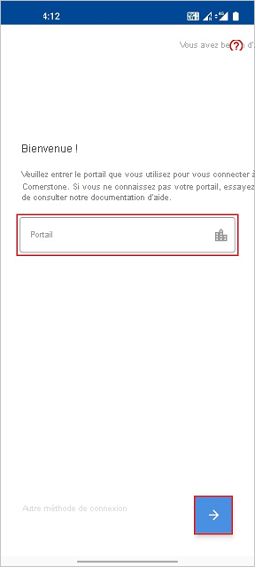
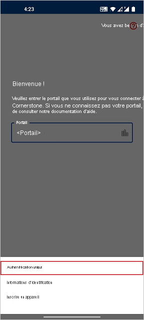
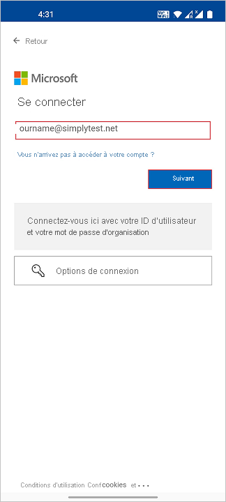

# Tutoriel : Intégration de l’authentification unique (SSO) Azure Active Directory à Cornerstone

Dans ce tutoriel, vous allez apprendre à configurer l’intégration de l’authentification unique entre Cornerstone et Azure Active Directory (Azure AD). Quand vous intégrez Cornerstone à Azure AD, vous pouvez :

* Contrôler qui a l’accès en authentification unique à Cornerstone.
* Autoriser vos utilisateurs à se connecter automatiquement à Cornerstone avec leur compte Azure AD.
* Gérer vos comptes à un emplacement central : le Portail Azure.

## Prérequis

Pour commencer, vous devez disposer de ce qui suit :

* Un abonnement Azure AD Si vous ne disposez d’aucun abonnement, vous pouvez obtenir [un compte gratuit](https://azure.microsoft.com/free/).
* Authentification unique activée dans Cornerstone.

> [!NOTE]
> Cette intégration peut également être utilisée à partir de l’environnement cloud US Government Azure AD. Cette application est disponible dans la Galerie d’applications cloud US Government Azure AD et peut être configurée de la même façon que dans le cloud public.

## Description du scénario

Dans ce tutoriel, vous allez configurer et tester l’authentification unique Azure AD dans un environnement de test.

* Cornerstone prend en charge l’authentification unique initiée par le **fournisseur de services**.

* Cornerstone prend en charge l’[attribution d’utilisateurs automatisée](cornerstone-ondemand-provisioning-tutorial.md).

* Si vous intégrez un ou plusieurs produits de cette liste en particulier, vous devez utiliser cette application Cornestone Single Sign-On à partir de la galerie.

    Nous proposons des solutions pour :

    1. Recrutement
    2. Apprentissage
    3. Développement
    4. Contenu
    5. Performances
    6. Carrière
    7. HR

## Ajout de Cornerstone Single Sign-On à partir de la galerie

Pour configurer l’intégration de l’authentification unique Azure AD avec Cornerstone, vous devez...

1. Connectez-vous au portail Azure avec un compte professionnel ou scolaire ou avec un compte personnel Microsoft.
1. Dans le panneau de navigation gauche, sélectionnez le service **Azure Active Directory**.
1. Accédez à **Applications d’entreprise**, puis sélectionnez **Toutes les applications**.
1. Pour ajouter une nouvelle application, sélectionnez **Nouvelle application**.
1. Dans la section **Ajouter à partir de la galerie**, saisissez **Cornerstone Single Sign-On** dans la zone de recherche.
1. Sélectionnez **Cornerstone Single Sign-On** dans le volet de résultats, puis ajoutez l’application. Patientez quelques secondes pendant que l’application est ajoutée à votre locataire.

## Configurer et tester l’authentification unique Azure AD pour Cornerstone

Configurez et testez l’authentification unique Azure AD avec Cornerstone à l’aide d’un utilisateur de test appelé **B.Simon**. Pour que l’authentification unique fonctionne, vous devez établir un lien entre un utilisateur Azure AD et l’utilisateur Cornerstone associé.

Pour configurer et tester l’authentification unique Azure AD avec Cornerstone, effectuez les étapes suivantes :

1. **[Configurer l’authentification unique Azure AD](#configure-azure-ad-sso)** pour permettre à vos utilisateurs d’utiliser cette fonctionnalité.
    1. **[Créer un utilisateur de test Azure AD](#create-an-azure-ad-test-user)** pour tester l’authentification unique Azure AD avec B. Simon.
    1. **[Affecter l’utilisateur de test Azure AD](#assign-the-azure-ad-test-user)** pour permettre à B. Simon d’utiliser l’authentification unique Azure AD.
2. **[Configurer l’authentification unique Cornerstone](#configure-cornerstone-single-sign-on)** pour configurer l’authentification unique dans Cornerstone.
    1. **[Créer un utilisateur de test Cornerstone Single Sign-On](#create-cornerstone-single-sign-on-test-user)** pour avoir, dans Cornerstone, un équivalent de B.Simon lié à la représentation Azure AD de l’utilisateur.
3. **[Tester l’authentification unique](#test-sso)** pour vérifier si la configuration fonctionne.
4. **[Tester l’authentification unique pour Cornerstone (mobile)](#test-sso-for-cornerstone-mobile)** afin de vérifier si la configuration fonctionne.

## Configurer l’authentification unique Azure AD

Effectuez les étapes suivantes pour activer l’authentification unique Azure AD dans le Portail Azure.

1. Dans le portail Azure, accédez à la page d’intégration de l’application **Cornerstone Single Sign-On**, recherchez la section **Gérer** et sélectionnez **Authentification unique**.
1. Dans la page **Sélectionner une méthode d’authentification unique**, sélectionnez **SAML**.
1. Dans la page **Configurer l’authentification unique avec SAML**, cliquez sur l’icône de crayon pour **Configuration SAML de base** afin de modifier les paramètres.

   

1. Dans la section **Configuration SAML de base**, effectuez les étapes suivantes :

    a. Dans la zone de texte **Identificateur**, tapez une URL au format suivant : `https://<PORTAL_NAME>.csod.com`

    b. Dans la zone de texte **URL de réponse**, tapez une URL au format suivant : `https://<PORTAL_NAME>.csod.com/samldefault.aspx?ouid=<OUID>`

    c. Dans la zone de texte **URL de connexion**, saisissez une URL au format suivant : `https://<PORTAL_NAME>.csod.com/samldefault.aspx?ouid=<OUID>`

    > [!NOTE]
    > Il ne s’agit pas de valeurs réelles. Mettez à jour ces valeurs avec l’URL de réponse, l’identificateur et l’URL de connexion réels. Pour obtenir ces valeurs, contactez votre équipe de projet d’implémentation de Cornerstone. Vous pouvez également consulter les modèles figurant à la section **Configuration SAML de base** dans le portail Azure.

4. Dans la page **Configurer l’authentification unique avec SAML**, dans la section **Certificat de signature SAML**, recherchez **Certificat (Base64)** , puis sélectionnez **Télécharger** pour télécharger le certificat et l’enregistrer sur votre ordinateur.

    

6. Dans la section **Configurer Cornerstone Single Sign-On**, copiez les URL appropriées en fonction de vos besoins.

    

### Créer un utilisateur de test Azure AD

Dans cette section, vous allez créer un utilisateur de test appelé B. Simon dans le portail Azure.

1. Dans le volet gauche du Portail Azure, sélectionnez **Azure Active Directory**, **Utilisateurs**, puis **Tous les utilisateurs**.
1. Sélectionnez **Nouvel utilisateur** dans la partie supérieure de l’écran.
1. Dans les propriétés **Utilisateur**, effectuez les étapes suivantes :
    1. Dans le champ **Nom**, entrez `B.Simon`.  
    1. Dans le champ **Nom de l’utilisateur**, entrez username@companydomain.extension. Par exemple : `B.Simon@contoso.com`.
    1. Cochez la case **Afficher le mot de passe**, puis notez la valeur affichée dans le champ **Mot de passe**.
    1. Cliquez sur **Créer**.

### Affecter l’utilisateur de test Azure AD

Dans cette section, vous allez autoriser B.Simon à utiliser l’authentification unique Azure en lui accordant l’accès à Cornerstone.

1. Dans le portail Azure, sélectionnez **Applications d’entreprise**, puis **Toutes les applications**.
1. Dans la liste des applications, sélectionnez **Cornerstone Single Sign-On**.
1. Dans la page de vue d’ensemble de l’application, recherchez la section **Gérer** et sélectionnez **Utilisateurs et groupes**.
1. Sélectionnez **Ajouter un utilisateur**, puis **Utilisateurs et groupes** dans la boîte de dialogue **Ajouter une attribution**.
1. Dans la boîte de dialogue **Utilisateurs et groupes**, sélectionnez **B. Simon** dans la liste Utilisateurs, puis cliquez sur le bouton **Sélectionner** au bas de l’écran.
1. Si vous attendez qu’un rôle soit attribué aux utilisateurs, vous pouvez le sélectionner dans la liste déroulante **Sélectionner un rôle** . Si aucun rôle n’a été configuré pour cette application, vous voyez le rôle « Accès par défaut » sélectionné.
1. Dans la boîte de dialogue **Ajouter une attribution**, cliquez sur le bouton **Attribuer**.

## Configurer l’authentification unique Cornerstone

Pour configurer l’authentification unique dans Cornerstone, vous devez contacter votre équipe de projet d’implémentation de Cornerstone. Celles-ci configurent ensuite ce paramètre pour que la connexion SSO SAML soit définie correctement des deux côtés.

### Créer un utilisateur de test Cornerstone Single Sign-On

Dans cette section, vous allez créer un utilisateur appelé Britta Simon dans Cornerstone. Collaborez avec votre équipe d’implémentation de Cornerstone pour ajouter les utilisateurs dans Cornerstone. Les utilisateurs doivent être créés et activés avant que vous utilisiez l’authentification unique.

Cornerstone Single Sign-On prend également en charge l’attribution automatique d’utilisateurs. Vous trouverez plus d’informations [ici](./cornerstone-ondemand-provisioning-tutorial.md) sur la façon de configurer l’attribution automatique d’utilisateurs.

## Tester l’authentification unique (SSO) 

Dans cette section, vous allez tester votre configuration de l’authentification unique Azure AD avec les options suivantes. 

* Cliquez sur **Tester cette application** dans le portail Azure. Vous êtes alors redirigé vers l’URL de connexion à Cornerstone où vous pouvez démarrer le flux de connexion. 

* Accédez directement à l’URL de connexion à Cornerstone pour y lancer le flux de connexion.

* Vous pouvez utiliser Mes applications de Microsoft. Quand vous cliquez sur la vignette Cornerstone Single Sign-On dans Mes applications, vous êtes redirigé vers l’URL de connexion à Cornerstone. Pour plus d’informations sur Mes applications, consultez [Présentation de Mes applications](https://support.microsoft.com/account-billing/sign-in-and-start-apps-from-the-my-apps-portal-2f3b1bae-0e5a-4a86-a33e-876fbd2a4510).

## Tester l’authentification unique pour Cornerstone (mobile)

1. Dans une autre fenêtre de navigateur, connectez-vous à votre site web Cornerstone en tant qu’administrateur et procédez comme suit.

    a. Accédez à la **Admin > Outils -> Fonctions principales -> Préférences principales-> Préférences d’authentification**.

    

    b. Recherchez le **Nom de la division** en indiquant son nom dans la zone de recherche.

    c. Cliquez sur le **Nom de la division** dans les résultats.

    d. Dans la liste déroulante URL du serveur SAML/IDP, sélectionnez le serveur SAML/IDP approprié qui doit être utilisé pour l’authentification utilisateur.

    

    e. Cliquez sur **Enregistrer**.

1. Accédez à **Admin > Outils -> Fonctions principales -> Préférences principales-> Mobile**.

    a. Sélectionnez l’**Unité d’organisation de la division** appropriée.

    b. Sélectionnez **Autoriser les utilisateurs** dans cette unité d’organisation à accéder à l’application Cornerstone Learn sur leur appareil mobile ou tablette, puis activez la case à cocher Activer l’accès mobile.

    c. Cliquez sur **Enregistrer**.

2. Ouvrez l’application mobile **Cornerstone**. Sur la page de connexion, entrez le nom du portail.

    

3. Cliquez sur **Autre connexion**, puis sur **Authentification unique**.

    

4. .  Entrez vos **informations d’identification Azure AD** pour vous connecter à l’application Cornerstone, puis cliquez sur **Suivant**.

    

5. Une fois la connexion réussie, la page d’accueil de l’application s’affiche comme illustrée ci-dessous.

    

## Étapes suivantes

Après avoir configuré Cornerstone Single Sign-On, vous pouvez appliquer le contrôle de session, qui protège contre l’exfiltration et l’infiltration des données sensibles de votre organisation en temps réel. Le contrôle de session est étendu à partir de l’accès conditionnel. [Découvrir comment appliquer un contrôle de session avec Microsoft Cloud App Security](/cloud-app-security/proxy-deployment-aad)