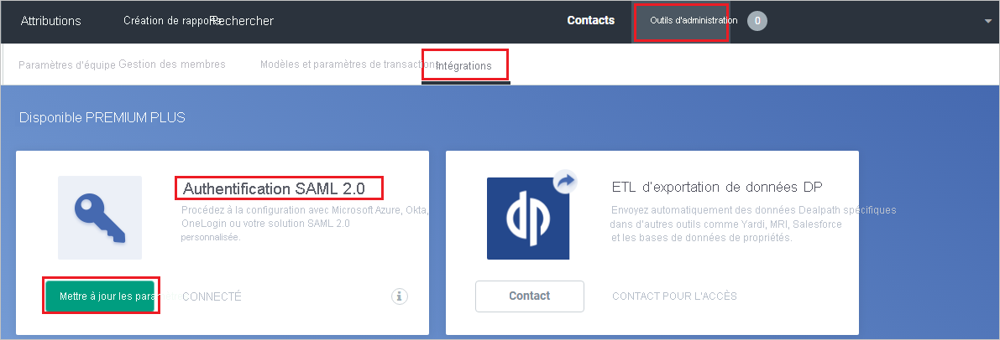
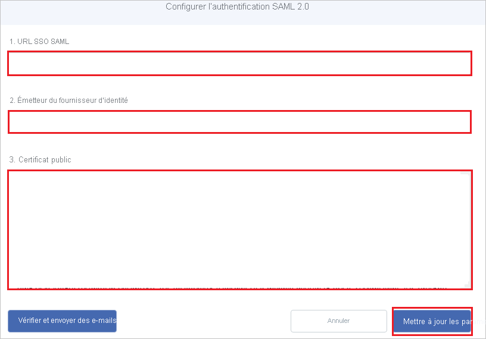

# Tutoriel : Intégration de l’authentification unique Azure AD à Dealpath

Dans ce tutoriel, vous allez découvrir comment intégrer Dealpath à Azure Active Directory (Azure AD). Quand vous intégrez Dealpath à Azure AD, vous pouvez :

* Contrôler dans Azure AD qui a accès à Dealpath.
* Permettre à vos utilisateurs de se connecter automatiquement à Dealpath avec leur compte Azure AD.
* Gérer vos comptes à un emplacement central : le Portail Azure.

## Prérequis

Pour commencer, vous devez disposer de ce qui suit :

* Un abonnement Azure AD Si vous ne disposez d’aucun abonnement, vous pouvez obtenir [un compte gratuit](https://azure.microsoft.com/free/).
* Un abonnement Dealpath pour lequel l’authentification unique est activée.

## Description du scénario

Dans ce didacticiel, vous configurez et testez l’authentification unique Azure AD dans un environnement de test.

* Dealpath prend en charge l’authentification unique lancée par le **fournisseur de services**.

## Ajouter Dealpath à partir de la galerie

Pour configurer l’intégration de Dealpath à Azure AD, vous devez ajouter Dealpath à partir de la galerie à votre liste d’applications SaaS gérées.

1. Connectez-vous au portail Azure avec un compte professionnel ou scolaire ou avec un compte personnel Microsoft.
1. Dans le panneau de navigation gauche, sélectionnez le service **Azure Active Directory**.
1. Accédez à **Applications d’entreprise**, puis sélectionnez **Toutes les applications**.
1. Pour ajouter une nouvelle application, sélectionnez **Nouvelle application**.
1. Dans la section **Ajouter à partir de la galerie**, tapez **Dealpath** dans la zone de recherche.
1. Sélectionnez **Dealpath** dans le volet de résultats, puis ajoutez l’application. Patientez quelques secondes pendant que l’application est ajoutée à votre locataire.

## Configurer et tester l’authentification unique Azure AD pour Dealpath

Configurez et testez l’authentification unique Azure AD avec Dealpath à l’aide d’un utilisateur test nommé **B.Simon**. Pour que l’authentification unique fonctionne, vous devez établir un lien entre un utilisateur Azure AD et l’utilisateur associé dans Dealpath.

Pour configurer et tester l’authentification unique Azure AD avec Dealpath, effectuez les étapes suivantes :

1. **[Configurer l’authentification unique Azure AD](#configure-azure-ad-sso)** pour permettre à vos utilisateurs d’utiliser cette fonctionnalité.
    1. **[Créer un utilisateur de test Azure AD](#create-an-azure-ad-test-user)** pour tester l’authentification unique Azure AD avec B. Simon.
    1. **[Affecter l’utilisateur de test Azure AD](#assign-the-azure-ad-test-user)** pour permettre à B. Simon d’utiliser l’authentification unique Azure AD.
1. **[Configurer l’authentification unique Dealpath](#configure-dealpath-sso)** pour configurer les paramètres de l’authentification unique côté application.
    1. **[Créer un utilisateur test Dealpath](#create-dealpath-test-user)** pour avoir un équivalent de B.Simon dans Dealpath lié à la représentation Azure AD associée de l’utilisateur.
1. **[Tester l’authentification unique](#test-sso)** pour vérifier si la configuration fonctionne.

## Configurer l’authentification unique Azure AD

Effectuez les étapes suivantes pour activer l’authentification unique Azure AD dans le Portail Azure.

1. Dans le portail Azure, accédez à la page d’intégration de l’application **Dealpath**, recherchez la section **Gérer** et sélectionnez **Authentification unique**.
1. Dans la page **Sélectionner une méthode d’authentification unique**, sélectionnez **SAML**.
1. Dans la page **Configurer l’authentification unique avec SAML**, cliquez sur l’icône de crayon de **Configuration SAML de base** afin de modifier les paramètres.

   

4. Dans la section **Configuration SAML de base**, effectuez les étapes suivantes :

    a. Dans la zone de texte **URL de connexion**, tapez l’URL : `https://app.dealpath.com/account/login`

    b. Dans la zone de texte **Identificateur (ID d’entité)** , saisissez une URL au format suivant : `https://api.dealpath.com/saml/metadata/<ID>`

    > [!NOTE]
    > La valeur de l'identificateur n'est pas réelle. Mettez à jour cette valeur avec l’identificateur réel. Pour obtenir ces valeurs, contactez l’[équipe de support client Dealpath](mailto:kenter@dealpath.com). Vous pouvez également consulter les modèles figurant à la section **Configuration SAML de base** dans le portail Azure.

4. Dans la page **Configurer l’authentification unique avec SAML**, dans la section **Certificat de signature SAML**, cliquez sur **Télécharger** pour télécharger le **Certificat (Base64)** en fonction des options définies par rapport à vos besoins, puis enregistrez-le sur votre ordinateur.

    

6. Dans la section **Configurer Dealpath**, copiez la ou les URL appropriées en fonction de vos besoins.

    

### Créer un utilisateur de test Azure AD 

Dans cette section, vous allez créer un utilisateur de test appelé B. Simon dans le portail Azure.

1. Dans le volet gauche du Portail Azure, sélectionnez **Azure Active Directory**, **Utilisateurs**, puis **Tous les utilisateurs**.
1. Sélectionnez **Nouvel utilisateur** dans la partie supérieure de l’écran.
1. Dans les propriétés **Utilisateur**, effectuez les étapes suivantes :
   1. Dans le champ **Nom**, entrez `B.Simon`.  
   1. Dans le champ **Nom de l’utilisateur**, entrez username@companydomain.extension. Par exemple : `B.Simon@contoso.com`.
   1. Cochez la case **Afficher le mot de passe**, puis notez la valeur affichée dans le champ **Mot de passe**.
   1. Cliquez sur **Créer**.

### Affecter l’utilisateur de test Azure AD

Dans cette section, vous allez autoriser B.Simon à utiliser l’authentification unique Azure en lui accordant l’accès à Dealpath.

1. Dans le portail Azure, sélectionnez **Applications d’entreprise**, puis **Toutes les applications**.
1. Dans la liste des applications, sélectionnez **Dealpath**.
1. Dans la page de vue d’ensemble de l’application, recherchez la section **Gérer** et sélectionnez **Utilisateurs et groupes**.
1. Sélectionnez **Ajouter un utilisateur**, puis **Utilisateurs et groupes** dans la boîte de dialogue **Ajouter une attribution**.
1. Dans la boîte de dialogue **Utilisateurs et groupes**, sélectionnez **B. Simon** dans la liste Utilisateurs, puis cliquez sur le bouton **Sélectionner** au bas de l’écran.
1. Si vous attendez qu’un rôle soit attribué aux utilisateurs, vous pouvez le sélectionner dans la liste déroulante **Sélectionner un rôle** . Si aucun rôle n’a été configuré pour cette application, vous voyez le rôle « Accès par défaut » sélectionné.
1. Dans la boîte de dialogue **Ajouter une attribution**, cliquez sur le bouton **Attribuer**.

## Configurer l’authentification unique Dealpath

1. Dans une autre fenêtre de navigateur web, connectez-vous à Dealpath en tant qu’administrateur.

2. Dans l’angle supérieur droit, cliquez sur **Outils d’administration** et sélectionnez **Intégrations**, puis dans la section **SAML 2.0 Authentication**, cliquez sur **Mettre à jour les paramètres** :

    

3. Dans la page **SAML 2.0 Authentication**, procédez comme suit :

     

    a. Dans la zone de texte **SAML SSO URL** (URL SSO SAML), collez la valeur **URL de connexion** que vous avez copiée dans le portail Azure.

    b. Dans la zone de texte **Identity Provider Issuer** (Émetteur du fournisseur d’identité), collez la valeur **Identificateur Azure AD** que vous avez copiée à partir du portail Azure.

    c. Copiez le contenu du certificat téléchargé dans le fichier **certificate(Base64)** , puis collez-le dans la zone de texte **Certificat public**.

    d. Cliquez sur **Mettre à jour les paramètres**.

### Créer un utilisateur de test Dealpath

Dans cette section, vous allez créer un utilisateur appelé Britta Simon dans Dealpath. Collaborez avec l’[équipe du support technique Dealpath](mailto:kenter@dealpath.com) pour ajouter des utilisateurs sur la plateforme Dealpath. Les utilisateurs doivent être créés et activés avant que vous utilisiez l’authentification unique.

## Tester l’authentification unique (SSO) 

Dans cette section, vous allez tester votre configuration de l’authentification unique Azure AD avec les options suivantes. 

* Cliquez sur **Tester cette application** dans le portail Azure. Vous êtes alors redirigé vers l’URL d’authentification Dealpath, à partir de laquelle vous pouvez lancer le processus de connexion. 

* Accédez directement à l’URL d’authentification Dealpath pour lancer le processus de connexion.

* Vous pouvez utiliser Mes applications de Microsoft. Quand vous cliquez sur la vignette Dealpath dans Mes applications, vous êtes redirigé vers l’URL d’authentification Dealpath. Pour plus d’informations sur Mes applications, consultez [Présentation de Mes applications](../user-help/my-apps-portal-end-user-access.md).

## Étapes suivantes

Une fois que vous avez configuré Dealpath, vous pouvez appliquer le contrôle de session, qui protège contre l’exfiltration et l’infiltration des données sensibles de votre organisation en temps réel. Le contrôle de session est étendu à partir de l’accès conditionnel. [Découvrez comment appliquer un contrôle de session avec Microsoft Defender for Cloud Apps](/cloud-app-security/proxy-deployment-aad).
