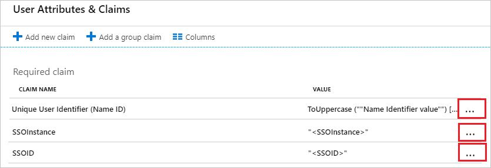
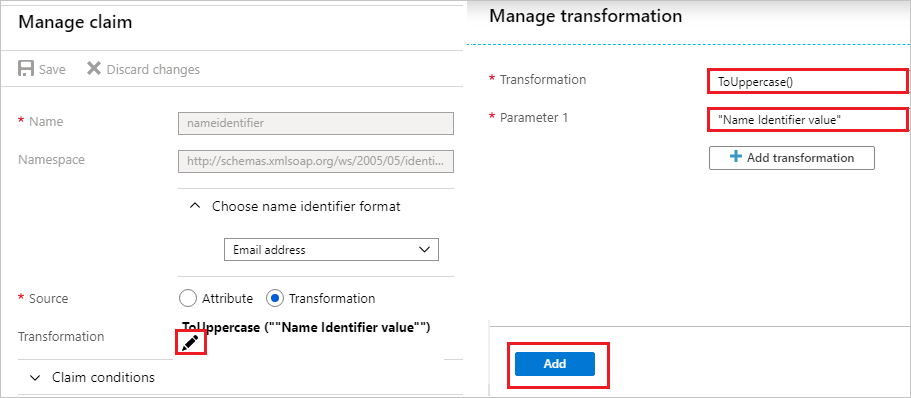

# Tutoriel : Intégration de l’authentification unique Azure Active Directory à Discovery Benefits SSO

Dans ce tutoriel, vous allez apprendre à intégrer Discovery Benefits SSO à Azure Active Directory (Azure AD). Quand vous intégrez Discovery Benefits SSO à Azure AD, vous pouvez :

* Dans Azure AD, contrôler qui a accès à Discovery Benefits SSO.
* Permettre à vos utilisateurs de se connecter automatiquement à Discovery Benefits SSO avec leur compte Azure AD.
* Gérer vos comptes à un emplacement central : le Portail Azure.

## Prérequis

Pour commencer, vous devez disposer de ce qui suit :

* Un abonnement Azure AD Si vous ne disposez d’aucun abonnement, vous pouvez obtenir [un compte gratuit](https://azure.microsoft.com/free/).
* Un abonnement Discovery Benefits SSO pour lequel l’authentification unique est activée.

## Description du scénario

Dans ce tutoriel, vous allez configurer et tester l’authentification unique Azure AD dans un environnement de test.

* Discovery Benefits SSO prend en charge l’authentification unique lancée par le **fournisseur d’identité**.

> [!NOTE]
> L’identificateur de cette application étant une valeur de chaîne fixe, une seule instance peut être configurée dans un locataire.

## Ajout de Discovery Benefits SSO à partir de la galerie

Pour configurer l’intégration de Discovery Benefits SSO à Azure AD, vous devez ajouter Discovery Benefits SSO, disponible dans la galerie, à votre liste d’applications SaaS gérées.

1. Connectez-vous au portail Azure avec un compte professionnel ou scolaire ou avec un compte personnel Microsoft.
1. Dans le panneau de navigation gauche, sélectionnez le service **Azure Active Directory**.
1. Accédez à **Applications d’entreprise**, puis sélectionnez **Toutes les applications**.
1. Pour ajouter une nouvelle application, sélectionnez **Nouvelle application**.
1. Dans la section **Ajouter à partir de la galerie**, tapez **Discovery Benefits SSO** dans la zone de recherche.
1. Sélectionnez **Discovery Benefits SSO** dans le volet de résultats, puis ajoutez l’application. Patientez quelques secondes pendant que l’application est ajoutée à votre locataire.

## Configurer et tester l’authentification unique Azure AD pour Discovery Benefits SSO

Configurez et testez l’authentification unique Azure AD avec Discovery Benefits SSO à l’aide d’un utilisateur de test appelé **B.Simon**. Pour que l’authentification unique fonctionne, vous devez établir un lien entre un utilisateur Azure AD et l’utilisateur Discovery Benefits SSO associé.

Pour configurer et tester l’authentification unique Azure AD avec Discovery Benefits SSO, suivez les indications des sections ci-après :

1. **[Configurer l’authentification unique Azure AD](#configure-azure-ad-sso)** pour permettre à vos utilisateurs d’utiliser cette fonctionnalité.
    1. **[Créer un utilisateur de test Azure AD](#create-an-azure-ad-test-user)** pour tester l’authentification unique Azure AD avec B. Simon.
    1. **[Affecter l’utilisateur de test Azure AD](#assign-the-azure-ad-test-user)** pour permettre à B. Simon d’utiliser l’authentification unique Azure AD.
1. **[Configurer l’authentification unique Discovery Benefits](#configure-discovery-benefits-sso)** pour configurer les paramètres de l’authentification unique côté application.
    1. **[Créer un utilisateur de test Discovery Benefits SSO](#create-discovery-benefits-sso-test-user)** pour avoir un équivalent de B.Simon dans Discovery Benefits SSO lié à la représentation Azure AD de l’utilisateur.
1. **[Tester l’authentification unique](#test-sso)** pour vérifier si la configuration fonctionne.

## Configurer l’authentification unique Azure AD

Effectuez les étapes suivantes pour activer l’authentification unique Azure AD dans le Portail Azure.

1. Dans le portail Azure, accédez à la page d’intégration de l’application **Discovery Benefits SSO**, recherchez la section **Gérer** et sélectionnez **Authentification unique**.
1. Dans la page **Sélectionner une méthode d’authentification unique**, sélectionnez **SAML**.
1. Dans la page **Configurer l’authentification unique avec SAML**, cliquez sur l’icône de crayon de **Configuration SAML de base** afin de modifier les paramètres.

   

1. Dans la section **Configuration SAML de base**, l’application est préconfigurée en mode Lancement par le **fournisseur d’identité** et les URL nécessaires sont déjà préremplies avec Azure. L’utilisateur doit enregistrer la configuration en cliquant sur le bouton **Enregistrer**.

1. L’application Discovery Benefits SSO s’attend à recevoir les assertions SAML dans un format spécifique, ce qui vous oblige à ajouter des mappages d’attributs personnalisés à votre configuration Attributs du jeton SAML. La capture d’écran suivante montre la liste des attributs par défaut. Cliquez sur l’icône **Modifier** pour ouvrir la boîte de dialogue Attributs d’utilisateur.

    

    a. Cliquez sur l’icône **Modifier** pour ouvrir la boîte de dialogue **Identificateur d’utilisateur unique (ID nom)** .

    

    

    b. Cliquez sur l’icône **Modifier** pour ouvrir la boîte de dialogue **Gérer la transformation**.

    c. Dans la zone de texte **Transformation**, tapez la chaîne **ToUppercase()** indiquée pour cette ligne.

    d. Dans la zone de texte **Paramètre 1**, tapez le paramètre tel que `<Name Identifier value>`.

    e. Cliquez sur **Add**.

    > [!NOTE]
    > Discovery Benefits SSO requiert la transmission d’une valeur de chaîne fixe dans **Identificateur d’utilisateur unique (ID nom)** pour que cette intégration fonctionne. Azure AD ne prend pas en charge cette fonctionnalité ; en guise de solution de contournement, vous pouvez donc utiliser des transformations **ToUpper** ou **ToLower** de NameID pour définir une valeur de chaîne fixe comme indiqué ci-dessus dans la capture d’écran.

    f. Nous avons rempli automatiquement les revendications supplémentaires requises pour la configuration de l’authentification unique (`SSOInstance` et `SSOID`). Utilisez l’icône **crayon** pour mapper les valeurs en fonction de votre organisation.

    

1. Dans la page **Configurer l’authentification unique avec SAML**, dans la section **Certificat de signature SAML**, recherchez **Certificat (en base64)** , puis sélectionnez **Télécharger** pour télécharger le certificat et l’enregistrer sur votre ordinateur.

    

1. Dans la section **Configurer Discovery Benefits SSO**, copiez la ou les URL appropriées en fonction de vos besoins.

    

### Créer un utilisateur de test Azure AD

Dans cette section, vous allez créer un utilisateur de test appelé B. Simon dans le portail Azure.

1. Dans le volet gauche du Portail Azure, sélectionnez **Azure Active Directory**, **Utilisateurs**, puis **Tous les utilisateurs**.
1. Sélectionnez **Nouvel utilisateur** dans la partie supérieure de l’écran.
1. Dans les propriétés **Utilisateur**, effectuez les étapes suivantes :
   1. Dans le champ **Nom**, entrez `B.Simon`.  
   1. Dans le champ **Nom de l’utilisateur**, entrez username@companydomain.extension. Par exemple : `B.Simon@contoso.com`.
   1. Cochez la case **Afficher le mot de passe**, puis notez la valeur affichée dans le champ **Mot de passe**.
   1. Cliquez sur **Créer**.

### Affecter l’utilisateur de test Azure AD

Dans cette section, vous allez autoriser B.Simon à utiliser l’authentification unique Azure en lui accordant l’accès à Discovery Benefits SSO.

1. Dans le portail Azure, sélectionnez **Applications d’entreprise**, puis **Toutes les applications**.
1. Dans la liste des applications, sélectionnez **Discovery Benefits SSO**.
1. Dans la page de vue d’ensemble de l’application, recherchez la section **Gérer** et sélectionnez **Utilisateurs et groupes**.
1. Sélectionnez **Ajouter un utilisateur**, puis **Utilisateurs et groupes** dans la boîte de dialogue **Ajouter une attribution**.
1. Dans la boîte de dialogue **Utilisateurs et groupes**, sélectionnez **B. Simon** dans la liste Utilisateurs, puis cliquez sur le bouton **Sélectionner** au bas de l’écran.
1. Si vous attendez qu’un rôle soit attribué aux utilisateurs, vous pouvez le sélectionner dans la liste déroulante **Sélectionner un rôle** . Si aucun rôle n’a été configuré pour cette application, vous voyez le rôle « Accès par défaut » sélectionné.
1. Dans la boîte de dialogue **Ajouter une attribution**, cliquez sur le bouton **Attribuer**.

## Configurer Discovery Benefits SSO

Pour configurer l’authentification unique côté **Discovery Benefits SSO**, vous devez envoyer le **certificat (Base64)** téléchargé et les URL appropriées copiées à partir du portail Azure à l’[équipe du support technique Discovery Benefits SSO](mailto:Jsimpson@DiscoveryBenefits.com). Celles-ci configurent ensuite ce paramètre pour que la connexion SSO SAML soit définie correctement des deux côtés.

### Créer un utilisateur de test Discovery Benefits SSO

Dans cette section, vous allez créer un utilisateur appelé Britta Simon dans Discovery Benefits SSO. Collaborez avec l’[équipe de support technique Discovery Benefits SSO](mailto:Jsimpson@DiscoveryBenefits.com) pour ajouter les utilisateurs à la plateforme Discovery Benefits SSO. Les utilisateurs doivent être créés et activés avant que vous utilisiez l’authentification unique.

## Tester l’authentification unique (SSO) 

Dans cette section, vous allez tester votre configuration de l’authentification unique Azure AD avec les options suivantes.

* Un clic sur Tester cette application dans le portail Azure doit vous connecter automatiquement à l’instance de Discovery Benefits SSO pour laquelle vous avez configuré l’authentification unique.

* Vous pouvez utiliser Mes applications de Microsoft. Quand vous cliquez sur la vignette Discovery Benefits SSO dans Mes applications, vous devez être connecté automatiquement à l’application Discovery Benefits SSO pour laquelle vous avez configuré l’authentification unique. Pour plus d’informations sur Mes applications, consultez [Présentation de Mes applications](https://support.microsoft.com/account-billing/sign-in-and-start-apps-from-the-my-apps-portal-2f3b1bae-0e5a-4a86-a33e-876fbd2a4510).

## Étapes suivantes

Une fois que vous avez configuré Discovery Benefits SSO, vous pouvez appliquer le contrôle de session, qui protège contre l’exfiltration et l’infiltration des données sensibles de votre organisation en temps réel. Le contrôle de session est étendu à partir de l’accès conditionnel. [Découvrez comment appliquer un contrôle de session avec Microsoft Defender for Cloud Apps](/cloud-app-security/proxy-deployment-aad).
