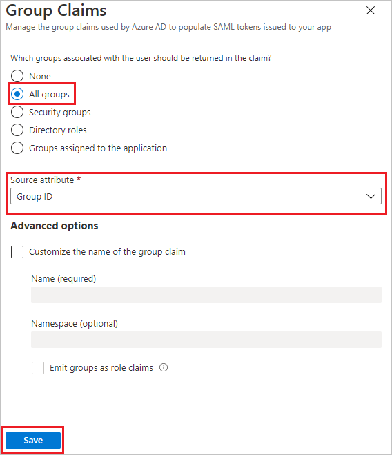
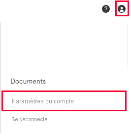
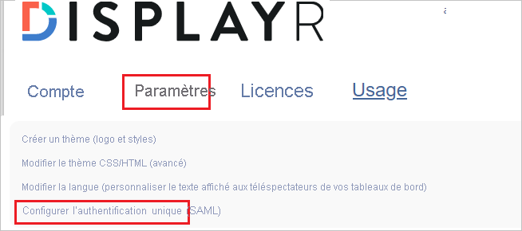

# Tutoriel : Intégrer Displayr à Azure Active Directory

Dans ce tutoriel, vous allez apprendre à intégrer Displayr à Azure Active Directory (Azure AD). Quand vous intégrez Displayr à Azure AD, vous pouvez :

* Contrôler dans Azure AD qui a accès à Displayr.
* Permettre à vos utilisateurs de se connecter automatiquement à Displayr avec leur compte Azure AD.
* Gérer vos comptes à un emplacement central : le Portail Azure.

## Prérequis

Pour commencer, vous devez disposer de ce qui suit :

* Un abonnement Azure AD Si vous ne disposez d’aucun abonnement, vous pouvez obtenir [un compte gratuit](https://azure.microsoft.com/free/).
* Entreprise Displayr pour laquelle l’authentification unique est activée.

## Description du scénario

Dans ce tutoriel, vous apprendrez à configurer Azure AD SSO dans votre société Displayr.

* Displayr prend en charge l’authentification unique lancée par le **fournisseur de services**.

## Ajouter Displayr depuis la galerie

Pour configurer l’intégration de Displayr à Azure AD, vous devez ajouter Displayr à partir de la galerie à votre liste d’applications SaaS gérées.

1. Connectez-vous au portail Azure avec un compte professionnel ou scolaire ou avec un compte personnel Microsoft.
1. Dans le panneau de navigation gauche, sélectionnez le service **Azure Active Directory**.
1. Accédez à **Applications d’entreprise**, puis sélectionnez **Toutes les applications**.
1. Pour ajouter une nouvelle application, sélectionnez **Nouvelle application**.
1. Dans la section **Ajouter à partir de la galerie**, tapez **Displayr** dans la zone de recherche.
1. Sélectionnez **Displayr** dans le volet de résultats, puis ajoutez l’application. Patientez quelques secondes pendant que l’application est ajoutée à votre locataire.

## Configurer l’authentification unique Azure AD pour Displayr

Pour configurer l’authentification unique Azure AD avec Displayr, procédez comme suit :

1. **[Configurer l’authentification unique Azure AD](#configure-azure-ad-sso)** pour permettre à vos utilisateurs d’utiliser cette fonctionnalité.
1. **[Configurer l’authentification unique Displayr](#configure-displayr-sso)** pour configurer les paramètres de l’authentification unique côté application.
1. **[Restreindre l’accès à des utilisateurs spécifiques](#restrict-access-to-specific-users)** pour limiter les utilisateurs Azure AD qui peuvent se connecter à Displayr.
1. **[Tester l’authentification unique](#test-sso)** pour vérifier si la configuration fonctionne.

## Configurer l’authentification unique Azure AD

Effectuez les étapes suivantes pour activer l’authentification unique Azure AD dans le Portail Azure.

1. Dans le Portail Azure, accédez à la page d’intégration de l’application **Displayr**, recherchez la section **Gérer** et sélectionnez **Authentification unique**.
1. Dans la page **Sélectionner une méthode d’authentification unique**, sélectionnez **SAML**.
1. Dans la page **Configurer l’authentification unique avec SAML**, cliquez sur l’icône de crayon pour **Configuration SAML de base** afin de modifier les paramètres.

   

1. Dans la section **Configuration SAML de base**, effectuez les étapes suivantes :

    a. Dans la zone de texte **Identificateur (ID d'entité)** , entre une valeur au format suivant : `<YOURDOMAIN>.displayr.com`
    
    b. Dans la zone de texte **URL de réponse**, tapez l’URL : `https://app.displayr.com/Login/ProcessSamlResponse`.
    
    c. Dans la zone de texte **URL de connexion**, tapez une URL au format suivant : `https://<YOURDOMAIN>.displayr.com`.

    d. Cliquez sur **Enregistrer**.

    >[!NOTE]
    >Il ne s’agit pas de valeurs réelles. Mettez à jour ces valeurs avec l’identificateur et l’URL de connexion réels. Pour obtenir ces valeurs, contactez l’[équipe de support technique de Displayr](mailto:support@displayr.com). Vous pouvez également consulter les modèles figurant à la section Configuration SAML de base dans le portail Azure.

1. Dans la page **Configurer l’authentification unique avec SAML**, dans la section **Certificat de signature SAML**, recherchez **Certificat (Base64)** , puis sélectionnez **Télécharger** pour télécharger le certificat et l’enregistrer sur votre ordinateur.

   

1. L'application Displayr s’attend à recevoir les assertions SAML dans un format spécifique, ce qui vous oblige à ajouter des mappages d’attributs personnalisés à votre configuration des attributs du jeton SAML. La capture d’écran suivante montre la liste des attributs par défaut. Cliquez sur l’icône **Modifier** pour ouvrir la boîte de dialogue Attributs d’utilisateur.

   

1. En plus de ce qui précède, l’application Displayr s’attend à ce que quelques attributs supplémentaires soient repassés dans la réponse SAML. Dans la section **Attributs et revendications de l’utilisateur** de la boîte de dialogue **Revendications de groupe (préversion)** , effectuez les étapes suivantes :

   a. Cliquez sur **Ajouter une revendication de groupe**.

      

   b. Sélectionnez **Tous les groupes** dans la liste d’options.

   c. Sélectionnez **Attribut source** de **ID de groupe**.

   f. Cliquez sur **Enregistrer**.

1. Dans la section **ConfigurerDisplayr**, copiez la ou les URL appropriées en fonction de vos besoins.

   

## Configurer l’authentification unique Displayr

1. Pour automatiser la configuration dans Displayr, vous devez installer l’**extension de navigateur My Apps Secure Sign-in** en cliquant sur **Installer l’extension**.

    

2. Après l’ajout de l’extension au navigateur, cliquez sur **Configurer Displayr** pour être dirigé vers l’application Displayr. À partir de là, indiquez les informations d’identification de l’administrateur pour vous connecter à Displayr. Cette extension de navigateur configure automatiquement l’application et automatise les étapes 3 à 6.

    

3. Si vous souhaitez configurer manuellement Displayr, ouvrez une nouvelle fenêtre de navigateur web, connectez-vous à votre site d’entreprise Displayr en tant qu’administrateur et effectuez les étapes suivantes :

4. Cliquez sur l’icône **Utilisateur**, puis accédez à **Paramètres du compte**.

    

5. Passez à **Settings** (Paramètres) à partir du menu supérieur et faites défiler la page pour cliquer sur **Configure Single Sign On (SAML)** (Configurer l’authentification unique (SAML)).

    

6. Sur la page **Single sign-on (SAML)** (Authentification unique (SAML)), procédez comme suit :

    

    a. Cochez la case **Enable Single Sign On (SAML)** (Activer l’authentification unique).

    b. Copiez la valeur **Identificateur** réelle à partir de la section **Configuration SAML de base** d’Azure AD et collez-la dans la zone de texte **Émetteur**.

    c. Dans la zone de texte **Login URL** (URL de connexion), collez la valeur **URL de connexion** que vous avez copiée depuis le portail Azure.

    d. Dans la zone de texte **Logout URL** (URL de déconnexion), collez la valeur **URL de connexion** que vous avez copiée depuis le portail Azure.

    e. Ouvrez le certificat (Base64) dans le Bloc-notes, copiez son contenu et collez-le dans la zone de texte **Certificat**.

    f. Les **mappages de groupes** sont facultatifs.

    g. Cliquez sur **Enregistrer**.  

### Restreindre l’accès à des utilisateurs spécifiques

Par défaut, tous les utilisateurs du locataire dans lequel vous avez ajouté l’application Displayr peuvent se connecter à Displayr à l’aide de l’authentification unique. Si vous souhaitez restreindre l’accès à des utilisateurs ou des groupes spécifiques, consultez [Limiter votre application Azure AD à un ensemble d’utilisateurs dans un locataire Azure AD](../develop/howto-restrict-your-app-to-a-set-of-users.md).

## Tester l’authentification unique (SSO)

Dans cette section, vous allez tester votre configuration de l’authentification unique Azure AD avec les options suivantes. 

* Cliquez sur **Tester cette application** dans le portail Azure. Vous êtes alors redirigé vers l’URL de connexion Displayr à partir de laquelle vous pouvez lancer le flux de connexion. 

* Accédez directement à l’URL de connexion Displayr pour lancer le flux de connexion.

* Vous pouvez utiliser Mes applications de Microsoft. Cliquez sur la mosaïque Displayr dans Mes applications pour être redirigé vers l’URL de connexion Displayr. Pour plus d’informations sur Mes applications, consultez [Présentation de Mes applications](../user-help/my-apps-portal-end-user-access.md).

## Étapes suivantes

Une fois que vous avez configuré Displayr, vous pouvez appliquer le contrôle de session, qui protège contre l’exfiltration et l’infiltration des données sensibles de votre organisation en temps réel. Le contrôle de session est étendu à partir de l’accès conditionnel. [Découvrez comment appliquer un contrôle de session avec Microsoft Cloud App Security](/cloud-app-security/proxy-deployment-aad).