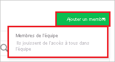
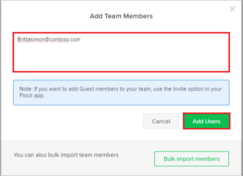

# Tutoriel : Intégration d’Azure Active Directory à Flock

Dans ce tutoriel, vous allez découvrir comment intégrer Flock à Azure Active Directory (Azure AD). Quand vous intégrez Flock à Azure AD, vous pouvez :

* Contrôler, dans Azure AD, qui a accès à Flock.
* Autoriser les utilisateurs à se connecter automatiquement à Flock avec leur compte Azure AD.
* Gérer vos comptes à un emplacement central : le Portail Azure.

## Prérequis

Pour commencer, vous devez disposer de ce qui suit :

* Un abonnement Azure AD Si vous ne disposez d’aucun abonnement, vous pouvez obtenir [un compte gratuit](https://azure.microsoft.com/free/).
* Un abonnement Flock pour lequel l’authentification unique est activée.

## Description du scénario

Dans ce didacticiel, vous configurez et testez l’authentification unique Azure AD dans un environnement de test.

* Flock prend en charge l’authentification unique lancée par le **fournisseur de services**.
* Flock prend en charge l’[attribution automatique d’utilisateurs](flock-provisioning-tutorial.md).

## Ajouter Flock à partir de la galerie

Pour configurer l’intégration de Flock à Azure AD, vous devez ajouter Flock à votre liste d’applications SaaS gérées à partir de la galerie.

1. Connectez-vous au portail Azure avec un compte professionnel ou scolaire ou avec un compte personnel Microsoft.
1. Dans le panneau de navigation gauche, sélectionnez le service **Azure Active Directory**.
1. Accédez à **Applications d’entreprise**, puis sélectionnez **Toutes les applications**.
1. Pour ajouter une nouvelle application, sélectionnez **Nouvelle application**.
1. Dans la section **Ajouter à partir de la galerie**, tapez **Flock** dans la zone de recherche.
1. Sélectionnez **Flock** dans le volet de résultats, puis ajoutez l’application. Patientez quelques secondes pendant que l’application est ajoutée à votre locataire.

## Configurer et tester l’authentification unique Azure AD pour Flock

Configurez et testez l’authentification unique Azure AD avec Flock pour un utilisateur test nommé **B.Simon**. Pour que l’authentification unique fonctionne, vous devez établir un lien entre un utilisateur Azure AD et l’utilisateur correspondant dans Flock.

Pour configurer et tester l’authentification unique Azure AD avec Flock, effectuez les étapes suivantes :

1. **[Configurer l’authentification unique Azure AD](#configure-azure-ad-sso)** pour permettre à vos utilisateurs d’utiliser cette fonctionnalité.
    1. **[Créer un utilisateur de test Azure AD](#create-an-azure-ad-test-user)** pour tester l’authentification unique Azure AD avec Britta Simon.
    1. **[Affecter l’utilisateur de test Azure AD](#assign-the-azure-ad-test-user)** pour permettre à Britta Simon d’utiliser l’authentification unique Azure AD.
2. **[Configurer l’authentification unique Flock](#configure-flock-sso)** pour configurer les paramètres de l’authentification unique côté application.
    1. **[Créer un utilisateur de test Flock](#create-flock-test-user)** pour avoir un équivalent de Britta Simon dans Flock lié à la représentation Azure AD associée.
1. **[Tester l’authentification unique](#test-sso)** pour vérifier si la configuration fonctionne.

## Configurer l’authentification unique Azure AD

Effectuez les étapes suivantes pour activer l’authentification unique Azure AD dans le Portail Azure.

1. Dans le portail Azure, accédez à la page d’intégration de l’application **Flock**, recherchez la section **Gérer** et sélectionnez **Authentification unique**.
1. Dans la page **Sélectionner une méthode d’authentification unique**, sélectionnez **SAML**.
1. Dans la page **Configurer l’authentification unique avec SAML**, cliquez sur l’icône de crayon de **Configuration SAML de base** afin de modifier les paramètres.

   

4. Dans la section **Configuration SAML de base**, effectuez les étapes suivantes :

    a. Dans la zone de texte **URL de connexion**, saisissez une URL au format suivant : `https://<subdomain>.flock.com/`

    b. Dans la zone de texte **Identificateur (ID d’entité)** , saisissez une URL au format suivant : `https://<subdomain>.flock.com/`

    > [!NOTE]
    > Il ne s’agit pas de valeurs réelles. Mettez à jour ces valeurs avec l’URL de connexion et l’identificateur réels. Pour obtenir ces valeurs, contactez [l’équipe de support client de Flock](mailto:support@flock.com). Vous pouvez également consulter les modèles figurant à la section **Configuration SAML de base** dans le portail Azure.

4. Dans la page **Configurer l’authentification unique avec SAML**, dans la section **Certificat de signature SAML**, cliquez sur **Télécharger** pour télécharger le **Certificat (Base64)** en fonction des options définies par rapport à vos besoins, puis enregistrez-le sur votre ordinateur.

    

6. Dans la section **Configurer Flock**, copiez les URL appropriées, selon vos besoins.

    

### Créer un utilisateur de test Azure AD

Dans cette section, vous allez créer un utilisateur de test appelé B. Simon dans le portail Azure.

1. Dans le volet gauche du Portail Azure, sélectionnez **Azure Active Directory**, **Utilisateurs**, puis **Tous les utilisateurs**.
1. Sélectionnez **Nouvel utilisateur** dans la partie supérieure de l’écran.
1. Dans les propriétés **Utilisateur**, effectuez les étapes suivantes :
   1. Dans le champ **Nom**, entrez `B.Simon`.  
   1. Dans le champ **Nom de l’utilisateur**, entrez username@companydomain.extension. Par exemple : `B.Simon@contoso.com`.
   1. Cochez la case **Afficher le mot de passe**, puis notez la valeur affichée dans le champ **Mot de passe**.
   1. Cliquez sur **Créer**.

### Affecter l’utilisateur de test Azure AD

Dans cette section, vous allez autoriser B.Simon à utiliser l’authentification unique Azure en lui accordant l’accès à Flock.

1. Dans le portail Azure, sélectionnez **Applications d’entreprise**, puis **Toutes les applications**.
1. Dans la liste des applications, sélectionnez **Flock**.
1. Dans la page de vue d’ensemble de l’application, recherchez la section **Gérer** et sélectionnez **Utilisateurs et groupes**.
1. Sélectionnez **Ajouter un utilisateur**, puis **Utilisateurs et groupes** dans la boîte de dialogue **Ajouter une attribution**.
1. Dans la boîte de dialogue **Utilisateurs et groupes**, sélectionnez **B. Simon** dans la liste Utilisateurs, puis cliquez sur le bouton **Sélectionner** au bas de l’écran.
1. Si vous attendez qu’un rôle soit attribué aux utilisateurs, vous pouvez le sélectionner dans la liste déroulante **Sélectionner un rôle** . Si aucun rôle n’a été configuré pour cette application, vous voyez le rôle « Accès par défaut » sélectionné.
1. Dans la boîte de dialogue **Ajouter une attribution**, cliquez sur le bouton **Attribuer**.

## Configurer l’authentification unique Flock

1. Dans une autre fenêtre de navigateur web, connectez-vous à votre site d’entreprise Flock en tant qu’administrateur.

2. Sélectionnez l’onglet **Authentification** dans le volet de navigation de gauche, puis **Authentification SAML**.

    

3. Dans la section **SAML Authentication** , procédez comme suit :

    

    a. Dans la zone de texte **Point de terminaison SAML 2.0 (HTTP)** , collez la valeur de l’**URL de connexion** que vous avez copiée à partir du Portail Azure.

    b. Dans la zone de texte **Émetteur du fournisseur d’identité**, collez la valeur de l’**identificateur Azure AD** que vous avez copiée à partir du Portail Azure.

    c. Ouvrez le **Certificat (Base64)** téléchargé sur le Portail Azure dans le Bloc-notes et collez le contenu dans la zone de texte **Certificat public**.

    d. Cliquez sur **Enregistrer**.

### Créer un utilisateur de test Flock

Les utilisateurs Azure AD doivent avoir fait l’objet d’une attribution dans Flock pour pouvoir s’y connecter. Il s’agit en l’occurrence d’une tâche manuelle.

**Pour approvisionner un compte d’utilisateur, procédez comme suit :**

1. Connectez-vous à votre site d’entreprise Flock en tant qu’administrateur.

2. Cliquez sur **Gérer l’équipe** dans le volet de navigation de gauche.

    

3. Cliquez sur l’onglet **Ajouter un membre**, puis sélectionnez **Membres de l’équipe**.

    

4. Entrez l’adresse e-mail de l’utilisateur, par exemple, **Brittasimon\@contoso.com**, puis sélectionnez **Ajouter des utilisateurs**.

    

> [!NOTE]
>Flock prend aussi en charge l’attribution automatique d’utilisateurs. Vous trouverez [ici](./flock-provisioning-tutorial.md) plus d’informations sur la façon de configurer l’attribution automatique d’utilisateurs.

## Tester l’authentification unique (SSO) 

Dans cette section, vous allez tester votre configuration de l’authentification unique Azure AD avec les options suivantes. 

* Cliquez sur **Tester cette application** dans le portail Azure. Vous êtes alors redirigé vers l’URL d’authentification Flock, d’où vous pouvez lancer le flux de connexion. 

* Accédez directement à l’URL d’authentification Flock pour lancer le flux de connexion.

* Vous pouvez utiliser Mes applications de Microsoft. Quand vous cliquez sur la vignette Flock dans Mes applications, vous êtes redirigé vers l’URL d’authentification Flock. Pour plus d’informations sur Mes applications, consultez [Présentation de Mes applications](../user-help/my-apps-portal-end-user-access.md).

## Étapes suivantes

Après avoir configuré Flock, vous pouvez appliquer le contrôle de session, qui protège contre l’exfiltration et l’infiltration des données sensibles de votre organisation en temps réel. Le contrôle de session est étendu à partir de l’accès conditionnel. [Découvrez comment appliquer un contrôle de session avec Microsoft Defender for Cloud Apps](/cloud-app-security/proxy-deployment-any-app).
