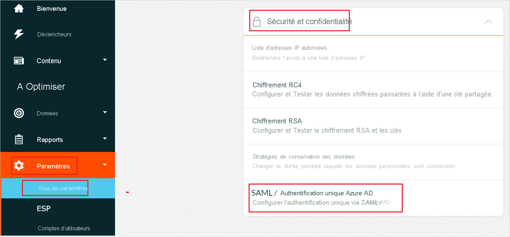
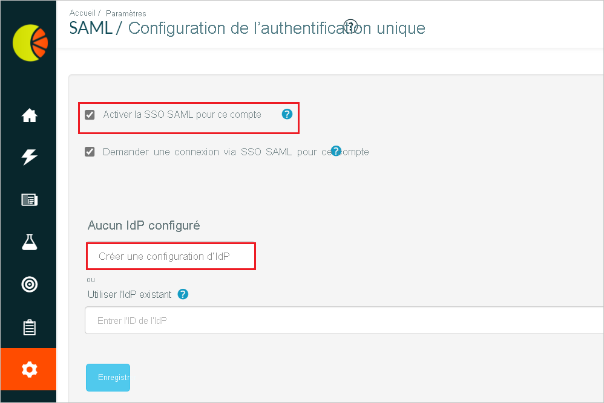
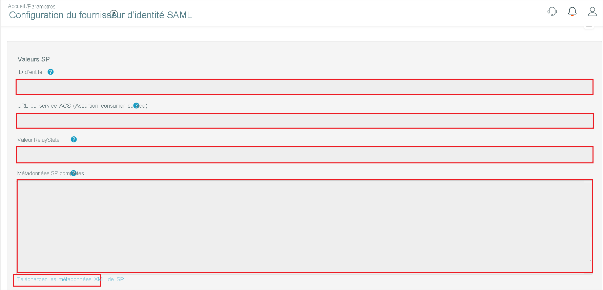

# Tutoriel : Intégration de l’authentification unique Azure Active Directory à Fresh Relevance

Dans ce didacticiel, vous allez apprendre à intégrer Fresh Relevance à Azure Active Directory (Azure AD). Quand vous intégrez Fresh Relevance à Azure AD, vous pouvez :

* Contrôler dans Azure AD qui a accès à Fresh Relevance.
* Permettre à vos utilisateurs de se connecter automatiquement à Fresh Relevance avec leur compte Azure AD.
* Gérer vos comptes à un emplacement central : le Portail Azure.

## Prérequis

Pour commencer, vous devez disposer de ce qui suit :

* Un abonnement Azure AD Si vous ne disposez d’aucun abonnement, vous pouvez obtenir [un compte gratuit](https://azure.microsoft.com/free/)
* Un abonnement Fresh Relevance pour lequel l’authentification unique (SSO) est activée.

## Description du scénario

Dans ce tutoriel, vous allez configurer et tester l’authentification unique Azure AD dans un environnement de test.

* Fresh Relevance prend en charge l’authentification unique initiée par **IdP**.

* Fresh Relevance prend en charge le provisionnement d’utilisateurs **juste-à-temps**.

## Ajouter Fresh Relevance à partir de la Galerie

Pour configurer l’intégration de Fresh Relevance dans Azure AD, vous devez ajouter Fresh Relevance depuis la galerie dans votre liste d’applications SaaS gérées.

1. Connectez-vous au portail Azure avec un compte professionnel ou scolaire ou avec un compte personnel Microsoft.
1. Dans le panneau de navigation gauche, sélectionnez le service **Azure Active Directory**.
1. Accédez à **Applications d’entreprise**, puis sélectionnez **Toutes les applications**.
1. Pour ajouter une nouvelle application, sélectionnez **Nouvelle application**.
1. Dans la section **Ajouter à partir de la galerie**, tapez **Fresh Relevance** dans la zone de recherche.
1. Sélectionnez **Fresh Relevance** dans le volet de résultats, puis ajoutez l’application. Patientez quelques secondes pendant que l’application est ajoutée à votre locataire.

## Configurer et tester l’authentification unique Azure AD pour Fresh Relevance

Configurez et testez l’authentification unique Azure AD avec Fresh Relevance pour un utilisateur de test appelé **B.Simon**. Pour que l’authentification unique fonctionne, vous devez établir un lien entre un utilisateur Azure AD et l’utilisateur Fresh Relevance associé.

Pour configurer et tester l’authentification unique Azure AD avec Fresh Relevance, vous devez suivre les étapes suivantes :

1. **[Configurer l’authentification unique Azure AD](#configure-azure-ad-sso)** pour permettre à vos utilisateurs d’utiliser cette fonctionnalité.
    1. **[Créer un utilisateur de test Azure AD](#create-an-azure-ad-test-user)** pour tester l’authentification unique Azure AD avec B. Simon.
    1. **[Affecter l’utilisateur de test Azure AD](#assign-the-azure-ad-test-user)** pour permettre à B. Simon d’utiliser l’authentification unique Azure AD.
1. **[Configurer l’authentification unique Fresh Relevance](#configure-fresh-relevance-sso)** pour configurer les paramètres de l’authentification unique côté application.
    1. **[Créer un utilisateur de test Fresh Relevance](#create-fresh-relevance-test-user)** pour avoir un équivalent de B.Simon dans Fresh Relevance lié à la représentation Azure AD associée.
1. **[Tester l’authentification unique](#test-sso)** pour vérifier si la configuration fonctionne.

## Configurer l’authentification unique Azure AD

Effectuez les étapes suivantes pour activer l’authentification unique Azure AD dans le Portail Azure.

1. Dans le portail Azure, accédez à la page d’intégration de l’application **Fresh Relevance**, recherchez la section **Gérer** et sélectionnez **Authentification unique**.
1. Dans la page **Sélectionner une méthode d’authentification unique**, sélectionnez **SAML**.
1. Dans la page **Configurer l’authentification unique avec SAML**, cliquez sur l’icône de crayon de **Configuration SAML de base** afin de modifier les paramètres.

   

1. Dans la section **Configuration SAML de base**, si vous disposez d’un **fichier de métadonnées du fournisseur de services**, suivez les étapes ci-dessous :

    a. Cliquez sur **Charger un fichier de métadonnées**.

    

    b. Cliquez sur le **logo du dossier** pour sélectionner le fichier de métadonnées, puis cliquez sur **Charger**.

    

    c. Une fois le fichier de métadonnées chargé, les valeurs **Identificateur** et **URL de réponse** sont automatiquement renseignées dans la section Configuration SAML de base :

    > [!Note]
    > Si les valeurs **Identificateur** et **URL de réponse** ne sont pas automatiquement renseignées, renseignez-les manuellement en fonction de vos besoins.

    d. Dans la zone de texte **Relay State** (État du relais), tapez une valeur en respectant le format suivant : `<ID>`

1. Dans la page **Configurer l’authentification unique avec SAML**, dans la section **Certificat de signature SAML**, cliquez sur le bouton Copier pour copier l’**URL des métadonnées de fédération d’application**, puis enregistrez-la sur votre ordinateur.

    

### Créer un utilisateur de test Azure AD

Dans cette section, vous allez créer un utilisateur de test appelé B. Simon dans le portail Azure.

1. Dans le volet gauche du Portail Azure, sélectionnez **Azure Active Directory**, **Utilisateurs**, puis **Tous les utilisateurs**.
1. Sélectionnez **Nouvel utilisateur** dans la partie supérieure de l’écran.
1. Dans les propriétés **Utilisateur**, effectuez les étapes suivantes :
   1. Dans le champ **Nom**, entrez `B.Simon`.  
   1. Dans le champ **Nom de l’utilisateur**, entrez username@companydomain.extension. Par exemple : `B.Simon@contoso.com`.
   1. Cochez la case **Afficher le mot de passe**, puis notez la valeur affichée dans le champ **Mot de passe**.
   1. Cliquez sur **Créer**.

### Affecter l’utilisateur de test Azure AD

Dans cette section, vous allez autoriser B.Simon à utiliser l’authentification unique Azure en lui accordant l’accès à Fresh Relevance.

1. Dans le portail Azure, sélectionnez **Applications d’entreprise**, puis **Toutes les applications**.
1. Dans la liste des applications, sélectionnez **Fresh Relevance**.
1. Dans la page de vue d’ensemble de l’application, recherchez la section **Gérer** et sélectionnez **Utilisateurs et groupes**.
1. Sélectionnez **Ajouter un utilisateur**, puis **Utilisateurs et groupes** dans la boîte de dialogue **Ajouter une attribution**.
1. Dans la boîte de dialogue **Utilisateurs et groupes**, sélectionnez **B. Simon** dans la liste Utilisateurs, puis cliquez sur le bouton **Sélectionner** au bas de l’écran.
1. Si vous attendez qu’un rôle soit attribué aux utilisateurs, vous pouvez le sélectionner dans la liste déroulante **Sélectionner un rôle** . Si aucun rôle n’a été configuré pour cette application, vous voyez le rôle « Accès par défaut » sélectionné.
1. Dans la boîte de dialogue **Ajouter une attribution**, cliquez sur le bouton **Attribuer**.

## Configurer l’authentification unique Fresh Relevance

1. Connectez-vous au site d’entreprise Fresh Relevance en tant qu’administrateur.

1. Accédez à **Paramètres** > **Tous les paramètres** > **Sécurité et confidentialité**, puis cliquez sur **Authentification unique SAML/Azure AD**.

    

1. Dans la page **Configuration SAML/authentification unique**, cochez **Activer l’authentification unique SAML pour ce compte**, puis cliquez sur le bouton **Créer une nouvelle configuration IdP**. 

    

1. Dans la page **Configuration IdP SAML**, procédez comme suit :

    

    

    a. Copiez la valeur de **Entity ID** (ID d’entité), puis collez-la dans la zone de texte **Identificateur (ID d’entité)** de la section **Configuration SAML de base** du portail Azure.

    b. Copiez la valeur du champ **URL Assertion Consumer Service** et collez-la dans la zone de texte **URL de réponse** de la section **Configuration SAML de base** sur le portail Azure.

    c. Copiez la **valeur de RelayState**, collez-la dans la zone de texte **État de relais** de la section **Configuration SAML de base** du portail Azure.

    d. Cliquez sur **Télécharger le XML de métadonnées SP** et chargez le fichier de métadonnées dans la section de **Configuration SAML de base** du portail Azure.

    e. Copiez l’**URL des métadonnées de fédération** à partir du portail Azure, puis collez son contenu dans la zone de texte **XML des métadonnées IdP** et cliquez sur **Enregistrer**.

    f. En cas de réussite, des informations telles que l’**ID d’entité** de votre IdP s’affichent dans la zone de texte **ID d’entité de l’IdP**.

    g. Dans la section **Mappage des attributs**, remplissez manuellement les champs requis que vous avez copiés depuis le portail Azure.

    h. Dans la section **Configuration générale**, activez la **Création de compte juste-à-temps (JIT)** , puis cliquez sur **Enregistrer**.

    > [!NOTE]
    > Si ces paramètres ne sont pas correctement mappés, la création de la connexion/du compte échouera et une erreur s’affichera. Pour afficher temporairement les informations de débogage d’attribut améliorées lors de l’échec de l’authentification, activez la case à cocher **Afficher les informations de débogage**.

### Créer un utilisateur de test Fresh Relevance

Dans cette section, un utilisateur appelé Britta Simon est créé dans Fresh Relevance. Fresh Relevance prend en charge l’attribution d’utilisateurs juste-à-temps, option activée par défaut. Vous n’avez aucune opération à effectuer dans cette section. S’il n’existe pas encore d’utilisateur dans Fresh Relevance, il en est créé un après l’authentification.

## Tester l’authentification unique (SSO) 

Dans cette section, vous allez tester votre configuration de l’authentification unique Azure AD avec les options suivantes.

* Cliquez sur Tester cette application dans le portail Azure. Vous devez être connecté automatiquement à l’instance de Fresh Relevance pour laquelle vous avez configuré l’authentification unique.

* Vous pouvez utiliser Mes applications de Microsoft. Quand vous cliquez sur la vignette Fresh Relevance dans Mes applications, vous devez être connecté automatiquement à l’application Fresh Relevance pour laquelle vous avez configuré l’authentification unique. Pour plus d’informations sur Mes applications, consultez [Présentation de Mes applications](https://support.microsoft.com/account-billing/sign-in-and-start-apps-from-the-my-apps-portal-2f3b1bae-0e5a-4a86-a33e-876fbd2a4510).

## Étapes suivantes

Une fois que vous avez configuré Fresh Relevance, vous pouvez appliquer le contrôle de session, qui protège l’exfiltration et l’infiltration des données sensibles de votre organisation en temps réel. Le contrôle de session est étendu à partir de l’accès conditionnel. [Découvrez comment appliquer un contrôle de session avec Microsoft Defender for Cloud Apps](/cloud-app-security/proxy-deployment-aad).
