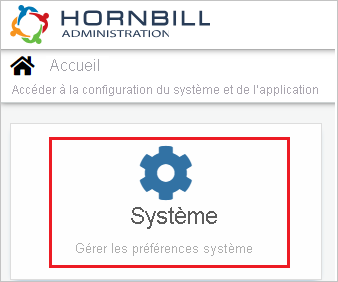
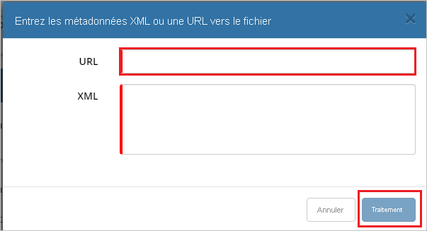
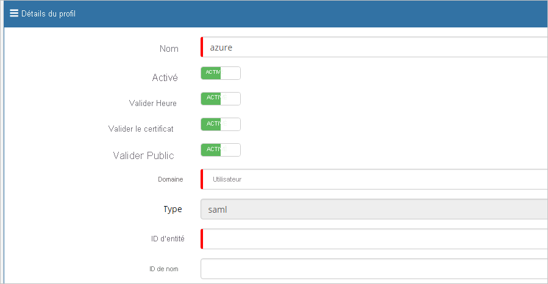
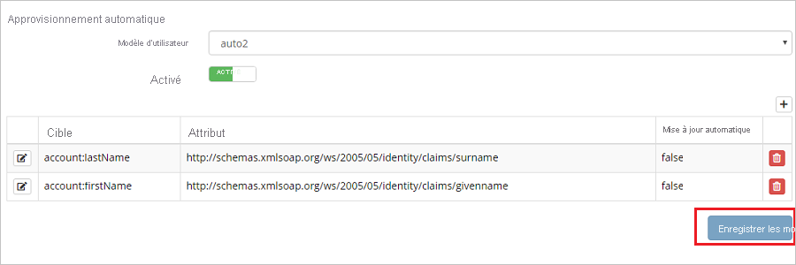

# Didacticiel : Intégration d’Azure Active Directory à Hornbill

Dans ce tutoriel, vous allez apprendre à intégrer Hornbill à Azure Active Directory (Azure AD). Quand vous intégrez Hornbill à Azure AD, vous pouvez :

* contrôler, dans Azure AD, qui a accès à Hornbill ;
* permettre à vos utilisateurs de se connecter automatiquement à Hornbill avec leurs comptes Azure AD ;
* Gérer vos comptes à un emplacement central : le Portail Azure.

## Prérequis

Pour commencer, vous devez disposer de ce qui suit :

* Un abonnement Azure AD Si vous ne disposez d’aucun abonnement, vous pouvez obtenir [un compte gratuit](https://azure.microsoft.com/free/).
* Abonnement Hornbill pour lequel l’authentification unique (SSO) est activée.

> [!NOTE]
> Cette intégration peut également être utilisée à partir de l’environnement cloud US Government Azure AD. Cette application est disponible dans la Galerie d’applications cloud US Government Azure AD et peut être configurée de la même façon que dans le cloud public.

## Description du scénario

Dans ce didacticiel, vous configurez et testez l’authentification unique Azure AD dans un environnement de test.

* Hornbill prend en charge l’authentification unique initiée par le **fournisseur de services**.
* Hornbill prend en charge le provisionnement d’utilisateurs **Juste-à-temps**.

## Ajouter Hornbill à partir de la galerie

Pour configurer l’intégration de Hornbill à Azure AD, vous devez ajouter Hornbill depuis la galerie à votre liste d’applications SaaS gérées.

1. Connectez-vous au portail Azure avec un compte professionnel ou scolaire ou avec un compte personnel Microsoft.
1. Dans le panneau de navigation gauche, sélectionnez le service **Azure Active Directory**.
1. Accédez à **Applications d’entreprise**, puis sélectionnez **Toutes les applications**.
1. Pour ajouter une nouvelle application, sélectionnez **Nouvelle application**.
1. Dans la section **Ajouter à partir de la galerie**, tapez **Hornbill** dans la zone de recherche.
1. Sélectionnez **Hornbill** dans le volet de résultats, puis ajoutez l’application. Patientez quelques secondes pendant que l’application est ajoutée à votre locataire.

## Configurer et tester l’authentification unique Azure AD pour Hornbill

Configurez et testez l’authentification unique Azure AD avec Hornbill à l’aide d’un utilisateur de test appelé **B.Simon**. Pour que l’authentification unique fonctionne, vous devez établir un lien entre un utilisateur Azure AD et l’utilisateur Hornbill associé.

Pour configurer et tester l’authentification unique Azure AD auprès de Hornbill, effectuez les étapes suivantes :

1. **[Configurer l’authentification unique Azure AD](#configure-azure-ad-sso)** pour permettre à vos utilisateurs d’utiliser cette fonctionnalité.
    1. **[Créer un utilisateur de test Azure AD](#create-an-azure-ad-test-user)** pour tester l’authentification unique Azure AD avec B. Simon.
    1. **[Affecter l’utilisateur de test Azure AD](#assign-the-azure-ad-test-user)** pour permettre à B. Simon d’utiliser l’authentification unique Azure AD.
1. **[Configurer l'authentification unique Hornbill](#configure-hornbill-sso)** pour configurer les paramètres de l'authentification unique côté application.
    1. **[Créer l’utilisateur de test Hornbill](#create-hornbill-test-user)** pour avoir dans Hornbill un équivalent de B.Simon lié à la représentation Azure AD de l’utilisateur.
1. **[Tester l’authentification unique](#test-sso)** pour vérifier si la configuration fonctionne.

## Configurer l’authentification unique Azure AD

Effectuez les étapes suivantes pour activer l’authentification unique Azure AD dans le Portail Azure.

1. Dans le Portail Azure, accédez à la page d’intégration de l’application **Hornbill**, recherchez la section **Gérer**, puis sélectionnez **Authentification unique**.
1. Dans la page **Sélectionner une méthode d’authentification unique**, sélectionnez **SAML**.
1. Dans la page **Configurer l’authentification unique avec SAML**, cliquez sur l’icône de crayon de **Configuration SAML de base** afin de modifier les paramètres.

   

4. Dans la section **Configuration SAML de base**, effectuez les étapes suivantes :

    a. Dans la zone de texte **Identificateur (ID d’entité)** , saisissez une URL au format suivant : `https://<SUBDOMAIN>.hornbill.com/<INSTANCE_NAME>/lib/saml/auth/simplesaml/module.php/saml/sp/metadata.php/saml`

    b. Dans la zone de texte **URL de connexion**, saisissez une URL au format suivant : `https://<SUBDOMAIN>.hornbill.com/<INSTANCE_NAME>/`

    > [!NOTE]
    > Il ne s’agit pas de valeurs réelles. Mettez à jour ces valeurs avec l’identificateur et l’URL de connexion réels. Pour obtenir ces valeurs, contactez l’[équipe de support aux clients Hornbill](https://www.hornbill.com/support/?request/). Vous pouvez également consulter les modèles figurant à la section **Configuration SAML de base** dans le portail Azure.

5. Dans la page **Configurer l’authentification unique avec SAML**, dans la section **Certificat de signature SAML**, cliquez sur le bouton Copier pour copier l’**URL des métadonnées de fédération d’application**, puis enregistrez-la sur votre ordinateur.

    

### Créer un utilisateur de test Azure AD

Dans cette section, vous allez créer un utilisateur de test appelé B. Simon dans le portail Azure.

1. Dans le volet gauche du Portail Azure, sélectionnez **Azure Active Directory**, **Utilisateurs**, puis **Tous les utilisateurs**.
1. Sélectionnez **Nouvel utilisateur** dans la partie supérieure de l’écran.
1. Dans les propriétés **Utilisateur**, effectuez les étapes suivantes :
   1. Dans le champ **Nom**, entrez `B.Simon`.  
   1. Dans le champ **Nom de l’utilisateur**, entrez username@companydomain.extension. Par exemple : `B.Simon@contoso.com`.
   1. Cochez la case **Afficher le mot de passe**, puis notez la valeur affichée dans le champ **Mot de passe**.
   1. Cliquez sur **Créer**.

### Affecter l’utilisateur de test Azure AD

Dans cette section, vous allez autoriser B.Simon à utiliser l’authentification unique Azure en lui accordant l’accès à Hornbill.

1. Dans le portail Azure, sélectionnez **Applications d’entreprise**, puis **Toutes les applications**.
1. Dans la liste des applications, sélectionnez **Hornbill**.
1. Dans la page de vue d’ensemble de l’application, recherchez la section **Gérer** et sélectionnez **Utilisateurs et groupes**.
1. Sélectionnez **Ajouter un utilisateur**, puis **Utilisateurs et groupes** dans la boîte de dialogue **Ajouter une attribution**.
1. Dans la boîte de dialogue **Utilisateurs et groupes**, sélectionnez **B. Simon** dans la liste Utilisateurs, puis cliquez sur le bouton **Sélectionner** au bas de l’écran.
1. Si vous attendez qu’un rôle soit attribué aux utilisateurs, vous pouvez le sélectionner dans la liste déroulante **Sélectionner un rôle** . Si aucun rôle n’a été configuré pour cette application, vous voyez le rôle « Accès par défaut » sélectionné.
1. Dans la boîte de dialogue **Ajouter une attribution**, cliquez sur le bouton **Attribuer**.

## Configurer l’authentification unique Hornbill

1. Dans une autre fenêtre de navigateur web, connectez-vous à Hornbill comme Administrateur de la sécurité.

2. Dans la page d’accueil, cliquez sur **System** (Système).

    

3. Naviguez vers **Sécurité**.

    

4. Cliquez sur **Profils SSO**.

    

5. À droite de la page, cliquez sur **Ajouter un logo**.

    

6. Sur la barre **Détails du profil**, cliquez sur **Importer le logo SAML Meta**.

    

7. Dans la fenêtre contextuelle de la zone de texte **URL**, collez l’**URL des métadonnées de fédération de l’application** que vous avez copiée dans le portail Azure, puis cliquez sur **Process** (Traiter).

    

8. Après avoir cliqué sur Process, les valeurs sont remplies automatiquement dans la section **Détails du profil**.

    

    

    

9. Cliquez sur **Enregistrer les modifications**.

### Créer l’utilisateur de test Hornbill

Dans cette section, un utilisateur nommé Britta Simon est créé dans Hornbill. Hornbill prend en charge l’attribution d’utilisateurs juste-à-temps, une option activée par défaut. Vous n’avez aucune opération à effectuer dans cette section. S’il n’existe pas encore d’utilisateur dans Hornbill, il en est créé un après l’authentification.

> [!Note]
> Si vous devez créer un utilisateur manuellement, contactez [l’équipe du support technique du client Hornbill](https://www.hornbill.com/support/?request/).

## Tester l’authentification unique (SSO)

Dans cette section, vous allez tester votre configuration de l’authentification unique Azure AD avec les options suivantes. 

* Cliquez sur **Tester cette application** dans le portail Azure. Vous êtes alors redirigé vers l’URL de connexion à Hornbill, d’où vous pouvez lancer le flux de connexion. 

* Accédez directement à l’URL de connexion à Hornbill pour lancer le flux de connexion.

* Vous pouvez utiliser Mes applications de Microsoft. Un clic sur la mosaïque Hornbill dans Mes applications vous redirige vers l’URL de connexion à Hornbill. Pour plus d’informations sur Mes applications, consultez [Présentation de Mes applications](../user-help/my-apps-portal-end-user-access.md).

## Étapes suivantes

Une fois que vous avez configuré Hornbill, vous pouvez appliquer le contrôle de session, qui protège contre l’exfiltration et l’infiltration des données sensibles de votre organisation en temps réel. Le contrôle de session est étendu à partir de l’accès conditionnel. [Découvrez comment appliquer un contrôle de session avec Microsoft Cloud App Security](/cloud-app-security/proxy-deployment-aad).