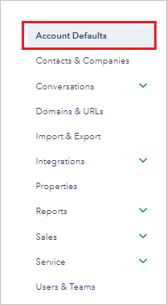
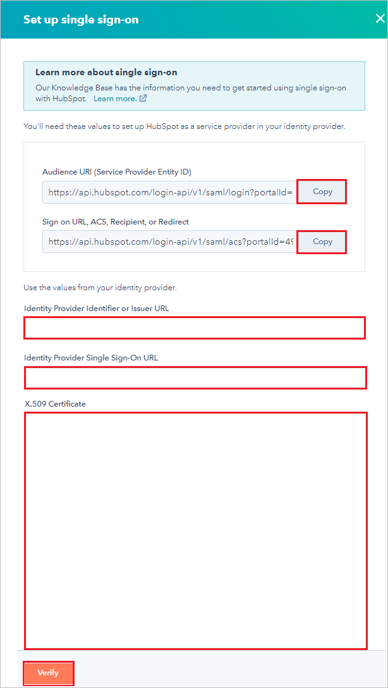
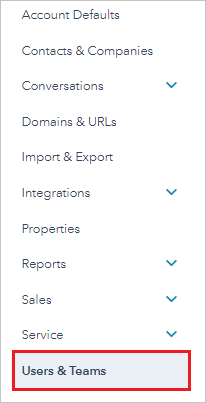
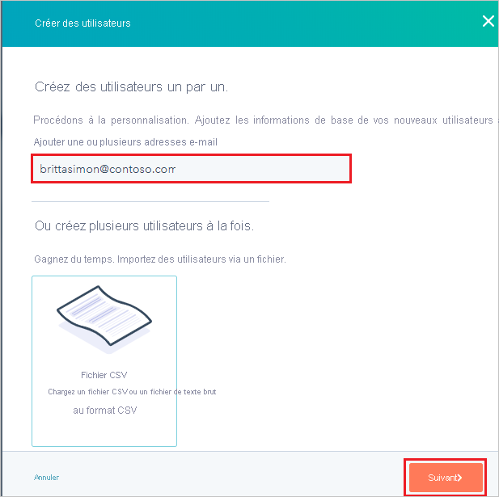
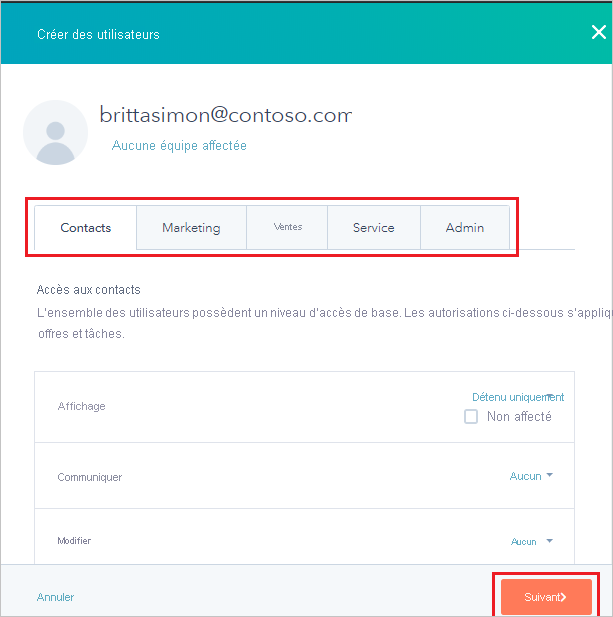
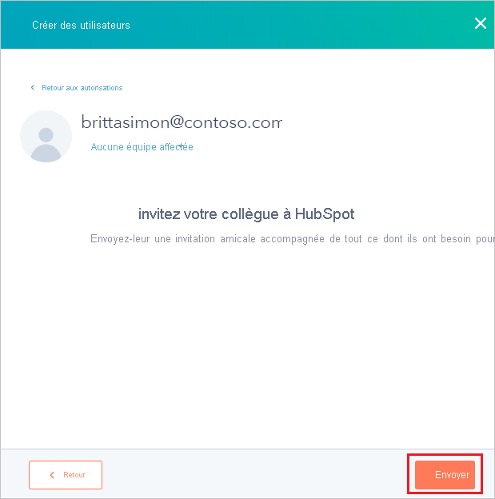

# Tutoriel : Intégration de l’authentification unique Azure AD à HubSpot

Dans ce tutoriel, vous allez découvrir comment intégrer HubSpot à Azure Active Directory (Azure AD). Quand vous intégrez HubSpot à Azure AD, vous pouvez :

* Contrôler dans Azure AD qui a accès à HubSpot.
* Autoriser les utilisateurs à se connecter automatiquement à HubSpot avec leur compte Azure AD.
* Gérer vos comptes à un emplacement central : le Portail Azure.

## Prérequis

Pour configurer l’intégration d’Azure AD avec HubSpot, vous avez besoin des éléments suivants :

* Un abonnement Azure AD Si vous n’avez pas d’abonnement Azure AD, créez un [compte gratuit](https://azure.microsoft.com/free/) avant de commencer.
* Un abonnement HubSpot pour lequel l’authentification unique est activée.

## Description du scénario

Dans ce tutoriel, vous allez configurer et tester l’authentification unique Azure AD dans un environnement de test et intégrer HubSpot à Azure AD.

HubSpot prend en charge les fonctionnalités suivantes :

* **Authentification unique lancée par le fournisseur de services**.
* **Authentification unique lancée par le fournisseur d’identité**.

## Ajouter HubSpot à partir de la galerie

Pour configurer l’intégration de HubSpot à Azure AD, vous devez ajouter HubSpot à partir de la galerie à votre liste d’applications SaaS gérées.

1. Connectez-vous au portail Azure avec un compte professionnel ou scolaire ou avec un compte personnel Microsoft.
1. Dans le panneau de navigation gauche, sélectionnez le service **Azure Active Directory**.
1. Accédez à **Applications d’entreprise**, puis sélectionnez **Toutes les applications**.
1. Pour ajouter une nouvelle application, sélectionnez **Nouvelle application**.
1. Dans la section **Ajouter à partir de la galerie**, tapez **HubSpot** dans la zone de recherche.
1. Sélectionnez **HubSpot** dans le volet de résultats, puis ajoutez l’application. Patientez quelques secondes pendant que l’application est ajoutée à votre locataire.

## Configurer et tester l’authentification unique Azure AD pour HubSpot

Configurez et testez l’authentification unique Azure AD avec HubSpot pour un utilisateur test nommé **B.Simon**. Pour que l’authentification unique fonctionne, vous devez établir un lien entre un utilisateur Azure AD et l’utilisateur correspondant dans HubSpot.

Pour configurer et tester l’authentification unique Azure AD avec HubSpot, effectuez les étapes suivantes :

1. **[Configurer l’authentification unique Azure AD](#configure-azure-ad-sso)** pour permettre à vos utilisateurs d’utiliser cette fonctionnalité.
    1. **[Créer un utilisateur de test Azure AD](#create-an-azure-ad-test-user)** pour tester l’authentification unique Azure AD avec B. Simon.
    1. **[Affecter l’utilisateur de test Azure AD](#assign-the-azure-ad-test-user)** pour permettre à B. Simon d’utiliser l’authentification unique Azure AD.
1. **[Configurer l’authentification unique HubSpot](#configure-hubspot-sso)** pour configurer les paramètres de l’authentification unique côté application.
    1. **[Créer un utilisateur test HubSpot](#create-hubspot-test-user)** pour avoir, dans HubSpot, un équivalent de B.Simon lié à la représentation Azure AD de l’utilisateur.
1. **[Tester l’authentification unique](#test-sso)** pour vérifier si la configuration fonctionne.

## Configurer l’authentification unique Azure AD

1. Dans le portail Azure, accédez à la page d’intégration de l’application **HubSpot**, recherchez la section **Gérer** et sélectionnez **Authentification unique**.
1. Dans la page **Sélectionner une méthode d’authentification unique**, sélectionnez **SAML**.
1. Dans la page **Configurer l’authentification unique avec SAML**, cliquez sur l’icône de crayon pour **Configuration SAML de base** afin de modifier les paramètres.

   

1. Dans le volet **Configuration SAML de base**, pour configurer le **mode lancé par le fournisseur d’identité**, effectuez les étapes suivantes :

    1. Dans le champ **Identificateur**, entrez une URL au format suivant : https:\//api.hubspot.com/login-api/v1/saml/login?portalId=\<CUSTOMER ID\>.

    1. Dans le champ **URL de réponse**, entrez une URL au format suivant : https:\//api.hubspot.com/login-api/v1/saml/acs?portalId=\<CUSTOMER ID\>.

    > [!NOTE]
    > Pour le format des URL, vous pouvez aussi vous référer aux modèles figurant dans le volet **Configuration SAML de base** sur le portail Azure.

1. Pour configurer l’application en mode *initié par le fournisseur de services* :

    1. Sélectionnez **Définir des URL supplémentaires**.

    1. Dans le champ **URL de connexion**, entrez **https:\//app.hubspot.com/login**.

1. Dans le volet **Configurer l’authentification unique avec SAML**, sous la section **Certificat de signature SAML**, sélectionnez **Télécharger** en regard de **Certificat (Base64)** . Sélectionnez une option de téléchargement en fonction de vos exigences. Enregistrez le certificat sur votre ordinateur.

    

1. Dans la section **Configurer HubSpot**, copiez les URL suivantes en fonction de vos besoins :

    

### Créer un utilisateur de test Azure AD

Dans cette section, vous allez créer un utilisateur de test appelé B. Simon dans le portail Azure.

1. Dans le volet gauche du Portail Azure, sélectionnez **Azure Active Directory**, **Utilisateurs**, puis **Tous les utilisateurs**.
1. Sélectionnez **Nouvel utilisateur** dans la partie supérieure de l’écran.
1. Dans les propriétés **Utilisateur**, effectuez les étapes suivantes :
    1. Dans le champ **Nom**, entrez `B.Simon`.  
    1. Dans le champ **Nom de l’utilisateur**, entrez username@companydomain.extension. Par exemple : `B.Simon@contoso.com`.
    1. Cochez la case **Afficher le mot de passe**, puis notez la valeur affichée dans le champ **Mot de passe**.
    1. Cliquez sur **Créer**.

### Affecter l’utilisateur de test Azure AD

Dans cette section, vous allez autoriser B.Simon à utiliser l’authentification unique Azure en lui accordant l’accès à HubSpot.

1. Dans le portail Azure, sélectionnez **Applications d’entreprise**, puis **Toutes les applications**.
1. Dans la liste des applications, sélectionnez **HubSpot**.
1. Dans la page de vue d’ensemble de l’application, recherchez la section **Gérer** et sélectionnez **Utilisateurs et groupes**.
1. Sélectionnez **Ajouter un utilisateur**, puis **Utilisateurs et groupes** dans la boîte de dialogue **Ajouter une attribution**.
1. Dans la boîte de dialogue **Utilisateurs et groupes**, sélectionnez **B. Simon** dans la liste Utilisateurs, puis cliquez sur le bouton **Sélectionner** au bas de l’écran.
1. Si vous attendez qu’un rôle soit attribué aux utilisateurs, vous pouvez le sélectionner dans la liste déroulante **Sélectionner un rôle** . Si aucun rôle n’a été configuré pour cette application, vous voyez le rôle « Accès par défaut » sélectionné.
1. Dans la boîte de dialogue **Ajouter une attribution**, cliquez sur le bouton **Attribuer**.

## Configurer l’authentification unique HubSpot

1. Ouvrez un nouvel onglet dans votre navigateur et connectez-vous à votre compte d’administrateur HubSpot.

1. Sélectionnez l’icône des **paramètres** dans le coin supérieur droit de la page.

    

1. Sélectionnez **Account Defaults** (Valeurs par défaut du compte).

    

1. Faites défiler jusqu’à la section **Security** (Sécurité), puis sélectionnez **Set up** (Configurer).

    

1. Dans la section **Set up single sign-on** (Configurer l’authentification unique), procédez comme suit :

    1. Dans le champ **Audience URl (Service Provider Entity ID)** (URI de l’audience (ID de l’entité de fournisseur de services)), sélectionnez **Copy** (Copier) pour copier la valeur. Sur le portail Azure, dans le volet **Configuration SAML de base**, collez la valeur dans la zone **Identificateur**.

    1. Dans le champ **URL, ACS, Recipient, or Redirect** (URL d’authentification, ACS, destinataire ou redirection), sélectionnez **Copy** (Copier) pour copier la valeur. Sur le portail Azure, dans le volet **Configuration SAML de base**, collez la valeur dans la zone **URL de réponse**.

    1. Dans HubSpot, dans le champ **Identity Provider Identifier or Issuer URL** (URL de l’identificateur ou l’émetteur du fournisseur d’identité), collez l’**identificateur Azure AD** que vous avez copié sur le portail Azure.

    1. Dans HubSpot, dans le champ **Identity Provider Single Sign-On URL** (URL d’authentification unique du fournisseur d’identité), collez l’**URL de connexion** que vous avez copiée dans le portail Azure.

    1. Dans le Bloc-notes Windows, ouvrez le fichier **Certificate(Base64)** que vous avez téléchargé. Sélectionnez puis copiez le contenu du fichier. Ensuite, dans HubSpot, collez-le dans le champ **X.509 Certificate**.

    1. Sélectionnez **Vérifier**.

        

### Créer un utilisateur de test HubSpot

Pour se connecter à HubSpot, les utilisateurs d’Azure AD doivent être attribués dans HubSpot. Dans HubSpot, l’attribution des utilisateurs doit s’effectuer manuellement.

Pour provisionner un compte d’utilisateur dans HubSpot :

1. Connectez-vous à votre site d’entreprise HubSpot en tant qu’administrateur.

1. Sélectionnez l’icône des **paramètres** dans le coin supérieur droit de la page.

    

1. Sélectionnez **Users & Teams** (Utilisateurs et équipes).

    

1. Sélectionnez **Create user** (Créer un utilisateur).

    

1. Dans le champ **Add email addess(es)** (Ajouter des adresses e-mail), entrez l’adresse e-mail de l’utilisateur au format brittasimon\@contoso.com, puis sélectionnez **Next** (Suivant).

    

1. Dans la section **Create users** (Créer des utilisateurs), sélectionnez chaque onglet. Sous chaque onglet, définissez les options et les autorisations nécessaires pour l’utilisateur. Ensuite, sélectionnez **Suivant**.

    

1. Pour envoyer l’invitation à l’utilisateur, sélectionnez **Send** (Envoyer).

    

    > [!NOTE]
    > L’utilisateur est activé dès qu’il accepte l’invitation.

## Tester l’authentification unique (SSO)

Dans cette section, vous allez tester votre configuration de l’authentification unique Azure AD avec les options suivantes. 

#### Lancée par le fournisseur de services :

* Cliquez sur **Tester cette application** dans le portail Azure. Vous êtes alors redirigé vers l’URL de connexion à HubSpot, à partir de laquelle vous pouvez lancer le flux de connexion.  

* Accédez directement à l’URL de connexion HubSpot pour lancer le processus de connexion.

#### Lancée par le fournisseur d’identité :

* Cliquez sur **Tester cette application** dans le portail Azure. Vous êtes alors automatiquement connecté à l’instance HubSpot pour laquelle vous avez configuré l’authentification unique. 

Vous pouvez aussi utiliser Mes applications de Microsoft pour tester l’application dans n’importe quel mode. Si, quand vous cliquez sur la vignette HubSpot dans Mes applications, le mode Fournisseur de services est configuré, vous êtes redirigé vers la page de connexion de l’application pour lancer le flux de connexion ; s’il s’agit du mode Fournisseur d’identité, vous êtes automatiquement connecté à l’instance HubSpot pour laquelle vous avez configuré l’authentification unique. Pour plus d’informations sur Mes applications, consultez [Présentation de Mes applications](https://support.microsoft.com/account-billing/sign-in-and-start-apps-from-the-my-apps-portal-2f3b1bae-0e5a-4a86-a33e-876fbd2a4510).

## Étapes suivantes

Après avoir configuré HubSpot, vous pouvez appliquer le contrôle de session qui protège contre l’exfiltration et l’infiltration des données sensibles de votre organisation en temps réel. Le contrôle de session est étendu à partir de l’accès conditionnel. [Découvrez comment appliquer un contrôle de session avec Microsoft Cloud App Security](/cloud-app-security/proxy-deployment-aad).