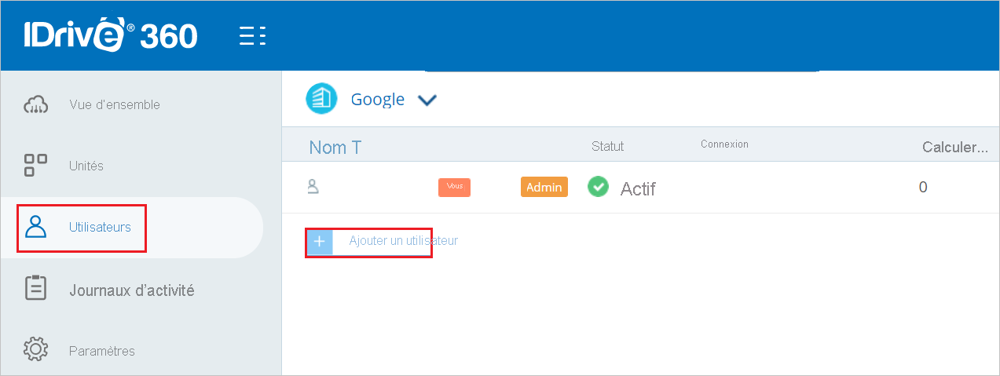
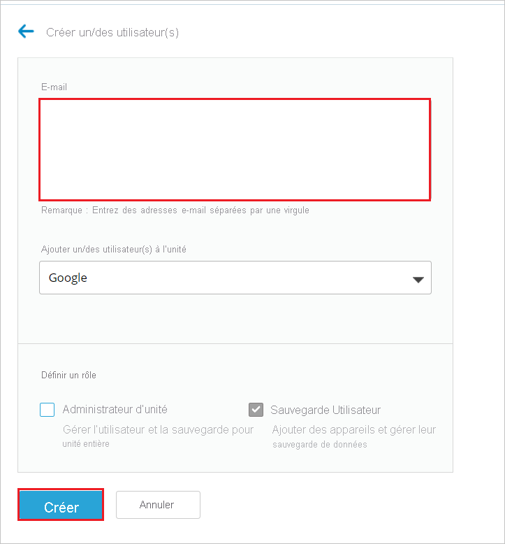

# Tutoriel : Intégration de l’authentification unique Azure Active Directory à IDrive360

Dans ce tutoriel, vous allez apprendre à intégrer IDrive360 à Azure Active Directory (Azure AD). Quand vous intégrez IDrive360 à Azure AD, vous pouvez :

* Contrôler qui a accès à IDrive360 dans Azure AD.
* Permettre à vos utilisateurs de se connecter automatiquement à IDrive360 avec leur compte Azure AD.
* Gérer vos comptes à un emplacement central : le Portail Azure.

## Prérequis

Pour commencer, vous devez disposer de ce qui suit :

* Un abonnement Azure AD Si vous ne disposez d’aucun abonnement, vous pouvez obtenir [un compte gratuit](https://azure.microsoft.com/free/).
* Un abonnement IDrive360 pour lequel l’authentification unique est activée

## Description du scénario

Dans ce tutoriel, vous allez configurer et tester l’authentification unique Azure AD dans un environnement de test.

* IDrive360 prend en charge l’authentification unique (SSO) lancée par **le fournisseur de services et le fournisseur d’identité**.

> [!NOTE]
> L’identificateur de cette application étant une valeur de chaîne fixe, une seule instance peut être configurée dans un locataire.

## Ajouter IDrive360 à partir de la galerie

Pour configurer l’intégration d’IDrive360 à Azure AD, vous devez ajouter IDrive360 à partir de la galerie à votre liste d’applications SaaS gérées.

1. Connectez-vous au portail Azure avec un compte professionnel ou scolaire ou avec un compte personnel Microsoft.
1. Dans le panneau de navigation gauche, sélectionnez le service **Azure Active Directory**.
1. Accédez à **Applications d’entreprise**, puis sélectionnez **Toutes les applications**.
1. Pour ajouter une nouvelle application, sélectionnez **Nouvelle application**.
1. Dans la section **Ajouter à partir de la galerie**, tapez **IDrive360** dans la zone de recherche.
1. Sélectionnez **IDrive360** dans le volet de résultats, puis ajoutez l’application. Patientez quelques secondes pendant que l’application est ajoutée à votre locataire.

## Configurer et tester l’authentification unique Azure AD pour IDrive360

Configurez et testez l’authentification unique Azure AD avec IDrive360 pour un utilisateur de test appelé **B.Simon**. Pour que l’authentification unique fonctionne, vous devez établir un lien entre un utilisateur Azure AD et l’utilisateur IDrive360 associé.

Pour configurer et tester l’authentification unique Azure AD avec IDrive360, effectuez les étapes suivantes :

1. **[Configurer l’authentification unique Azure AD](#configure-azure-ad-sso)** pour permettre à vos utilisateurs d’utiliser cette fonctionnalité.
    1. **[Créer un utilisateur de test Azure AD](#create-an-azure-ad-test-user)** pour tester l’authentification unique Azure AD avec B. Simon.
    1. **[Affecter l’utilisateur de test Azure AD](#assign-the-azure-ad-test-user)** pour permettre à B. Simon d’utiliser l’authentification unique Azure AD.
1. **[Configurer l’authentification unique IDrive360](#configure-idrive360-sso)** pour configurer les paramètres de l’authentification unique côté application.
    1. **[Créer un utilisateur de test IDrive360](#create-idrive360-test-user)** pour avoir un équivalent de B.Simon dans IDrive360, associé à sa représentation dans Azure AD.
1. **[Tester l’authentification unique](#test-sso)** pour vérifier si la configuration fonctionne.

## Configurer l’authentification unique Azure AD

Effectuez les étapes suivantes pour activer l’authentification unique Azure AD dans le Portail Azure.

1. Sur le portail Azure, accédez à la page d’intégration de l’application **IDrive360**, recherchez la section **Gérer** et sélectionnez **Authentification unique**.
1. Dans la page **Sélectionner une méthode d’authentification unique**, sélectionnez **SAML**.
1. Dans la page **Configurer l’authentification unique avec SAML**, cliquez sur l’icône de crayon de **Configuration SAML de base** afin de modifier les paramètres.

   

1. Dans la section **Configuration SAML de base**, l’utilisateur n’a rien à faire, car l’application est déjà intégrée à Azure.

1. Si vous souhaitez configurer l’application en **mode démarré par le fournisseur de services**, cliquez sur **Définir des URL supplémentaires**, puis effectuez les étapes suivantes :

    Dans la zone de texte **URL de connexion**, tapez l’URL : `https://www.idrive360.com/enterprise/sso`

1. Dans la page **Configurer l’authentification unique avec SAML**, dans la section **Certificat de signature SAML**, recherchez **Certificat (PEM)** , puis sélectionnez **Télécharger** pour télécharger le certificat et l’enregistrer sur votre ordinateur.

    

1. Dans la section **Configurer IDrive360**, copiez la ou les URL appropriées en fonction de vos besoins.

    

### Créer un utilisateur de test Azure AD

Dans cette section, vous allez créer un utilisateur de test appelé B. Simon dans le portail Azure.

1. Dans le volet gauche du Portail Azure, sélectionnez **Azure Active Directory**, **Utilisateurs**, puis **Tous les utilisateurs**.
1. Sélectionnez **Nouvel utilisateur** dans la partie supérieure de l’écran.
1. Dans les propriétés **Utilisateur**, effectuez les étapes suivantes :
   1. Dans le champ **Nom**, entrez `B.Simon`.  
   1. Dans le champ **Nom de l’utilisateur**, entrez username@companydomain.extension. Par exemple : `B.Simon@contoso.com`.
   1. Cochez la case **Afficher le mot de passe**, puis notez la valeur affichée dans le champ **Mot de passe**.
   1. Cliquez sur **Créer**.

### Affecter l’utilisateur de test Azure AD

Dans cette section, vous allez autoriser B.Simon à utiliser l’authentification unique Azure en lui accordant l’accès à IDrive360.

1. Dans le portail Azure, sélectionnez **Applications d’entreprise**, puis **Toutes les applications**.
1. Dans la liste des applications, sélectionnez **IDrive360**.
1. Dans la page de vue d’ensemble de l’application, recherchez la section **Gérer** et sélectionnez **Utilisateurs et groupes**.
1. Sélectionnez **Ajouter un utilisateur**, puis **Utilisateurs et groupes** dans la boîte de dialogue **Ajouter une attribution**.
1. Dans la boîte de dialogue **Utilisateurs et groupes**, sélectionnez **B. Simon** dans la liste Utilisateurs, puis cliquez sur le bouton **Sélectionner** au bas de l’écran.
1. Si vous attendez qu’un rôle soit attribué aux utilisateurs, vous pouvez le sélectionner dans la liste déroulante **Sélectionner un rôle** . Si aucun rôle n’a été configuré pour cette application, vous voyez le rôle « Accès par défaut » sélectionné.
1. Dans la boîte de dialogue **Ajouter une attribution**, cliquez sur le bouton **Attribuer**.

## Configurer l’authentification unique IDrive360

1. Connectez-vous à votre site d’entreprise IDrive360 en tant qu’administrateur.

2. Accédez à **Settings** > **Single Sign-on(SSO)** (Paramètres > Authentification unique) et procédez comme suit.

    

    a. Dans la zone de texte **SSO Name** (Nom de l’authentification unique), tapez un nom valide.
    
    b. Dans la zone de texte **URL de l’émetteur**, collez l’**Identificateur Azure AD** que vous avez copié sur le portail Azure.

    c. Dans la zone de texte **Point de terminaison SSO**, collez la valeur **URL de connexion** que vous avez copiée à partir du portail Azure.

    d. Cliquez sur **Upload Certificate** (Charger le certificat) pour charger le **certificat (PEM)** , que vous avez téléchargé à partir du portail Azure.

    e. Cliquez sur **Configure Single Sign-On** (Configurer l’authentification unique).

### Créer un utilisateur de test IDrive360

1. Dans une autre fenêtre de navigateur web, connectez-vous à votre site d’entreprise IDrive360 en tant qu’administrateur.

2. Accédez à l’onglet **Users** (Utilisateurs) et cliquez sur **Add User** (Ajouter un utilisateur).

    

3. Dans la section **Create new user(s)** (Créer un ou des utilisateurs), procédez comme suit.

    
     
    a. Entrez une **adresse e-mail** valide dans la zone de texte **Email**.

    b. Cliquez sur **Créer**.

## Tester l’authentification unique (SSO) 

Dans cette section, vous allez tester votre configuration de l’authentification unique Azure AD avec les options suivantes. 

#### Lancée par le fournisseur de services :

* Cliquez sur **Tester cette application** dans le portail Azure. Vous êtes alors redirigé vers l’URL de connexion à IDrive360, d’où vous pouvez lancer le flux de connexion.  

* Accédez directement à l’URL de connexion à IDrive360 pour lancer le flux de connexion.

#### Lancée par le fournisseur d’identité :

* Dans le portail Azure, cliquez sur **Tester cette application**. Vous êtes alors automatiquement connecté à l’instance d’IDrive360 pour laquelle vous avez configuré l’authentification unique. 

Vous pouvez aussi utiliser Mes applications de Microsoft pour tester l’application dans n’importe quel mode. Quand vous cliquez sur la vignette IDrive360 dans Mes applications, si le mode Fournisseur de services est configuré, vous êtes redirigé vers la page de connexion de l’application pour lancer le flux de connexion ; si le mode Fournisseur d’identité est configuré, vous êtes automatiquement connecté à l’instance d’IDrive360 pour laquelle vous avez configuré l’authentification unique. Pour plus d’informations sur Mes applications, consultez [Présentation de Mes applications](../user-help/my-apps-portal-end-user-access.md).

## Étapes suivantes

Une fois que vous avez configuré IDrive360, vous pouvez appliquer le contrôle de session, qui protège contre l’exfiltration et l’infiltration des données sensibles de votre organisation en temps réel. Le contrôle de session est étendu à partir de l’accès conditionnel. [Découvrez comment appliquer un contrôle de session avec Microsoft Cloud App Security](/cloud-app-security/proxy-deployment-aad).
