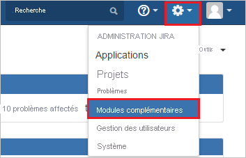
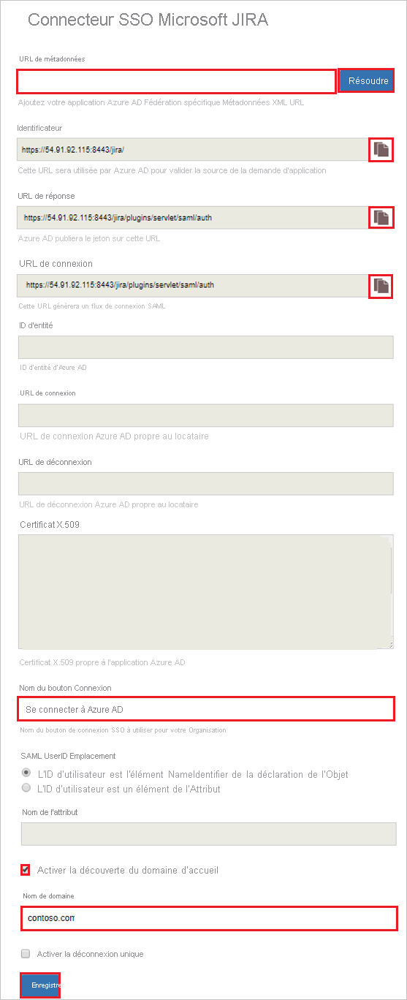
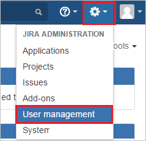
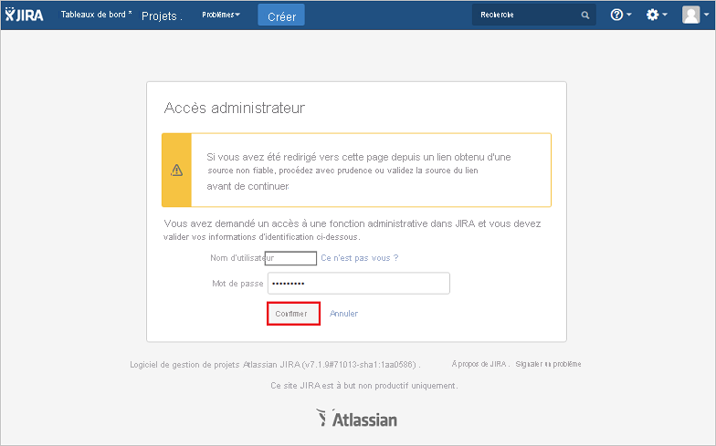

# Tutoriel : Intégration de l’authentification unique Azure AD (SSO) à JIRA SAML SSO by Microsoft (V5.2)

Dans ce tutoriel, vous allez apprendre à intégrer JIRA SAML SSO by Microsoft (v5.2) à Azure Active Directory (Azure AD). Quand vous intégrez JIRA SAML SSO by Microsoft (v5.2) à Azure AD, vous pouvez :

* Contrôler dans Azure AD qui a accès à JIRA SAML SSO by Microsoft (v5.2).
* Permettre à vos utilisateurs de se connecter automatiquement à JIRA SAML SSO by Microsoft (v5.2) avec leur compte Azure AD.
* Gérer vos comptes à un emplacement central : le Portail Azure.

## Description

Utilisez votre compte Microsoft Azure Active Directory avec le serveur Atlassian JIRA pour activer l’authentification unique. Ainsi, tous les utilisateurs de votre organisation peuvent utiliser les informations d’identification Azure Active Directory pour se connecter à l’application JIRA. Ce plug-in utilise SAML 2.0 pour la fédération.

## Conditions préalables requises

Pour configurer l’intégration d’Azure AD à JIRA SAML SSO by Microsoft (v5.2), vous aurez besoin des éléments suivants :

- Un abonnement Azure AD
- JIRA Core et Software 5.2 doivent être installés et configurés dans Windows version 64 bits.
- HTTPS est activé sur le serveur JIRA.
- Notez que les versions prises en charge par le plug-in JIRA sont mentionnées dans la section ci-dessous.
- Le serveur JIRA est accessible via Internet (en particulier la page de connexion Azure AD pour l’authentification) et doit pouvoir recevoir le jeton d’Azure AD.
- Les informations d’identification de l’administrateur sont configurées dans JIRA.
- WebSudo est désactivé dans JIRA.
- Un utilisateur test est créé dans l’application serveur JIRA.

> [!NOTE]
> Pour tester les étapes de ce didacticiel, nous déconseillons l’utilisation d’un environnement de production de JIRA. Testez d’abord l’intégration dans l’environnement de développement ou l’environnement intermédiaire de l’application, puis passez à l’environnement de production.

Vous devez en outre suivre les recommandations ci-dessous :

- N’utilisez pas votre environnement de production, sauf si cela est nécessaire.
- Un abonnement Azure AD Si vous ne disposez d’aucun abonnement, vous pouvez obtenir [un compte gratuit](https://azure.microsoft.com/free/).

## Versions de JIRA prises en charge

* JIRA Core et Software : 5.2.
* JIRA prend également en charge les versions 6.0 à 7.12. Pour plus d’informations, cliquez sur [JIRA SAML SSO by Microsoft](jiramicrosoft-tutorial.md).

> [!NOTE]
> Veuillez noter que notre plug-in JIRA fonctionnent également sur la version 16.04 de Ubuntu.

## Description du scénario

Dans ce didacticiel, vous configurez et testez l’authentification unique Azure AD dans un environnement de test.

* JIRA SAML SSO by Microsoft (v5.2) prend en charge l’authentification unique lancée par le **fournisseur de services**.

## Ajouter JIRA SAML SSO by Microsoft (v5.2) à partir de la galerie

Pour configurer l’intégration de JIRA SAML SSO by Microsoft (v5.2) à Azure AD, vous devez ajouter JIRA SAML SSO by Microsoft (v5.2) à votre liste d’applications SaaS gérées à partir de la galerie.

1. Connectez-vous au portail Azure avec un compte professionnel ou scolaire ou avec un compte personnel Microsoft.
1. Dans le panneau de navigation gauche, sélectionnez le service **Azure Active Directory**.
1. Accédez à **Applications d’entreprise**, puis sélectionnez **Toutes les applications**.
1. Pour ajouter une nouvelle application, sélectionnez **Nouvelle application**.
1. Dans la section **Ajouter à partir de la galerie**, tapez **JIRA SAML SSO by Microsoft (v5.2)** dans la zone de recherche.
1. Sélectionnez **JIRA SAML SSO by Microsoft (v5.2)** dans le volet de résultats, puis ajoutez l’application. Patientez quelques secondes pendant que l’application est ajoutée à votre locataire.

## Configurer et tester l’authentification unique Azure AD pour JIRA SAML SSO by Microsoft (v5.2)

Dans cette section, vous allez configurer et tester l’authentification unique Azure AD avec JIRA SAML SSO by Microsoft (v5.2) pour un utilisateur de test nommé **Britta Simon**. Pour que l’authentification unique fonctionne, vous devez établir une relation entre un utilisateur Azure AD et l’utilisateur JIRA SAML SSO by Microsoft (v5.2) associé.

Pour configurer et tester l’authentification unique Azure AD avec JIRA SAML SSO by Microsoft (v5.2), effectuez les étapes suivantes :

1. **[Configurer l’authentification unique Azure AD](#configure-azure-ad-sso)** pour permettre à vos utilisateurs d’utiliser cette fonctionnalité.
    1. **[Créer un utilisateur de test Azure AD](#create-an-azure-ad-test-user)** pour tester l’authentification unique Azure AD avec Britta Simon.
    1. **[Affecter l’utilisateur de test Azure AD](#assign-the-azure-ad-test-user)** pour permettre à Britta Simon d’utiliser l’authentification unique Azure AD.
2. **[Configurer l’authentification unique JIRA SAML SSO by Microsoft (v5.2)](#configure-jira-saml-sso-by-microsoft-v52-sso)** pour configurer les paramètres de l’authentification unique côté application.
    1. **[Créer un utilisateur de test JIRA SAML SSO by Microsoft (v5.2)](#create-jira-saml-sso-by-microsoft-v52-test-user)** pour avoir un équivalent de Britta Simon dans JIRA SAML SSO by Microsoft (v5.2), qui soit lié à la représentation Azure AD associée.
1. **[Tester l’authentification unique](#test-sso)** pour vérifier si la configuration fonctionne.

### Configurer l’authentification unique Azure AD

1. Dans le portail Azure, accédez à la page d’intégration de l’application **JIRA SAML SSO by Microsoft (v5.2)** , recherchez la section **Gérer** et sélectionnez **Authentification unique**.
1. Dans la page **Sélectionner une méthode d’authentification unique**, sélectionnez **SAML**.
1. Dans la page **Configurer l’authentification unique avec SAML**, cliquez sur l’icône de crayon pour **Configuration SAML de base** afin de modifier les paramètres.

   

4. Dans la section **Configuration SAML de base**, effectuez les étapes suivantes :

    a. Dans la zone de texte **Identificateur**, tapez une URL en utilisant le format suivant : `https://<domain:port>/`

    b. Dans la zone de texte **URL de réponse**, tapez une URL au format suivant : `https://<domain:port>/plugins/servlet/saml/auth`

    c. Dans la zone de texte **URL de connexion**, tapez une URL au format suivant : `https://<domain:port>/plugins/servlet/saml/auth`.

    > [!NOTE]
    > Il ne s’agit pas de valeurs réelles. Mettez à jour ces valeurs avec l’identificateur, l’URL de réponse et l’URL de connexion réels. Le port est facultatif s’il s’agit d’une URL nommée. Ces valeurs sont reçues durant la configuration du plug-in JIRA qui est décrite plus loin dans le didacticiel.

5. Dans la page **Configurer l’authentification unique avec SAML**, dans la section **Certificat de signature SAML**, cliquez sur le bouton Copier pour copier l’**URL des métadonnées de fédération d’application**, puis enregistrez-la sur votre ordinateur.

    

### Créer un utilisateur de test Azure AD

Dans cette section, vous allez créer un utilisateur de test appelé B. Simon dans le portail Azure.

1. Dans le volet gauche du Portail Azure, sélectionnez **Azure Active Directory**, **Utilisateurs**, puis **Tous les utilisateurs**.
1. Sélectionnez **Nouvel utilisateur** dans la partie supérieure de l’écran.
1. Dans les propriétés **Utilisateur**, effectuez les étapes suivantes :
    1. Dans le champ **Nom**, entrez `B.Simon`.  
    1. Dans le champ **Nom de l’utilisateur**, entrez username@companydomain.extension. Par exemple : `B.Simon@contoso.com`.
    1. Cochez la case **Afficher le mot de passe**, puis notez la valeur affichée dans le champ **Mot de passe**.
    1. Cliquez sur **Créer**.

### Affecter l’utilisateur de test Azure AD

Dans cette section, vous allez autoriser B.Simon à utiliser l’authentification unique Azure en lui accordant l’accès à JIRA SAML SSO by Microsoft (v5.2).

1. Dans le portail Azure, sélectionnez **Applications d’entreprise**, puis **Toutes les applications**.
1. Dans la liste des applications, sélectionnez **JIRA SAML SSO by Microsoft (v5.2)** .
1. Dans la page de vue d’ensemble de l’application, recherchez la section **Gérer** et sélectionnez **Utilisateurs et groupes**.
1. Sélectionnez **Ajouter un utilisateur**, puis **Utilisateurs et groupes** dans la boîte de dialogue **Ajouter une attribution**.
1. Dans la boîte de dialogue **Utilisateurs et groupes**, sélectionnez **B. Simon** dans la liste Utilisateurs, puis cliquez sur le bouton **Sélectionner** au bas de l’écran.
1. Si vous attendez qu’un rôle soit attribué aux utilisateurs, vous pouvez le sélectionner dans la liste déroulante **Sélectionner un rôle** . Si aucun rôle n’a été configuré pour cette application, vous voyez le rôle « Accès par défaut » sélectionné.
1. Dans la boîte de dialogue **Ajouter une attribution**, cliquez sur le bouton **Attribuer**.

## Configurer l’authentification unique JIRA SAML SSO by Microsoft (v5.2)

1. Dans une autre fenêtre de navigateur web, connectez-vous à votre instance JIRA en tant qu’administrateur.

2. Pointez sur le roue dentée, puis cliquez sur **Modules complémentaires**.

    

3. Sous l’onglet Add-ons (Modules complémentaires), cliquez sur **Manage add-ons** (Gérer les modules complémentaires).

    

4. Téléchargez le plug-in depuis le [Centre de téléchargement Microsoft](https://www.microsoft.com/download/details.aspx?id=56521). Chargez manuellement le plug-in fourni par Microsoft à l’aide du menu **Upload add-on** (Charger le module complémentaire). Le téléchargement du plug-in est couvert dans [Contrat de Services Microsoft](https://www.microsoft.com/servicesagreement/).

    

5. Une fois que le plug-in est installé, il s’affiche dans la section des modules complémentaires **User Installed** (Installé par l’utilisateur). Cliquez sur **Configurer** pour configurer le nouveau plug-in.

    

6. Effectuez les opérations suivantes dans la page de configuration :

    

    > [!TIP]
    > Vérifiez qu’un seul certificat est associé à l’application pour éviter toute erreur liée à la résolution des métadonnées. Si plusieurs certificats sont associés, l’administrateur verra un message d’erreur s’afficher lors de la résolution des métadonnées.

    a. Dans la zone de texte **URL des métadonnées**, collez la valeur **URL des métadonnées de fédération de l’application** que vous avez copiée sur le portail Azure, puis cliquez sur le bouton **Résoudre**. L’URL des métadonnées IdP est alors lue et tous les champs sont renseignés.

    b. Copiez les valeurs des champs **Identifier, Reply URL et Sign on URL**, puis collez-les dans les zones de texte **Identificateur, URL de réponse et URL de connexion** correspondantes dans la section **Configuration SAML de base** du portail Azure.

    c. Dans **Login Button Name** (Nom du bouton de connexion), tapez le nom du bouton que les utilisateurs doivent voir sur l’écran de connexion.

    d. Dans **SAML User ID Locations** (Emplacements de l’identificateur d’utilisateur SAML), sélectionnez **User ID is in the NameIdentifier element of the Subject statement** (L’ID utilisateur se trouve dans l’élément NameIdentifier de l’instruction Subject ) ou **User ID is in an Attribute element** (L’identificateur d’utilisateur se trouve dans l’élément Attribute).  Cet ID doit être l’ID d’utilisateur JIRA. Si aucun ID d’utilisateur correspondant n’est trouvé, le système n’autorise pas l’utilisateur à se connecter.

    > [!Note]
    > Par défaut, l’emplacement de l’identificateur d’utilisateur SAML est défini sur l’élément NameIdentifier. Vous pouvez remplacer cela par une option d’attribut et entrer le nom de l’attribut souhaité.

    e. Si vous sélectionnez l’option **User ID is in an Attribute element** (L’identificateur d’utilisateur se trouve dans l’élément Attribute), dans la zone de texte **Attribute name** (Nom de l’attribut), tapez le nom de l’attribut dans lequel l’ID d’utilisateur doit se trouver. 

    f. Si vous utilisez le domaine fédéré (AD FS, etc.) avec Azure AD, cochez l’option **Enable Home Realm Discovery** (Activer la détection de domaine d’accueil), puis entrez un nom de domaine sous **Domain Name**.

    g. Si la connexion est basée sur AD FS, tapez le nom du domaine dans le champ **Domain Name**.

    h. Cochez l’option **Enable Single Sign out** (Activer la déconnexion unique) si vous souhaitez qu’un utilisateur soit déconnecté d’Azure AD quand il se déconnecte de JIRA. 

    i. Cliquez sur **Enregistrer** pour enregistrer les paramètres.

    > [!NOTE]
    > Pour plus d’informations sur l’installation et la résolution des problèmes, consultez la page [Guide d’administration du connecteur d’authentification unique MS JIRA](./ms-confluence-jira-plugin-adminguide.md) et le [Forum aux questions](./ms-confluence-jira-plugin-adminguide.md).

### Créer un utilisateur de test JIRA SAML SSO by Microsoft (v5.2)

Les utilisateurs Azure AD doivent avoir été provisionnés dans le serveur local JIRA pour pouvoir s’y connecter.

**Pour approvisionner un compte d’utilisateur, procédez comme suit :**

1. Connectez-vous à votre serveur local JIRA en tant qu’administrateur.

2. Pointez sur la roue dentée, puis cliquez sur **Gestion des utilisateurs**.

    

3. Vous êtes redirigé vers la page d’accès administrateur dans laquelle vous entrez le **mot de passe**, puis cliquez sur le bouton **Confirmer**.

    

4. Sous l’onglet **User management** (Gestion des utilisateurs), cliquez sur **Create user** (Créer un utilisateur).

     

5. Dans la page de boîte de dialogue **Create New User** (Créer un utilisateur), procédez comme suit :

    

    a. Dans la zone de texte **Email address** (Adresse e-mail), tapez l’adresse e-mail d’un utilisateur, par exemple, Brittasimon@contoso.com.

    b. Dans la zone de texte **Full Name** (Nom complet), tapez le nom complet d’un utilisateur, par exemple, Britta Simon.

    c. Dans la zone de texte **Username** (Nom d’utilisateur), tapez l’e-mail d’un utilisateur, par exemple, Brittasimon@contoso.com.

    d. Dans la zone de texte **Password** (Mot de passe), tapez le mot de passe de l’utilisateur.

    e. Cliquez sur **Create User** (Créer un utilisateur).

## Tester l’authentification unique (SSO)

Dans cette section, vous allez tester votre configuration de l’authentification unique Azure AD avec les options suivantes. 

* Cliquez sur **Tester cette application** dans le portail Azure. Cette opération redirige vers l’URL de connexion JIRA SAML SSO by Microsoft (v5.2), où vous pouvez lancer le processus de connexion. 

* Accédez directement à l’URL de connexion JIRA SAML SSO by Microsoft (v5.2) pour y lancer le processus de connexion.

* Vous pouvez utiliser Mes applications de Microsoft. Le fait de cliquer sur la vignette JIRA SAML SSO by Microsoft (v5.2) dans Mes applications vous redirige vers l’URL de connexion JIRA SAML SSO by Microsoft (v5.2). Pour plus d’informations sur Mes applications, consultez [Présentation de Mes applications](https://support.microsoft.com/account-billing/sign-in-and-start-apps-from-the-my-apps-portal-2f3b1bae-0e5a-4a86-a33e-876fbd2a4510).

## Étapes suivantes

Après avoir configuré JIRA SAML SSO by Microsoft (v5.2), vous pouvez appliquer le contrôle de session, qui protège contre l’exfiltration et l’infiltration des données sensibles de votre organisation en temps réel. Le contrôle de session est étendu à partir de l’accès conditionnel. [Découvrez comment appliquer un contrôle de session avec Microsoft Cloud App Security](/cloud-app-security/proxy-deployment-aad).