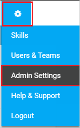
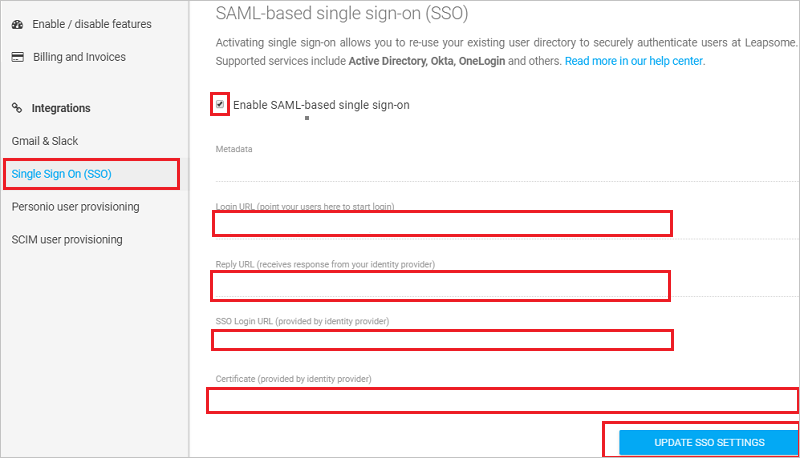

# Tutoriel : Intégration de l’authentification unique Azure Active Directory à Leapsome

Ce tutoriel explique comment intégrer Leapsome avec Azure Active Directory (Azure AD). Quand vous intégrez Leapsome avec Azure AD, vous pouvez :

* Contrôler dans Azure AD qui a accès à Leapsome.
* Permettre à vos utilisateurs de se connecter automatiquement à Leapsome avec leur compte Azure AD.
* Gérer vos comptes à un emplacement central : le Portail Azure.

## Prérequis

Pour commencer, vous devez disposer de ce qui suit :

* Un abonnement Azure AD Si vous ne disposez d’aucun abonnement, vous pouvez obtenir [un compte gratuit](https://azure.microsoft.com/free/).
* Abonnement Leapsome pour lequel l’authentification unique (SSO) est activée.

## Description du scénario

Dans ce tutoriel, vous allez configurer et tester l’authentification unique Azure AD dans un environnement de test.

* Leapsome prend en charge l’authentification unique lancée par **le fournisseur de services et le fournisseur d’identité**.
* Leapsome prend en charge le [provisionnement d’utilisateurs automatisé](leapsome-provisioning-tutorial.md).

> [!NOTE]
> L’identificateur de cette application étant une valeur de chaîne fixe, une seule instance peut être configurée dans un locataire.

## Ajouter Leapsome à partir de la galerie

Pour configurer l’intégration de Leapsome à Azure AD, vous devez ajouter Leapsome à votre liste d’applications SaaS gérées, à partir de la galerie.

1. Connectez-vous au portail Azure avec un compte professionnel ou scolaire ou avec un compte personnel Microsoft.
1. Dans le panneau de navigation gauche, sélectionnez le service **Azure Active Directory**.
1. Accédez à **Applications d’entreprise**, puis sélectionnez **Toutes les applications**.
1. Pour ajouter une nouvelle application, sélectionnez **Nouvelle application**.
1. Dans la section **Ajouter à partir de la galerie**, tapez **Leapsome** dans la zone de recherche.
1. Sélectionnez **Leapsome** dans le volet de résultats, puis ajoutez l’application. Patientez quelques secondes pendant que l’application est ajoutée à votre locataire.

## Configurer et tester l’authentification unique Azure AD pour Leapsome

Configurez et testez l’authentification unique Azure AD avec Leapsome à l’aide d’un utilisateur de test appelé **B.Simon**. Pour que l’authentification unique fonctionne, vous devez établir un lien entre un utilisateur Azure AD et l’utilisateur Leapsome associé.

Pour configurer et tester l’authentification unique Azure AD avec Leapsome, vous devez suivre les étapes suivantes :

1. **[Configurer l’authentification unique Azure AD](#configure-azure-ad-sso)** pour permettre à vos utilisateurs d’utiliser cette fonctionnalité.
    1. **[Créer un utilisateur de test Azure AD](#create-an-azure-ad-test-user)** pour tester l’authentification unique Azure AD avec B. Simon.
    1. **[Affecter l’utilisateur de test Azure AD](#assign-the-azure-ad-test-user)** pour permettre à B. Simon d’utiliser l’authentification unique Azure AD.
1. **[Configurer l’authentification unique Leapsome](#configure-leapsome-sso)** – pour configurer les paramètres d’authentification unique côté application.
    1. **[Créer un utilisateur de test Leapsome](#create-leapsome-test-user)** – pour avoir un équivalent de B.Simon dans Leapsome qui soit lié à la représentation Azure AD de l’utilisateur.
1. **[Tester l’authentification unique](#test-sso)** pour vérifier si la configuration fonctionne.

## Configurer l’authentification unique Azure AD

Effectuez les étapes suivantes pour activer l’authentification unique Azure AD dans le Portail Azure.

1. Dans le portail Azure, accédez à la page d’intégration de l’application **Leapsome**, recherchez la section **Gérer** et sélectionnez **Authentification unique**.
1. Dans la page **Sélectionner une méthode d’authentification unique**, sélectionnez **SAML**.
1. Dans la page **Configurer l’authentification unique avec SAML**, cliquez sur l’icône de crayon de **Configuration SAML de base** afin de modifier les paramètres.

   

1. Dans la section **Configuration SAML de base**, si vous souhaitez configurer l’application en mode lancé par le **fournisseur d’identité**, effectuez les étapes suivantes :

    a. Dans la zone de texte **Identificateur**, tapez une l’URL : `https://www.leapsome.com`

    b. Dans la zone de texte **URL de réponse**, tapez une URL au format suivant : `https://www.leapsome.com/api/users/auth/saml/<CLIENTID>/assert`

1. Si vous souhaitez configurer l’application en **mode démarré par le fournisseur de services**, cliquez sur **Définir des URL supplémentaires**, puis effectuez les étapes suivantes :

    Dans la zone de texte **URL de connexion**, tapez une URL au format suivant : `https://www.leapsome.com/api/users/auth/saml/<CLIENTID>/login`

    > [!NOTE]
    > Les valeurs URL de réponse et URL de connexion ci-dessus ne sont pas de vraies valeurs. Vous devrez les remplacer par les valeurs réelles. La procédure est expliquée plus loin dans le tutoriel.

1. L’application Leapsome attend les assertions SAML dans un format spécifique, ce qui vous oblige à ajouter des mappages d’attributs personnalisés à votre configuration des attributs de jeton SAML. La capture d’écran suivante montre la liste des attributs par défaut.

    

1. En plus de ce qui précède, l’application Leapsome s’attend à ce que quelques attributs supplémentaires soient repassés dans la réponse SAML. Ces attributs sont également préremplis, mais vous pouvez les examiner pour voir s’ils répondent à vos besoins.

    | Nom | Attribut source | Espace de noms |
    | ---------------| --------------- | --------- |  
    | firstname | user.givenname | http://schemas.xmlsoap.org/ws/2005/05/identity/claims |
    | lastname | user.surname | http://schemas.xmlsoap.org/ws/2005/05/identity/claims |
    | title | user.jobtitle | http://schemas.xmlsoap.org/ws/2005/05/identity/claims |
    | picture | URL de la photo de l’employé | http://schemas.xmlsoap.org/ws/2005/05/identity/claims |
    | | |

    > [!Note]
    > La valeur de l’attribut picture n’est pas réelle. Pour cette valeur, fournissez la vraie URL de photo. Pour obtenir cette valeur, contactez [l’équipe du support technique Leapsome](mailto:support@leapsome.com).

1. Dans la page **Configurer l’authentification unique avec SAML**, dans la section **Certificat de signature SAML**, recherchez **Certificat (en base64)** , puis sélectionnez **Télécharger** pour télécharger le certificat et l’enregistrer sur votre ordinateur.

    

1. Dans la section **Configurer Leapsome**, copiez la ou les URL appropriées en fonction de vos besoins.

    

### Créer un utilisateur de test Azure AD

Dans cette section, vous allez créer un utilisateur de test appelé B. Simon dans le portail Azure.

1. Dans le volet gauche du Portail Azure, sélectionnez **Azure Active Directory**, **Utilisateurs**, puis **Tous les utilisateurs**.
1. Sélectionnez **Nouvel utilisateur** dans la partie supérieure de l’écran.
1. Dans les propriétés **Utilisateur**, effectuez les étapes suivantes :
   1. Dans le champ **Nom**, entrez `B.Simon`.  
   1. Dans le champ **Nom de l’utilisateur**, entrez username@companydomain.extension. Par exemple : `B.Simon@contoso.com`.
   1. Cochez la case **Afficher le mot de passe**, puis notez la valeur affichée dans le champ **Mot de passe**.
   1. Cliquez sur **Créer**.

### Affecter l’utilisateur de test Azure AD

Dans cette section, vous allez autoriser B.Simon à utiliser l’authentification unique Azure en lui accordant l’accès à Leapsome.

1. Dans le portail Azure, sélectionnez **Applications d’entreprise**, puis **Toutes les applications**.
1. Dans la liste des applications, sélectionnez **Leapsome**.
1. Dans la page de vue d’ensemble de l’application, recherchez la section **Gérer** et sélectionnez **Utilisateurs et groupes**.
1. Sélectionnez **Ajouter un utilisateur**, puis **Utilisateurs et groupes** dans la boîte de dialogue **Ajouter une attribution**.
1. Dans la boîte de dialogue **Utilisateurs et groupes**, sélectionnez **B. Simon** dans la liste Utilisateurs, puis cliquez sur le bouton **Sélectionner** au bas de l’écran.
1. Si vous attendez qu’un rôle soit attribué aux utilisateurs, vous pouvez le sélectionner dans la liste déroulante **Sélectionner un rôle** . Si aucun rôle n’a été configuré pour cette application, le rôle Accès par défaut est sélectionné
1. Dans la boîte de dialogue **Ajouter une attribution**, cliquez sur le bouton **Attribuer**.

## Configurer l’authentification unique Leapsome

1. Dans une autre fenêtre de navigateur web, connectez-vous à Leapsome en tant qu’administrateur de la sécurité.

1. Dans le coin supérieur droit, cliquez sur le logo Paramètres, puis cliquez sur **Admin Settings** (Paramètres d’administration).

    

1. Dans la barre de menu de gauche, cliquez sur **Single Sign On (SSO)** (Authentification unique), puis, dans la page **SAML-based single sign-on (SSO)** (Authentification unique SAML), procédez aux étapes suivantes :

    

    a. Sélectionnez **Enable SAML-based single sign-on** (Activer l’authentification unique SAML).

    b. Copiez la valeur de **Login URL (point your users here to start login)** (URL de connexion (à indiquer aux utilisateurs pour démarrer la connexion)), puis collez-la dans la zone de texte **Sign-on URL** (URL de connexion) de la section **Basic SAML Configuration** (Configuration SAML de base) du portail Azure.

    c. Copiez la valeur de **Reply URL (receives response from your identity provider)** (URL de réponse [réponse reçue du fournisseur d’identité]), puis collez-la dans la zone de texte **Reply URL** (URL de réponse) de la section **Basic SAML Configuration** (Configuration SAML de base) du portail Azure.

    d. Dans la zone de texte **SSO Login URL (provided by identity provider)** (URL de connexion SSO - fournie par le fournisseur d'identité), collez la valeur de **Login URL** (URL de connexion) que vous avez copiée à partir du portail Azure.

    e. Copiez le certificat que vous avez téléchargé à partir du portail Azure sans les commentaires `--BEGIN CERTIFICATE and END CERTIFICATE--`, puis collez-le dans la zone de texte **Certificate (provided by identity provider)** [(Certificat (fourni par le fournisseur d'identité))].

    f. Cliquez sur **Update SSO Settings** (Mettre à jour les paramètres SSO).

### Créer un utilisateur de test Leapsome

Dans cette section, vous allez créer un utilisateur appelé Britta Simon dans Leapsome. Rapprochez-vous de l’[équipe du support technique Leapsome](mailto:support@leapsome.com) pour ajouter les utilisateurs ou le domaine à mettre sur liste verte sur la plateforme Leapsome. Si le domaine est ajouté par l’équipe, les utilisateurs sont automatiquement provisionnés dans la plateforme Leapsome. Les utilisateurs doivent être créés et activés avant que vous utilisiez l’authentification unique.

Leapsome prend aussi en charge le provisionnement automatique d’utilisateurs ; vous trouverez plus d’informations [ici](./leapsome-provisioning-tutorial.md) sur la manière de configurer ce dernier.

## Tester l’authentification unique (SSO)

Dans cette section, vous allez tester votre configuration de l’authentification unique Azure AD avec les options suivantes. 

#### Lancée par le fournisseur de services :

* Cliquez sur **Tester cette application** dans le portail Azure. Vous êtes alors redirigé vers l’URL de connexion à Leapsome, d’où vous pouvez lancer le flux de connexion.  

* Accédez directement à l’URL de connexion à Leapsome pour lancer le flux de connexion.

#### Lancée par le fournisseur d’identité :

* Dans le portail Azure, cliquez sur **Tester cette application**. Vous êtes alors automatiquement connecté à l’instance Leapsome pour laquelle vous avez configuré l’authentification unique. 

Vous pouvez aussi utiliser Mes applications de Microsoft pour tester l’application dans n’importe quel mode. Si, quand vous cliquez sur la vignette Leapsome dans Mes applications, le mode Fournisseur de services est configuré, vous êtes redirigé vers la page de connexion de l’application pour lancer le flux de connexion ; si c’est le mode Fournisseur d’identité qui est configuré, vous êtes automatiquement connecté à l’instance de Leapsome pour laquelle vous avez configuré l’authentification unique. Pour plus d’informations sur Mes applications, consultez [Présentation de Mes applications](https://support.microsoft.com/account-billing/sign-in-and-start-apps-from-the-my-apps-portal-2f3b1bae-0e5a-4a86-a33e-876fbd2a4510).

## Étapes suivantes

Une fois que vous avez configuré Leapsome, vous pouvez appliquer le contrôle de session, qui protège contre l’exfiltration et l’infiltration des données sensibles de votre organisation en temps réel. Le contrôle de session est étendu à partir de l’accès conditionnel. [Découvrez comment appliquer un contrôle de session avec Microsoft Defender for Cloud Apps](/cloud-app-security/proxy-deployment-aad).
