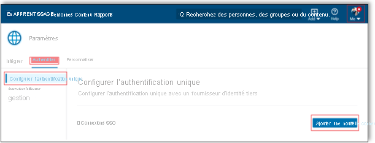
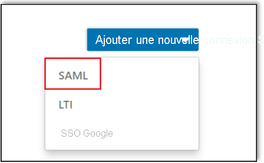
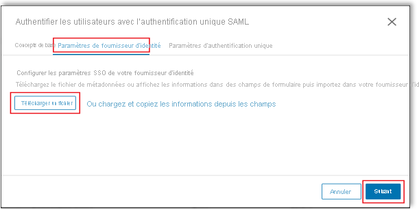
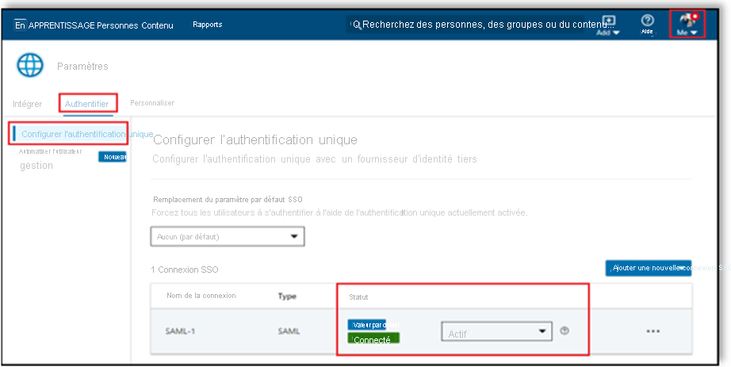
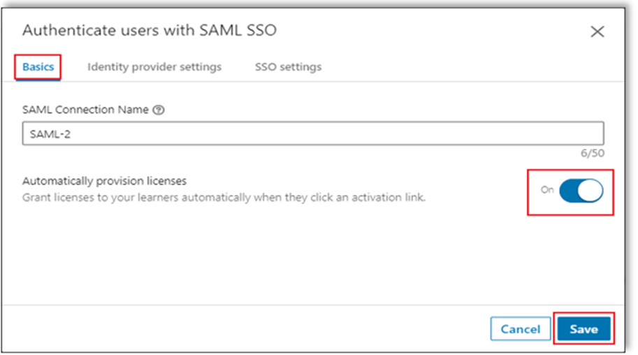

# Tutoriel : Intégration de l’authentification unique Azure AD à LinkedIn Learning

Dans ce tutoriel, vous allez apprendre à intégrer LinkedIn Learning à Azure AD (Azure Active Directory). Quand vous intégrez LinkedIn Learning à Azure AD, vous pouvez :

* Contrôler dans Azure AD qui a accès à LinkedIn Learning.
* Permettre à vos utilisateurs de se connecter automatiquement à LinkedIn Learning avec leur compte Azure AD.
* Gérer vos comptes à un emplacement central : le Portail Azure.

## Prérequis

Pour commencer, vous devez disposer de ce qui suit :

* Un abonnement Azure AD Si vous ne disposez d’aucun abonnement, vous pouvez obtenir [un compte gratuit](https://azure.microsoft.com/free/).
* Un abonnement LinkedIn Learning pour lequel l’authentification unique est activée.

## Description du scénario

Dans ce tutoriel, vous allez configurer et tester l’authentification unique Azure AD dans un environnement de test.

* LinkedIn Learning prend en charge l’authentification unique initiée par le **fournisseur de services et le fournisseur d’identité**.
* LinkedIn Learning prend en charge l’attribution d’utilisateurs **Juste-à-temps**.
* LinkedIn Learning prend en charge l’[attribution automatique d’utilisateurs](linkedin-learning-provisioning-tutorial.md).

## Ajouter LinkedIn Learning à partir de la galerie

Pour configurer l’intégration de LinkedIn Learning à Azure AD, vous devez ajouter LinkedIn Learning à votre liste d’applications SaaS gérées à partir de la galerie.

1. Connectez-vous au portail Azure avec un compte professionnel ou scolaire ou avec un compte personnel Microsoft.
1. Dans le panneau de navigation gauche, sélectionnez le service **Azure Active Directory**.
1. Accédez à **Applications d’entreprise**, puis sélectionnez **Toutes les applications**.
1. Pour ajouter une nouvelle application, sélectionnez **Nouvelle application**.
1. Dans la section **Ajouter à partir de la galerie**, tapez **LinkedIn Learning** dans la zone de recherche.
1. Sélectionnez **LinkedIn Learning** dans le volet de résultats, puis ajoutez l’application. Patientez quelques secondes pendant que l’application est ajoutée à votre locataire.

## Configurer et tester l’authentification unique Azure AD pour LinkedIn Learning

Configurez et testez l’authentification unique Azure AD avec LinkedIn Learning pour un utilisateur de test nommé **B.Simon**. Pour que l’authentification unique fonctionne, vous devez établir un lien entre un utilisateur Azure AD et l’utilisateur LinkedIn Learning associé.

Pour configurer et tester l’authentification unique Azure AD avec LinkedIn Learning, effectuez les étapes suivantes :

1. **[Configurer l’authentification unique Azure AD](#configure-azure-ad-sso)** pour permettre à vos utilisateurs d’utiliser cette fonctionnalité.
    1. **[Créer un utilisateur de test Azure AD](#create-an-azure-ad-test-user)** pour tester l’authentification unique Azure AD avec B. Simon.
    1. **[Affecter l’utilisateur de test Azure AD](#assign-the-azure-ad-test-user)** pour permettre à B. Simon d’utiliser l’authentification unique Azure AD.
1. **[Configurer l’authentification unique LinkedIn Learning](#configure-linkedin-learning-sso)** pour configurer les paramètres de l’authentification unique côté application.
    1. **[Attribuer des licences](#assign-licenses)** pour avoir un équivalent de B.Simon dans LinkedIn Learning lié à la représentation Azure AD associée.
1. **[Tester l’authentification unique](#test-sso)** pour vérifier si la configuration fonctionne.

## Configurer l’authentification unique Azure AD

Effectuez les étapes suivantes pour activer l’authentification unique Azure AD dans le Portail Azure.

1. Dans le portail Azure, accédez à la page d’intégration de l’application **LinkedIn Learning**, recherchez la section **Gérer** et sélectionnez **Authentification unique**.
1. Dans la page **Sélectionner une méthode d’authentification unique**, sélectionnez **SAML**.
1. Dans la page **Configurer l’authentification unique avec SAML**, cliquez sur l’icône de crayon de **Configuration SAML de base** afin de modifier les paramètres.

   

1. Dans la section **Configuration SAML de base**, si vous souhaitez configurer l’application en mode lancé par le **fournisseur d’identité**, effectuez les étapes suivantes :

    a. Dans la zone de texte **Identificateur**, saisissez **l’ID d’entité** copié à partir du portail LinkedIn. 

    b. Dans la zone de texte **URL de réponse**, saisissez **l’URL ACS** copiée à partir du portail LinkedIn.

    c. Si vous souhaitez configurer l’application en mode **initiée par le fournisseur de services**, cliquez sur l’option **Définir des URL supplémentaires** dans la section **Configuration SAML de base** où vous indiquerez votre URL de connexion. Pour créer votre URL de connexion, copiez l’**URL ACS (Assertion consumer service)** et remplacez /saml/ par /login/. Une fois cette opération effectuée, l’URL de connexion doit avoir le format suivant :

    `https://www.linkedin.com/checkpoint/enterprise/login/<AccountId>?application=learning&applicationInstanceId=<InstanceId>`

    > [!NOTE]
    > Il ne s’agit pas de valeurs réelles. Vous mettrez à jour ces valeurs avec l’identificateur et l’URL de réponse et l’URL de connexion réels, tel qu’expliqué dans la section **Configurer l’authentification unique LinkedIn Learning** de ce didacticiel.

1. L’application LinkedIn Learning attend les assertions SAML dans un format spécifique, ce qui vous oblige à ajouter des mappages d’attributs personnalisés à votre configuration Attributs du jeton SAML. La capture d’écran suivante montre la liste des attributs par défaut, où **nameidentifier** est mappé avec **user.userprincipalname**. L’application LinkedIn Learning s’attend à ce que **nameidentifier** soit mappé avec **user.mail**. Vous devez donc modifier le mappage d’attribut en cliquant sur l’icône **Modifier**.

    

1. Dans la page **Configurer l’authentification unique avec SAML**, dans la section **Certificat de signature SAML**, recherchez **XML de métadonnées de fédération** et sélectionnez **Télécharger** pour télécharger le certificat et l’enregistrer sur votre ordinateur.

    

1. Dans la section **Configurer LinkedIn Learning**, copiez l’URL ou les URL appropriées en fonction de vos besoins.

    

### Créer un utilisateur de test Azure AD

Dans cette section, vous allez créer un utilisateur de test appelé B. Simon dans le portail Azure.

1. Dans le volet gauche du Portail Azure, sélectionnez **Azure Active Directory**, **Utilisateurs**, puis **Tous les utilisateurs**.
1. Sélectionnez **Nouvel utilisateur** dans la partie supérieure de l’écran.
1. Dans les propriétés **Utilisateur**, effectuez les étapes suivantes :
   1. Dans le champ **Nom**, entrez `B.Simon`.  
   1. Dans le champ **Nom de l’utilisateur**, entrez username@companydomain.extension. Par exemple : `B.Simon@contoso.com`.
   1. Cochez la case **Afficher le mot de passe**, puis notez la valeur affichée dans le champ **Mot de passe**.
   1. Cliquez sur **Créer**.

### Affecter l’utilisateur de test Azure AD

Dans cette section, vous allez autoriser B.Simon à utiliser l’authentification unique Azure en accordant l’accès à LinkedIn Learning.

1. Dans le portail Azure, sélectionnez **Applications d’entreprise**, puis **Toutes les applications**.
1. Dans la liste des applications, sélectionnez **LinkedIn Learning**.
1. Dans la page de vue d’ensemble de l’application, recherchez la section **Gérer** et sélectionnez **Utilisateurs et groupes**.
1. Sélectionnez **Ajouter un utilisateur**, puis **Utilisateurs et groupes** dans la boîte de dialogue **Ajouter une attribution**.
1. Dans la boîte de dialogue **Utilisateurs et groupes**, sélectionnez **B. Simon** dans la liste Utilisateurs, puis cliquez sur le bouton **Sélectionner** au bas de l’écran.
1. Si vous attendez qu’un rôle soit attribué aux utilisateurs, vous pouvez le sélectionner dans la liste déroulante **Sélectionner un rôle** . Si aucun rôle n’a été configuré pour cette application, vous voyez le rôle « Accès par défaut » sélectionné.
1. Dans la boîte de dialogue **Ajouter une attribution**, cliquez sur le bouton **Attribuer**.

## Configurer l’authentification unique LinkedIn Learning

1. Connectez-vous au site d’entreprise LinkedIn Learning en tant qu’administrateur.

1. Sélectionnez **Accéder à l’administrateur** > **Moi** > **S’authentifier**. 

     

1. Sélectionnez **Configurer l’authentification unique** sous **Authentification**, puis cliquez sur **Ajouter une nouvelle authentification unique**.    

    

1. Sélectionnez **SAML** dans la liste déroulante **Ajouter une nouvelle authentification unique**.

    

1. Sous l’onglet **Notions de base**, entrez le nom de la **connexion SAML**, puis cliquez sur **Suivant**.

    

1. Accédez à l’onglet **Paramètres du fournisseur d’identité**, cliquez sur **Télécharger le fichier** pour télécharger le fichier de métadonnées et enregistrez-le sur votre ordinateur, puis cliquez sur **Suivant**.

    

    > [!NOTE]    
    > Vous ne pourrez peut-être pas importer ce fichier dans votre fournisseur d’identité. Par exemple, Okta n’a pas cette fonctionnalité. Si ce cas correspond à vos exigences de configuration, continuez à travailler avec des champs individuels.

1. Dans l’onglet **Paramètres du fournisseur d’identité**, cliquez sur **Charger et copier les informations des champs** pour copier les champs requis et coller dans la section **Configuration SAML de base** à partir du portail Azure puis cliquez sur **Suivant**.

    

1. Accédez à l’onglet **Paramètres d’authentification unique**, cliquez sur **Télécharger un fichier XML** pour télécharger le fichier **Federation Metadata XML** que vous avez téléchargé à partir du portail Azure.

    

1. Renseignez manuellement les champs requis que vous avez copiés à partir du portail Azure sous l’onglet **Paramètres d’authentification unique**.

    

1. Sous **Paramètres d’authentification unique**, sélectionnez vos options d’authentification unique en fonction de vos besoins, puis cliquez sur **Enregistrer**.

    

#### Activation de l'authentification unique

Une fois la configuration terminée, activez l’authentification unique en sélectionnant **Actif** dans la liste déroulante de l’état de l’authentification unique.

  

### Affecter des licences

Une fois que vous avez activé l’authentification unique, vous pouvez attribuer automatiquement des licences à vos employés en basculant **Approvisionner automatiquement des licences** sur **Activé**, puis en cliquant sur **Enregistrer**. Lorsque vous activez cette option, les utilisateurs reçoivent automatiquement une licence lorsqu’ils sont authentifiés pour la première fois.

   

> [!NOTE]   
> Si vous n’activez pas cette option, un administrateur doit ajouter manuellement des utilisateurs dans l’onglet personnes. LinkedIn Learning identifie les utilisateurs par leur adresse d’e-mail.

## Tester l’authentification unique (SSO) 

Dans cette section, vous allez tester votre configuration de l’authentification unique Azure AD avec les options suivantes. 

#### Lancée par le fournisseur de services :

* Cliquez sur **Tester cette application** dans le portail Azure. Vous êtes alors redirigé vers l’URL de connexion LinkedIn Learning où vous pouvez lancer le flux de connexion.  

* Accédez directement à l’URL de connexion LinkedIn Learning et démarrez le flux de connexion.

#### Lancée par le fournisseur d’identité :

* Cliquez sur **Tester cette application** dans le portail Azure : vous devez être connecté automatiquement à l’instance de LinkedIn Learning pour laquelle vous avez configuré l’authentification unique. 

Vous pouvez aussi utiliser Mes applications de Microsoft pour tester l’application dans n’importe quel mode. Si, quand vous cliquez sur la vignette LinkedIn Learning dans Mes applications, le mode Fournisseur de services est configuré, vous êtes redirigé vers la page de connexion de l’application pour lancer le flux de connexion ; s’il s’agit du mode Fournisseur d’identité, vous êtes automatiquement connecté à l’instance LinkedIn Learning pour laquelle vous avez configuré l’authentification unique. Pour plus d’informations sur Mes applications, consultez [Présentation de Mes applications](https://support.microsoft.com/account-billing/sign-in-and-start-apps-from-the-my-apps-portal-2f3b1bae-0e5a-4a86-a33e-876fbd2a4510).

## Étapes suivantes

Après avoir configuré LinkedIn Learning, vous pouvez appliquer le contrôle de session, qui protège contre l’exfiltration et l’infiltration des données sensibles de votre organisation en temps réel. Le contrôle de session est étendu à partir de l’accès conditionnel. [Découvrez comment appliquer un contrôle de session avec Microsoft Defender for Cloud Apps](/cloud-app-security/proxy-deployment-aad).
