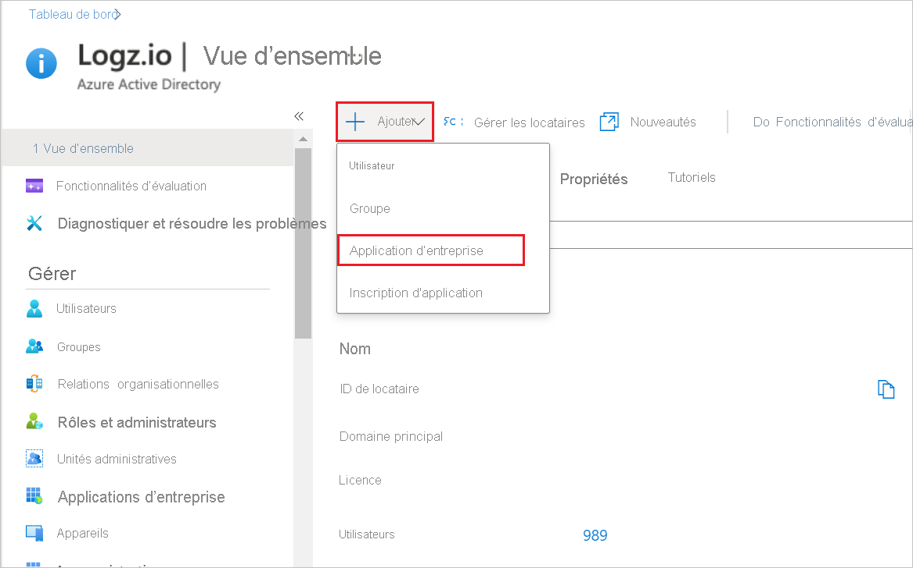
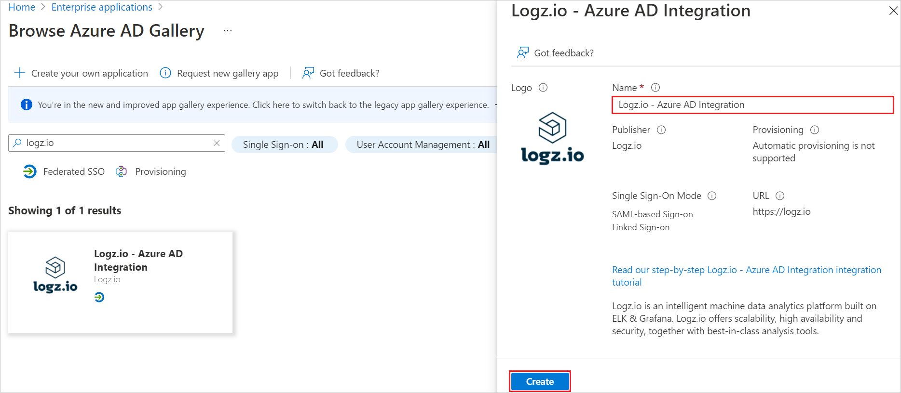
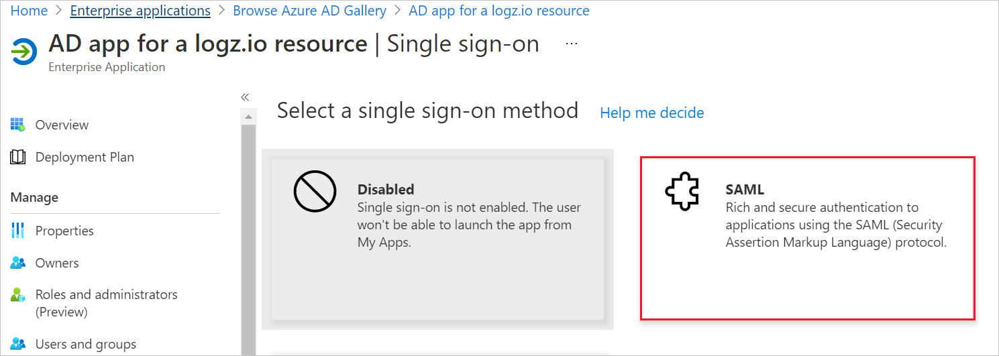
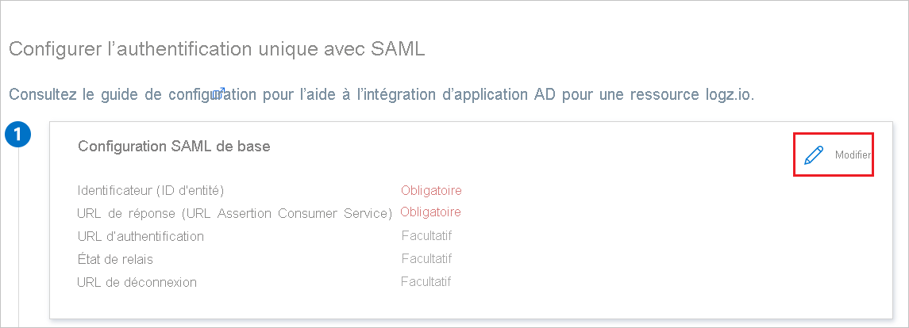
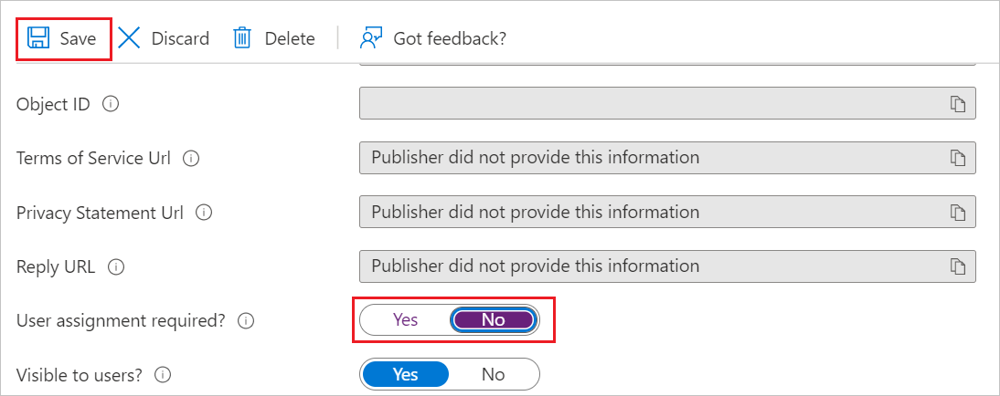
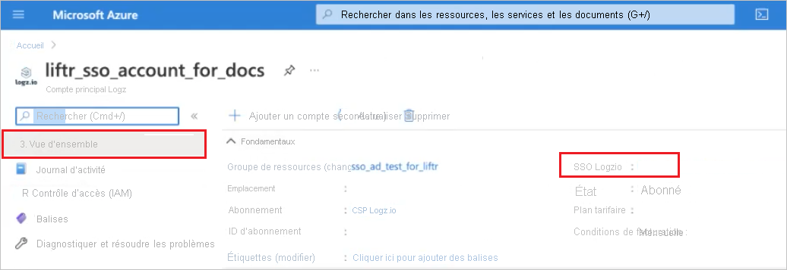

# Tutoriel : Configuration de l’authentification unique Azure Active Directory pour Logz.io - Azure AD Integration

## Authentification unique pour l’intégration entre Logz.io et le portail Azure

Logz.io s’intègre à la Place de marché Azure. Cette rubrique fournit des conseils aux administrateurs afin de configurer l’authentification unique pour l’intégration entre Logz.io et le portail Azure, qui active un lien d’authentification unique pour les utilisateurs qui accèdent aux ressources Logz.io via la Place de marché Microsoft Azure.

### Avantages

Avantages de l’accès des utilisateurs à la ressource Azure Logz.io par le biais de l’authentification unique : 

+ Inutile de prédéfinir un nom d’utilisateur et un mot de passe uniques pour chaque utilisateur : tout utilisateur qui a le lien d’authentification unique peut se connecter à l’application.
+ Meilleur contrôle utilisateur : un utilisateur doit être défini dans le compte Azure pour pouvoir utiliser le lien d’authentification unique.

Préparez la connectivité de l’authentification unique avant de configurer la ressource Azure pour Logz.io. Vous aurez besoin des informations d’identification que vous créez dans ce processus pour configurer la ressource. 

### Création de la connectivité de l’authentification unique pour votre ressource Logz.io dans Azure Active Directory 

Vous allez créer une application d’entreprise Azure Active Directory (AD) pour vous permettre d’utiliser l’authentification unique afin de vous connecter à votre compte Logz.io à partir de votre ressource Azure. 

### Prérequis : 

Pour commencer, vous avez besoin des privilèges suivants :

* Accès à Azure Active Directory (AAD)
* Autorisations de créer une application d’entreprise
* Autorisations du rôle Propriétaire pour l’abonnement Azure pour lequel vous créez la ressource Logz.io 

Pour pouvoir accéder au lien d’authentification unique créé pour une ressource d’intégration entre Logz.io et Azure, et l’utiliser, les utilisateurs doivent être définis dans le compte Azure associé. 

#### Configuration d’un lien d’authentification unique pour la ressource de portail Azure Logz.io

##### Ajouter l’application Logz.io - Azure Active Directory Integration à partir de la galerie

Pour configurer l’authentification unique pour la ressource Logz.io dans le portail Azure, vous devez ajouter l’application Logz.io - Azure AD Integration à partir de la galerie à votre liste d’applications SaaS gérées.

1. Connectez-vous au portail Azure en utilisant un compte Microsoft.
2. Dans le portail Azure, dans **Logz.io | Vue d’ensemble**, dans le menu **+ Ajouter**, sélectionnez **Application d’entreprise**.

   
   
3. Dans la galerie Azure Active Directory, accédez à l’application **Logz.io - Azure AD Integration** et sélectionnez-la.
4. Renommez l’intégration avec un nom approprié, puis cliquez sur **Créer**. (Dans les étapes qui suivent, nous avons utilisé le nom **Application AD pour une ressource logz.io**)

   

##### Copier l’ID de l’application

Dans **Application AD pour une ressource logz.io| Vue d’ensemble > Propriétés**, copiez la propriété **ID d’application**.

##### Configurer l’authentification unique Azure AD

1. Dans **Application AD pour une ressource logz.io| Vue d’ensemble > Démarrage**, dans **2. Configurer l’authentification unique**, cliquez sur **Démarrer** pour ouvrir **Authentification unique**.

   

2. Dans **Application AD pour une ressource logz.io| Authentification unique**, sélectionnez la méthode **SAML**.

   

##### Configuration SAML de base   

1. Dans **Application AD pour une ressource logz.io | Authentification basée sur SAML**, cliquez sur **Modifier** pour ouvrir le panneau **Configuration SAML de base**.

   

2. Dans la zone de texte **Identificateur (ID d’entité)** , tapez une valeur à l’aide du modèle `urn:auth0:logzio:*` : remplacez le `*` par l’**ID d’application** que vous avez copié dans la procédure 2, puis cliquez sur l’option **Par défaut**. 

3. Dans la zone de texte **URL de réponse (URL Assertion Consumer Service)** , tapez une URL à l’aide du modèle `https://logzio.auth0.com/login/callback?connection=` : remplacez `CONNECTION_NAME` par l’**ID d’application** que vous avez copié dans la procédure 2.

4. Cliquez sur **Enregistrer** dans la partie supérieure du panneau.

    

##### Configurer l’option d’affectation d’utilisateurs    

Dans **Application AD pour une ressource logz.io|Propriétés (Gérer > Propriétés)** , affectez à **Affectation utilisateur requise ?** la valeur **Non** et cliquez sur **Enregistrer**.  
Cette étape permet aux utilisateurs ayant accès au lien d’authentification unique de se connecter à Logz.io via le portail Microsoft Azure, sans avoir à prédéfinir chaque utilisateur dans Active Directory.

Cette option permet à tout utilisateur défini sous Active Directory d’utiliser le lien d’authentification unique, au lieu de vous demander de définir des droits d’accès spécifiques pour chaque utilisateur par le biais de l’application AD qui vient d’être créée. 

Si vous ne souhaitez pas configurer cette option, votre organisation doit attribuer des droits d’accès spécifiques à Logz.io pour chaque utilisateur.

### Activer l’authentification unique pour votre ressource Logz.io via Azure Active Directory

Lorsque vous créez un compte Logz.io, utilisez l’application Active Directory que vous avez créée pour la ressource Logz.io afin d’activer l’authentification unique avec Azure Active Directory.  

Le nom de la ressource d’application AAD Logz.io est automatiquement renseigné à mesure que vous tapez.

Le lien d’authentification unique s’affiche lorsque vous vous connectez à votre ressource Logz.io.   
Cliquez sur le lien pour accéder à votre compte dans Logz.io. 

Si vous ne configurez pas l’authentification unique lors de la création de la ressource Logz.io, vous pouvez la configurer ultérieurement via le panneau d’authentification unique.

Vous devrez configurer vos journaux dans Azure pour vous assurer qu’ils sont envoyés à Logz.io.

## Authentification unique Azure Active Directory pour un compte Logz.io existant

Dans cette section, vous allez apprendre à intégrer Logz.io - Azure AD Integration à Azure Active Directory (Azure AD). Quand vous intégrez Logz.io - Azure AD Integration à Azure AD, vous pouvez :

* Contrôler qui dans Azure AD a accès à Logz.io - Azure AD Integration.
* Permettre à vos utilisateurs de se connecter automatiquement à Logz.io - Azure AD Integration avec leur compte Azure AD.
* Gérer vos comptes à un emplacement central : le Portail Azure.

### Prérequis

Pour commencer, vous devez disposer de ce qui suit :

* Un abonnement Azure AD Si vous ne disposez d’aucun abonnement, vous pouvez obtenir [un compte gratuit](https://azure.microsoft.com/free/).
* Un abonnement Logz.io - Azure AD Integration pour lequel l’authentification unique est activée.

### Description du scénario

Dans ce tutoriel, vous allez configurer et tester l’authentification unique Azure AD dans un environnement de test.

* Logz.io - Azure AD Integration prend en charge l’authentification unique lancée par le **fournisseur d’identité**.

### Ajouter Logz.io - Azure AD Integration à partir de la galerie

Pour configurer l’intégration de Logz.io - Azure AD Integration à Azure AD, vous devez ajouter Logz.io - Azure AD Integration à votre liste d’applications SaaS gérées à partir de la galerie.

1. Connectez-vous au portail Azure avec un compte professionnel ou scolaire ou avec un compte personnel Microsoft.
1. Dans le panneau de navigation gauche, sélectionnez le service **Azure Active Directory**.
1. Accédez à **Applications d’entreprise**, puis sélectionnez **Toutes les applications**.
1. Pour ajouter une nouvelle application, sélectionnez **Nouvelle application**.
1. Dans la section **Ajouter à partir de la galerie**, tapez **Logz.io - Azure AD Integration** dans la zone de recherche.
1. Sélectionnez **Logz.io - Azure AD Integration** dans le volet de résultats, puis ajoutez l’application. Patientez quelques secondes pendant que l’application est ajoutée à votre locataire.

### Configurer et tester l’authentification unique Azure AD pour Logz.io - Azure AD Integration

Configurez et testez l’authentification unique Azure AD avec Logz.io - Azure AD Integration pour un utilisateur de test appelé **B.Simon**. Pour que l’authentification unique fonctionne, vous devez établir un lien entre un utilisateur Azure AD et l’utilisateur associé dans Logz.io - Azure AD Integration.

Pour configurer et tester l’authentification unique Azure AD auprès de Logz.io - Azure AD Integration, effectuez les étapes suivantes :

1. **[Configurer l’authentification unique Azure AD](#configure-azure-ad-sso)** pour permettre à vos utilisateurs d’utiliser cette fonctionnalité.
    1. **[Créer un utilisateur de test Azure AD](#create-an-azure-ad-test-user)** pour tester l’authentification unique Azure AD avec B. Simon.
    1. **[Affecter l’utilisateur de test Azure AD](#assign-the-azure-ad-test-user)** pour permettre à B. Simon d’utiliser l’authentification unique Azure AD.
1. **[Configurer l’authentification unique Logz.io - Azure AD Integration](#configure-logzio-azure-ad-integration-sso)** pour configurer les paramètres de l’authentification unique côté application.
    1. **[Créer un utilisateur de test Logz.io - Azure AD Integration](#create-logzio-azure-ad-integration-test-user)** pour avoir un équivalent de B.Simon dans Logz.io - Azure AD Integration lié à la représentation Azure AD de l’utilisateur.
1. **[Tester l’authentification unique](#test-sso)** pour vérifier si la configuration fonctionne.

### Configurer l’authentification unique Azure AD

Effectuez les étapes suivantes pour activer l’authentification unique Azure AD dans le Portail Azure.

1. Sur le portail Azure, dans la page d’intégration de l’application **Logz.io - Azure AD Integration**, recherchez la section **Gérer**, puis sélectionnez **Authentification unique**.
1. Dans la page **Sélectionner une méthode d’authentification unique**, sélectionnez **SAML**.
1. Dans la page **Configurer l’authentification unique avec SAML**, cliquez sur l’icône de crayon de **Configuration SAML de base** afin de modifier les paramètres.

   

1. Dans la page **Configurer l’authentification unique avec SAML**, effectuez les étapes suivantes :

    a. Dans la zone de texte **Identificateur**, tapez une valeur au format suivant : `urn:auth0:logzio:CONNECTION-NAME`

    b. Dans la zone de texte **URL de réponse**, tapez une URL au format suivant : `https://logzio.auth0.com/login/callback?connection=CONNECTION-NAME`

    > [!NOTE]
    > Il ne s’agit pas de valeurs réelles. Mettez à jour ces valeurs avec l’identificateur et l’URL de réponse réels. Pour obtenir ces valeurs, contactez l’[équipe de support client Logz.io - Azure AD Integration](mailto:help@logz.io). Vous pouvez également consulter les modèles figurant à la section **Configuration SAML de base** dans le portail Azure.

1. L’application Logz.io - Azure AD Integration s’attend à recevoir les assertions SAML dans un format spécifique, ce qui vous oblige à ajouter des mappages d’attributs personnalisés à votre configuration des attributs de jeton SAML. La capture d’écran suivante montre la liste des attributs par défaut.

    

1. En plus de ce qui précède, l’application Logz.io - Azure AD Integration s’attend à ce que quelques attributs supplémentaires (présentés ci-dessous) soient repassés dans la réponse SAML. Ces attributs sont également préremplis, mais vous pouvez les examiner pour voir s’ils répondent à vos besoins.
    
    | Nom |  Attribut source|
    | ---------------| --------- |
    | session-expiration | user.session-expiration |
    | email | user.mail |
    | Groupe | user.groups |

1. Dans la page **Configurer l’authentification unique avec SAML**, dans la section **Certificat de signature SAML**, recherchez **Certificat (en base64)** , puis sélectionnez **Télécharger** pour télécharger le certificat et l’enregistrer sur votre ordinateur.

    

1. Dans la section **Configurer Logz.io - Azure AD Integration**, copiez la ou les URL appropriées en fonction de vos besoins.

    

#### Créer un utilisateur de test Azure AD

Dans cette section, vous allez créer un utilisateur de test appelé B. Simon dans le portail Azure.

1. Dans le volet gauche du Portail Azure, sélectionnez **Azure Active Directory**, **Utilisateurs**, puis **Tous les utilisateurs**.
1. Sélectionnez **Nouvel utilisateur** dans la partie supérieure de l’écran.
1. Dans les propriétés **Utilisateur**, effectuez les étapes suivantes :
   1. Dans le champ **Nom**, entrez `B.Simon`.  
   1. Dans le champ **Nom de l’utilisateur**, entrez username@companydomain.extension. Par exemple : `B.Simon@contoso.com`.
   1. Cochez la case **Afficher le mot de passe**, puis notez la valeur affichée dans le champ **Mot de passe**.
   1. Cliquez sur **Créer**.

#### Affecter l’utilisateur de test Azure AD

Dans cette section, vous allez autoriser B.Simon à utiliser l’authentification unique Azure en lui accordant l’accès à Logz.io - Azure AD Integration.

1. Dans le portail Azure, sélectionnez **Applications d’entreprise**, puis **Toutes les applications**.
1. Dans la liste des applications, sélectionnez **Logz.io - Azure AD Integration**.
1. Dans la page de vue d’ensemble de l’application, recherchez la section **Gérer** et sélectionnez **Utilisateurs et groupes**.
1. Sélectionnez **Ajouter un utilisateur**, puis **Utilisateurs et groupes** dans la boîte de dialogue **Ajouter une attribution**.
1. Dans la boîte de dialogue **Utilisateurs et groupes**, sélectionnez **B. Simon** dans la liste Utilisateurs, puis cliquez sur le bouton **Sélectionner** au bas de l’écran.
1. Si vous attendez une valeur de rôle dans l’assertion SAML, dans la boîte de dialogue **Sélectionner un rôle**, sélectionnez le rôle approprié pour l’utilisateur dans la liste, puis cliquez sur le bouton **Sélectionner** en bas de l’écran.
1. Dans la boîte de dialogue **Ajouter une attribution**, cliquez sur le bouton **Attribuer**.

### Configurer l’authentification unique Logz.io - Azure AD Integration

Pour configurer l’authentification unique côté **Logz.io - Azure AD Integration**, vous devez envoyer le **Certificat (en base64)** téléchargé et les URL appropriées copiées à partir du portail Azure à l’[équipe de support Logz.io - Azure AD Integration](mailto:help@logz.io). Celles-ci configurent ensuite ce paramètre pour que la connexion SSO SAML soit définie correctement des deux côtés.

#### Créer un utilisateur de test Logz.io - Azure AD Integration

Dans cette section, vous allez créer un utilisateur appelé Britta Simon dans Logz.io - Azure AD Integration. Rapprochez-vous de l’[équipe de support Logz.io-Azure AD Integration](mailto:help@logz.io) pour ajouter les utilisateurs dans la plateforme Logz.io - Azure AD Integration. Les utilisateurs doivent être créés et activés avant que vous utilisiez l’authentification unique.

### Tester l’authentification unique (SSO) 

Dans cette section, vous allez tester votre configuration de l’authentification unique Azure AD avec les options suivantes.

* Cliquez sur Tester cette application dans le portail Azure. Vous êtes alors connecté automatiquement à l’instance de Logz.io Azure AD Integration pour laquelle vous avez configuré l’authentification unique.

* Vous pouvez utiliser Mes applications de Microsoft. Quand vous cliquez sur la vignette Logz.io Azure AD Integration dans Mes applications, vous devez être connecté automatiquement à l’application Logz.io Azure AD Integration pour laquelle vous avez configuré l’authentification unique. Pour plus d’informations sur Mes applications, consultez [Présentation de Mes applications](https://support.microsoft.com/account-billing/sign-in-and-start-apps-from-the-my-apps-portal-2f3b1bae-0e5a-4a86-a33e-876fbd2a4510).

### Étapes suivantes

Après avoir configuré Logz.io Azure AD Integration, vous pouvez appliquer le contrôle de session, qui protège contre l’exfiltration et l’infiltration des données sensibles de votre organisation en temps réel. Le contrôle de session est étendu à partir de l’accès conditionnel. [Découvrez comment appliquer un contrôle de session avec Microsoft Cloud App Security](/cloud-app-security/proxy-deployment-aad).