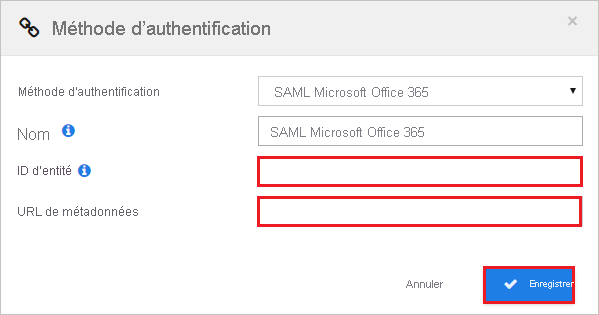
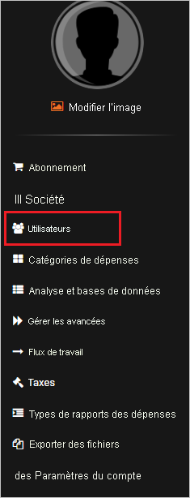
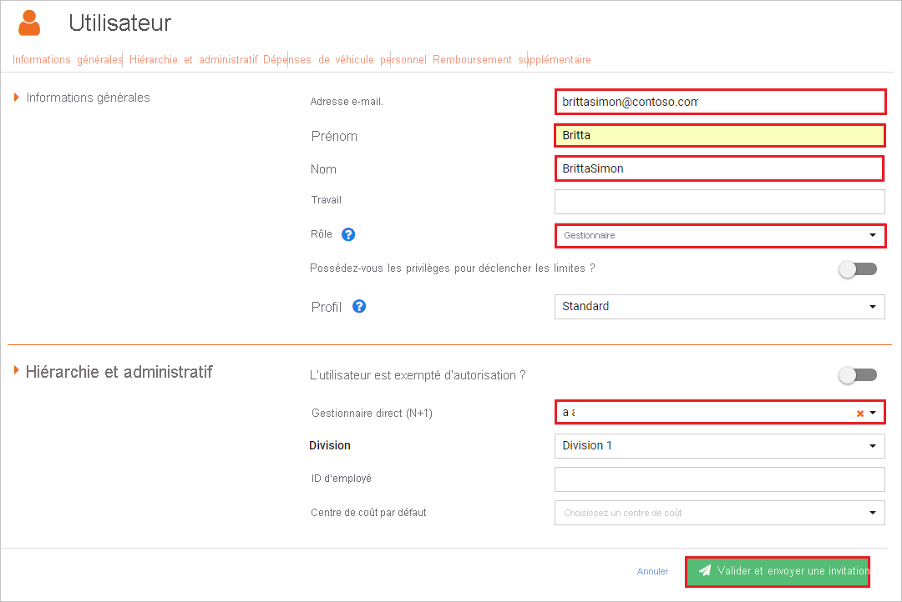

# Tutoriel : Intégration de l’authentification unique Azure AD à N2F - Note de frais

Dans ce tutoriel, vous allez apprendre à intégrer N2F - Note de frais à Azure Active Directory (Azure AD). Lorsque vous intégrez N2F - Note de frais à Azure AD, vous pouvez :

* Contrôler dans Azure AD qui a accès à N2F - Note de frais.
* Permettre à vos utilisateurs de se connecter automatiquement à N2F - Note de frais avec leur compte Azure AD.
* Gérer vos comptes à un emplacement central : le Portail Azure.

## Prérequis

Pour commencer, vous devez disposer de ce qui suit :

* Un abonnement Azure AD Si vous ne disposez d’aucun abonnement, vous pouvez obtenir [un compte gratuit](https://azure.microsoft.com/free/).
* Un abonnement N2F - Note de frais pour lequel l’authentification unique est activée.

## Description du scénario

Dans ce didacticiel, vous configurez et testez l’authentification unique Azure AD dans un environnement de test.

* N2F - Note de frais prend en charge l’authentification unique lancée par le **fournisseur de services** et le **fournisseur d’identité**.

## Ajouter N2F - Note de frais à partir de la galerie

Pour configurer l’intégration de N2F - Note de frais à Azure AD, vous devez ajouter N2F - Note de frais à partir de la galerie à votre liste d’applications SaaS gérées.

1. Connectez-vous au portail Azure avec un compte professionnel ou scolaire ou avec un compte personnel Microsoft.
1. Dans le panneau de navigation gauche, sélectionnez le service **Azure Active Directory**.
1. Accédez à **Applications d’entreprise**, puis sélectionnez **Toutes les applications**.
1. Pour ajouter une nouvelle application, sélectionnez **Nouvelle application**.
1. Dans la section **Ajouter à partir de la galerie**, tapez **N2F - Note de frais** dans la zone de recherche.
1. Sélectionnez **N2F - Note de frais** dans le volet de résultats, puis ajoutez l’application. Patientez quelques secondes pendant que l’application est ajoutée à votre locataire.

## Configurer et tester l’authentification unique Azure AD pour N2F - Note de frais

Configurez et testez l’authentification unique Azure AD avec N2F - Note de frais à l’aide d’un utilisateur test nommé **B.Simon**. Pour que l’authentification unique fonctionne, vous devez établir un lien entre un utilisateur Azure AD et l’utilisateur N2F - Note de frais associé.

Pour configurer et tester l’authentification unique Azure AD avec N2F - Note de frais, effectuez les étapes suivantes :

1. **[Configurer l’authentification unique Azure AD](#configure-azure-ad-sso)** pour permettre à vos utilisateurs d’utiliser cette fonctionnalité.
    1. **[Créer un utilisateur de test Azure AD](#create-an-azure-ad-test-user)** pour tester l’authentification unique Azure AD avec B. Simon.
    1. **[Affecter l’utilisateur de test Azure AD](#assign-the-azure-ad-test-user)** pour permettre à B. Simon d’utiliser l’authentification unique Azure AD.
1. **[Configurer l’authentification unique N2F - Note de frais](#configure-n2f---expense-reports-sso)** pour configurer les paramètres de l’authentification unique côté application.
    1. **[Créer un utilisateur test N2F - Note de frais](#create-n2f---expense-reports-test-user)** pour disposer dans N2F - Note de frais d’un équivalent de B.Simon lié à la représentation Azure AD de l’utilisateur.
1. **[Tester l’authentification unique](#test-sso)** pour vérifier si la configuration fonctionne.

## Configurer l’authentification unique Azure AD

Effectuez les étapes suivantes pour activer l’authentification unique Azure AD dans le Portail Azure.

1. Dans le portail Azure, accédez à la page d’intégration de l’application **N2F - Note de frais**, recherchez la section **Gérer** et sélectionnez **Authentification unique**.
1. Dans la page **Sélectionner une méthode d’authentification unique**, sélectionnez **SAML**.
1. Dans la page **Configurer l’authentification unique avec SAML**, cliquez sur l’icône de crayon de **Configuration SAML de base** afin de modifier les paramètres.

   

4. Dans la section **Configuration SAML de base**, si vous souhaitez configurer l’application en mode lancé par le **fournisseur d’identité**, l’utilisateur n’a rien à faire, car l’application est pré-intégrée à Azure.

5. Si vous souhaitez configurer l’application en **mode démarré par le fournisseur de services**, cliquez sur **Définir des URL supplémentaires**, puis effectuez les étapes suivantes :

    Dans la zone de texte **URL de connexion**, tapez l’URL : `https://www.n2f.com/app/`

6. Dans la page **Configurer l’authentification unique avec SAML**, dans la section **Certificat de signature SAML**, cliquez sur le bouton Copier pour copier l’**URL des métadonnées de fédération d’application**, puis enregistrez-la sur votre ordinateur.

    

7. Dans la section **Configurer N2F - Note de frais**, copiez les URL appropriées, selon vos besoins.

    

### Créer un utilisateur de test Azure AD 

Dans cette section, vous allez créer un utilisateur de test appelé B. Simon dans le portail Azure.

1. Dans le volet gauche du Portail Azure, sélectionnez **Azure Active Directory**, **Utilisateurs**, puis **Tous les utilisateurs**.
1. Sélectionnez **Nouvel utilisateur** dans la partie supérieure de l’écran.
1. Dans les propriétés **Utilisateur**, effectuez les étapes suivantes :
   1. Dans le champ **Nom**, entrez `B.Simon`.  
   1. Dans le champ **Nom de l’utilisateur**, entrez username@companydomain.extension. Par exemple : `B.Simon@contoso.com`.
   1. Cochez la case **Afficher le mot de passe**, puis notez la valeur affichée dans le champ **Mot de passe**.
   1. Cliquez sur **Créer**.

### Affecter l’utilisateur de test Azure AD

Dans cette section, vous allez autoriser B.Simon à utiliser l’authentification unique Azure en lui accordant l’accès à N2F - Note de frais.

1. Dans le portail Azure, sélectionnez **Applications d’entreprise**, puis **Toutes les applications**.
1. Dans la liste des applications, sélectionnez **N2F - Note de frais**.
1. Dans la page de vue d’ensemble de l’application, recherchez la section **Gérer** et sélectionnez **Utilisateurs et groupes**.
1. Sélectionnez **Ajouter un utilisateur**, puis **Utilisateurs et groupes** dans la boîte de dialogue **Ajouter une attribution**.
1. Dans la boîte de dialogue **Utilisateurs et groupes**, sélectionnez **B. Simon** dans la liste Utilisateurs, puis cliquez sur le bouton **Sélectionner** au bas de l’écran.
1. Si vous attendez qu’un rôle soit attribué aux utilisateurs, vous pouvez le sélectionner dans la liste déroulante **Sélectionner un rôle** . Si aucun rôle n’a été configuré pour cette application, vous voyez le rôle « Accès par défaut » sélectionné.
1. Dans la boîte de dialogue **Ajouter une attribution**, cliquez sur le bouton **Attribuer**.

## Configurer l’authentification unique de N2F - Note de frais

1. Dans une autre fenêtre de navigateur web, connectez-vous au site d’entreprise N2F - Note de frais en tant qu’administrateur.

2. Cliquez sur **Paramètres**, puis sélectionnez **Paramètres avancés** dans la liste déroulante.

    

3. Sélectionnez l’onglet **Paramètres du compte**.

    

4. Sélectionnez **Authentification**, puis sélectionnez l’onglet **+ Add an authentication method** (Ajouter une méthode d’authentification).

    

5. Sélectionnez **SAML Microsoft Office 365** comme méthode d’authentification.

    

6. Dans la section **Méthode d’authentification** , procédez comme suit :

    

    a. Dans la zone de texte **ID d’entité**, collez l’**Identificateur Azure AD** que vous avez copié sur le portail Azure.

    b. Dans la zone de texte **URL de métadonnées**, collez la valeur **URL des métadonnées de fédération d’application** que vous avez copiée à partir du Portail Azure.

    c. Cliquez sur **Enregistrer**.

### Créer un utilisateur de test N2F - Note de frais

Pour permettre aux utilisateurs Azure AD de se connecter à N2F - Note de frais, vous devez les approvisionner dans N2F - Note de frais. Dans le cas de N2F - Note de frais, l’approvisionnement est une tâche manuelle.

**Pour approvisionner un compte d’utilisateur, procédez comme suit :**

1. Connectez-vous au site d’entreprise N2F - Note de frais en tant qu’administrateur.

2. Cliquez sur **Paramètres**, puis sélectionnez **Paramètres avancés** dans la liste déroulante.

    

3. Sélectionnez l’onglet **Utilisateurs** dans le volet de navigation de gauche.

    

4. Sélectionnez l’onglet **+ Nouvel utilisateur**.

    

5. Dans la section **Utilisateur**, procédez comme suit :

    

    a. Dans la zone de texte **Email address** (Adresse e-mail), entrez l’adresse e-mail de l’utilisateur, par exemple **brittasimon\@contoso.com**.

    b. Dans la zone de texte **First name**, entrez le prénom de l’utilisateur, par exemple **Britta**.

    c. Dans la zone de texte **Nom**, entrez le nom d’un utilisateur, par exemple **Britta Simon**.

    d. Choisissez **Role, Direct manager (N+1)** (Rôle, Supérieur hiérarchique [N+1]) et **Division** (Division) conformément aux exigences de votre organisation.

    e. Cliquez sur **Validate and send invitation** (Valider et envoyer une invitation).

    > [!NOTE]
    > Si vous rencontrez des problèmes lors de l’ajout de l’utilisateur, contactez [l’équipe du support technique de N2F - Note de frais](mailto:support@n2f.com).

## Tester l’authentification unique (SSO)

Dans cette section, vous allez tester votre configuration de l’authentification unique Azure AD avec les options suivantes. 

#### Lancée par le fournisseur de services :

* Cliquez sur **Tester cette application** dans le portail Azure. Vous êtes redirigé vers l’URL d’authentification N2F - Note de frais, à partir de laquelle vous pouvez lancer le processus de connexion.  

* Accédez directement à l’URL d’authentification N2F - Note de frais pour lancer le processus de connexion.

#### Lancée par le fournisseur d’identité :

* Cliquez sur **Tester cette application** dans le portail Azure, ce qui vous permet d’être automatiquement connecté à l’application N2F - Note de frais pour laquelle vous avez configuré l’authentification unique. 

Vous pouvez aussi utiliser Mes applications de Microsoft pour tester l’application dans n’importe quel mode. Quand vous cliquez sur la vignette N2F - Note de frais dans Mes applications, si le mode Fournisseur de services est configuré, vous êtes redirigé vers la page d’authentification de l’application pour lancer le processus de connexion. Si le mode Fournisseur d’identité est configuré, vous êtes automatiquement connecté à l’application N2F - Note de frais pour laquelle vous avez configuré l’authentification unique. Pour plus d’informations sur Mes applications, consultez [Présentation de Mes applications](../user-help/my-apps-portal-end-user-access.md).

## Étapes suivantes

Après avoir configuré N2F - Note de frais, vous pouvez appliquer le contrôle de session qui protège contre l’exfiltration et l’infiltration des données sensibles de votre organisation en temps réel. Le contrôle de session est étendu à partir de l’accès conditionnel. [Découvrez comment appliquer un contrôle de session avec Microsoft Defender for Cloud Apps](/cloud-app-security/proxy-deployment-aad).
