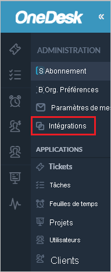
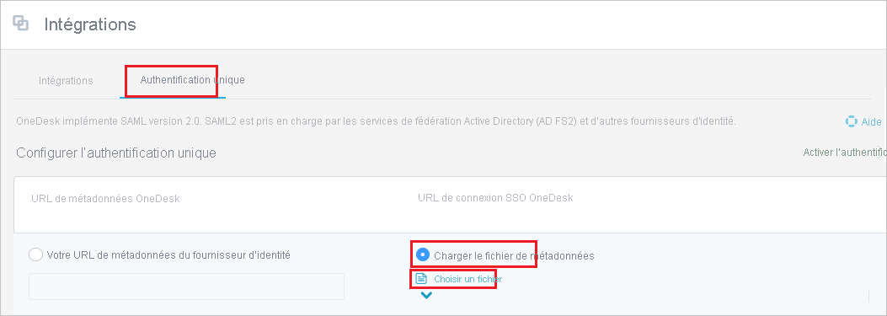

# Tutoriel : Intégration de l’authentification unique Azure AD à OneDesk

Dans ce tutoriel, vous allez apprendre à intégrer OneDesk à Azure Active Directory (Azure AD). Quand vous intégrez OneDesk à Azure AD, vous pouvez :

* Contrôler qui dans Azure AD a accès à OneDesk.
* Permettre à vos utilisateurs de se connecter automatiquement à OneDesk avec leur compte Azure AD.
* Gérer vos comptes à un emplacement central : le Portail Azure.

## Prérequis

Pour commencer, vous devez disposer de ce qui suit :

* Un abonnement Azure AD Si vous ne disposez d’aucun abonnement, vous pouvez obtenir [un compte gratuit](https://azure.microsoft.com/free/).
* Un abonnement OneDesk pour lequel l’authentification unique (SSO) est activée.

## Description du scénario

Dans ce tutoriel, vous allez configurer et tester l’authentification unique Azure AD dans un environnement de test.

* OneDesk prend en charge l’authentification unique lancée par **le fournisseur de services et le fournisseur d’identité**.
* OneDesk prend en charge l’attribution d’utilisateurs **juste-à-temps**.

## Ajouter OneDesk à partir de la galerie

Pour configurer l’intégration de OneDesk à Azure AD, vous devez ajouter OneDesk à votre liste d’applications SaaS gérées, à partir de la galerie.

1. Connectez-vous au portail Azure avec un compte professionnel ou scolaire ou avec un compte personnel Microsoft.
1. Dans le panneau de navigation gauche, sélectionnez le service **Azure Active Directory**.
1. Accédez à **Applications d’entreprise**, puis sélectionnez **Toutes les applications**.
1. Pour ajouter une nouvelle application, sélectionnez **Nouvelle application**.
1. Dans la section **Ajouter à partir de la galerie**, tapez **OneDesk** dans la zone de recherche.
1. Sélectionnez **OneDesk** dans le volet de résultats, puis ajoutez l’application. Patientez quelques secondes pendant que l’application est ajoutée à votre locataire.

## Configurer et tester l’authentification unique Azure AD pour OneDesk

Configurez et testez l’authentification unique Azure AD auprès de OneDesk pour un utilisateur de test appelé **B.Simon**. Pour que l’authentification unique fonctionne, vous devez établir un lien entre un utilisateur Azure AD et l’utilisateur OneDesk associé.

Pour configurer et tester l’authentification unique Azure AD avec OneDesk, effectuez les étapes suivantes :

1. **[Configurer l’authentification unique Azure AD](#configure-azure-ad-sso)** pour permettre à vos utilisateurs d’utiliser cette fonctionnalité.
    1. **[Créer un utilisateur de test Azure AD](#create-an-azure-ad-test-user)** pour tester l’authentification unique Azure AD avec B. Simon.
    1. **[Affecter l’utilisateur de test Azure AD](#assign-the-azure-ad-test-user)** pour permettre à B. Simon d’utiliser l’authentification unique Azure AD.
1. **[Configurer l’authentification unique OneDesk](#configure-onedesk-sso)** pour configurer les paramètres de l’authentification unique côté application.
    1. **[Créer un utilisateur de test OneDesk](#create-onedesk-test-user)** pour avoir un équivalent de B.Simon dans OneDesk lié à la représentation Azure AD associée.
1. **[Tester l’authentification unique](#test-sso)** pour vérifier si la configuration fonctionne.

## Configurer l’authentification unique Azure AD

Effectuez les étapes suivantes pour activer l’authentification unique Azure AD dans le Portail Azure.

1. Dans le portail Azure, accédez à la page d’intégration de l’application **OneDesk**, recherchez la section **Gérer** et sélectionnez **Authentification unique**.
1. Dans la page **Sélectionner une méthode d’authentification unique**, sélectionnez **SAML**.
1. Dans la page **Configurer l’authentification unique avec SAML**, cliquez sur l’icône de crayon de **Configuration SAML de base** afin de modifier les paramètres.

   

1. Dans la section **Configuration SAML de base**, si vous souhaitez configurer l’application en mode lancé par le **fournisseur d’identité**, effectuez les étapes suivantes :

    a. Dans la zone de texte **Identificateur**, tapez une valeur au format suivant : `onedesk.com_<specific_tenant_string>`

    b. Dans la zone de texte **URL de réponse**, tapez une URL au format suivant : `https://app.onedesk.com/sso/saml/SSO/alias/onedesk.com_<specific_tenant_string>`

1. Si vous souhaitez configurer l’application en **mode démarré par le fournisseur de services**, cliquez sur **Définir des URL supplémentaires**, puis effectuez les étapes suivantes :

    Dans la zone de texte **URL de connexion**, tapez une URL au format suivant : `https://app.onedesk.com/sso/saml/login/alias/onedesk.com_<specific_tenant_string>`

    > [!NOTE]
    > Il ne s’agit pas de valeurs réelles. Mettez à jour ces valeurs avec l’identificateur, l’URL de réponse et l’URL de connexion réels. Pour obtenir ces valeurs, contactez l’[équipe de support technique OneDesk](mailto:hello@onedesk.com). Vous pouvez également consulter les modèles figurant à la section **Configuration SAML de base** dans le portail Azure.

1. Dans la page **Configurer l’authentification unique avec SAML**, dans la section **Certificat de signature SAML**, recherchez **XML de métadonnées de fédération** et sélectionnez **Télécharger** pour télécharger le certificat et l’enregistrer sur votre ordinateur.

    

1. Dans la section **Configurer OneDesk**, copiez la ou les URL appropriées en fonction de vos besoins.

    

### Créer un utilisateur de test Azure AD

Dans cette section, vous allez créer un utilisateur de test appelé B. Simon dans le portail Azure.

1. Dans le volet gauche du Portail Azure, sélectionnez **Azure Active Directory**, **Utilisateurs**, puis **Tous les utilisateurs**.
1. Sélectionnez **Nouvel utilisateur** dans la partie supérieure de l’écran.
1. Dans les propriétés **Utilisateur**, effectuez les étapes suivantes :
   1. Dans le champ **Nom**, entrez `B.Simon`.  
   1. Dans le champ **Nom de l’utilisateur**, entrez username@companydomain.extension. Par exemple : `B.Simon@contoso.com`.
   1. Cochez la case **Afficher le mot de passe**, puis notez la valeur affichée dans le champ **Mot de passe**.
   1. Cliquez sur **Créer**.

### Affecter l’utilisateur de test Azure AD

Dans cette section, vous allez permettre à B.Simon d’utiliser l’authentification unique Azure en lui accordant l’accès à OneDesk.

1. Dans le portail Azure, sélectionnez **Applications d’entreprise**, puis **Toutes les applications**.
1. Dans la liste des applications, sélectionnez **OneDesk**.
1. Dans la page de vue d’ensemble de l’application, recherchez la section **Gérer** et sélectionnez **Utilisateurs et groupes**.
1. Sélectionnez **Ajouter un utilisateur**, puis **Utilisateurs et groupes** dans la boîte de dialogue **Ajouter une attribution**.
1. Dans la boîte de dialogue **Utilisateurs et groupes**, sélectionnez **B. Simon** dans la liste Utilisateurs, puis cliquez sur le bouton **Sélectionner** au bas de l’écran.
1. Si vous attendez une valeur de rôle dans l’assertion SAML, dans la boîte de dialogue **Sélectionner un rôle**, sélectionnez le rôle approprié pour l’utilisateur dans la liste, puis cliquez sur le bouton **Sélectionner** en bas de l’écran.
1. Dans la boîte de dialogue **Ajouter une attribution**, cliquez sur le bouton **Attribuer**.

## Configurer l’authentification unique OneDesk

1. Pour automatiser la configuration dans OneDesk, vous devez installer l’**extension de navigateur My Apps Secure Sign-in** en cliquant sur **Installer l’extension**.

    

1. Après avoir ajouté l’extension au navigateur, cliquez sur **Configurer OneDesk**. Vous êtes alors dirigé vers l’application OneDesk. À partir de là, indiquez les informations d’identification de l’administrateur pour vous connecter à OneDesk. Cette extension de navigateur configure automatiquement l’application et automatise les étapes 3 à 5.

    

1. Si vous souhaitez configurer OneDesk manuellement, ouvrez une nouvelle fenêtre de navigateur web, connectez-vous à votre site d’entreprise OneDesk en tant qu’administrateur et effectuez les étapes suivantes :

1. Cliquez sur l’onglet **Integrations**.

    

1. Cliquez sur **Single Sign On** (Authentification unique), sélectionnez **Upload Metadata File** (Charger un fichier de métadonnées), puis cliquez sur **Choose File** (Choisir un fichier) pour charger le fichier de métadonnées que vous avez téléchargé sur le portail Azure.

    

### Créer un utilisateur de test OneDesk

Dans cette section, un utilisateur appelé B.Simon est créé dans OneDesk. OneDesk prend en charge le provisionnement d’utilisateurs juste-à-temps, option activée par défaut. Vous n’avez aucune opération à effectuer dans cette section. S’il n’existe pas encore d’utilisateur dans OneDesk, il en est créé un après l’authentification.

## Tester l’authentification unique (SSO)

Dans cette section, vous allez tester votre configuration de l’authentification unique Azure AD avec les options suivantes. 

#### Lancée par le fournisseur de services :

* Cliquez sur **Tester cette application** dans le portail Azure. Vous êtes alors redirigé vers l’URL d’authentification de OneDesk, d’où vous pouvez lancer le processus de connexion.  

* Accédez directement à l’URL d’authentification de OneDesk pour lancer le processus de connexion.

#### Lancée par le fournisseur d’identité :

* Cliquez sur **Tester cette application** dans le portail Azure, ce qui devrait vous connecter automatiquement à l’application OneDesk pour laquelle vous avez configuré l’authentification unique. 

Vous pouvez aussi utiliser Mes applications de Microsoft pour tester l’application dans n’importe quel mode. Quand vous cliquez sur la vignette OneDesk dans Mes applications, si le mode Fournisseur de services est configuré, vous êtes redirigé vers la page d’authentification de l’application pour lancer le processus de connexion. Si le mode Fournisseur d’identité est configuré, vous devriez être automatiquement connecté à l’application OneDesk pour laquelle vous avez configuré l’authentification unique. Pour plus d’informations sur Mes applications, consultez [Présentation de Mes applications](../user-help/my-apps-portal-end-user-access.md).

## Étapes suivantes

Une fois que vous avez configuré OneDesk, vous pouvez appliquer le contrôle de session, qui protège contre l’exfiltration et l’infiltration des données sensibles de votre organisation en temps réel. Le contrôle de session est étendu à partir de l’accès conditionnel. [Découvrez comment appliquer un contrôle de session avec Microsoft Cloud App Security](/cloud-app-security/proxy-deployment-aad).