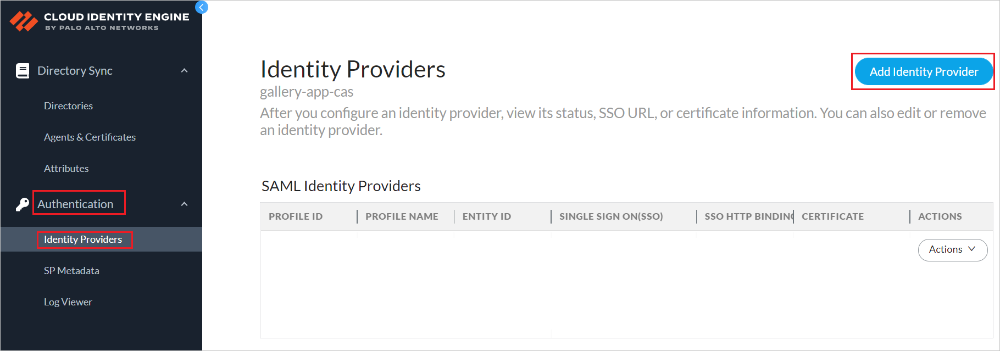
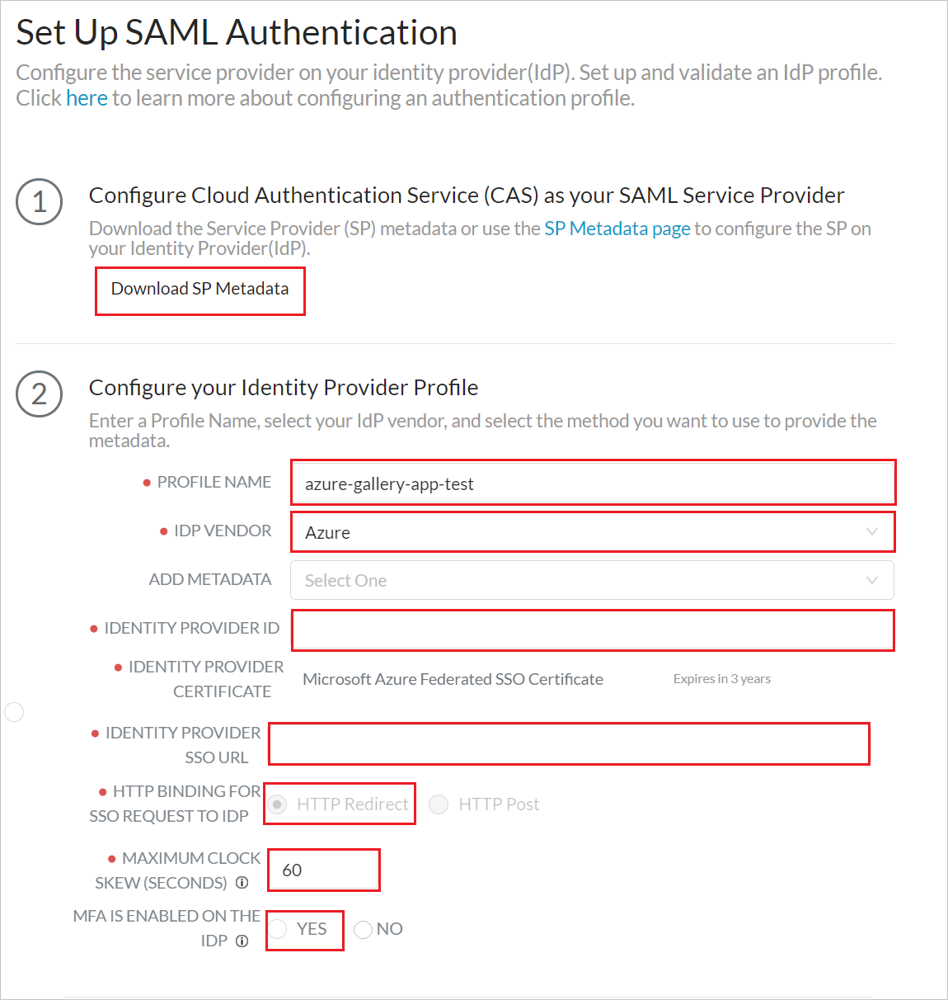
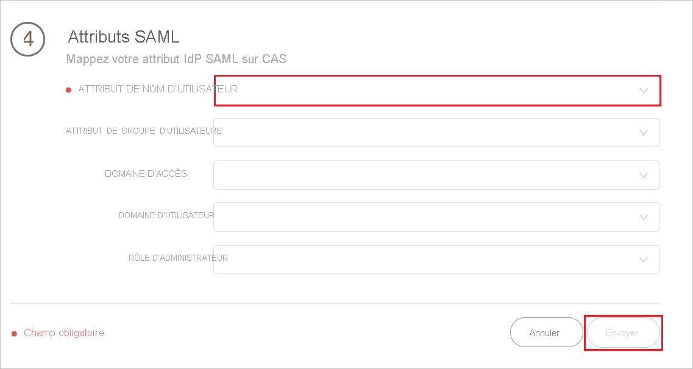

# Tutoriel : Intégration de l’authentification unique Azure Active Directory à Palo Alto Networks Cloud Identity Engine - Cloud Authentication Service

Dans ce didacticiel, vous allez découvrir comment intégrer Palo Alto Networks Cloud Identity Engine - Cloud Authentication Service avec Azure Active Directory (Azure AD). Quand vous intégrez Palo Alto Networks Cloud Identity Engine - Cloud Authentication Service avec Azure AD, vous pouvez :

* Contrôler dans Azure AD qui a accès à Palo Alto Networks Cloud Identity Engine - Cloud Authentication Service.
* Permettre à vos utilisateurs de se connecter automatiquement à Palo Alto Networks Cloud Identity Engine - Cloud Authentication Service avec leur compte Azure AD.
* Gérer vos comptes à un emplacement central : le Portail Azure.

## Prérequis

Pour commencer, vous devez disposer de ce qui suit :

* Un abonnement Azure AD Si vous ne disposez d’aucun abonnement, vous pouvez obtenir [un compte gratuit](https://azure.microsoft.com/free/).
* Un abonnement avec authentification unique Palo Alto Networks Cloud Identity Engine - Cloud Authentication Service activée.

## Description du scénario

Dans ce tutoriel, vous allez configurer et tester l’authentification unique Azure AD dans un environnement de test.

* Palo Alto Networks Cloud Identity Engine - Cloud Authentication Service prend en charge l’authentification unique **SP** initiée.

* Palo Alto Networks Cloud Identity Engine - Cloud Authentication Service prend en charge le provisionnement utilisateur **juste à temps**.

## Ajouter Palo Alto Networks Cloud Identity Engine - Cloud Authentication Service à partir de la galerie

Pour configurer l’intégration de Palo Alto Networks Cloud Identity Engine - Cloud Authentication Service dans Azure AD, vous devez ajouter Palo Alto Networks Cloud Identity Engine - Cloud Authentication Service à partir de la galerie de votre liste d’applications SaaS gérées.

1. Connectez-vous au portail Azure avec un compte professionnel ou scolaire ou avec un compte personnel Microsoft.
1. Dans le panneau de navigation gauche, sélectionnez le service **Azure Active Directory**.
1. Accédez à **Applications d’entreprise**, puis sélectionnez **Toutes les applications**.
1. Pour ajouter une nouvelle application, sélectionnez **Nouvelle application**.
1. Dans la section **Ajouter à partir de la galerie**, saisissez **Palo Alto Networks Cloud Identity Engine - Cloud Authentication Service** dans le champ de recherche.
1. Sélectionnez **Palo Alto Networks Cloud Identity Engine - Cloud Authentication Service** dans le volet de résultats et ajoutez l’application. Patientez quelques secondes pendant que l’application est ajoutée à votre locataire.

## Configurer et tester l’authentification unique d’Azure AD pour Palo Alto Networks Cloud Identity Engine-Cloud Authentication Service

Configurez et testez l’authentification unique d’Azure AD avec Palo Alto Networks Cloud Identity Engine-Cloud Authentication Service avec un utilisateur test que nous appellerons **B. Simon**. Pour que l’authentification unique fonctionne, vous devez établir un lien entre un utilisateur Azure AD et l’utilisateur Palo Alto Networks Cloud Identity Engine - Cloud Authentication Service associé.

Pour configurer et tester Azure AD SSO with Palo Alto Networks Cloud Identity Engine - Cloud Authentication Service, suivez les étapes suivantes :

1. **[Configurer l’authentification unique Azure AD](#configure-azure-ad-sso)** pour permettre à vos utilisateurs d’utiliser cette fonctionnalité.
    1. **[Créer un utilisateur de test Azure AD](#create-an-azure-ad-test-user)** pour tester l’authentification unique Azure AD avec B. Simon.
    1. **[Affecter l’utilisateur de test Azure AD](#assign-the-azure-ad-test-user)** pour permettre à B. Simon d’utiliser l’authentification unique Azure AD.
1. **[Configurer Palo Alto Networks Cloud Identity Engine-Cloud Authentication service SSO](#configure-palo-alto-networks-cloud-identity-engine---cloud-authentication-service-sso)** pour configurer les paramètres d’authentification unique côté application.
    1. **[Créer un utilisateur de test Palo Alto Networks Cloud Identity Engine-Cloud Authentication Service](#create-palo-alto-networks-cloud-identity-engine---cloud-authentication-service-test-user)** pour avoir un équivalent de B. Simon dans Palo Alto Networks Cloud Identity Engine-Cloud Authentication Service lié à la représentation Azure AD de l’utilisateur.
1. **[Tester l’authentification unique](#test-sso)** pour vérifier si la configuration fonctionne.

## Configurer l’authentification unique Azure AD

Effectuez les étapes suivantes pour activer l’authentification unique Azure AD dans le Portail Azure.

1. Dans le portail Azure, à la page d’intégration **Palo Alto Networks Cloud Identity Engine - Cloud Authentication Service**, cherchez la section **Gérer** et sélectionnez **authentification unique**.
1. Dans la page **Sélectionner une méthode d’authentification unique**, sélectionnez **SAML**.
1. Dans la page **Configurer l’authentification unique avec SAML**, cliquez sur l’icône de crayon de **Configuration SAML de base** afin de modifier les paramètres.

   

1. Dans la section **Configuration SAML de base**, si vous disposez d’un **fichier de métadonnées du fournisseur de services**, suivez les étapes ci-dessous :

    a. Cliquez sur **Charger un fichier de métadonnées**.

    

    b. Cliquez sur le **logo du dossier** pour sélectionner le fichier de métadonnées, puis cliquez sur **Charger**.

    

    c. Une fois le fichier de métadonnées correctement chargé, la valeur **Identificateur** est automatiquement renseignée dans la section Configuration SAML de base.

    d. Dans la zone de texte **URL de connexion**, tapez une URL au format suivant : `https://<RegionUrl>.paloaltonetworks.com/sp/acs`.

    > [!Note]
    > Si la valeur **Identificateur** n’est pas automatiquement renseignée, renseignez-la manuellement. La valeur de l’URL de connexion n’est pas réelle. Mettez à jour la valeur avec l’URL de connexion réelle. Contactez [l’équipe du support technique de Palo Alto Networks Cloud Identity Engine - Cloud Authentication Service Client](mailto:support@paloaltonetworks.com) pour obtenir cette valeur. Vous pouvez également consulter les modèles figurant à la section **Configuration SAML de base** dans le portail Azure.

1. L’application Palo Alto Networks Cloud Identity Engine - Cloud Authentication Service attend les assertions SAML dans un format spécifique, ce qui vous oblige à ajouter des mappages d’attributs personnalisés à votre configuration d’attributs de jeton SAML. La capture d’écran suivante montre la liste des attributs par défaut.

    

1. En plus de ce qui précède, l’application Palo Alto Networks Cloud Identity Engine - Cloud Authentication Service s’attend à ce que quelques attributs supplémentaires (présentés ci-dessus) soient repassés dans la réponse SAML. Ces attributs sont également préremplis, mais vous pouvez les examiner pour voir s’ils répondent à vos besoins.
    
    | Nom | Attribut source|
    | ---------------| --------- |
    | Groupe |  user.groups |
    | username | user.userprincipalname |

1. Dans la page **Configurer l’authentification unique avec SAML**, dans la section **Certificat de signature SAML**, cliquez sur le bouton Copier pour copier l’**URL des métadonnées de fédération d’application**, puis enregistrez-la sur votre ordinateur.

    

### Créer un utilisateur de test Azure AD

Dans cette section, vous allez créer un utilisateur de test appelé B. Simon dans le portail Azure.

1. Dans le volet gauche du Portail Azure, sélectionnez **Azure Active Directory**, **Utilisateurs**, puis **Tous les utilisateurs**.
1. Sélectionnez **Nouvel utilisateur** dans la partie supérieure de l’écran.
1. Dans les propriétés **Utilisateur**, effectuez les étapes suivantes :
   1. Dans le champ **Nom**, entrez `B.Simon`.  
   1. Dans le champ **Nom de l’utilisateur**, entrez username@companydomain.extension. Par exemple : `B.Simon@contoso.com`.
   1. Cochez la case **Afficher le mot de passe**, puis notez la valeur affichée dans le champ **Mot de passe**.
   1. Cliquez sur **Créer**.

### Affecter l’utilisateur de test Azure AD

Dans cette section, vous autoriserez B.Simon à utiliser l’authentification unique Azure en lui accordant l’accès à Palo Alto Networks Cloud Identity Engine - Cloud Authentication Service.

1. Dans le portail Azure, sélectionnez **Applications d’entreprise**, puis **Toutes les applications**.
1. Dans la liste d’applications, sélectionnez **Palo Alto Networks Cloud Identity Engine - Cloud Authentication Service**.
1. Dans la page de vue d’ensemble de l’application, recherchez la section **Gérer** et sélectionnez **Utilisateurs et groupes**.
1. Sélectionnez **Ajouter un utilisateur**, puis **Utilisateurs et groupes** dans la boîte de dialogue **Ajouter une attribution**.
1. Dans la boîte de dialogue **Utilisateurs et groupes**, sélectionnez **B. Simon** dans la liste Utilisateurs, puis cliquez sur le bouton **Sélectionner** au bas de l’écran.
1. Si vous attendez qu’un rôle soit attribué aux utilisateurs, vous pouvez le sélectionner dans la liste déroulante **Sélectionner un rôle** . Si aucun rôle n’a été configuré pour cette application, vous voyez le rôle « Accès par défaut » sélectionné.
1. Dans la boîte de dialogue **Ajouter une attribution**, cliquez sur le bouton **Attribuer**.

## Configurer l’authentification unique de Palo Alto Networks Cloud Identity Engine - Cloud Authentication Service

1. Connectez-vous à votre site d’entreprise Palo Alto Networks Cloud Identity Engine-Cloud Authentication Service en tant qu’administrateur.

1. Accédez à **Authentification** > **Fournisseurs d’identité**, puis cliquez sur **Ajouter un fournisseur d’identité**.

     

1. Dans la page **Configurer l’authentification SAML**, procédez comme suit.

     

    a. À l'étape 1, cliquez sur **Télécharger les métadonnées SP** pour télécharger le fichier de métadonnées et l'enregistrer sur votre ordinateur.

    b. À l’étape 2, renseignez les champs requis pour **configurer votre profil de fournisseur d’identité** que vous avez copié à partir du portail Azure. 

    c. À l’étape 3, cliquez sur **Tester le programme d’installation SAML** pour vérifier la configuration du profil et sélectionnez l'**authentification multifacteur est activée sur le fournisseur d’identité**.

    

    > [!NOTE]
    > Pour tester l’authentification unique de **Palo Alto Networks Cloud Identity Engine - Cloud Authentication Service**, ouvrez la console **Palo Alto Networks Cloud Identity Engine - Cloud Authentication Service**, puis cliquez sur le bouton **Tester la connexion** et authentifiez-vous à l’aide du compte de test que vous avez créé dans la section **Créer un utilisateur test pour Azure AD**. 

    d. À l’étape 4, entrez l'**ATTRIBUT DE NOM D’UTILISATEUR**, puis cliquez sur **Envoyer**. 

    

### Créer un utilisateur test pour Palo Alto Networks Cloud Identity Engine - Cloud Authentication Service

Dans cette section, un utilisateur appelé Britta Simon est créé dans **Palo Alto Networks Cloud Identity Engine-Cloud Authentication Service**. **Palo Alto Networks Cloud Identity Engine - Cloud Authentication Service** prend en charge le provisionnement juste à temps des utilisateurs, qui est activé par défaut. Vous n’avez aucune opération à effectuer dans cette section. S’il n’existe pas encore d’utilisateur dans **Palo Alto Networks Cloud Identity Engine - Cloud Authentication Service**, il en est créé un après l’authentification.

## Tester l’authentification unique (SSO) 

Pour tester l’authentification unique de **Palo Alto Networks Cloud Identity Engine - Cloud Authentication Service**, ouvrez la console **Palo Alto Networks Cloud Identity Engine - Cloud Authentication Service**, puis cliquez sur le bouton **Tester la connexion** et authentifiez-vous à l’aide du compte de test que vous avez créé dans la section **Créer un utilisateur test pour Azure AD**.

## Étapes suivantes

Après avoir configuré **Palo Alto Networks Cloud Identity Engine - Cloud Authentication Service**, vous pouvez appliquer le contrôle de session, qui protège contre l’exfiltration et l’infiltration des données sensibles de votre organisation en temps réel. Le contrôle de session est étendu à partir de l’accès conditionnel. [Découvrez comment appliquer un contrôle de session avec Microsoft Defender for Cloud Apps](/cloud-app-security/proxy-deployment-aad).
