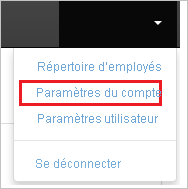
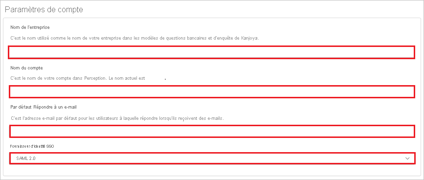

# Tutoriel : Intégration de l’authentification unique Azure AD à Perception United States (Non-UltiPro)

Dans ce tutoriel, vous allez apprendre à intégrer Azure Active Directory (Azure AD) à Perception United States (Non-UltiPro). Quand vous intégrez Azure AD à Perception United States (Non-UltiPro), vous pouvez :

* Contrôler dans Azure AD qui a accès à Perception United States (Non-UltiPro).
* Permettre à vos utilisateurs de se connecter automatiquement à Perception United States (Non-UltiPro) avec leur compte Azure AD.
* Gérer vos comptes à un emplacement central : le Portail Azure.

## Prérequis

Pour commencer, vous devez disposer de ce qui suit :

* Un abonnement Azure AD Si vous ne disposez d’aucun abonnement, vous pouvez obtenir [un compte gratuit](https://azure.microsoft.com/free/).
* Un abonnement Perception United States (Non-UltiPro) pour lequel l’authentification unique (SSO) est activée.

## Description du scénario

Dans ce didacticiel, vous configurez et testez l’authentification unique Azure AD dans un environnement de test.

* Perception United States (Non-UltiPro) prend en charge l’authentification unique lancée par le **fournisseur d’identité**.

> [!NOTE]
> L’identificateur de cette application étant une valeur de chaîne fixe, une seule instance peut être configurée dans un locataire.

## Ajouter Perception United States (Non-UltiPro) à partir de la galerie

Pour configurer l’intégration de Perception United States (Non-UltiPro) à Azure AD, vous devez ajouter Perception United States (Non-UltiPro) à partir de la galerie à votre liste d’applications SaaS gérées.

1. Connectez-vous au portail Azure avec un compte professionnel ou scolaire ou avec un compte personnel Microsoft.
1. Dans le panneau de navigation gauche, sélectionnez le service **Azure Active Directory**.
1. Accédez à **Applications d’entreprise**, puis sélectionnez **Toutes les applications**.
1. Pour ajouter une nouvelle application, sélectionnez **Nouvelle application**.
1. Dans la section **Ajouter à partir de la galerie**, tapez **Perception United States (Non-UltiPro)** dans la zone de recherche.
1. Sélectionnez **Perception United States (Non-UltiPro)** dans le volet de résultats, puis ajoutez l’application. Patientez quelques secondes pendant que l’application est ajoutée à votre locataire.

## Configurer et tester l’authentification unique Azure AD pour Perception United States (Non-UltiPro)

Configurez et testez l’authentification unique Azure AD avec Perception United States (Non-UltiPro) à l’aide d’un utilisateur test appelé **B.Simon**. Pour que l’authentification unique fonctionne, vous devez établir une relation entre un utilisateur Azure AD et l’utilisateur Perception United States (Non-UltiPro) associé.

Pour configurer et tester l’authentification unique Azure AD avec Perception United States (Non-UltiPro), effectuez les étapes suivantes :

1. **[Configurer l’authentification unique Azure AD](#configure-azure-ad-sso)** pour permettre à vos utilisateurs d’utiliser cette fonctionnalité.
    1. **[Créer un utilisateur de test Azure AD](#create-an-azure-ad-test-user)** pour tester l’authentification unique Azure AD avec B. Simon.
    1. **[Affecter l’utilisateur de test Azure AD](#assign-the-azure-ad-test-user)** pour permettre à B. Simon d’utiliser l’authentification unique Azure AD.
1. **[Configurer l’authentification unique de Perception United States (Non-UltiPro)](#configure-perception-united-states-non-ultipro-sso)** pour configurer les paramètres de l’authentification unique côté application.
    1. **[Créer un utilisateur test Perception United States (Non-UltiPro)](#create-perception-united-states-non-ultipro-test-user)** pour avoir dans Perception United States (Non-UltiPro) un équivalent de B.Simon lié à la représentation Azure AD de l’utilisateur.
1. **[Tester l’authentification unique](#test-sso)** pour vérifier si la configuration fonctionne.

## Configurer l’authentification unique Azure AD

Effectuez les étapes suivantes pour activer l’authentification unique Azure AD dans le Portail Azure.

1. Dans le portail Azure, accédez à la page d’intégration de l’application **Perception United States (Non-UltiPro)** , recherchez la section **Gérer** et sélectionnez **Authentification unique**.
1. Dans la page **Sélectionner une méthode d’authentification unique**, sélectionnez **SAML**.
1. Dans la page **Configurer l’authentification unique avec SAML**, cliquez sur l’icône de crayon de **Configuration SAML de base** afin de modifier les paramètres.

   

4. Dans la page **Configuration SAML de base**, effectuez les étapes suivantes :

    a. Dans la zone de texte **Identificateur**, tapez une l’URL : `https://perception.kanjoya.com/sp`

    b. Dans la zone de texte **URL de réponse**, tapez une URL au format suivant : `https://perception.kanjoya.com/sso?idp=<entity_id>`

    c. L’application **Perception United States (Non-UltiPro)** requiert la valeur de l’**identificateur Azure AD** en tant que <entity_id>, que vous obtiendrez à partir de la section **Configurer Perception United States (Non-UltiPro)** , à encoder dans l’URI. Pour obtenir la valeur encodée sous forme d’URI, utilisez le lien suivant : **http://www.url-encode-decode.com/** .

    d. Après l’obtention de la valeur encodée en URI, associez-la à l’**URL de réponse** comme indiqué ci-dessous :

    `https://perception.kanjoya.com/sso?idp=<URI encooded entity_id>`
    
    e. Collez la valeur ci-dessus dans la zone de texte **URL de réponse**.

5. Sur la page **Configurer l’authentification unique avec SAML**, dans la section **Certificat de signature SAML**, cliquez sur **Télécharger** pour télécharger le fichier **XML de métadonnées de fédération** en fonction des options définies selon vos besoins, puis enregistrez-le sur votre ordinateur.

    

6. Dans la section **Configurer Perception United States (Non-UltiPro)** , copiez la ou les URL appropriées correspondant à vos besoins.

    

### Créer un utilisateur de test Azure AD 

Dans cette section, vous allez créer un utilisateur de test appelé B. Simon dans le portail Azure.

1. Dans le volet gauche du Portail Azure, sélectionnez **Azure Active Directory**, **Utilisateurs**, puis **Tous les utilisateurs**.
1. Sélectionnez **Nouvel utilisateur** dans la partie supérieure de l’écran.
1. Dans les propriétés **Utilisateur**, effectuez les étapes suivantes :
   1. Dans le champ **Nom**, entrez `B.Simon`.  
   1. Dans le champ **Nom de l’utilisateur**, entrez username@companydomain.extension. Par exemple : `B.Simon@contoso.com`.
   1. Cochez la case **Afficher le mot de passe**, puis notez la valeur affichée dans le champ **Mot de passe**.
   1. Cliquez sur **Créer**.

### Affecter l’utilisateur de test Azure AD

Dans cette section, vous allez autoriser B.Simon à utiliser l’authentification unique Azure en lui accordant l’accès à Perception United States (Non-UltiPro).

1. Dans le portail Azure, sélectionnez **Applications d’entreprise**, puis **Toutes les applications**.
1. Dans la liste des applications, sélectionnez **Perception United States (Non-UltiPro)** .
1. Dans la page de vue d’ensemble de l’application, recherchez la section **Gérer** et sélectionnez **Utilisateurs et groupes**.
1. Sélectionnez **Ajouter un utilisateur**, puis **Utilisateurs et groupes** dans la boîte de dialogue **Ajouter une attribution**.
1. Dans la boîte de dialogue **Utilisateurs et groupes**, sélectionnez **B. Simon** dans la liste Utilisateurs, puis cliquez sur le bouton **Sélectionner** au bas de l’écran.
1. Si vous attendez qu’un rôle soit attribué aux utilisateurs, vous pouvez le sélectionner dans la liste déroulante **Sélectionner un rôle** . Si aucun rôle n’a été configuré pour cette application, vous voyez le rôle « Accès par défaut » sélectionné.
1. Dans la boîte de dialogue **Ajouter une attribution**, cliquez sur le bouton **Attribuer**.

## Configurer l’authentification unique de Perception United States (Non-UltiPro)

1. Dans une autre fenêtre de navigateur, connectez-vous à votre site d’entreprise Perception United States (Non-UltiPro) en tant qu’administrateur.

2. Dans la barre d’outils principale, cliquez sur **Paramètres du compte**.

    

3. Sur la page **Paramètres du compte** , procédez comme suit :

    

    a. Dans la zone de texte **Nom de l’entreprise**, entrez le nom de l’**entreprise**.
    
    b. Dans la zone de texte **Nom du compte**, entrez le nom du **compte**.

    c. Dans la zone de texte **Default Reply-To Email** (Adresse électronique de réponse par défaut), entrez une **adresse e-mail** valide.

    d. Sélectionnez le **fournisseur d’identité d’authentification unique** **SAML 2.0**.

4. Dans la page **Configuration SAML**, procédez comme suit :

    

    a. Sélectionnez le **type de NameID SAML** **E-MAIL**.

    b. Dans la zone de texte **Nom de configuration d’authentification unique**, tapez le nom de votre **configuration**.
    
    c. Dans la zone de texte **Identity Provider Name** (Nom du fournisseur d’identité), collez la valeur de l’**identificateur Azure AD** que vous avez copiée à partir du portail Azure. 

    d. Dans la **zone de texte de domaine SAML**, entrez le domaine tel que @contoso.com.

    e. Cliquez sur **Télécharger à nouveau** pour télécharger le fichier de **XML de métadonnées**.

    f. Cliquez sur **Update**.

### Créer un utilisateur de test Perception United States (Non-UltiPro)

Dans cette section, vous allez créer un utilisateur appelé Britta Simon dans Perception United States (Non-UltiPro). Collaborez avec l’[équipe de support Perception United States (Non-UltiPro)](https://www.ultimatesoftware.com/Contact/ContactUs) pour ajouter les utilisateurs dans la plateforme Perception United States (Non-UltiPro).

## Tester l’authentification unique (SSO)

Dans cette section, vous allez tester votre configuration de l’authentification unique Azure AD avec les options suivantes.

* Cliquez sur Tester cette application dans le portail Azure, ce qui devrait vous connecter automatiquement à l’application Perception United States (Non-UltiPro) pour laquelle vous avez configuré l’authentification unique.

* Vous pouvez utiliser Mes applications de Microsoft. Quand vous cliquez sur la vignette Perception United States (Non-UltiPro) dans Mes applications, vous devriez être connecté automatiquement à l’application Perception United States (Non-UltiPro) pour laquelle vous avez configuré l’authentification unique. Pour plus d’informations sur Mes applications, consultez [Présentation de Mes applications](../user-help/my-apps-portal-end-user-access.md).

## Étapes suivantes

Après avoir configuré Perception United States (Non-UltiPro), vous pouvez appliquer le contrôle de session qui protège contre l’exfiltration et l’infiltration des données sensibles de votre organisation en temps réel. Le contrôle de session est étendu à partir de l’accès conditionnel. [Découvrez comment appliquer un contrôle de session avec Microsoft Cloud App Security](/cloud-app-security/proxy-deployment-aad).