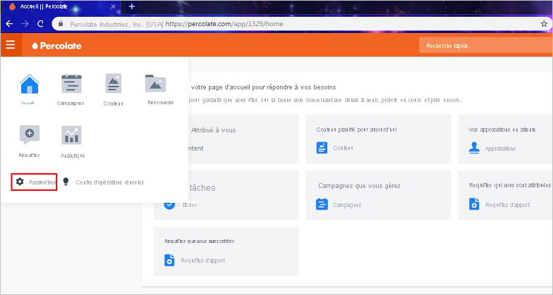
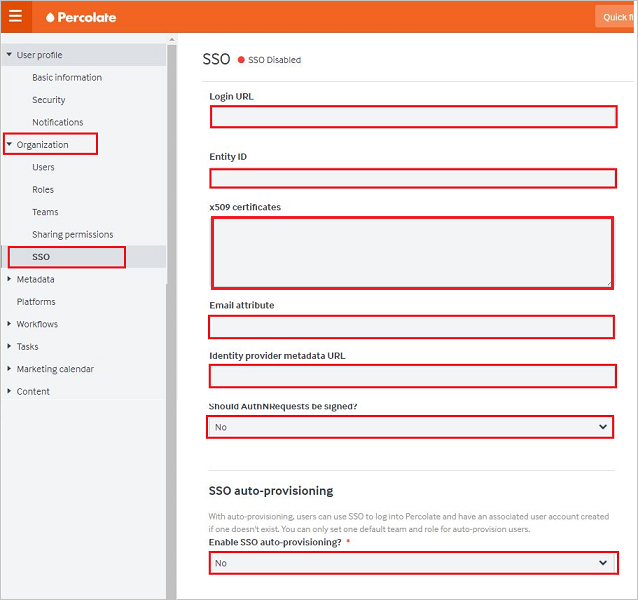

# Tutoriel : Intégration de l’authentification unique Azure AD à Percolate

Dans ce didacticiel, vous allez apprendre à intégrer Percolate à Azure Active Directory (Azure AD). Quand vous intégrez Azure AD à Percolate, vous pouvez :

* Contrôler dans Azure AD qui a accès à Percolate.
* Permettre aux utilisateurs de se connecter automatiquement à Percolate avec leur compte Azure AD.
* Gérer vos comptes à un emplacement central : le Portail Azure.

## Prérequis

Pour configurer l’intégration d’Azure AD à Percolate, vous devez disposer de ce qui suit :

* Un abonnement Azure AD Si vous n’avez pas d’environnement Azure AD, vous pouvez obtenir un [compte gratuit](https://azure.microsoft.com/free/).
* Un abonnement Percolate pour lequel l’authentification unique est activée.

## Description du scénario

Dans ce tutoriel, vous allez configurer et tester l’authentification unique Azure AD dans un environnement de test.

* Percolate prend en charge l’authentification unique lancée par le fournisseur de services et le fournisseur d’identité.

## Ajouter Percolate à partir de la galerie

Pour configurer l’intégration de Percolate dans Azure AD, vous devez ajouter Percolate à partir de la galerie à votre liste d’applications SaaS gérées.

1. Connectez-vous au portail Azure avec un compte professionnel ou scolaire ou avec un compte personnel Microsoft.
1. Dans le panneau de navigation gauche, sélectionnez le service **Azure Active Directory**.
1. Accédez à **Applications d’entreprise**, puis sélectionnez **Toutes les applications**.
1. Pour ajouter une nouvelle application, sélectionnez **Nouvelle application**.
1. Dans la section **Ajouter à partir de la galerie**, tapez **Percolate** dans la zone de recherche.
1. Sélectionnez **Percolate** dans le volet de résultats, puis ajoutez l’application. Patientez quelques secondes pendant que l’application est ajoutée à votre locataire.

## Configurer et tester l’authentification unique Azure AD pour Percolate

Configurez et testez l’authentification unique Azure AD avec Percolate pour un utilisateur test appelé **B.Simon**. Pour que l’authentification unique fonctionne, vous devez établir un lien entre un utilisateur Azure AD et l’utilisateur Percolate associé.

Pour configurer et tester l’authentification unique Azure AD avec Percolate, effectuez les étapes suivantes :

1. **[Configurer l’authentification unique Azure AD](#configure-azure-ad-sso)** pour permettre à vos utilisateurs d’utiliser cette fonctionnalité.
    1. **[Créer un utilisateur de test Azure AD](#create-an-azure-ad-test-user)** pour tester l’authentification unique Azure AD avec B. Simon.
    1. **[Affecter l’utilisateur de test Azure AD](#assign-the-azure-ad-test-user)** pour permettre à B. Simon d’utiliser l’authentification unique Azure AD.
1. **[Configurer l’authentification unique de Percolate](#configure-percolate-sso)** pour configurer les paramètres de l’authentification unique côté application.
    1. **[Créer un utilisateur test Percolate](#create-percolate-test-user)** pour avoir un équivalent de B.Simon dans Percolate lié à la représentation Azure AD de l’utilisateur.
1. **[Tester l’authentification unique](#test-sso)** pour vérifier si la configuration fonctionne.

## Configurer l’authentification unique Azure AD

Effectuez les étapes suivantes pour activer l’authentification unique Azure AD dans le Portail Azure.

1. Dans le portail Azure, accédez à la page d’intégration de l’application **Percolate**, recherchez la section **Gérer** et sélectionnez **Authentification unique**.
1. Dans la page **Sélectionner une méthode d’authentification unique**, sélectionnez **SAML**.
1. Dans la page **Configurer l’authentification unique avec SAML**, cliquez sur l’icône de crayon de **Configuration SAML de base** afin de modifier les paramètres.

   

4. Dans la boîte de dialogue **Configuration SAML de base**, vous n'avez rien à faire pour configurer l’application en mode lancé par le fournisseur d’identité. L’application est déjà intégrée à Azure.

5. Pour configurer l’application en mode lancée par le fournisseur de services, sélectionnez **Définir des URL supplémentaires**, puis dans la zone **URL de connexion**, entrez **https://percolate.com/app/login** .

6. Dans la page **Configurer l’authentification unique avec SAML**, dans la section **Certificat de signature SAML** , sélectionnez l’icône **Copier** pour copier l’**URL des métadonnées de fédération d’application**. Enregistrez cette URL.

    

7. Dans la section **Configurer Percolate**, copiez la ou les URL appropriées, selon vos besoins.

    

### Créer un utilisateur de test Azure AD

Dans cette section, vous allez créer un utilisateur de test appelé B. Simon dans le portail Azure.

1. Dans le volet gauche du Portail Azure, sélectionnez **Azure Active Directory**, **Utilisateurs**, puis **Tous les utilisateurs**.
1. Sélectionnez **Nouvel utilisateur** dans la partie supérieure de l’écran.
1. Dans les propriétés **Utilisateur**, effectuez les étapes suivantes :
   1. Dans le champ **Nom**, entrez `B.Simon`.  
   1. Dans le champ **Nom de l’utilisateur**, entrez username@companydomain.extension. Par exemple : `B.Simon@contoso.com`.
   1. Cochez la case **Afficher le mot de passe**, puis notez la valeur affichée dans le champ **Mot de passe**.
   1. Cliquez sur **Créer**.

### Affecter l’utilisateur de test Azure AD

Dans cette section, vous allez autoriser B.Simon à utiliser l’authentification unique Azure en lui accordant l’accès à Percolate.

1. Dans le portail Azure, sélectionnez **Applications d’entreprise**, puis **Toutes les applications**.
1. Dans la liste des applications, sélectionnez **Percolate**.
1. Dans la page de vue d’ensemble de l’application, recherchez la section **Gérer** et sélectionnez **Utilisateurs et groupes**.
1. Sélectionnez **Ajouter un utilisateur**, puis **Utilisateurs et groupes** dans la boîte de dialogue **Ajouter une attribution**.
1. Dans la boîte de dialogue **Utilisateurs et groupes**, sélectionnez **B. Simon** dans la liste Utilisateurs, puis cliquez sur le bouton **Sélectionner** au bas de l’écran.
1. Si vous attendez qu’un rôle soit attribué aux utilisateurs, vous pouvez le sélectionner dans la liste déroulante **Sélectionner un rôle** . Si aucun rôle n’a été configuré pour cette application, vous voyez le rôle « Accès par défaut » sélectionné.
1. Dans la boîte de dialogue **Ajouter une attribution**, cliquez sur le bouton **Attribuer**.

## Configurer l’authentification unique de Percolate

1. Dans une nouvelle fenêtre de navigateur web, connectez-vous à Percolate en tant qu’administrateur.

2. À gauche de la page d’accueil, sélectionnez **Paramètres** :
    
    

3. Dans le volet gauche, sélectionnez **SSO** sous **Organisation** :

    

    1. Dans la zone **URL de connexion**, collez la valeur **URL de connexion** que vous avez copiée à partir du portail Azure.

    1. Dans la zone **ID d'entité**, collez la valeur **Identificateur Azure AD** que vous avez copiée à partir du portail Azure.

    1. Dans le Bloc-notes, ouvrez le certificat encodé en base 64 que vous avez téléchargé à partir du portail Azure. Copiez son contenu et collez-le dans la zone **Certificats x509**.

    1. Dans la zone **Attribut d'e-mail**, entrez **emailaddress**.

    1. La zone **URL des métadonnées de fournisseur d'identité** correspond à un champ facultatif. Si vous avez copié une **URL des métadonnées de fédération d'application** à partir du portail Azure, vous pouvez la coller dans cette zone.

    1. Dans la liste **Should AuthNRequests be signed?** , sélectionnez **Non**.

    1. Dans la liste **Enable SSO auto-provisioning**, sélectionnez **Non**.

    1. Sélectionnez **Enregistrer**.

### Créer l’utilisateur de test Percolate

Pour autoriser les utilisateurs Azure AD à se connecter à Percolate, vous devez les ajouter dans Percolate. Vous devez les ajouter manuellement.

Pour créer un compte d’utilisateur, procédez comme suit :

1. Connectez-vous à Percolate en tant qu’administrateur.

2. Dans le volet gauche, sélectionnez **Utilisateurs** sous **Organisation**. Sélectionnez **Nouveaux utilisateurs** :

    

3. Dans la page **Créer des utilisateurs**, procédez comme suit.

    

    1. Dans la zone **E-mail**, entrez l’adresse e-mail de l’utilisateur. Par exemple : brittasimon@contoso.com.

    1. Dans la zone **Nom complet** , entrez le nom de l’utilisateur. Par exemple, **Brittasimon**.

    1. Sélectionnez **Créer des utilisateurs**.

## Tester l’authentification unique (SSO)

Dans cette section, vous allez tester votre configuration de l’authentification unique Azure AD avec les options suivantes. 

#### Lancée par le fournisseur de services :

* Cliquez sur **Tester cette application** dans le portail Azure. Vous êtes alors redirigé vers l’URL d’authentification de Percolate, à partir de laquelle vous pouvez lancer le processus de connexion.  

* Accédez directement à l’URL d’authentification de Percolate pour lancer le processus de connexion.

#### Lancée par le fournisseur d’identité :

* Cliquez sur **Tester cette application** dans le portail Azure, ce qui devrait vous connecter automatiquement à l’application Percolate pour laquelle vous avez configuré l’authentification unique. 

Vous pouvez aussi utiliser Mes applications de Microsoft pour tester l’application dans n’importe quel mode. Quand vous cliquez sur la vignette Percolate dans Mes applications, si le mode Fournisseur de services est configuré, vous êtes redirigé vers la page d’authentification de l’application pour lancer le processus de connexion. Si le mode Fournisseur d’identité est configuré, vous êtes automatiquement connecté à l’application Percolate pour laquelle vous avez configuré l’authentification unique. Pour plus d’informations sur Mes applications, consultez [Présentation de Mes applications](../user-help/my-apps-portal-end-user-access.md).

## Étapes suivantes

Après avoir configuré Percolate, vous pouvez appliquer le contrôle de session, qui protège contre l’exfiltration et l’infiltration des données sensibles de votre organisation en temps réel. Le contrôle de session est étendu à partir de l’accès conditionnel. [Découvrez comment appliquer un contrôle de session avec Microsoft Defender for Cloud Apps](/cloud-app-security/proxy-deployment-aad).
