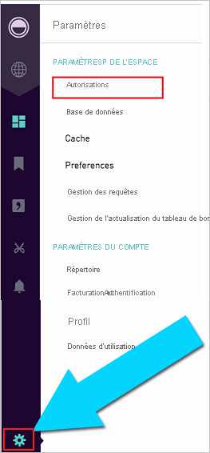
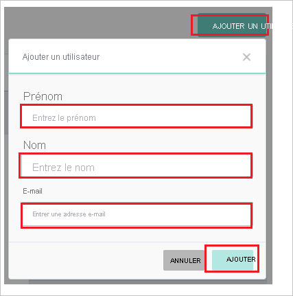

# Tutoriel : Intégration de l’authentification unique Azure AD à Periscope Data

Dans ce tutoriel, vous allez apprendre à intégrer Azure Active Directory (Azure AD) à Periscope Data. Lorsque vous intégrez Azure AD à Periscope Data, vous pouvez :

* Contrôler dans Azure AD qui a accès à Periscope Data.
* Permettre aux utilisateurs de se connecter automatiquement à Periscope Data avec leur compte Azure AD.
* Gérer vos comptes à un emplacement central : le Portail Azure.

## Prérequis

Pour commencer, vous devez disposer de ce qui suit :

* Un abonnement Azure AD Si vous ne disposez d’aucun abonnement, vous pouvez obtenir [un compte gratuit](https://azure.microsoft.com/free/).
* Un abonnement Periscope Data pour lequel l’authentification unique (SSO) est activée.

## Description du scénario

Dans ce didacticiel, vous configurez et testez l’authentification unique Azure AD dans un environnement de test.

* Periscope Data prend en charge l’authentification unique lancée par le **fournisseur de services**.

## Ajouter Periscope Data à partir de la galerie

Pour configurer l’intégration de Periscope Data à Azure AD, vous devez ajouter Periscope Data, disponible dans la galerie, à votre liste d’applications SaaS managées.

1. Connectez-vous au portail Azure avec un compte professionnel ou scolaire ou avec un compte personnel Microsoft.
1. Dans le panneau de navigation gauche, sélectionnez le service **Azure Active Directory**.
1. Accédez à **Applications d’entreprise**, puis sélectionnez **Toutes les applications**.
1. Pour ajouter une nouvelle application, sélectionnez **Nouvelle application**.
1. Dans la section **Ajouter à partir de la galerie**, tapez **Periscope Data** dans la zone de recherche.
1. Sélectionnez **Periscope Data** dans le volet de résultats, puis ajoutez l’application. Patientez quelques secondes pendant que l’application est ajoutée à votre locataire.

## Configurer et tester l’authentification unique Azure AD pour Periscope Data

Configurez et testez l’authentification unique Azure AD avec Periscope Data à l’aide d’un utilisateur test appelé **B.Simon**. Pour que l’authentification unique fonctionne, vous devez établir un lien entre un utilisateur Azure AD et l’utilisateur Periscope Data associé.

Pour configurer et tester l’authentification unique Azure AD avec Periscope Data, effectuez les étapes suivantes :

1. **[Configurer l’authentification unique Azure AD](#configure-azure-ad-sso)** pour permettre à vos utilisateurs d’utiliser cette fonctionnalité.
    1. **[Créer un utilisateur de test Azure AD](#create-an-azure-ad-test-user)** pour tester l’authentification unique Azure AD avec B. Simon.
    1. **[Affecter l’utilisateur de test Azure AD](#assign-the-azure-ad-test-user)** pour permettre à B. Simon d’utiliser l’authentification unique Azure AD.
1. **[Configurer l’authentification unique de Periscope Data](#configure-periscope-data-sso)** pour configurer les paramètres de l’authentification unique côté application.
    1. **[Créer un utilisateur test Periscope Data](#create-periscope-data-test-user)** pour avoir dans Periscope Data un équivalent de B.Simon lié à la représentation Azure AD de l’utilisateur.
1. **[Tester l’authentification unique](#test-sso)** pour vérifier si la configuration fonctionne.

## Configurer l’authentification unique Azure AD

Effectuez les étapes suivantes pour activer l’authentification unique Azure AD dans le Portail Azure.

1. Dans le portail Azure, accédez à la page d’intégration de l’application **Periscope Data**, recherchez la section **Gérer** et sélectionnez **Authentification unique**.
1. Dans la page **Sélectionner une méthode d’authentification unique**, sélectionnez **SAML**.
1. Dans la page **Configurer l’authentification unique avec SAML**, cliquez sur l’icône de crayon de **Configuration SAML de base** afin de modifier les paramètres.

   

4. Dans la section **Configuration SAML de base**, effectuez les étapes suivantes :

    a. Dans la zone de texte **Identificateur (ID d’entité)** , saisissez une URL au format suivant : `https://app.periscopedata.com/<SITENAME>/sso`

    b. Dans la zone de texte **URL de connexion**, tapez une URL en utilisant un des modèles suivants :
    
    | **URL d’authentification** |
    |--------|
    | `https://app.periscopedata.com/` |
    | `https://app.periscopedata.com/app/<SITENAME>` |

    > [!NOTE]
    > La valeur d’URL de connexion n’est pas réelle. Mettez à jour les valeurs avec l’URL de connexion réelle. Contactez l’[équipe du support technique de Periscope Data](mailto:support@periscopedata.com) pour obtenir cette valeur, ainsi que celle de l’identificateur que vous allez récupérer à la section **Configurer l’authentification unique de Periscope Data**, expliquée plus loin dans le tutoriel. Vous pouvez également consulter les modèles figurant à la section **Configuration SAML de base** dans le portail Azure.

5. Dans la page **Configurer l’authentification unique avec SAML**, dans la section **Certificat de signature SAML**, cliquez sur le bouton Copier pour copier l’**URL des métadonnées de fédération d’application**, puis enregistrez-la sur votre ordinateur.

    

### Créer un utilisateur de test Azure AD 

Dans cette section, vous allez créer un utilisateur de test appelé B. Simon dans le portail Azure.

1. Dans le volet gauche du Portail Azure, sélectionnez **Azure Active Directory**, **Utilisateurs**, puis **Tous les utilisateurs**.
1. Sélectionnez **Nouvel utilisateur** dans la partie supérieure de l’écran.
1. Dans les propriétés **Utilisateur**, effectuez les étapes suivantes :
   1. Dans le champ **Nom**, entrez `B.Simon`.  
   1. Dans le champ **Nom de l’utilisateur**, entrez username@companydomain.extension. Par exemple : `B.Simon@contoso.com`.
   1. Cochez la case **Afficher le mot de passe**, puis notez la valeur affichée dans le champ **Mot de passe**.
   1. Cliquez sur **Créer**.

### Affecter l’utilisateur de test Azure AD

Dans cette section, vous allez autoriser B.Simon à utiliser l’authentification unique Azure en lui accordant l’accès à Periscope Data.

1. Dans le portail Azure, sélectionnez **Applications d’entreprise**, puis **Toutes les applications**.
1. Dans la liste des applications, sélectionnez **Periscope Data**.
1. Dans la page de vue d’ensemble de l’application, recherchez la section **Gérer** et sélectionnez **Utilisateurs et groupes**.
1. Sélectionnez **Ajouter un utilisateur**, puis **Utilisateurs et groupes** dans la boîte de dialogue **Ajouter une attribution**.
1. Dans la boîte de dialogue **Utilisateurs et groupes**, sélectionnez **B. Simon** dans la liste Utilisateurs, puis cliquez sur le bouton **Sélectionner** au bas de l’écran.
1. Si vous attendez qu’un rôle soit attribué aux utilisateurs, vous pouvez le sélectionner dans la liste déroulante **Sélectionner un rôle** . Si aucun rôle n’a été configuré pour cette application, vous voyez le rôle « Accès par défaut » sélectionné.
1. Dans la boîte de dialogue **Ajouter une attribution**, cliquez sur le bouton **Attribuer**.

## Configurer l’authentification unique de Periscope Data

1. Dans une autre fenêtre de navigateur web, connectez-vous à Periscope Data en tant qu’administrateur.

2. Ouvrez le menu engrenage en bas à gauche, puis ouvrez le menu **Billing** (Facturation) > **Security** (Sécurité) et effectuez les étapes suivantes. Seuls les administrateurs ont accès à ces paramètres.

    

    a. Copiez l’**URL des métadonnées de fédération de l’application** que vous avez récupérée à l’étape 5 **Certificat de signature SAML** et ouvrez-la dans un navigateur. Un document XML s’ouvre.

    b. Dans la zone de texte **Single Sign-On** (Authentification unique), sélectionnez **Azure Active Directory**.

    c. Recherchez la balise **SingleSignOnService** et collez la valeur de **Location** (Emplacement) dans la zone de texte **SSO URL** (URL SSO).

    d. Recherchez la balise **SingleLogoutService** et collez la valeur de **Location** (Emplacement) dans la zone de texte **SLO URL** (URL SLO).

    e. Copiez la valeur de **Identifier** (Identificateur) pour votre instance et collez-la dans la zone de texte **Identificateur (ID d’entité)** de la section **Configuration SAML de base** du portail Azure.

    f. Recherchez la première balise du fichier XML, copiez la valeur de **entityID** et collez-la dans la zone de texte **Issuer** (Émetteur).

    g. Recherchez la balise **IDPSSODescriptor** avec le protocole SAML. Dans cette section, recherchez la balise **KeyDescriptor** avec **use=signing**. Copiez la valeur de **X509Certificate** (CertificatX509) et collez-la dans la zone de texte **Certificate** (Certificat).

    h. Les sites dotés de plusieurs espaces peuvent choisir l’espace par défaut dans la liste déroulante **Default Space** (Espace par défaut). Cet espace est celui auquel les nouveaux utilisateurs sont ajoutés lorsqu’ils se connectent à Periscope Data pour la première fois et où ils sont provisionnés par le biais de l’authentification unique Active Directory.

    i. Pour terminer, cliquez sur **Save** (Enregistrer) et **confirmez** la modification apportée aux paramètres d’authentification unique en tapant **Logout** (Déconnexion).

    

### Créer l’utilisateur de test Periscope Data

Pour permettre aux utilisateurs Azure AD de se connecter à Periscope Data, vous devez les provisionner dans Periscope Data. Dans Periscope Data, le provisionnement est une tâche manuelle.

**Pour approvisionner un compte d’utilisateur, procédez comme suit :**

1. Connectez-vous à Periscope Data en tant qu’administrateur.

2. Cliquez sur l’icône **Settings** (Paramètres) dans le bas du menu à gauche et accédez à **Permissions** (Autorisations).

    

3. Cliquez sur **ADD USER** (Ajouter un utilisateur) et effectuez les étapes suivantes :

      

    a. Dans la zone de texte **Prénom**, entrez le prénom de l’utilisateur, par exemple **Britta**.

    b. Dans la zone de texte **Nom**, entrez le nom de l’utilisateur, par exemple **Simon**.

    c. Dans la zone de texte **E-mail**, entrez l’adresse e-mail de l’utilisateur, par exemple **brittasimon\@contoso.com**.

    d. Cliquez sur **ADD** (Ajouter).

## Tester l’authentification unique (SSO) 

Dans cette section, vous allez tester votre configuration de l’authentification unique Azure AD avec les options suivantes. 

* Cliquez sur **Tester cette application** dans le portail Azure. Vous êtes alors redirigé vers l’URL d’authentification de Periscope Data, à partir de laquelle vous pouvez lancer le processus de connexion. 

* Accédez directement à l’URL d’authentification de Periscope Data pour lancer le processus de connexion.

* Vous pouvez utiliser Mes applications de Microsoft. Quand vous cliquez sur la vignette Periscope Data dans Mes applications, vous êtes redirigé vers l’URL d’authentification de Periscope Data. Pour plus d’informations sur Mes applications, consultez [Présentation de Mes applications](../user-help/my-apps-portal-end-user-access.md).

## Étapes suivantes

Après avoir configuré Periscope Data, vous pouvez appliquer le contrôle de session, qui protège contre l’exfiltration et l’infiltration des données sensibles de votre organisation en temps réel. Le contrôle de session est étendu à partir de l’accès conditionnel. [Découvrez comment appliquer un contrôle de session avec Microsoft Defender for Cloud Apps](/cloud-app-security/proxy-deployment-aad).
