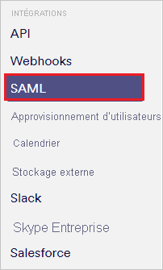
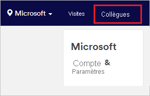
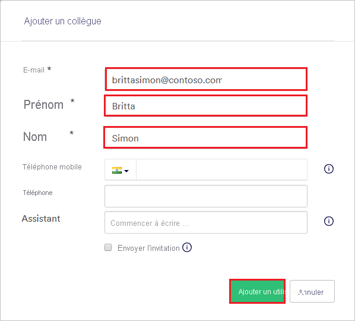

# Didacticiel : Intégration d’Azure Active Directory à Proxyclick

Ce didacticiel vous montrera comment intégrer Proxyclick à Azure Active Directory (Azure AD). Quand vous intégrez Proxyclick à Azure AD, vous pouvez :

* Contrôler dans Azure AD qui a accès à Proxyclick.
* Permettre à vos utilisateurs de se connecter automatiquement à Proxyclick avec leur compte Azure AD.
* Gérer vos comptes à un emplacement central : le Portail Azure.

## Prérequis

Pour commencer, vous devez disposer de ce qui suit :

* Un abonnement Azure AD Si vous ne disposez d’aucun abonnement, vous pouvez obtenir [un compte gratuit](https://azure.microsoft.com/free/)
* Un abonnement Proxyclick pour lequel l’authentification unique est activée.

## Description du scénario

Dans ce tutoriel, vous allez configurer et tester l’authentification unique Azure AD dans un environnement de test.

* Proxyclick prend en charge l’authentification unique lancée par le fournisseur de services et le fournisseur d’identité.

* Proxyclick prend en charge le [provisionnement d’utilisateurs automatisé](proxyclick-provisioning-tutorial.md).

## Ajouter Proxyclick à partir de la galerie

Pour configurer l’intégration de Proxyclick à Azure AD, vous devez ajouter Proxyclick, disponible dans la galerie, à votre liste d’applications SaaS gérées.

1. Connectez-vous au portail Azure avec un compte professionnel ou scolaire ou avec un compte personnel Microsoft.
1. Dans le panneau de navigation gauche, sélectionnez le service **Azure Active Directory**.
1. Accédez à **Applications d’entreprise**, puis sélectionnez **Toutes les applications**.
1. Pour ajouter une nouvelle application, sélectionnez **Nouvelle application**.
1. Dans la section **Ajouter à partir de la galerie**, tapez **Proxyclick** dans la zone de recherche.
1. Sélectionnez **Proxyclick** dans le volet de résultats, puis ajoutez l’application. Patientez quelques secondes pendant que l’application est ajoutée à votre locataire.

## Configurer et tester l’authentification unique Azure AD pour Proxyclick

Configurez et testez l’authentification unique Azure AD avec Proxyclick pour un utilisateur de test nommé **B.Simon**. Pour que l’authentification unique fonctionne, vous devez établir un lien entre un utilisateur Azure AD et l’utilisateur Proxyclick associé.

Pour configurer et tester l’authentification unique Azure AD avec Proxyclick, procédez comme suit :

1. **[Configurer l’authentification unique Azure AD](#configure-azure-ad-sso)** pour permettre à vos utilisateurs d’utiliser cette fonctionnalité.
    1. **[Créer un utilisateur de test Azure AD](#create-an-azure-ad-test-user)** pour tester l’authentification unique Azure AD avec B. Simon.
    1. **[Affecter l’utilisateur de test Azure AD](#assign-the-azure-ad-test-user)** pour permettre à B. Simon d’utiliser l’authentification unique Azure AD.
1. **[Configurer l’authentification unique Proxyclick](#configure-proxyclick-sso)** pour configurer les paramètres de l’authentification unique côté application.
    1. **[Créer un utilisateur de test Proxyclick](#create-proxyclick-test-user)** pour avoir un équivalent de B.Simon dans Proxyclick lié à la représentation Azure AD associée.
1. **[Tester l’authentification unique](#test-sso)** pour vérifier si la configuration fonctionne.

## Configurer l’authentification unique Azure AD

Effectuez les étapes suivantes pour activer l’authentification unique Azure AD dans le Portail Azure.

1. Dans le portail Azure, accédez à la page d’intégration de l’application **Proxyclick**, recherchez la section **Gérer** et sélectionnez **Authentification unique**.
1. Dans la page **Sélectionner une méthode d’authentification unique**, sélectionnez **SAML**.
1. Dans la page **Configurer l’authentification unique avec SAML**, cliquez sur l’icône de crayon de **Configuration SAML de base** afin de modifier les paramètres.

   

4. Dans la boîte de dialogue **Configuration SAML de base**, si vous souhaitez configurer l’application en mode lancé par le fournisseur d’identité, procédez comme suit.
    
    a. Dans la zone de texte **Identificateur**, tapez une URL en utilisant le format suivant : `https://saml.proxyclick.com/init/<COMPANY_ID>`

    b. Dans la zone **URL de réponse**, tapez une URL au format suivant : `https://saml.proxyclick.com/consume/<COMPANY_ID>`

5. Si vous voulez configurer l’application en mode lancé par le fournisseur de services, sélectionnez **Définir des URL supplémentaires**. Dans la zone de texte **URL de connexion**, tapez une URL au format suivant :
   
   `https://saml.proxyclick.com/init/<COMPANY_ID>`

    > [!NOTE]
    > Ces valeurs sont des espaces réservés. Vous devez utiliser l’identificateur, l’URL de réponse et l’URL de connexion exacts. Vous trouverez plus loin dans ce tutoriel les étapes permettant d’obtenir ces valeurs.

6. Dans la page **Configurer l’authentification unique avec SAML**, dans la section **Certificat de signature SAML**, sélectionnez le lien **Télécharger** en regard du **Certificat (Base64)** correspondant à vos besoins, puis enregistrez le certificat sur votre ordinateur :

    

7. Dans la section **Configurer Proxyclick**, copiez la ou les URL appropriées, selon vos besoins :

    

### Créer un utilisateur de test Azure AD

Dans cette section, vous allez créer un utilisateur de test appelé B. Simon dans le portail Azure.

1. Dans le volet gauche du Portail Azure, sélectionnez **Azure Active Directory**, **Utilisateurs**, puis **Tous les utilisateurs**.
1. Sélectionnez **Nouvel utilisateur** dans la partie supérieure de l’écran.
1. Dans les propriétés **Utilisateur**, effectuez les étapes suivantes :
   1. Dans le champ **Nom**, entrez `B.Simon`.  
   1. Dans le champ **Nom de l’utilisateur**, entrez username@companydomain.extension. Par exemple : `B.Simon@contoso.com`.
   1. Cochez la case **Afficher le mot de passe**, puis notez la valeur affichée dans le champ **Mot de passe**.
   1. Cliquez sur **Créer**.

### Affecter l’utilisateur de test Azure AD

Dans cette section, vous allez autoriser B.Simon à utiliser l’authentification unique Azure en lui accordant l’accès à Proxyclick.

1. Dans le portail Azure, sélectionnez **Applications d’entreprise**, puis **Toutes les applications**.
1. Dans la liste des applications, sélectionnez **Proxyclick**.
1. Dans la page de vue d’ensemble de l’application, recherchez la section **Gérer** et sélectionnez **Utilisateurs et groupes**.
1. Sélectionnez **Ajouter un utilisateur**, puis **Utilisateurs et groupes** dans la boîte de dialogue **Ajouter une attribution**.
1. Dans la boîte de dialogue **Utilisateurs et groupes**, sélectionnez **B. Simon** dans la liste Utilisateurs, puis cliquez sur le bouton **Sélectionner** au bas de l’écran.
1. Si vous attendez qu’un rôle soit attribué aux utilisateurs, vous pouvez le sélectionner dans la liste déroulante **Sélectionner un rôle** . Si aucun rôle n’a été configuré pour cette application, vous voyez le rôle « Accès par défaut » sélectionné.
1. Dans la boîte de dialogue **Ajouter une attribution**, cliquez sur le bouton **Attribuer**.

## Configurer l’authentification unique Proxyclick

1. Dans une nouvelle fenêtre de navigateur web, connectez-vous à votre site d’entreprise Proxyclick en tant qu’administrateur.

2. Sélectionnez **Compte et paramètres**.

    

3. Faites défiler jusqu’à la section **Intégrations**, puis sélectionnez **SAML**.

    

4. Dans la section **SAML**, procédez comme suit.

    

    1. Copiez la valeur de l’**URL de consommateur SAML**, puis collez-la dans la zone **URL de réponse** de la boîte de dialogue **Configuration SAML de base** du portail Azure.

    1. Copiez la valeur de l’**URL de redirection d’authentification unique SAML**, puis collez-la dans les zones **URL de connexion** et **Identificateur** de la boîte de dialogue **Configuration SAML de base** du portail Azure.

    1. Dans la liste **Méthode de requête SAML**, sélectionnez **Redirection HTTP**.

    1. Dans la zone **Émetteur**, collez la valeur **Identificateur Azure AD** copiée à partir du portail Azure.

    1. Dans la zone **URL de point de terminaison SAML 2.0**, collez la valeur de l’**URL de connexion** que vous avez copiée à partir du portail Azure.

    1. Dans le bloc-notes, ouvrez le fichier de certificat que vous avez téléchargé à partir du portail Azure. Collez le contenu de ce fichier dans la zone **Certificat**.

    1. Sélectionnez **Enregistrer les modifications**.

### Créer un utilisateur de test Proxyclick

Pour autoriser les utilisateurs Azure AD à se connecter à Proxyclick, vous devez les ajouter dans Proxyclick. Vous devez les ajouter manuellement.

Pour créer un compte d’utilisateur, procédez comme suit :

1. Connectez-vous à votre site d’entreprise Proxyclick en tant qu’administrateur.

1. Sélectionnez **Collègues** en haut de la fenêtre.

    

1. Sélectionnez **Ajouter un collègue**.

    

1. Dans la section **Ajouter un collègue**, procédez comme suit.

    

    1. Dans la zone **E-mail**, entrez l’adresse e-mail de l’utilisateur. Dans ce cas, **brittasimon\@contoso.com**.

    1. Dans la boîte **Prénom**, entrez le prénom de l’utilisateur. Dans ce cas, **Britta**.

    1. Dans la boîte **Nom**, entrez le nom de l’utilisateur. Dans ce cas, **Simon**.

    1. Sélectionnez **Add User** (Ajouter un utilisateur).

> [!NOTE]
> Proxyclick prend également en charge le provisionnement automatique d’utilisateurs ; vous trouverez plus d’informations [ici](./proxyclick-provisioning-tutorial.md) sur la façon de configurer ce dernier.

## Tester l’authentification unique (SSO)

Dans cette section, vous allez tester votre configuration de l’authentification unique Azure AD avec les options suivantes. 

#### Lancée par le fournisseur de services :

* Cliquez sur **Tester cette application** dans le portail Azure. Vous êtes alors redirigé vers l’URL de connexion Proxyclick, à partir de laquelle vous pouvez lancer le flux de connexion.  

* Accédez directement à l’URL de connexion à Proxyclick et lancez le flux de connexion.

#### Lancée par le fournisseur d’identité :

* Sur le portail Azure, cliquez sur **Tester cette application**. Vous êtes alors automatiquement connecté à l’instance de Proxyclick pour laquelle vous avez configuré l’authentification unique. 

Vous pouvez aussi utiliser Mes applications de Microsoft pour tester l’application dans n’importe quel mode. Si, quand vous cliquez sur la vignette Proxyclick dans Mes applications, le mode Fournisseur de services est configuré, vous êtes redirigé vers la page de connexion de l’application pour lancer le flux de connexion ; s’il s’agit du mode Fournisseur d’identité, vous êtes automatiquement connecté à l’instance de Proxyclick pour laquelle vous avez configuré l’authentification unique. Pour plus d’informations sur Mes applications, consultez [Présentation de Mes applications](https://support.microsoft.com/account-billing/sign-in-and-start-apps-from-the-my-apps-portal-2f3b1bae-0e5a-4a86-a33e-876fbd2a4510).

## Étapes suivantes

Une fois que vous avez configuré Proxyclick, vous pouvez appliquer le contrôle de session qui protège contre l’exfiltration et l’infiltration des données sensibles de votre organisation en temps réel. Le contrôle de session est étendu à partir de l’accès conditionnel. [Découvrez comment appliquer un contrôle de session avec Microsoft Defender for Cloud Apps](/cloud-app-security/proxy-deployment-aad).
