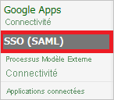
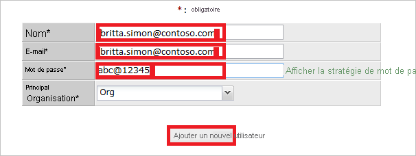

# Tutoriel : Intégration de l’authentification unique Azure AD à Questetra BPM Suite

Dans ce tutoriel, vous allez apprendre à intégrer Questetra BPM Suite à Azure Active Directory (Azure AD). Quand vous intégrez Azure AD à Questetra BPM Suite, vous pouvez :

* Contrôler dans Azure AD qui a accès à Questetra BPM Suite.
* Permettre à vos utilisateurs de se connecter automatiquement à Questetra BPM Suite avec leur compte Azure AD.
* Gérer vos comptes à un emplacement central : le Portail Azure.

## Prérequis

Pour commencer, vous devez disposer de ce qui suit :

* Un abonnement Azure AD Si vous ne disposez d’aucun abonnement, vous pouvez obtenir [un compte gratuit](https://azure.microsoft.com/free/).
* Un abonnement Questetra BPM Suite pour lequel l’authentification unique (SSO) est activée.

## Description du scénario

Dans ce didacticiel, vous configurez et testez l’authentification unique Azure AD dans un environnement de test.

* Questetra BPM Suite prend en charge l’authentification unique lancée par le **fournisseur de services**.

## Ajouter Questetra BPM Suite à partir de la galerie

Pour configurer l'intégration de Questetra BPM Suite avec Azure AD, vous devez ajouter Questetra BPM Suite, disponible dans la galerie, à votre liste d'applications SaaS gérées.

1. Connectez-vous au portail Azure avec un compte professionnel ou scolaire ou avec un compte personnel Microsoft.
1. Dans le panneau de navigation gauche, sélectionnez le service **Azure Active Directory**.
1. Accédez à **Applications d’entreprise**, puis sélectionnez **Toutes les applications**.
1. Pour ajouter une nouvelle application, sélectionnez **Nouvelle application**.
1. Dans la section **Ajouter à partir de la galerie**, tapez **Questetra BPM Suite** dans la zone de recherche.
1. Sélectionnez **Questetra BPM Suite** dans le volet de résultats, puis ajoutez l’application. Patientez quelques secondes pendant que l’application est ajoutée à votre locataire.

## Configurer et tester l’authentification unique Azure AD pour Questetra BPM Suite

Configurez et testez l’authentification unique Azure AD avec Questetra BPM Suite à l’aide d’un utilisateur test appelé **B.Simon**. Pour que l’authentification unique fonctionne, vous devez établir un lien entre un utilisateur Azure AD et l’utilisateur Questetra BPM Suite associé.

Pour configurer et tester l’authentification unique Azure AD avec Questetra BPM Suite, effectuez les étapes suivantes :

1. **[Configurer l’authentification unique Azure AD](#configure-azure-ad-sso)** pour permettre à vos utilisateurs d’utiliser cette fonctionnalité.
    1. **[Créer un utilisateur de test Azure AD](#create-an-azure-ad-test-user)** pour tester l’authentification unique Azure AD avec B. Simon.
    1. **[Affecter l’utilisateur de test Azure AD](#assign-the-azure-ad-test-user)** pour permettre à B. Simon d’utiliser l’authentification unique Azure AD.
1. **[Configurer l’authentification unique de Questetra BPM Suite](#configure-questetra-bpm-suite-sso)** pour configurer les paramètres de l’authentification unique côté application.
    1. **[Créer un utilisateur test Questetra BPM Suite](#create-questetra-bpm-suite-test-user)** pour avoir un équivalent de B.Simon dans Questetra BPM Suite, lié à la représentation Azure AD de l’utilisateur.
1. **[Tester l’authentification unique](#test-sso)** pour vérifier si la configuration fonctionne.

## Configurer l’authentification unique Azure AD

Effectuez les étapes suivantes pour activer l’authentification unique Azure AD dans le Portail Azure.

1. Dans le portail Azure, accédez à la page d’intégration de l’application **Questetra BPM Suite**, recherchez la section **Gérer** et sélectionnez **Authentification unique**.
1. Dans la page **Sélectionner une méthode d’authentification unique**, sélectionnez **SAML**.
1. Dans la page **Configurer l’authentification unique avec SAML**, cliquez sur l’icône de crayon de **Configuration SAML de base** afin de modifier les paramètres.

   

4. Dans la section **Configuration SAML de base**, effectuez les étapes suivantes :

    a. Dans la zone de texte **Identificateur (ID d’entité)** , saisissez une URL au format suivant : `https://<subdomain>.questetra.net/`

    b. Dans la zone de texte **URL de connexion**, saisissez une URL au format suivant : `https://<subdomain>.questetra.net/saml/SSO/alias/bpm`

    > [!NOTE]
    > Il ne s’agit pas de valeurs réelles. Mettez à jour ces valeurs avec l’identificateur et l’URL de connexion réels. Vous pouvez obtenir ces valeurs dans la section **Informations SP** de votre site d’entreprise **Questetra BPM Suite**, décrit plus loin dans le didacticiel ou contacter l’[équipe de support Questetra BPM Suite](https://www.questetra.com/contact/). Vous pouvez également consulter les modèles figurant à la section **Configuration SAML de base** dans le portail Azure.

5. Dans la page **Configurer l’authentification unique avec SAML**, dans la section **Certificat de signature SAML**, cliquez sur **Télécharger** pour télécharger le **Certificat (Base64)** en fonction des options définies par rapport à vos besoins, puis enregistrez-le sur votre ordinateur.

    

6. Dans la section **Configurer Questetra BPM Suite**, copiez la ou les URL appropriées en fonction de vos besoins.

    

### Créer un utilisateur de test Azure AD 

Dans cette section, vous allez créer un utilisateur de test appelé B. Simon dans le portail Azure.

1. Dans le volet gauche du Portail Azure, sélectionnez **Azure Active Directory**, **Utilisateurs**, puis **Tous les utilisateurs**.
1. Sélectionnez **Nouvel utilisateur** dans la partie supérieure de l’écran.
1. Dans les propriétés **Utilisateur**, effectuez les étapes suivantes :
   1. Dans le champ **Nom**, entrez `B.Simon`.  
   1. Dans le champ **Nom de l’utilisateur**, entrez username@companydomain.extension. Par exemple : `B.Simon@contoso.com`.
   1. Cochez la case **Afficher le mot de passe**, puis notez la valeur affichée dans le champ **Mot de passe**.
   1. Cliquez sur **Créer**.

### Affecter l’utilisateur de test Azure AD

Dans cette section, vous allez autoriser B.Simon à utiliser l’authentification unique Azure en lui accordant l’accès à Questetra BPM Suite.

1. Dans le portail Azure, sélectionnez **Applications d’entreprise**, puis **Toutes les applications**.
1. Dans la liste des applications, sélectionnez **Questetra BPM Suite**.
1. Dans la page de vue d’ensemble de l’application, recherchez la section **Gérer** et sélectionnez **Utilisateurs et groupes**.
1. Sélectionnez **Ajouter un utilisateur**, puis **Utilisateurs et groupes** dans la boîte de dialogue **Ajouter une attribution**.
1. Dans la boîte de dialogue **Utilisateurs et groupes**, sélectionnez **B. Simon** dans la liste Utilisateurs, puis cliquez sur le bouton **Sélectionner** au bas de l’écran.
1. Si vous attendez qu’un rôle soit attribué aux utilisateurs, vous pouvez le sélectionner dans la liste déroulante **Sélectionner un rôle** . Si aucun rôle n’a été configuré pour cette application, vous voyez le rôle « Accès par défaut » sélectionné.
1. Dans la boîte de dialogue **Ajouter une attribution**, cliquez sur le bouton **Attribuer**.

## Configurer l’authentification unique de Questetra BPM Suite

1. Dans une autre fenêtre de navigateur web, connectez-vous à votre site d’entreprise **Questetra BPM Suite** en tant qu’administrateur.

2. Dans le menu situé en haut, cliquez sur **Paramètres système**. 
   
    

3. Pour ouvrir la page **SingleSignOnSAML**, cliquez sur **SSO (SAML)** . 

    

4. Sur votre site d’entreprise **Questetra BPM Suite**, dans la section **Informations SP**, effectuez les étapes suivantes :

    a. Copiez l’**URL ACS**, puis collez-la dans la zone de texte **URL de connexion** dans la section **Configuration SAML de base** du portail Azure.
    
    b. Copiez l’**ID d’entité**, puis collez-la dans la zone de texte **Identificateur** dans la section **Configuration SAML de base** du portail Azure.

5. Sur votre site d’entreprise **Questetra BPM Suite**, effectuez les étapes suivantes : 
   
    
   
    a. Sélectionnez **Activer l'authentification unique**.
   
    b. Dans la zone de texte **Entity Id**, collez la valeur **Identificateur Azure AD** que vous avez copiée dans le portail Azure.
    
    c. Dans la zone de texte **Sign-in page URL**, collez la valeur **URL de connexion** que vous avez copiée à partir du portail Azure.
    
    d. Dans la zone de texte **Sign-out page URL**, collez la valeur **URL de déconnexion** que vous avez copiée à partir du portail Azure.
    
    e. Dans la zone de texte **Format NameID**, type `urn:oasis:names:tc:SAML:1.1:nameid-format:emailAddress`.

    f. Ouvrez, dans le Bloc-notes, votre certificat codé en **base 64**, téléchargé à partir du portail Azure, copiez son contenu dans le Presse-papiers, puis collez-le dans la zone de texte **Certificat de validation**. 

    g. Cliquez sur **Enregistrer**.

### Créer un utilisateur de test Questetra BPM Suite

L'objectif de cette section est de créer un utilisateur appelé Britta Simon dans Questetra BPM Suite.

**Pour créer un utilisateur appelé Britta Simon dans Questetra BPM Suite, procédez comme suit :**

1. Connectez-vous à votre site d’entreprise Questetra BPM Suite en tant qu’administrateur.

2. Accédez à **Paramètres système > Liste des utilisateurs > Nouvel utilisateur**.
 
3. Dans la boîte de dialogue Nouvel utilisateur, procédez comme suit : 
   
    
   
    a. Dans la zone de texte **Nom**, tapez le **nom** de l’utilisateur britta.simon@contoso.com.
   
    b. Dans la zone de texte **E-mail**, entrez l’**e-mail** de l’utilisateur britta.simon@contoso.com.
   
    c. Dans la zone de texte **Mot de passe**, tapez un **mot de passe** pour l’utilisateur.
    
    d. Cliquez sur **Ajouter un nouvel utilisateur**.

## Tester l’authentification unique (SSO) 

Dans cette section, vous allez tester votre configuration de l’authentification unique Azure AD avec les options suivantes. 

* Cliquez sur **Tester cette application** dans le portail Azure. Vous êtes alors redirigé vers l’URL d’authentification de Questetra BPM Suite, où vous pouvez lancer le processus de connexion. 

* Accédez directement à l’URL d’authentification de Questetra BPM Suite pour lancer le processus de connexion.

* Vous pouvez utiliser Mes applications de Microsoft. Quand vous cliquez sur la vignette Questetra BPM Suite dans Mes applications, vous êtes redirigé vers l’URL d’authentification de Questetra BPM Suite. Pour plus d’informations sur Mes applications, consultez [Présentation de Mes applications](../user-help/my-apps-portal-end-user-access.md).

## Étapes suivantes

Après avoir configuré Questetra BPM Suite, vous pouvez appliquer le contrôle de session, qui protège contre l’exfiltration et l’infiltration des données sensibles de votre organisation en temps réel. Le contrôle de session est étendu à partir de l’accès conditionnel. [Découvrez comment appliquer un contrôle de session avec Microsoft Defender for Cloud Apps](/cloud-app-security/proxy-deployment-aad).
