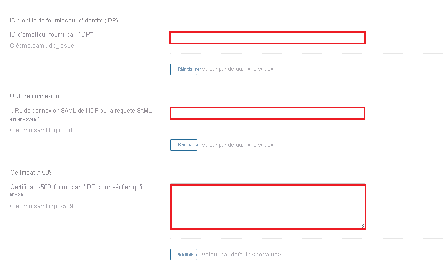
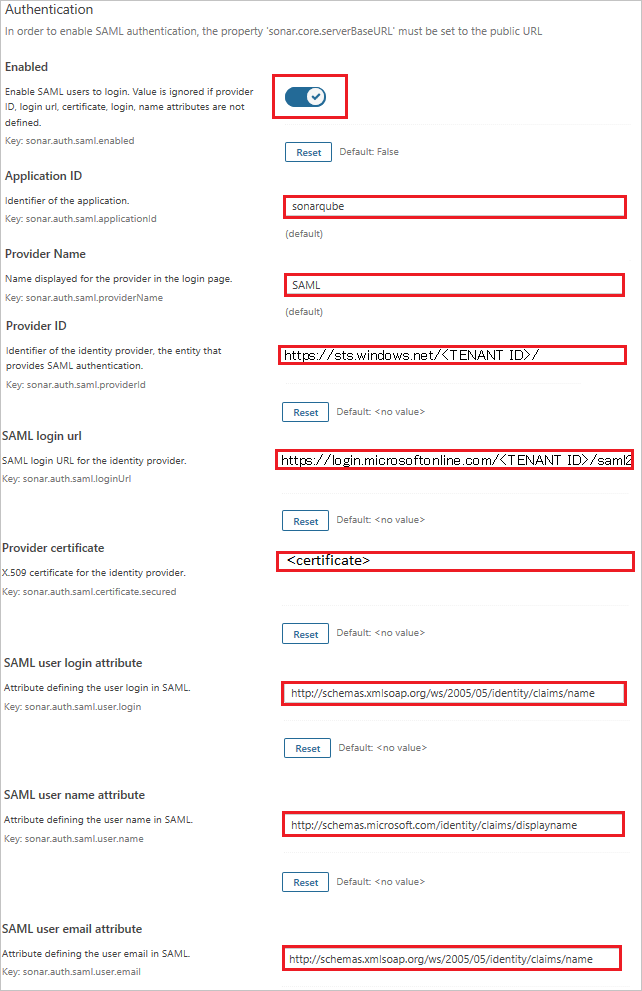

# Tutoriel : Intégration de l’authentification unique Azure Active Directory à Sonarqube

Dans ce tutoriel, vous allez apprendre à intégrer Sonarqube à Azure Active Directory (Azure AD). Quand vous intégrez Sonarqube à Azure AD, vous pouvez :

* Contrôler dans Azure AD qui a accès à Sonarqube.
* Permettre à vos utilisateurs de se connecter automatiquement à Sonarqube avec leur compte Azure AD.
* Gérer vos comptes à un emplacement central : le Portail Azure.

## Prérequis

Pour commencer, vous devez disposer de ce qui suit :

* Un abonnement Azure AD Si vous ne disposez d’aucun abonnement, vous pouvez obtenir [un compte gratuit](https://azure.microsoft.com/free/).
* Un abonnement Sonarqube pour lequel l’authentification unique est activée.

## Description du scénario

Dans ce tutoriel, vous allez configurer et tester l’authentification unique Azure AD dans un environnement de test.

* Sonarqube prend en charge l’authentification unique lancée par le **fournisseur de services**.

> [!NOTE]
> L’identificateur de cette application étant une valeur de chaîne fixe, une seule instance peut être configurée dans un locataire.

## Ajouter Sonarqube à partir de la galerie

Pour configurer l’intégration de Sonarqube à Azure AD, vous devez ajouter Sonarqube à partir de la galerie à votre liste d’applications SaaS gérées.

1. Connectez-vous au portail Azure avec un compte professionnel ou scolaire ou avec un compte personnel Microsoft.
1. Dans le panneau de navigation gauche, sélectionnez le service **Azure Active Directory**.
1. Accédez à **Applications d’entreprise**, puis sélectionnez **Toutes les applications**.
1. Pour ajouter une nouvelle application, sélectionnez **Nouvelle application**.
1. Dans la section **Ajouter à partir de la galerie**, tapez **Sonarqube** dans la zone de recherche.
1. Sélectionnez **Sonarqube** dans le volet de résultats, puis ajoutez l’application. Patientez quelques secondes pendant que l’application est ajoutée à votre locataire.

## Configurer et tester l’authentification unique Azure AD pour SonarQube

Configurez et testez l’authentification unique Azure AD avec Sonarqube à l’aide d’un utilisateur de test nommé **B.Simon**. Pour que l’authentification unique fonctionne, vous devez établir un lien entre un utilisateur Azure AD et l’utilisateur Sonarqube associé.

Pour configurer et tester l’authentification unique Azure AD avec SonarQube, effectuez les étapes suivantes :

1. **[Configurer l’authentification unique Azure AD](#configure-azure-ad-sso)** pour permettre à vos utilisateurs d’utiliser cette fonctionnalité.
    1. **[Créer un utilisateur de test Azure AD](#create-an-azure-ad-test-user)** pour tester l’authentification unique Azure AD avec B. Simon.
    1. **[Affecter l’utilisateur de test Azure AD](#assign-the-azure-ad-test-user)** pour permettre à B. Simon d’utiliser l’authentification unique Azure AD.
1. **[Configurer l’authentification unique Sonarqube](#configure-sonarqube-sso)** pour configurer les paramètres de l’authentification unique côté application.
    1. **[Créer un utilisateur de test Sonarqube](#create-sonarqube-test-user)** pour avoir un équivalent de B.Simon dans Sonarqube lié à la représentation Azure AD associée.
1. **[Tester l’authentification unique](#test-sso)** pour vérifier si la configuration fonctionne.

## Configurer l’authentification unique Azure AD

Effectuez les étapes suivantes pour activer l’authentification unique Azure AD dans le Portail Azure.

1. Dans le portail Azure, accédez à la page d’intégration de l’application **SonarQube**, recherchez la section **Gérer**, puis sélectionnez **Authentification unique**.
1. Dans la page **Sélectionner une méthode d’authentification unique**, sélectionnez **SAML**.
1. Dans la page **Configurer l’authentification unique avec SAML**, cliquez sur l’icône de crayon de **Configuration SAML de base** afin de modifier les paramètres.

   

1. Dans la section **Configuration SAML de base**, effectuez les étapes suivantes :

    a. Dans la zone de texte **URL de réponse**, tapez une URL au format suivant : `https://servicessonar.<YOUR_ORGANIZATION>.com`

    b. Dans la zone de texte **URL d’authentification**, tapez l’une des URL suivantes :

    * **Pour l’environnement de production**

        `https://servicessonar.corp.microsoft.com/`

    * **Pour l’environnement de développement**

        `https://servicescode-dev.westus.cloudapp.azure.com`

    > [!NOTE]
    > Cette valeur n’est pas la valeur réelle. Mettez à jour la valeur avec l’URL de réponse réelle, qui sont expliquées plus loin dans le tutoriel.

1. Dans la page **Configurer l’authentification unique avec SAML**, dans la section **Certificat de signature SAML**, recherchez **Certificat (en base64)** , puis sélectionnez **Télécharger** pour télécharger le certificat et l’enregistrer sur votre ordinateur.

    

1. Dans la section **Configurer Sonarqube**, copiez l’URL ou les URL appropriées en fonction de vos besoins.

    

### Créer un utilisateur de test Azure AD

Dans cette section, vous allez créer un utilisateur de test appelé B. Simon dans le portail Azure.

1. Dans le volet gauche du Portail Azure, sélectionnez **Azure Active Directory**, **Utilisateurs**, puis **Tous les utilisateurs**.
1. Sélectionnez **Nouvel utilisateur** dans la partie supérieure de l’écran.
1. Dans les propriétés **Utilisateur**, effectuez les étapes suivantes :
   1. Dans le champ **Nom**, entrez `B.Simon`.  
   1. Dans le champ **Nom de l’utilisateur**, entrez username@companydomain.extension. Par exemple : `B.Simon@contoso.com`.
   1. Cochez la case **Afficher le mot de passe**, puis notez la valeur affichée dans le champ **Mot de passe**.
   1. Cliquez sur **Créer**.

### Affecter l’utilisateur de test Azure AD

Dans cette section, vous allez autoriser B.Simon à utiliser l’authentification unique Azure en lui accordant l’accès à Sonarqube.

1. Dans le portail Azure, sélectionnez **Applications d’entreprise**, puis **Toutes les applications**.
1. Dans la liste des applications, sélectionnez **Sonarqube**.
1. Dans la page de vue d’ensemble de l’application, recherchez la section **Gérer** et sélectionnez **Utilisateurs et groupes**.
1. Sélectionnez **Ajouter un utilisateur**, puis **Utilisateurs et groupes** dans la boîte de dialogue **Ajouter une attribution**.
1. Dans la boîte de dialogue **Utilisateurs et groupes**, sélectionnez **B. Simon** dans la liste Utilisateurs, puis cliquez sur le bouton **Sélectionner** au bas de l’écran.
1. Si vous attendez qu’un rôle soit attribué aux utilisateurs, vous pouvez le sélectionner dans la liste déroulante **Sélectionner un rôle** . Si aucun rôle n’a été configuré pour cette application, vous voyez le rôle « Accès par défaut » sélectionné.
1. Dans la boîte de dialogue **Ajouter une attribution**, cliquez sur le bouton **Attribuer**.

## Configurer l’authentification unique Sonarqube

1. Ouvrez une nouvelle fenêtre de navigateur web et connectez-vous à votre site d’entreprise Sonarqube en tant qu’administrateur.

1. Cliquez sur **Administration > Configuration > Sécurité**, accédez au **Plug-in SAML**, puis effectuez les étapes suivantes.

1. Copiez les informations suivantes à partir des métadonnées de du fournisseur d’identité (IdP), puis collez-les dans les champs de texte correspondants dans le plug-in SonarQube.
    1. ID d’entité de fournisseur d’identité (IdP)
    2. URL de connexion
    3. X.509 Certificate 

1. Enregistrez toutes les informations.

    

1. Sur la page **SAML** , procédez comme suit :

    

    a. Affectez à l’option **Enabled** (Activé) la valeur **yes** (oui).

    b. Dans la zone de texte **Application ID** (ID de l’application), entrez un nom, par exemple **sonarqube**.

    c. Dans la zone de texte **Provider Name** (Nom du fournisseur), entrez un nom, par exemple **SAML**.

    d. Dans la zone de texte **Provider ID** (ID du fournisseur), collez la valeur **Identificateur Azure AD** que vous avez copiée à partir du Portail Azure.

    e. Dans la zone de texte **SAML login url** (URL de connexion SAML), collez la valeur **URL de connexion** que vous avez copiée à partir du Portail Azure.

    f. Ouvrez le certificat encodé en Base64 dans le Bloc-notes, puis copiez son contenu et collez-le dans la zone de texte **Provider certificate** (Certificat du fournisseur).

    g. Dans la zone de texte **SAML user login attribute** (Attribut de la connexion utilisateur SAML), entrez la valeur `http://schemas.xmlsoap.org/ws/2005/05/identity/claims/name`.

    h. Dans la zone de texte **SAML user name attribute** (Attribut du nom d’utilisateur SAML), entrez la valeur `http://schemas.microsoft.com/identity/claims/displayname`.

    i. Dans la zone de texte **SAML user email attribute** (Attribut de l’adresse e-mail de l’utilisateur SAML), entrez la valeur `http://schemas.xmlsoap.org/ws/2005/05/identity/claims/name`.

    j. Cliquez sur **Enregistrer**.

### Créer un utilisateur de test Sonarqube

Dans cette section, vous allez créer un utilisateur appelé B.Simon dans Sonarqube. Collaborez avec l’[équipe du support technique de Sonarqube](https://www.sonarsource.com/support/) pour ajouter des utilisateurs dans la plateforme Sonarqube. Les utilisateurs doivent être créés et activés avant que vous utilisiez l’authentification unique. 

## Tester l’authentification unique (SSO) 

Dans cette section, vous allez tester votre configuration de l’authentification unique Azure AD avec les options suivantes. 

* Cliquez sur **Tester cette application** dans le portail Azure. Cette opération redirige vers l’URL de connexion SonarQube, où vous pouvez lancer le flux de connexion. 

* Accédez directement à l’URL de connexion SonarQube et lancez le flux de connexion à partir de là.

* Vous pouvez utiliser Mes applications de Microsoft. Le fait de cliquer sur la vignette Sonarqube dans Mes applications vous redirige vers l’URL de connexion Sonarqube. Pour plus d’informations sur Mes applications, consultez [Présentation de Mes applications](../user-help/my-apps-portal-end-user-access.md).

## Étapes suivantes

* Après avoir configuré SonarQube, vous pouvez appliquer des contrôles de session, qui protègent contre l’exfiltration et l’infiltration des données sensibles de votre organisation en temps réel. Les contrôles de session sont étendus à partir de l’accès conditionnel. [Découvrez comment appliquer un contrôle de session avec Microsoft Cloud App Security](/cloud-app-security/proxy-deployment-any-app).