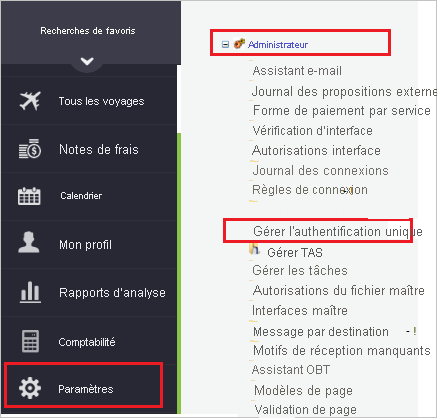
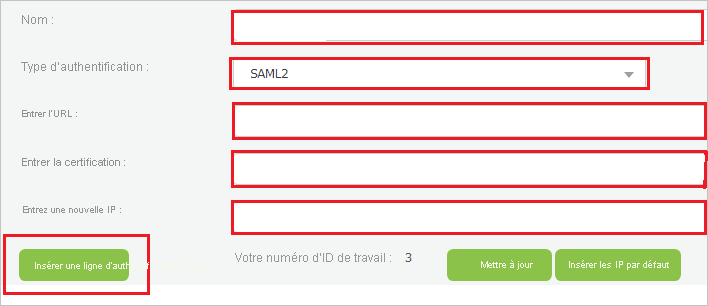

# Tutoriel : Intégration d’Azure Active Directory à TAS

Dans ce tutoriel, vous allez apprendre à intégrer TAS à Azure Active Directory (Azure AD). Quand vous intégrez TAS à Azure AD, vous pouvez :

* Contrôler dans Azure AD qui a accès à TAS.
* Permettre à vos utilisateurs de se connecter automatiquement à TAS avec leur compte Azure AD.
* Gérer vos comptes à un emplacement central : le Portail Azure.

## Prérequis

Pour commencer, vous devez disposer de ce qui suit :

* Un abonnement Azure AD Si vous ne disposez d’aucun abonnement, vous pouvez obtenir [un compte gratuit](https://azure.microsoft.com/free/).
* Un abonnement TAS pour lequel l’authentification unique est activée

## Description du scénario

Dans ce didacticiel, vous configurez et testez l’authentification unique Azure AD dans un environnement de test.

* TAS prend en charge l’authentification unique initiée par le **fournisseur de services et le fournisseur d’identité**.

## Ajouter TAS à partir de la galerie

Pour configurer l’intégration de TAS à Azure AD, vous devez ajouter TAS à partir de la galerie à votre liste d’applications SaaS managées.

1. Connectez-vous au portail Azure avec un compte professionnel ou scolaire ou avec un compte personnel Microsoft.
1. Dans le panneau de navigation gauche, sélectionnez le service **Azure Active Directory**.
1. Accédez à **Applications d’entreprise**, puis sélectionnez **Toutes les applications**.
1. Pour ajouter une nouvelle application, sélectionnez **Nouvelle application**.
1. Dans la section **Ajouter à partir de la galerie**, saisissez **TAS** dans la zone de recherche.
1. Sélectionnez **TAS** dans le volet de résultats, puis ajoutez l’application. Patientez quelques secondes pendant que l’application est ajoutée à votre locataire.

## Configurer et tester l’authentification unique Azure AD pour TAS

Configurez et testez l’authentification unique Azure AD avec TAS à l’aide d’un utilisateur de test appelé **B.Simon**. Pour que l’authentification unique fonctionne, vous devez établir un lien entre un utilisateur Azure AD et l’utilisateur associé dans TAS.

Pour configurer et tester l’authentification unique Azure AD avec TAS, procédez comme suit :

1. **[Configurer l’authentification unique Azure AD](#configure-azure-ad-sso)** pour permettre à vos utilisateurs d’utiliser cette fonctionnalité.
    1. **[Créer un utilisateur de test Azure AD](#create-an-azure-ad-test-user)** pour tester l’authentification unique Azure AD avec B. Simon.
    1. **[Affecter l’utilisateur de test Azure AD](#assign-the-azure-ad-test-user)** pour permettre à B. Simon d’utiliser l’authentification unique Azure AD.
1. **[Configurer l’authentification unique de TAS](#configure-tas-sso)** pour configurer les paramètres de l’authentification unique côté application.
    1. **[Créer un utilisateur de test TAS](#create-tas-test-user)** pour avoir un équivalent de B.Simon dans TAS lié à la représentation Azure AD de l’utilisateur.
1. **[Tester l’authentification unique](#test-sso)** pour vérifier si la configuration fonctionne.

## Configurer l’authentification unique Azure AD

Effectuez les étapes suivantes pour activer l’authentification unique Azure AD dans le Portail Azure.

1. Dans le portail Azure, accédez à la page d’intégration de l’application **TAS**, recherchez la section **Gérer** et sélectionnez **Authentification unique**.
1. Dans la page **Sélectionner une méthode d’authentification unique**, sélectionnez **SAML**.
1. Dans la page **Configurer l’authentification unique avec SAML**, cliquez sur l’icône de crayon de **Configuration SAML de base** afin de modifier les paramètres.

   

4. À la section **Configuration SAML de base**, si vous souhaitez configurer l’application en mode initié par **IDP**, suivez les étapes ci-dessous :

    a. Dans la zone de texte **Identificateur**, tapez une URL au format suivant : `https://taseu.combtas.com/<DOMAIN>`

    b. Dans la zone de texte **URL de réponse**, tapez une URL au format suivant : `https://taseu.combtas.com/<ENVIRONMENT_NAME>/AssertionService.aspx`

5. Si vous souhaitez configurer l’application en **mode démarré par le fournisseur de services**, cliquez sur **Définir des URL supplémentaires**, puis effectuez les étapes suivantes :

    Dans la zone de texte **URL de connexion**, tapez une URL au format suivant : `https://taseu.combtas.com/<DOMAIN>`

    > [!NOTE]
    > Il ne s’agit pas de valeurs réelles. Vous les mettrez à jour avec l’identificateur, l’URL de réponse et l’URL de connexion réels. La procédure est expliquée plus loin dans le tutoriel. Vous pouvez également consulter les modèles figurant à la section **Configuration SAML de base** dans le portail Azure.

6. Dans la page **Configurer l’authentification unique avec SAML**, dans la section **Certificat de signature SAML**, cliquez sur **Télécharger** pour télécharger le **Certificat (Base64)** en fonction des options définies par rapport à vos besoins, puis enregistrez-le sur votre ordinateur.

    

7. Dans la section **Configurer TAS**, copiez l’URL ou les URL appropriées, selon vos besoins.

    

### Créer un utilisateur de test Azure AD 

Dans cette section, vous allez créer un utilisateur de test appelé B. Simon dans le portail Azure.

1. Dans le volet gauche du Portail Azure, sélectionnez **Azure Active Directory**, **Utilisateurs**, puis **Tous les utilisateurs**.
1. Sélectionnez **Nouvel utilisateur** dans la partie supérieure de l’écran.
1. Dans les propriétés **Utilisateur**, effectuez les étapes suivantes :
   1. Dans le champ **Nom**, entrez `B.Simon`.  
   1. Dans le champ **Nom de l’utilisateur**, entrez username@companydomain.extension. Par exemple : `B.Simon@contoso.com`.
   1. Cochez la case **Afficher le mot de passe**, puis notez la valeur affichée dans le champ **Mot de passe**.
   1. Cliquez sur **Créer**.

### Affecter l’utilisateur de test Azure AD

Dans cette section, vous allez autoriser B.Simon à utiliser l’authentification unique Azure en lui accordant l’accès à TAS.

1. Dans le portail Azure, sélectionnez **Applications d’entreprise**, puis **Toutes les applications**.
1. Dans la liste des applications, sélectionnez **TAS**.
1. Dans la page de vue d’ensemble de l’application, recherchez la section **Gérer** et sélectionnez **Utilisateurs et groupes**.
1. Sélectionnez **Ajouter un utilisateur**, puis **Utilisateurs et groupes** dans la boîte de dialogue **Ajouter une attribution**.
1. Dans la boîte de dialogue **Utilisateurs et groupes**, sélectionnez **B. Simon** dans la liste Utilisateurs, puis cliquez sur le bouton **Sélectionner** au bas de l’écran.
1. Si vous attendez qu’un rôle soit attribué aux utilisateurs, vous pouvez le sélectionner dans la liste déroulante **Sélectionner un rôle** . Si aucun rôle n’a été configuré pour cette application, vous voyez le rôle « Accès par défaut » sélectionné.
1. Dans la boîte de dialogue **Ajouter une attribution**, cliquez sur le bouton **Attribuer**.

## Configurer l’authentification unique de TAS

1. Dans une autre fenêtre de navigateur web, connectez-vous à TAS en tant qu’administrateur.

2. Sur le côté gauche du menu, cliquez sur **Settings** (Paramètres) et accédez à **Administrator**, puis cliquez sur **Manage Single sign on** (Gérer l’authentification unique).

    

3. Dans la page **Manage Single sign on** (Gérer l’authentification unique), effectuez les étapes suivantes :

    

    a. Dans la zone de texte **Name** (Nom), tapez le nom de votre environnement.
    
    b. Pour **Authentication Type** (Type d’authentification), sélectionnez **SAML2**.

    c. Dans la zone de texte **Enter URL** (Entrer l’URL), collez la valeur **URL de connexion** que vous avez copiée dans le portail Azure.

    d. Dans le Bloc-notes, ouvrez le certificat codé en base 64 téléchargé depuis le portail Azure, copiez son contenu, puis collez-le dans la zone **Enter Certification** (Entrer la certification).

    e. Dans la zone de texte **Enter New IP** (Entrez la nouvelle adresse IP), tapez l’adresse IP.

    >[!NOTE]
    > Contactez l’[équipe du support technique de TAS](mailto:support@combtas.com) pour obtenir l’adresse IP.

    f. Copiez l’URL **Single Sign On** (Authentification unique) et collez-la dans les zones de texte **Identificateur (ID d’entité)** et **URL de connexion** de **Configuration SAML de base** dans le portail Azure. Veuillez noter que l’URL respecte la casse et doit se terminer par une barre oblique (/).

    g. Copiez l’URL **Assertion Service** (Service d’assertion) dans la page de configuration et collez-la dans la zone de texte **URL de réponse** de **Configuration SAML de base** dans le portail Azure.

    h. Cliquez sur **Insert SSO row** (Insérer la ligne d’authentification unique).

### Créer un utilisateur de test TAS

Dans cette section, vous allez créer un utilisateur appelé Britta Simon dans TAS. Collaborez avec l’[équipe de support TAS](mailto:support@combtas.com) pour ajouter les utilisateurs à la plateforme TAS. Les utilisateurs doivent être créés et activés avant que vous utilisiez l’authentification unique.

## Tester l’authentification unique (SSO) 

Dans cette section, vous allez tester votre configuration de l’authentification unique Azure AD avec les options suivantes. 

#### Lancée par le fournisseur de services :

* Cliquez sur **Tester cette application** dans le portail Azure. Vous êtes alors redirigé vers l’URL de connexion de TAS, à partir de laquelle vous pouvez lancer le flux de connexion.  

* Accédez directement à l’URL de connexion de TAS pour initier le flux de connexion.

#### Lancée par le fournisseur d’identité :

* Cliquez sur **Tester cette application** dans Portail Azure : vous devez être connecté automatiquement à l’instance de TAS pour laquelle vous avez configuré l’authentification unique. 

Vous pouvez aussi utiliser Mes applications de Microsoft pour tester l’application dans n’importe quel mode. Quand vous cliquez sur la vignette TAS dans Mes applications, si le mode Fournisseur de services est configuré, vous êtes redirigé vers la page de connexion de l’application pour lancer le flux de connexion ; si le mode Fournisseur d’identité est configuré, vous êtes automatiquement connecté à l’instance de TAS pour laquelle vous avez configuré l’authentification unique. Pour plus d’informations sur Mes applications, consultez [Présentation de Mes applications](https://support.microsoft.com/account-billing/sign-in-and-start-apps-from-the-my-apps-portal-2f3b1bae-0e5a-4a86-a33e-876fbd2a4510).

## Étapes suivantes

Une fois que vous avez configuré TAS, vous pouvez appliquer le contrôle de session, qui protège contre l’exfiltration et l’infiltration des données sensibles de votre organisation en temps réel. Le contrôle de session est étendu à partir de l’accès conditionnel. [Découvrez comment appliquer un contrôle de session avec Microsoft Defender for Cloud Apps](/cloud-app-security/proxy-deployment-aad).
