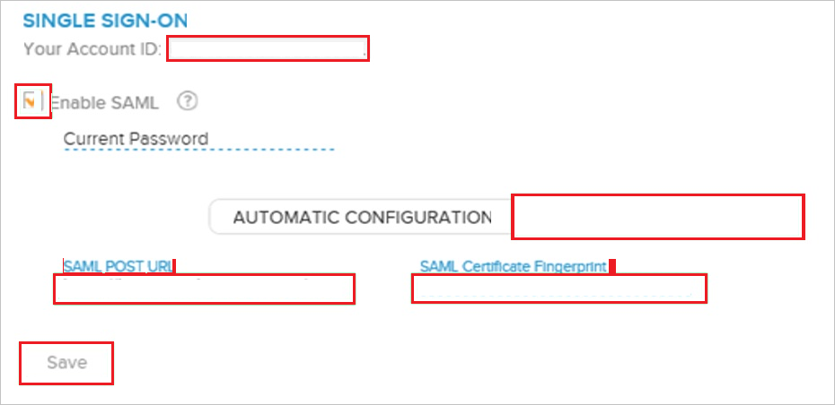

# Tutoriel : Intégration de l’authentification unique Azure AD à TINFOIL SECURITY

Dans ce tutoriel, vous allez apprendre à intégrer TINFOIL SECURITY à Azure Active Directory (Azure AD). Quand vous intégrez TINFOIL SECURITY à Azure AD, vous pouvez :

* Contrôler dans Azure AD qui a accès à TINFOIL SECURITY.
* Permettre à vos utilisateurs de se connecter automatiquement à TINFOIL SECURITY avec leur compte Azure AD.
* Gérer vos comptes à un emplacement central : le Portail Azure.

## Prérequis

Pour commencer, vous devez disposer de ce qui suit :

* Un abonnement Azure AD Si vous ne disposez d’aucun abonnement, vous pouvez obtenir [un compte gratuit](https://azure.microsoft.com/free/).
* Un abonnement TINFOIL SECURITY pour lequel l’authentification unique (SSO) est activée.

## Description du scénario

Dans ce tutoriel, vous allez configurer et tester l’authentification unique Azure AD dans un environnement de test.

* TINFOIL SECURITY prend en charge l’authentification unique lancée par le **fournisseur d’identité**.

> [!NOTE]
> L’identificateur de cette application étant une valeur de chaîne fixe, une seule instance peut être configurée dans un locataire.

## Ajouter TINFOIL SECURITY à partir de la galerie

Pour configurer l’intégration de TINFOIL SECURITY à Azure AD, vous devez ajouter TINFOIL SECURITY à votre liste d’applications SaaS gérées à partir de la galerie.

1. Connectez-vous au portail Azure avec un compte professionnel ou scolaire ou avec un compte personnel Microsoft.
1. Dans le panneau de navigation gauche, sélectionnez le service **Azure Active Directory**.
1. Accédez à **Applications d’entreprise**, puis sélectionnez **Toutes les applications**.
1. Pour ajouter une nouvelle application, sélectionnez **Nouvelle application**.
1. Dans la section **Ajouter à partir de la galerie**, tapez **TINFOIL SECURITY** dans la zone de recherche.
1. Sélectionnez **TINFOIL SECURITY** dans le volet de résultats, puis ajoutez l’application. Patientez quelques secondes pendant que l’application est ajoutée à votre locataire.

## Configurer et tester l’authentification unique Azure AD pour TINFOIL SECURITY

Configurez et testez l’authentification unique Azure AD avec TINFOIL SECURITY pour un utilisateur de test appelé **B.Simon**. Pour que l’authentification unique fonctionne, vous devez établir un lien entre un utilisateur Azure AD et l’utilisateur TINFOIL SECURITY associé.

Pour configurer et tester l’authentification unique Azure AD avec TINFOIL SECURITY, effectuez les étapes suivantes :

1. **[Configurer l’authentification unique Azure AD](#configure-azure-ad-sso)** pour permettre à vos utilisateurs d’utiliser cette fonctionnalité.
    1. **[Créer un utilisateur de test Azure AD](#create-an-azure-ad-test-user)** pour tester l’authentification unique Azure AD avec B. Simon.
    1. **[Affecter l’utilisateur de test Azure AD](#assign-the-azure-ad-test-user)** pour permettre à B. Simon d’utiliser l’authentification unique Azure AD.
1. **[Configurer l’authentification unique TINFOIL SECURITY](#configure-tinfoil-security-sso)** pour configurer les paramètres de l’authentification unique côté application.
    1. **[Créer un utilisateur de test TINFOIL SECURITY](#create-tinfoil-security-test-user)** pour avoir un équivalent de B.Simon dans TINFOIL SECURITY lié à la représentation Azure AD de l’utilisateur.
1. **[Tester l’authentification unique](#test-sso)** pour vérifier si la configuration fonctionne.

## Configurer l’authentification unique Azure AD

Effectuez les étapes suivantes pour activer l’authentification unique Azure AD dans le Portail Azure.

1. Dans le portail Azure, accédez à la page d’intégration de l’application **TINFOIL SECURITY**, recherchez la section **Gérer** et sélectionnez **Authentification unique**.
1. Dans la page **Sélectionner une méthode d’authentification unique**, sélectionnez **SAML**.
1. Dans la page **Configurer l’authentification unique avec SAML**, cliquez sur l’icône de crayon de **Configuration SAML de base** afin de modifier les paramètres.

   

1. Dans la section **Configuration SAML de base**, l’application est préconfigurée et les URL nécessaires sont déjà préremplies avec Azure. L’utilisateur doit enregistrer la configuration en cliquant sur le bouton **Enregistrer**.

1. Votre application Visitly s’attend à recevoir les assertions SAML dans un format spécifique, ce qui vous oblige à ajouter des mappages d’attributs personnalisés à la configuration des attributs du jeton SAML. La capture d’écran suivante montre la liste des attributs par défaut.

    

1. En plus de ce qui précède, l’application Visitly s’attend à ce que quelques attributs supplémentaires (présentés ci-dessous) soient repassés dans la réponse SAML. Ces attributs sont également préremplis, mais vous pouvez les examiner pour voir s’ils répondent à vos besoins.

    | Nom | Attribut source |
    | ------------------- | -------------|
    | accountid | UXXXXXXXXXXXXX |

    > [!NOTE]
    > Les valeurs accountid vous seront expliquées plus loin dans le tutoriel.

1. Dans la section **Certificat de signature SAML**, cliquez sur le bouton **Modifier** pour ouvrir la boîte de dialogue **Certificat de signature SAML**.

    

1. Dans la section **Certificat de signature SAML**, copiez la **valeur de l’empreinte** et enregistrez-la sur votre ordinateur.

    

1. Dans la section **Configurer TINFOIL SECURITY**, copiez la ou les URL appropriées en fonction de vos besoins.

    

### Créer un utilisateur de test Azure AD

Dans cette section, vous allez créer un utilisateur de test appelé B. Simon dans le portail Azure.

1. Dans le volet gauche du Portail Azure, sélectionnez **Azure Active Directory**, **Utilisateurs**, puis **Tous les utilisateurs**.
1. Sélectionnez **Nouvel utilisateur** dans la partie supérieure de l’écran.
1. Dans les propriétés **Utilisateur**, effectuez les étapes suivantes :
   1. Dans le champ **Nom**, entrez `B.Simon`.  
   1. Dans le champ **Nom de l’utilisateur**, entrez username@companydomain.extension. Par exemple : `B.Simon@contoso.com`.
   1. Cochez la case **Afficher le mot de passe**, puis notez la valeur affichée dans le champ **Mot de passe**.
   1. Cliquez sur **Créer**.

### Affecter l’utilisateur de test Azure AD

Dans cette section, vous allez permettre à B.Simon d’utiliser l’authentification unique Azure en lui accordant l’accès à TINFOIL SECURITY.

1. Dans le portail Azure, sélectionnez **Applications d’entreprise**, puis **Toutes les applications**.
1. Dans la liste d’applications, sélectionnez **TINFOIL SECURITY**.
1. Dans la page de vue d’ensemble de l’application, recherchez la section **Gérer** et sélectionnez **Utilisateurs et groupes**.
1. Sélectionnez **Ajouter un utilisateur**, puis **Utilisateurs et groupes** dans la boîte de dialogue **Ajouter une attribution**.
1. Dans la boîte de dialogue **Utilisateurs et groupes**, sélectionnez **B. Simon** dans la liste Utilisateurs, puis cliquez sur le bouton **Sélectionner** au bas de l’écran.
1. Si vous attendez une valeur de rôle dans l’assertion SAML, dans la boîte de dialogue **Sélectionner un rôle**, sélectionnez le rôle approprié pour l’utilisateur dans la liste, puis cliquez sur le bouton **Sélectionner** en bas de l’écran.
1. Dans la boîte de dialogue **Ajouter une attribution**, cliquez sur le bouton **Attribuer**.

## Configurer l’authentification unique TINFOIL SECURITY

1. Dans une autre fenêtre de navigateur web, connectez-vous à votre site d’entreprise TINFOIL SECURITY en tant qu’administrateur.

1. Dans la barre d’outils située en haut, cliquez sur **My Account**.

    

1. Cliquez sur **Sécurité**.

    

1. Dans la page de configuration **Single Sign on** , procédez comme suit :

    

    a. Sélectionnez **Enable SAML**.

    b. Cliquez sur **Manual Configuration**.

    c. Dans la zone de texte **SAML Post URL**, collez la valeur **URL de connexion** que vous avez copiée dans le portail Azure.

    d. Dans la zone de texte **Empreinte numérique du certificat SAML**, collez la valeur de l’**empreinte** que vous avez copiée à partir de la section **Certificat de signature SAML**.
  
    e. Copiez la valeur de l’**ID de votre compte** et collez-la dans la zone de texte **Attribut source** située sous la section **Attributs et revendications de l’utilisateur** sur le portail Azure.

    f. Cliquez sur **Enregistrer**.

### Créer un utilisateur de test TINFOIL SECURITY

Pour se connecter à TINFOIL SECURITY, les utilisateurs d’Azure AD doivent être provisionnés dans TINFOIL SECURITY. Dans le cas de TINFOIL SECURITY, l’approvisionnement est une tâche manuelle.

**Pour configurer l’approvisionnement des utilisateurs, procédez comme suit :**

1. Si l’utilisateur fait partie d’un compte d’entreprise, vous devez [contacter l’équipe de support technique TINFOIL SECURITY](https://www.tinfoilsecurity.com/contact) pour obtenir le compte d’utilisateur créé.

1. Si l’utilisateur est un utilisateur normal de SaaS TINFOIL SECURITY, il peut ajouter un collaborateur à n’importe lequel de ses sites. Cela déclenche l’envoi, à l’adresse e-mail spécifiée, d’une invitation à créer un compte d’utilisateur TINFOIL SECURITY.

> [!NOTE]
> Vous pouvez utiliser n’importe quels outils ou API de création de compte d’utilisateur, fournis par TINFOIL SECURITY, pour approvisionner des comptes d’utilisateur Azure AD.

## Tester l’authentification unique (SSO)

Dans cette section, vous allez tester votre configuration de l’authentification unique Azure AD avec les options suivantes.

* Cliquez sur Tester cette application dans le portail Azure. Vous êtes alors automatiquement connecté à l’instance TINFOIL SECURITY pour laquelle vous avez configuré l’authentification unique.

* Vous pouvez utiliser Mes applications de Microsoft. Quand vous cliquez sur la vignette TINFOIL SECURITY dans Mes applications, vous êtes connecté automatiquement à l’instance TINFOIL SECURITY pour laquelle vous avez configuré l’authentification unique. Pour plus d’informations sur Mes applications, consultez [Présentation de Mes applications](../user-help/my-apps-portal-end-user-access.md).

## Étapes suivantes

Après avoir configuré TINFOIL SECURITY, vous pouvez appliquer le contrôle de session, qui protège contre l’exfiltration et l’infiltration des données sensibles de votre organisation en temps réel. Le contrôle de session est étendu à partir de l’accès conditionnel. [Découvrez comment appliquer un contrôle de session avec Microsoft Cloud App Security](/cloud-app-security/proxy-deployment-aad).