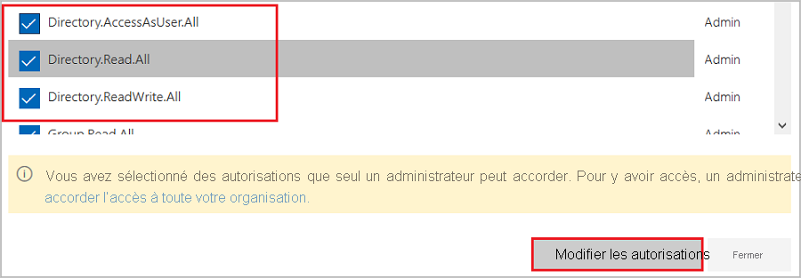
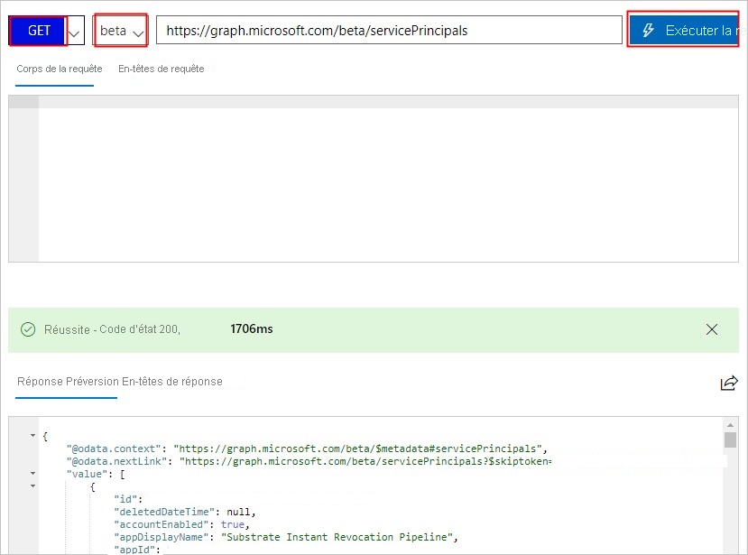

# <a name="tutorial-azure-ad-sso-integration-with-vida"></a>Tutoriel : Intégration de l’authentification unique Azure AD à VIDA

Dans ce tutoriel, vous allez apprendre à intégrer VIDA à Azure Active Directory (Azure AD). Quand vous intégrez VIDA à Azure AD, vous pouvez :

* Contrôler dans Azure AD qui a accès à VIDA.
* Permettre à vos utilisateurs de se connecter automatiquement à VIDA avec leur compte Azure AD.
* Gérer vos comptes à un emplacement central : le Portail Azure.

## <a name="prerequisites"></a>Prérequis

Pour commencer, vous devez disposer de ce qui suit :

* Un abonnement Azure AD Si vous ne disposez d’aucun abonnement, vous pouvez obtenir [un compte gratuit](https://azure.microsoft.com/free/).
* Un abonnement VIDA pour lequel l’authentification unique est activée

## <a name="scenario-description"></a>Description du scénario

Dans ce tutoriel, vous allez configurer et tester l’authentification unique Azure AD dans un environnement de test.

* VIDA prend en charge l’authentification unique initiée par le **fournisseur de services**.

* VIDA prend en charge l’attribution d’utilisateurs **juste-à-temps**.

## <a name="adding-vida-from-the-gallery"></a>Ajouter VIDA à partir de la galerie

Pour configurer l’intégration de VIDA dans Azure AD, vous devez ajouter VIDA à partir de la galerie à votre liste d’applications SaaS gérées.

1. Connectez-vous au portail Azure avec un compte professionnel ou scolaire ou avec un compte personnel Microsoft.
1. Dans le panneau de navigation gauche, sélectionnez le service **Azure Active Directory**.
1. Accédez à **Applications d’entreprise**, puis sélectionnez **Toutes les applications**.
1. Pour ajouter une nouvelle application, sélectionnez **Nouvelle application**.
1. Dans la section **Ajouter à partir de la galerie**, saisissez **VIDA** dans la zone de recherche.
1. Sélectionnez **VIDA** dans le volet de résultats, puis ajoutez l’application. Patientez quelques secondes pendant que l’application est ajoutée à votre locataire.


## <a name="configure-and-test-azure-ad-sso-for-vida"></a>Configurer et tester l’authentification unique Azure AD pour VIDA

Configurez et testez l’authentification unique Azure AD avec VIDA à l’aide d’un utilisateur de test appelé **B.Simon**. Pour que l’authentification unique fonctionne, vous devez établir un lien entre un utilisateur Azure AD et l’utilisateur associé dans VIDA.

Pour configurer et tester l’authentification unique Azure AD avec VIDA, procédez comme suit :

1. **[Configurer l’authentification unique Azure AD](#configure-azure-ad-sso)** pour permettre à vos utilisateurs d’utiliser cette fonctionnalité.
    1. **[Créer un utilisateur de test Azure AD](#create-an-azure-ad-test-user)** pour tester l’authentification unique Azure AD avec B. Simon.
    1. **[Affecter l’utilisateur de test Azure AD](#assign-the-azure-ad-test-user)** pour permettre à B. Simon d’utiliser l’authentification unique Azure AD.
1. **[Configurer l’authentification unique de VIDA](#configure-vida-sso)** pour configurer les paramètres de l’authentification unique côté application.
    1. **[Créer un utilisateur de test VIDA](#create-vida-test-user)** pour avoir un équivalent de B.Simon dans VIDA lié à la représentation Azure AD de l’utilisateur.
1. **[Tester l’authentification unique](#test-sso)** pour vérifier si la configuration fonctionne.

## <a name="configure-azure-ad-sso"></a>Configurer l’authentification unique Azure AD

Effectuez les étapes suivantes pour activer l’authentification unique Azure AD dans le Portail Azure.

1. Dans le portail Azure, accédez à la page d’intégration de l’application **VIDA**, recherchez la section **Gérer** et sélectionnez **Authentification unique**.
1. Dans la page **Sélectionner une méthode d’authentification unique**, sélectionnez **SAML**.
1. Dans la page **Configurer l’authentification unique avec SAML**, cliquez sur l’icône de crayon de **Configuration SAML de base** afin de modifier les paramètres.

   

1. Dans la section **Configuration SAML de base**, entrez les valeurs pour les champs suivants :

    a. Dans la zone de texte **Identificateur (ID d’entité)**, tapez la valeur : `urn:amazon:cognito:sp:eu-west-2_IDmTxjGr6`
    
    b. Dans la zone **URL de réponse**, tapez l’URL : `https://vitruevida.auth.eu-west-2.amazoncognito.com/saml2/idpresponse`
    
    c. Dans la zone de texte **URL d’authentification**, tapez une URL au format suivant :
    
    `https://vitruevida.com/?teamid=<ID>&idp=<IDP_NAME>`

    > [!NOTE]
    > La valeur de l’URL de connexion n’est pas réelle. Mettez à jour la valeur avec l’URL de connexion réelle. Pour obtenir cette valeur, contactez l’[équipe du support technique de VIDA](mailto:support@vitruehealth.com). Vous pouvez également consulter les modèles figurant à la section **Configuration SAML de base** dans le portail Azure.

1. L’application VIDA s’attend à recevoir les assertions SAML dans un format spécifique, ce qui vous oblige à ajouter des mappages d’attributs personnalisés à votre configuration des attributs de jetons SAML. La capture d’écran suivante montre la liste des attributs par défaut.

    

1. En plus de ce qui précède, l’application VIDA s’attend à ce que quelques attributs supplémentaires (présentés ci-dessous) soient repassés dans la réponse SAML. Ces attributs sont également préremplis, mais vous pouvez les examiner pour voir s’ils répondent à vos besoins.
    
    | Nom | Attribut source|
    | ---------------- | --------- |
    | assignedroles | user.assignedroles |

    > [!NOTE]
    > VIDA attend des rôles pour les utilisateurs affectés à l’application. Veuillez configurer ces rôles dans Azure AD pour pouvoir affecter les rôles appropriés aux utilisateurs. Pour comprendre comment configurer des rôles dans Azure AD, consultez [cette page](../develop/howto-add-app-roles-in-azure-ad-apps.md#app-roles-ui).

1. Dans la page **Configurer l’authentification unique avec SAML**, dans la section **Certificat de signature SAML**, recherchez **XML de métadonnées de fédération** et sélectionnez **Télécharger** pour télécharger le certificat et l’enregistrer sur votre ordinateur.

    

1. Dans la section **Configurer VIDA**, copiez les URL appropriées en fonction de vos besoins.

    

### <a name="create-an-azure-ad-test-user"></a>Créer un utilisateur de test Azure AD

Dans cette section, vous allez créer un utilisateur de test appelé B. Simon dans le portail Azure.

1. Dans le volet gauche du Portail Azure, sélectionnez **Azure Active Directory**, **Utilisateurs**, puis **Tous les utilisateurs**.
1. Sélectionnez **Nouvel utilisateur** dans la partie supérieure de l’écran.
1. Dans les propriétés **Utilisateur**, effectuez les étapes suivantes :
   1. Dans le champ **Nom**, entrez `B.Simon`.  
   1. Dans le champ **Nom de l’utilisateur**, entrez username@companydomain.extension. Par exemple : `B.Simon@contoso.com`.
   1. Cochez la case **Afficher le mot de passe**, puis notez la valeur affichée dans le champ **Mot de passe**.
   1. Cliquez sur **Créer**.

### <a name="assign-the-azure-ad-test-user"></a>Affecter l’utilisateur de test Azure AD

Dans cette section, vous allez autoriser B.Simon à utiliser l’authentification unique Azure en lui accordant l’accès à VIDA.

1. Dans le portail Azure, sélectionnez **Applications d’entreprise**, puis **Toutes les applications**.
1. Dans la liste des applications, sélectionnez **VIDA**.
1. Dans la page de vue d’ensemble de l’application, recherchez la section **Gérer** et sélectionnez **Utilisateurs et groupes**.
1. Sélectionnez **Ajouter un utilisateur**, puis **Utilisateurs et groupes** dans la boîte de dialogue **Ajouter une attribution**.
1. Dans la boîte de dialogue **Utilisateurs et groupes**, sélectionnez **B. Simon** dans la liste Utilisateurs, puis cliquez sur le bouton **Sélectionner** au bas de l’écran.
1. Si vous attendez qu’un rôle soit attribué aux utilisateurs, vous pouvez le sélectionner dans la liste déroulante **Sélectionner un rôle** . Si aucun rôle n’a été configuré pour cette application, vous voyez le rôle « Accès par défaut » sélectionné.
1. Dans la boîte de dialogue **Ajouter une attribution**, cliquez sur le bouton **Attribuer**.

## <a name="configure-role-based-single-sign-on-in-vida"></a>Configurer l’authentification unique en fonction du rôle dans VIDA

1. Pour associer un rôle VIDA à l’utilisateur Azure AD, vous devez créer un rôle dans Azure AD en procédant comme suit :

    a. Connectez-vous à [Microsoft Graph Explorer](https://developer.microsoft.com/graph/graph-explorer).

    b. Cliquez sur **Modify permissions** (Modifier les autorisations) pour obtenir les autorisations requises pour la création d’un rôle.

    

    c. Sélectionnez les autorisations suivantes dans la liste, puis cliquez sur **Modify permissions** (Modifier les autorisations) , comme illustré dans la figure suivante.

    

    >[!NOTE]
    >Une fois les autorisations accordées, reconnectez-vous à l’Afficheur Graph.

    d. Dans la page de l’Afficheur Graph, sélectionnez **GET** (OBTENIR) dans la première liste déroulante, puis **beta** (bêta) dans la deuxième. Ensuite, entrez `https://graph.microsoft.com/beta/servicePrincipals` dans le champ en regard des listes déroulantes, puis cliquez sur **Run Query** (Exécuter la requête).

    

    >[!NOTE]
    >Si vous utilisez plusieurs répertoires, vous pouvez entrer `https://graph.microsoft.com/beta/contoso.com/servicePrincipals` dans le champ de la requête.

    e. Dans la section **Response Preview** (Aperçu de la réponse), extrayez la propriété appRoles à partir de « Service Principal » (Principal du service) en vue d’un usage ultérieur.

    

    >[!NOTE]
    >Vous pouvez localiser la propriété appRoles en entrant `https://graph.microsoft.com/beta/servicePrincipals/<objectID>` dans le champ de la requête. Notez que `objectID` est l’ID d’objet que vous avez copié à partir de la page **Propriétés** d’Azure AD.

    f. Revenez à l’Afficheur Graph, modifiez la méthode **GET** (OBTENIR) en **PATCH** (CORRIGER), collez le contenu suivant dans la section **Request Body** (Corps de la demande), puis cliquez sur **Run Query** (Exécuter la requête) :
    
   ```
   { 
   "appRoles": [
       {
           "allowedMemberTypes": [
           "User"
           ],
           "description": "User",
           "displayName": "User",
           "id": "18d14569-c3bd-439b-9a66-3a2aee01****",
           "isEnabled": true,
           "origin": "Application",
           "value": null
       },
       {
           "allowedMemberTypes": [
           "User"
           ],
           "description": "msiam_access",
           "displayName": "msiam_access",
           "id": "b9632174-c057-4f7e-951b-be3adc52****",
           "isEnabled": true,
           "origin": "Application",
           "value": null
       },
       {
       "allowedMemberTypes": [
           "User"
       ],
       "description": "VIDACompanyAdmin",
       "displayName": "VIDACompanyAdmin",
       "id": "293414bb-2215-48b4-9864-64520937d437",
       "isEnabled": true,
       "origin": "ServicePrincipal",
       "value": "VIDACompanyAdmin"
       },
       {
       "allowedMemberTypes": [
           "User"
       ],
       "description": "VIDATeamAdmin",
       "displayName": "VIDATeamAdmin",
       "id": "2884f1ae-5c0d-4afd-bf28-d7d11a3d7b2c",
       "isEnabled": true,
       "origin": "ServicePrincipal",
       "value": "VIDATeamAdmin"
       },
       {
       "allowedMemberTypes": [
           "User"
       ],
       "description": "VIDAUser",
       "displayName": "VIDAUser",
       "id": "37b3218c-0c06-484f-90e6-4390ce5a8787",
       "isEnabled": true,
       "origin": "ServicePrincipal",
       "value": "VIDAUser"
       }
   ]
   }
   ```
   > [!NOTE]
   > Azure AD enverra la valeur de ces rôles en tant que valeur de revendication dans la réponse SAML. Cependant, vous ne pouvez ajouter de nouveaux rôles qu’après la partie `msiam_access` de l’opération de correction. Pour faciliter le processus de création, nous vous recommandons d’utiliser un générateur d’ID tels que Générateur de GUID pour générer des ID en temps réel.

   g. Une fois le « Service Principal » (principal du service) corrigé avec le rôle requis, associez le rôle à l’utilisateur Azure AD (B.Simon) en suivant la procédure décrite dans la section **Affecter l’utilisateur test Azure AD** du tutoriel.

## <a name="configure-vida-sso"></a>Configurer l’authentification unique de VIDA

Pour configurer l’authentification unique côté **VIDA**, vous devez envoyer le **XML des métadonnées de fédération** téléchargé et les URL appropriées, copiées à partir du portail Azure, à l’[équipe du support technique de VIDA](mailto:support@vitruehealth.com). Celles-ci configurent ensuite ce paramètre pour que la connexion SSO SAML soit définie correctement des deux côtés.

### <a name="create-vida-test-user"></a>Créer un utilisateur de test VIDA

Dans cette section, un utilisateur appelé Britta Simon est créé dans VIDA. VIDA prend en charge l’attribution d’utilisateurs juste-à-temps, option qui est activée par défaut. Vous n’avez aucune opération à effectuer dans cette section. Grâce à cela, s’il n’existe pas encore d’utilisateur dans VIDA, il en est créé un après l’authentification.

## <a name="test-sso"></a>Tester l’authentification unique (SSO) 

Dans cette section, vous allez tester votre configuration de l’authentification unique Azure AD avec les options suivantes. 

* Cliquez sur **Tester cette application** dans le portail Azure. Vous êtes alors redirigé vers l’URL de connexion de VIDA, à partir de laquelle vous pouvez lancer le flux de connexion. 

* Accédez directement à l’URL de connexion de VIDA pour initier le flux de connexion.

* Vous pouvez utiliser Mes applications de Microsoft. Quand vous cliquez sur la vignette VIDA dans Mes applications, vous êtes redirigé vers l’URL de connexion de VIDA. Pour plus d’informations sur Mes applications, consultez [Présentation de Mes applications](../user-help/my-apps-portal-end-user-access.md).

## <a name="next-steps"></a>Étapes suivantes

Une fois que vous avez configuré VIDA, vous pouvez appliquer le contrôle de session, qui protège contre l’exfiltration et l’infiltration des données sensibles de votre organisation en temps réel. Le contrôle de session est étendu à partir de l’accès conditionnel. [Découvrez comment appliquer un contrôle de session avec Microsoft Cloud App Security](/cloud-app-security/proxy-deployment-aad).

