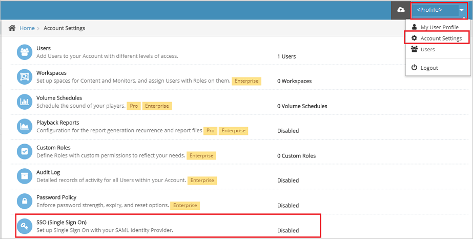
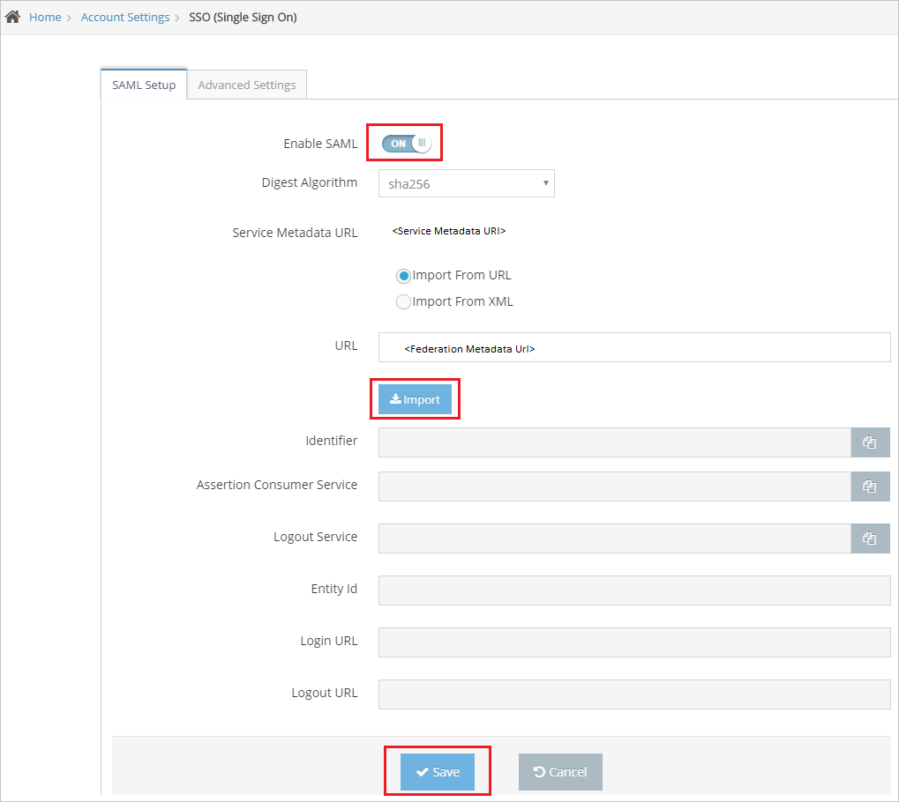
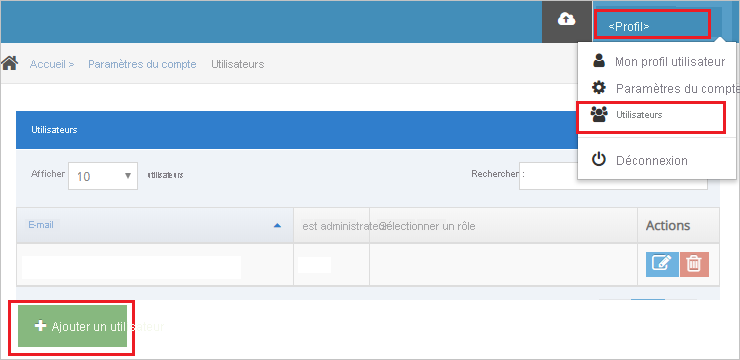
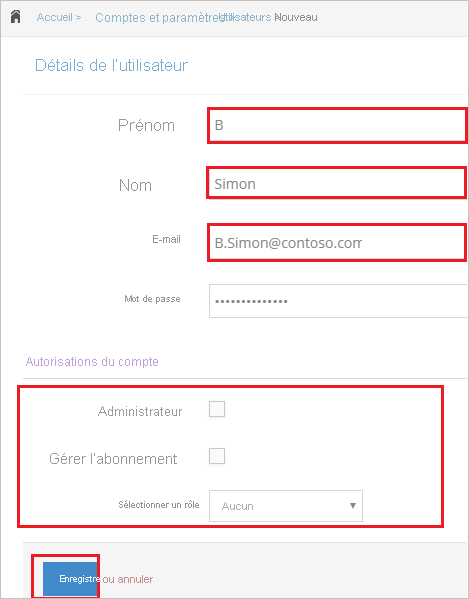

# Tutoriel : Intégration de l’authentification unique Azure AD à Watch by Colors

Dans ce tutoriel, vous allez découvrir comment intégrer Watch by Colors à Azure Active Directory (Azure AD). Quand vous intégrez Watch by Colors à Azure AD, vous pouvez :

* Contrôler dans Azure AD qui a accès à Watch by Colors.
* Permettre à vos utilisateurs de se connecter automatiquement à Watch by Colors avec leur compte Azure AD.
* Gérer vos comptes à un emplacement central : le Portail Azure.

## Prérequis

Pour commencer, vous devez disposer de ce qui suit :

* Un abonnement Azure AD Si vous ne disposez d’aucun abonnement, vous pouvez obtenir [un compte gratuit](https://azure.microsoft.com/free/).
* Un abonnement Watch by Colors pour lequel l’authentification unique (SSO) est activée.

## Description du scénario

Dans ce tutoriel, vous allez configurer et tester l’authentification unique Azure AD dans un environnement de test.

* Watch by Colors prend en charge l’authentification unique lancée par le **fournisseur de services et le fournisseur d’identité**.

## Ajouter Watch by Colors à partir de la galerie

Pour configurer l’intégration de Watch by Colors à Azure AD, vous devez ajouter Watch by Colors de la galerie à votre liste d’applications SaaS managées.

1. Connectez-vous au portail Azure avec un compte professionnel ou scolaire ou avec un compte personnel Microsoft.
1. Dans le panneau de navigation gauche, sélectionnez le service **Azure Active Directory**.
1. Accédez à **Applications d’entreprise**, puis sélectionnez **Toutes les applications**.
1. Pour ajouter une nouvelle application, sélectionnez **Nouvelle application**.
1. Dans la section **Ajouter à partir de la galerie**, tapez **Watch by Colors** dans la zone de recherche.
1. Sélectionnez **Watch by Colors** dans le volet de résultats, puis ajoutez l’application. Patientez quelques secondes pendant que l’application est ajoutée à votre locataire.

## Configurer et tester l’authentification unique Azure AD pour Watch by Colors

Configurez et testez l’authentification unique (SSO) Azure AD avec Watch by Colors à l’aide d’un utilisateur de test nommé **B.Simon**. Pour que l’authentification unique (SSO) fonctionne, vous devez établir une relation entre un utilisateur Azure AD et l’utilisateur Watch by Colors associé.

Pour configurer et tester l’authentification unique Azure AD avec Watch by Colors, effectuez les étapes suivantes :

1. **[Configurer l’authentification unique Azure AD](#configure-azure-ad-sso)** pour permettre à vos utilisateurs d’utiliser cette fonctionnalité.
    1. **[Créer un utilisateur de test Azure AD](#create-an-azure-ad-test-user)** pour tester l’authentification unique Azure AD avec B. Simon.
    1. **[Affecter l’utilisateur de test Azure AD](#assign-the-azure-ad-test-user)** pour permettre à B. Simon d’utiliser l’authentification unique Azure AD.
1. **[Configurer l’authentification unique (SSO) Watch by Colors](#configure-watch-by-colors-sso)** pour configurer les paramètres de l’authentification unique côté application.
    1. **[Créer un utilisateur de test Watch by Colors](#create-watch-by-colors-test-user)** pour disposer, dans Watch by Colors, d’un équivalent de B.Simon lié à la représentation Azure AD de l’utilisateur.
1. **[Tester l’authentification unique](#test-sso)** pour vérifier si la configuration fonctionne.

## Configurer l’authentification unique Azure AD

Effectuez les étapes suivantes pour activer l’authentification unique Azure AD dans le Portail Azure.

1. Dans le portail Azure, accédez à la page d’intégration de l’application **Watch by Colors**, recherchez la section **Gérer**, puis sélectionnez **Authentification unique**.
1. Dans la page **Sélectionner une méthode d’authentification unique**, sélectionnez **SAML**.
1. Dans la page **Configurer l’authentification unique avec SAML**, cliquez sur l’icône de crayon de **Configuration SAML de base** afin de modifier les paramètres.

   

1. Dans la section **Configuration SAML de base**, l’application est préconfigurée en mode Lancement par le **fournisseur d’identité** et les URL nécessaires sont déjà préremplies avec Azure. L’utilisateur doit enregistrer la configuration en cliquant sur le bouton **Enregistrer**.

1. Si vous souhaitez configurer l’application en **mode démarré par le fournisseur de services**, cliquez sur **Définir des URL supplémentaires**, puis effectuez les étapes suivantes :

    Dans la zone de texte **URL de connexion**, tapez l’URL : `https://app.colorscorporation.com/login`

1. Dans la page **Configurer l’authentification unique avec SAML**, dans la section **Certificat de signature SAML**, cliquez sur le bouton Copier pour copier l’**URL des métadonnées de fédération d’application**, puis enregistrez-la sur votre ordinateur.

    

### Créer un utilisateur de test Azure AD

Dans cette section, vous allez créer un utilisateur de test appelé B. Simon dans le portail Azure.

1. Dans le volet gauche du Portail Azure, sélectionnez **Azure Active Directory**, **Utilisateurs**, puis **Tous les utilisateurs**.
1. Sélectionnez **Nouvel utilisateur** dans la partie supérieure de l’écran.
1. Dans les propriétés **Utilisateur**, effectuez les étapes suivantes :
   1. Dans le champ **Nom**, entrez `B.Simon`.  
   1. Dans le champ **Nom de l’utilisateur**, entrez username@companydomain.extension. Par exemple : `B.Simon@contoso.com`.
   1. Cochez la case **Afficher le mot de passe**, puis notez la valeur affichée dans le champ **Mot de passe**.
   1. Cliquez sur **Créer**.

### Affecter l’utilisateur de test Azure AD

Dans cette section, vous allez autoriser B.Simon à utiliser l’authentification unique Azure en lui accordant l’accès à Watch by Colors.

1. Dans le portail Azure, sélectionnez **Applications d’entreprise**, puis **Toutes les applications**.
1. Dans la liste des applications, sélectionnez **Watch by Colors**.
1. Dans la page de vue d’ensemble de l’application, recherchez la section **Gérer** et sélectionnez **Utilisateurs et groupes**.
1. Sélectionnez **Ajouter un utilisateur**, puis **Utilisateurs et groupes** dans la boîte de dialogue **Ajouter une attribution**.
1. Dans la boîte de dialogue **Utilisateurs et groupes**, sélectionnez **B. Simon** dans la liste Utilisateurs, puis cliquez sur le bouton **Sélectionner** au bas de l’écran.
1. Si vous attendez une valeur de rôle dans l’assertion SAML, dans la boîte de dialogue **Sélectionner un rôle**, sélectionnez le rôle approprié pour l’utilisateur dans la liste, puis cliquez sur le bouton **Sélectionner** en bas de l’écran.
1. Dans la boîte de dialogue **Ajouter une attribution**, cliquez sur le bouton **Attribuer**.

## Configurer l’authentification unique (SSO) Watch by Colors

1. Afin d’automatiser la configuration dans Watch by Colors, vous devez installer l’**extension de connexion sécurisée à Mes applications** en cliquant sur **Installer l’extension**.

    

2. Après l’ajout de l’extension au navigateur, cliquez sur **Configurer Watch by Colors** pour être redirigé vers l’application Watch by Colors. À partir de là, indiquez les informations d’identification de l’administrateur pour vous connecter à Watch by Colors. Cette extension de navigateur configure automatiquement l’application et automatise les étapes 3 à 5.

    

3. Si vous souhaitez configurer manuellement Watch by Colors, ouvrez une nouvelle fenêtre de navigateur web, connectez-vous à votre site d’entreprise Watch by Colors en tant qu’administrateur et effectuez les étapes suivantes :

4. En haut à droite de la page, cliquez sur **Profil** > **Paramètres du compte** > **Authentification unique (SSO)** .

    

5. Dans la page **Authentification unique (SSO)** , effectuez les étapes suivantes :

    

    a. Définissez **Activer SAML** sur **ACTIVÉ**.

    b. Dans la zone de texte **URL**, collez l’**URL des métadonnées de fédération** que vous avez copiée à partir du portail Azure.

    c. Cliquez sur **Importer**. Les champs suivants sont alors automatiquement remplis dans la page.

    d. Cliquez sur **Enregistrer**.

### Créer un utilisateur de test Watch by Colors

Pour permettre aux utilisateurs Azure AD de se connecter à Watch by Colors, vous devez les attribuer dans Watch by Colors. Dans Watch by Colors, le provisionnement est une tâche manuelle.

**Pour approvisionner un compte d’utilisateur, procédez comme suit :**

1. Connectez-vous à Watch by Colors en tant qu’administrateur de la sécurité.

1. En haut à droite de la page, cliquez sur **Profil** > **Utilisateurs** > **Ajouter un utilisateur**.

    

1. Dans la page **Détails de l’utilisateur**, effectuez les étapes suivantes :

    

    a. Dans la zone de texte **First Name** (Prénom), tapez le prénom de l’utilisateur, par exemple **B**.

    b. Dans la zone de texte **Nom**, entrez le nom de l’utilisateur, par exemple **Simon**.

    c. Dans la zone de texte **E-mail**, entrez l’adresse e-mail de l’utilisateur, comme `B.Simon@contoso.com`.

    d. Dans la zone de texte **Mot de passe**, entrez le mot de passe.

    e. Sélectionnez **Autorisations du compte** en fonction de votre organisation.

    f. Cliquez sur **Enregistrer**.

## Tester l’authentification unique (SSO) 

Dans cette section, vous allez tester votre configuration de l’authentification unique Azure AD avec les options suivantes. 

#### Lancée par le fournisseur de services :

* Cliquez sur **Tester cette application** dans le portail Azure. Vous êtes alors redirigé vers l’URL de connexion de Watch by Colors, à partir de laquelle vous pouvez lancer le flux de connexion.  

* Accédez directement à l’URL de connexion de Watch by Colors pour lancer le flux de connexion.

#### Lancée par le fournisseur d’identité :

* Cliquez sur **Tester cette application** dans le portail Azure. Vous êtes alors automatiquement connecté automatiquement à l’instance de Watch by Colors pour laquelle vous avez configuré l’authentification unique. 

Vous pouvez aussi utiliser Mes applications de Microsoft pour tester l’application dans n’importe quel mode. Si, quand vous cliquez sur la vignette Watch by Colors dans Mes applications, le mode Fournisseur de services est configuré, vous êtes redirigé vers la page de connexion de l’application pour initier le flux de connexion ; s’il s’agit du mode Fournisseur d’identité, vous êtes automatiquement connecté à l’instance de Watch by Colors pour laquelle vous avez configuré l’authentification unique. Pour plus d’informations sur Mes applications, consultez [Présentation de Mes applications](../user-help/my-apps-portal-end-user-access.md).

## Étapes suivantes

Après avoir configuré Watch by Colors, vous pouvez appliquer le contrôle de session, qui protège contre l’exfiltration et l’infiltration des données sensibles de votre organisation en temps réel. Le contrôle de session est étendu à partir de l’accès conditionnel. [Découvrez comment appliquer un contrôle de session avec Microsoft Cloud App Security](/cloud-app-security/proxy-deployment-aad).