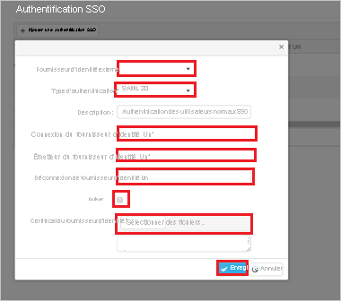
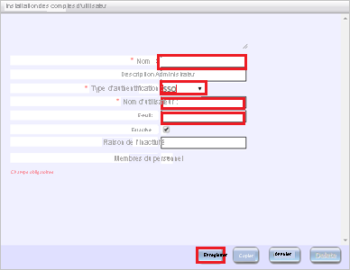

# Tutoriel : Intégration de l’authentification unique Azure AD à Workware

Dans ce tutoriel, vous allez découvrir comment intégrer Workware à Azure Active Directory (Azure AD). Quand vous intégrez Workware à Azure AD, vous pouvez :

* Contrôler qui dans Azure AD a accès à Workware.
* Permettre à vos utilisateurs de se connecter automatiquement à Workware avec leur compte Azure AD.
* Gérer vos comptes à un emplacement central : le Portail Azure.

## Prérequis

Pour commencer, vous devez disposer de ce qui suit :

* Un abonnement Azure AD Si vous ne disposez d’aucun abonnement, vous pouvez obtenir [un compte gratuit](https://azure.microsoft.com/free/).
* Un abonnement Workware pour lequel l’authentification unique (SSO) est activée

## Description du scénario

Dans ce tutoriel, vous allez configurer et tester l’authentification unique Azure AD dans un environnement de test.

* Workware prend en charge l’authentification unique lancée par le **fournisseur d’identité**.

## Ajouter Workware à partir de la galerie

Pour configurer l’intégration de Workware à Azure AD, vous devez ajouter Workware à partir de la galerie à votre liste d’applications SaaS gérées.

1. Connectez-vous au portail Azure avec un compte professionnel ou scolaire ou avec un compte personnel Microsoft.
1. Dans le panneau de navigation gauche, sélectionnez le service **Azure Active Directory**.
1. Accédez à **Applications d’entreprise**, puis sélectionnez **Toutes les applications**.
1. Pour ajouter une nouvelle application, sélectionnez **Nouvelle application**.
1. Dans la section **Ajouter à partir de la galerie**, tapez **Workware** dans la zone de recherche.
1. Sélectionnez **Workware** dans le volet de résultats, puis ajoutez l’application. Patientez quelques secondes pendant que l’application est ajoutée à votre locataire.

## Configurer et tester l’authentification unique Azure AD pour Workware

Configurez et testez l’authentification unique Azure AD avec Workware à l’aide d’un utilisateur de test nommé **B.Simon**. Pour que l’authentification unique fonctionne, vous devez établir un lien entre un utilisateur Azure AD et l’utilisateur Workware associé.

Pour configurer et tester l’authentification unique Azure AD avec Workware, procédez comme suit :

1. **[Configurer l’authentification unique Azure AD](#configure-azure-ad-sso)** pour permettre à vos utilisateurs d’utiliser cette fonctionnalité.
    1. **[Créer un utilisateur de test Azure AD](#create-an-azure-ad-test-user)** pour tester l’authentification unique Azure AD avec B. Simon.
    1. **[Affecter l’utilisateur de test Azure AD](#assign-the-azure-ad-test-user)** pour permettre à B. Simon d’utiliser l’authentification unique Azure AD.
1. **[Configurer l’authentification unique Workware](#configure-workware-sso)** pour configurer les paramètres de l’authentification unique côté application.
    1. **[Créer un utilisateur de test Workware](#create-workware-test-user)** pour avoir un équivalent de B.Simon dans Workware lié à la représentation Azure AD de l’utilisateur.
1. **[Tester l’authentification unique](#test-sso)** pour vérifier si la configuration fonctionne.

## Configurer l’authentification unique Azure AD

Effectuez les étapes suivantes pour activer l’authentification unique Azure AD dans le Portail Azure.

1. Dans le portail Azure, accédez à la page d’intégration de l’application **Workware**, recherchez la section **Gérer** et sélectionnez **Authentification unique**.
1. Dans la page **Sélectionner une méthode d’authentification unique**, sélectionnez **SAML**.
1. Dans la page **Configurer l’authentification unique avec SAML**, cliquez sur l’icône de crayon de **Configuration SAML de base** afin de modifier les paramètres.

   

1. Dans la section **Configuration SAML de base**, effectuez les étapes suivantes :

    a. Dans la zone de texte **Identificateur**, tapez une valeur au format suivant : `<WORKWARE_URL>/WW/AuthServices`

    b. Dans la zone de texte **URL de réponse**, tapez une valeur au format suivant : `<WORKWARE_URL>/WW/AuthServices/Acs`

    > [!NOTE]
    > Il ne s’agit pas de valeurs réelles. Mettez à jour ces valeurs avec l’identificateur et l’URL de réponse réels. Pour obtenir ces valeurs, contactez l’[équipe de support technique de Workware](mailto:support@activeops.com). Vous pouvez également consulter les modèles figurant à la section **Configuration SAML de base** dans le portail Azure.

1. Dans la page **Configurer l’authentification unique avec SAML**, dans la section **Certificat de signature SAML**, recherchez **XML de métadonnées de fédération** et sélectionnez **Télécharger** pour télécharger le certificat et l’enregistrer sur votre ordinateur.

    

1. Dans la section **Configurer Workware**, copiez la ou les URL appropriées en fonction de vos besoins.

    

### Créer un utilisateur de test Azure AD

Dans cette section, vous allez créer un utilisateur de test appelé B. Simon dans le portail Azure.

1. Dans le volet gauche du Portail Azure, sélectionnez **Azure Active Directory**, **Utilisateurs**, puis **Tous les utilisateurs**.
1. Sélectionnez **Nouvel utilisateur** dans la partie supérieure de l’écran.
1. Dans les propriétés **Utilisateur**, effectuez les étapes suivantes :
   1. Dans le champ **Nom**, entrez `B.Simon`.  
   1. Dans le champ **Nom de l’utilisateur**, entrez username@companydomain.extension. Par exemple : `B.Simon@contoso.com`.
   1. Cochez la case **Afficher le mot de passe**, puis notez la valeur affichée dans le champ **Mot de passe**.
   1. Cliquez sur **Créer**.

### Affecter l’utilisateur de test Azure AD

Dans cette section, vous allez autoriser B.Simon à utiliser l’authentification unique Azure en lui accordant l’accès à Workware.

1. Dans le portail Azure, sélectionnez **Applications d’entreprise**, puis **Toutes les applications**.
1. Dans la liste des applications, sélectionnez **Workware**.
1. Dans la page de vue d’ensemble de l’application, recherchez la section **Gérer** et sélectionnez **Utilisateurs et groupes**.
1. Sélectionnez **Ajouter un utilisateur**, puis **Utilisateurs et groupes** dans la boîte de dialogue **Ajouter une attribution**.
1. Dans la boîte de dialogue **Utilisateurs et groupes**, sélectionnez **B. Simon** dans la liste Utilisateurs, puis cliquez sur le bouton **Sélectionner** au bas de l’écran.
1. Si vous attendez qu’un rôle soit attribué aux utilisateurs, vous pouvez le sélectionner dans la liste déroulante **Sélectionner un rôle** . Si aucun rôle n’a été configuré pour cette application, vous voyez le rôle « Accès par défaut » sélectionné.
1. Dans la boîte de dialogue **Ajouter une attribution**, cliquez sur le bouton **Attribuer**.

## Configurer l’authentification unique Workware

Pour utiliser la fonctionnalité SSO dans Workware, vous devez effectuer la configuration suivante :

#### Activer les autorisations SSO pour les administrateurs système Workware

* Pour que les administrateurs système Workware puissent configurer l’authentification SSO, l’autorisation SSO Authentication (dans la **catégorie Administration > System Configuration de l’écran Permissions for Selected Role**) doit être activée pour ces administrateurs.

    

#### Configurer l’authentification SSO dans Workware

1. Accédez à la page **System Settings** (Paramètres système), puis cliquez sur **SSO Authentication** (Authentification SSO).

1. Dans la section **SSO Authentication**, cliquez sur le bouton **Add SSO Authentication** (Ajouter l’authentification SSO), puis effectuez les étapes suivantes : 

    

    1. Dans la zone **External Identity Provider** (Fournisseur d’identité externe), indiquez le nom du fournisseur d’identité.
    1. Pour **Authentication Type** (Type d’authentification), sélectionnez **SAML2.0**.
    1. Dans la zone de texte **Identity Provider SignIn URL** (URL de connexion du fournisseur d’identité), collez la valeur de l’**URL de connexion** que vous avez copiée à partir du portail Azure.
    1. Dans la zone de texte **Identity Provider Issuer URL**, entrez l’**identificateur Azure AD** que vous avez copié à partir du portail Azure.
    1. Dans la zone de texte **Identity Provider Logout URL** (URL de déconnexion du fournisseur d’identité), entrez la valeur de l’**URL de déconnexion** que vous avez copiée à partir du portail Azure.
    1. Cliquez sur **Enable** (Activer).
    1. Chargez le **certificat** téléchargé dans la zone **Identity Provider Certificate** (Certificat du fournisseur d’identité) à partir du portail Azure.
    1. Cliquez sur **Enregistrer**.

### Créer un utilisateur de test Workware

1. Connectez-vous au site web Workware en tant qu’administrateur.

1. Sélectionnez **Admin > Create / View > User Accounts > Add New** (Admin > Créer / Afficher > Comptes d’utilisateur > Ajouter).

1. Effectuez les étapes ci-après dans la page suivante.

    

    a. Donnez un nom valide dans le champ **Name**.

    b. Sélectionnez **SSO** pour **Authentication Type**.

    c. Entrez les champs requis, puis cliquez sur **Save** (Enregistrer).

## Tester l’authentification unique (SSO) 

Dans cette section, vous allez tester votre configuration de l’authentification unique Azure AD avec les options suivantes.

* Cliquez sur Tester cette application dans le portail Azure, ce qui devrait vous connecter automatiquement à l’application Workware pour laquelle vous avez configuré l’authentification unique.

* Vous pouvez utiliser Mes applications de Microsoft. Quand vous cliquez sur la vignette Workware dans Mes applications, vous devriez être connecté automatiquement à l’application Workware pour laquelle vous avez configuré l’authentification unique. Pour plus d’informations sur Mes applications, consultez [Présentation de Mes applications](../user-help/my-apps-portal-end-user-access.md).

## Étapes suivantes

Après avoir configuré Workware, vous pouvez appliquer le contrôle de session, qui protège contre l’exfiltration et l’infiltration des données sensibles de votre organisation en temps réel. Le contrôle de session est étendu à partir de l’accès conditionnel. [Découvrez comment appliquer un contrôle de session avec Microsoft Defender for Cloud Apps](/cloud-app-security/proxy-deployment-any-app).
