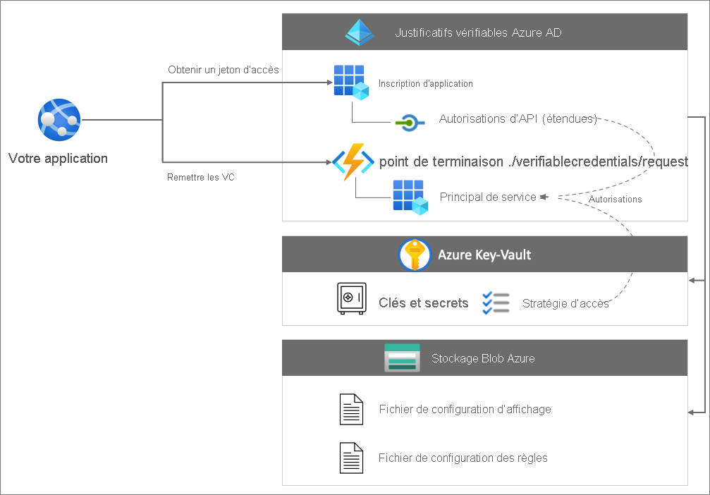
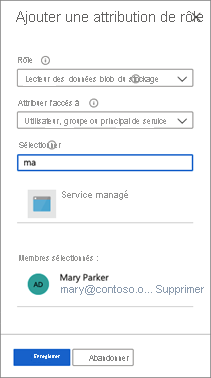
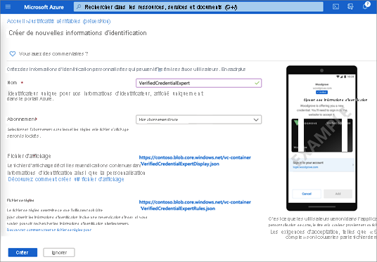
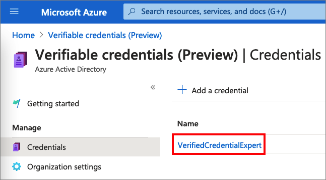
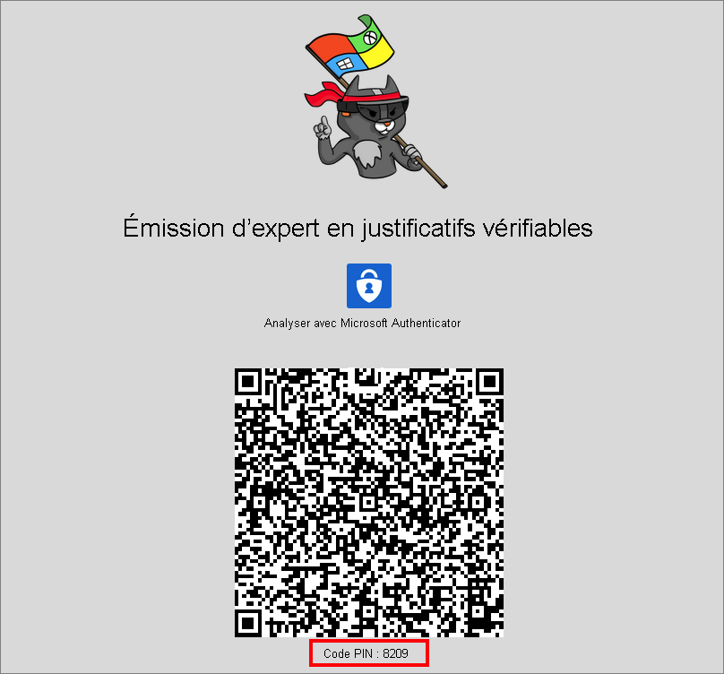
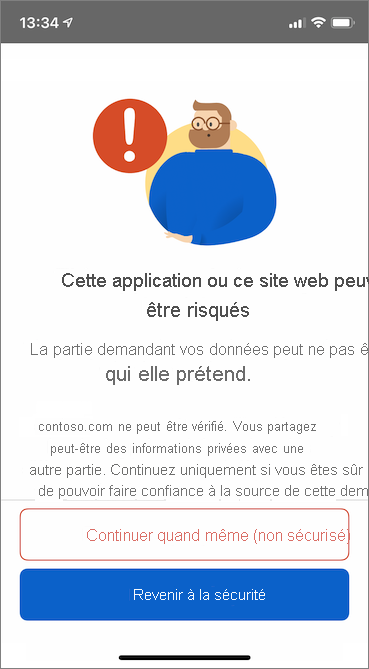
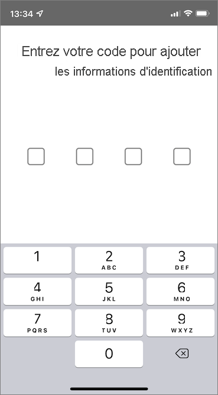
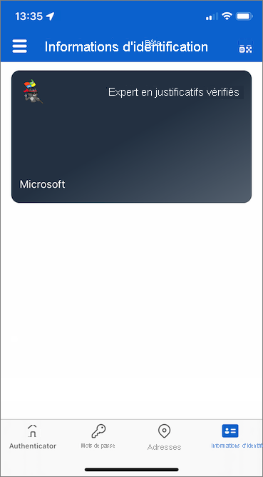
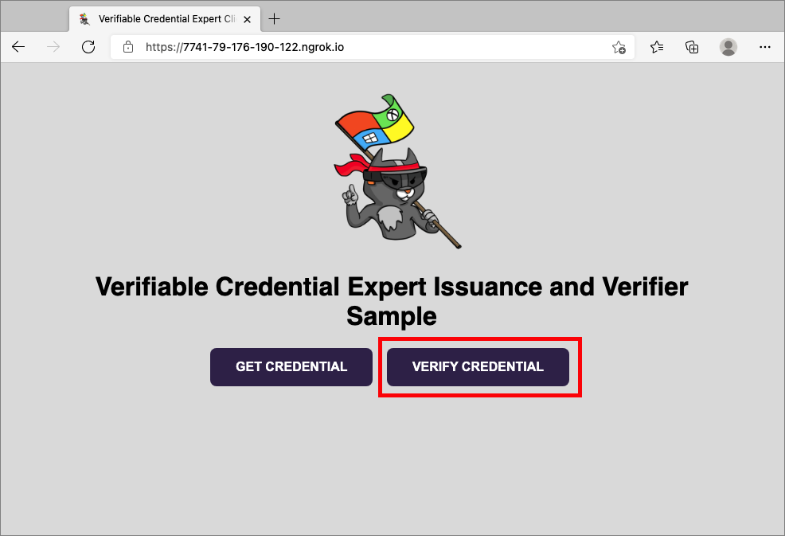
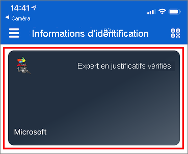

# <a name="issue-azure-ad-verifiable-credentials-from-an-application-preview"></a>Émettre des justificatifs vérifiables Azure AD à partir d’une application (préversion)

Dans ce tutoriel, vous exécutez un exemple d’application à partir de votre ordinateur local qui se connecte à votre locataire Azure Active Directory (Azure AD). À l’aide de l’application, vous allez émettre une carte d’expert Justificatif vérifié et la vérifier.

Dans cet article, vous apprendrez comment :

> [!div class="checklist"]
>
> - Configurer un stockage Blob Azure pour stocker vos fichiers de configuration de justificatifs vérifiables.
> - Créer et charger vos fichiers de configuration de justificatifs vérifiables.
> - Créer la carte d’expert Justificatif vérifié dans Azure.
> - Collecter les justificatifs et les détails de l’environnement pour configurer l’exemple d’application.
> - Télécharger l’exemple de code d’application sur votre ordinateur local.
> - Mettre à jour l’exemple d’application avec votre carte d’expert Justificatif vérifié et les détails de l’environnement.
> - Exécuter l’exemple d’application et émettre votre première carte d’expert Justificatif vérifié.
> - Vérifier votre carte d’expert Justificatif vérifié.

Le diagramme suivant illustre l’architecture des justificatifs vérifiables Azure AD et le composant que vous configurez.



## <a name="prerequisites"></a>Prérequis

- Avant de commencer, il est important de [configurer un locataire pour les justificatifs vérifiables Azure AD](./verifiable-credentials-configure-tenant.md).
- Pour cloner le dépôt qui héberge l’exemple d’application, installez [GIT](https://git-scm.com/downloads)
- [Visual Studio Code](https://code.visualstudio.com/Download) ou un éditeur de code similaire.
- [.NET 5.0](https://dotnet.microsoft.com/download/dotnet/5.0)
- [NGROK](https://ngrok.com/) gratuit.
- Un appareil mobile avec Microsoft Authenticator
  - Android version 6.2108.5654 ou ultérieure installé.
  - iOS version 6.5.82 ou ultérieure installé.

## <a name="create-a-storage-account"></a>Créez un compte de stockage.

Le stockage Blob Azure est la solution de stockage d’objet de Microsoft pour le cloud. Le service des justificatifs vérifiables Azure AD utilise le [stockage Blob Azure](../../storage/blobs/storage-blobs-introduction.md) pour stocker les fichiers de configuration des justificatifs vérifiables lors de l’émission des justificatifs vérifiables.

Créez et configurez votre Stockage Blob Azure en suivant ces étapes :

1. Si vous n’avez pas de compte de stockage Blob Azure, [créez un compte de stockage](../../storage/common/storage-account-create.md).
1. Après avoir créé le compte de stockage, créez un conteneur. Dans le menu de gauche du compte de stockage, faites défiler jusqu’à la section **Stockage de données**, puis sélectionnez **Conteneurs**.
1. Sélectionnez le bouton **+ Conteneur**.
1. Tapez un **nom** pour votre nouveau conteneur. Le nom du conteneur doit être en minuscules, commencer par une lettre ou un chiffre, et peut comporter uniquement des lettres, des chiffres et des tirets (-). Par exemple, *vc-container*.
1. Définissez le **niveau d’accès public** sur **Privé** (aucun accès anonyme).
1. Sélectionnez **Create** (Créer).  

    La capture d’écran suivante montre comment créer un conteneur :  

   

## <a name="grant-access-to-the-container"></a>Accorder l’accès au conteneur

Après avoir créé votre conteneur, accordez à l’utilisateur connecté le rôle qui convient pour lui permettre d’accéder aux fichiers dans l’objet blob de stockage.

1. Sélectionnez *vc-container* dans la liste des conteneurs.

1. Dans le menu, sélectionnez **Contrôle d’accès (IAM)** .

1. Sélectionnez **+ Ajouter**, puis sélectionnez **Ajouter une attribution de rôle**.

     

1. Dans la page **Ajouter une attribution de rôle** :

    1. Pour **Rôle**, sélectionnez **Lecteur des données blob du stockage**.

    1. Pour **Attribuer l’accès à**, sélectionnez **Utilisateur, groupe ou principal de service**.

    1. Ensuite, recherchez le compte que vous utilisez pour effectuer ces étapes et sélectionnez-le.

        

>[!IMPORTANT]
>Par défaut, les créateurs de conteneurs se voient attribuer le rôle Propriétaire. Le rôle Propriétaire n’est pas suffisant en lui-même. Votre compte doit disposer du rôle Lecteur des données blob du stockage. Pour plus d’informations, consultez [Utiliser le portail Azure afin d’attribuer un rôle Azure pour l’accès aux données de blob et de file d’attente](../../storage/blobs/assign-azure-role-data-access.md).

### <a name="upload-the-configuration-files"></a>Charger les fichiers de configuration

Le service des justificatifs vérifiables Azure AD utilise deux fichiers de configuration JSON, les fichiers de règles et d’affichage. 

- Le fichier de règles décrit les propriétés importantes des justificatifs vérifiables. En particulier, il décrit les revendications que les sujets (utilisateurs) doivent fournir avant qu’un justificatif vérifiable soit émis pour eux. 
- Le fichier d’affichage contrôle la personnalisation des justificatifs et le style des revendications.

Dans cette section, vous chargez des exemples de fichiers de règles et d’affichage dans votre stockage. Pour plus d’informations sur la façon de personnaliser ces fichiers, consultez [Guide pratique pour personnaliser vos justificatifs vérifiables](credential-design.md).

Pour charger les fichiers de configuration, effectuez les étapes suivantes :

1. Copiez le code JSON suivant et enregistrez le contenu dans un fichier appelé VerifiedCredentialExpertDisplay.json.

    ```json
    {
      "default": {
        "locale": "en-US",
        "card": {
          "title": "Verified Credential Expert",
          "issuedBy": "Microsoft",
          "backgroundColor": "#2E4053",
          "textColor": "#ffffff",
          "logo": {
            "uri": "https://didcustomerplayground.blob.core.windows.net/public/VerifiedCredentialExpert_icon.png",
            "description": "Verified Credential Expert Logo"
          },
          "description": "Use your verified credential to prove to anyone that you know all about verifiable credentials."
        },
        "consent": {
          "title": "Do you want to get your Verified Credential?",
          "instructions": "Sign in with your account to get your card."
        },
        "claims": {
          "vc.credentialSubject.firstName": {
            "type": "String",
            "label": "First name"
          },
          "vc.credentialSubject.lastName": {
            "type": "String",
            "label": "Last name"
          }
        }
      }
    }
    ```

1. Copiez le code JSON suivant et enregistrez le contenu dans un fichier appelé VerifiedCredentialExpertRules.json. Le justificatif vérifiable suivant définit quelques revendications simples : firstName et lastName.

    ```json
    {
      "attestations": {
        "idTokens": [
          {
            "id": "https://self-issued.me",
            "mapping": {
              "firstName": { "claim": "$.given_name" },
              "lastName": { "claim": "$.family_name" }
            },
            "configuration": "https://self-issued.me",
            "client_id": "",
            "redirect_uri": ""
          }
        ]
      },
      "validityInterval": 2592001,
      "vc": {
        "type": [ "VerifiedCredentialExpert" ]
      }
    }
    ```
    
1. Dans le portail Azure, accédez au conteneur de stockage Blob Azure que [vous avez créé](#create-a-storage-account).

1. Dans le menu de gauche, sélectionnez **Conteneurs** pour afficher la liste des objets blob qu’il contient. Ensuite, sélectionnez le conteneur **vc-container** que vous avez créé précédemment.

1. Sélectionnez le bouton **Charger** pour ouvrir le panneau Charger et parcourez votre système de fichiers local pour rechercher un fichier à charger. Sélectionnez les fichiers **VerifiedCredentialExpertDisplay.json** et **VerifiedCredentialExpertRules.json**. Ensuite, sélectionnez **Charger** pour charger les fichiers dans votre conteneur.

## <a name="create-the-verifiable-credential-expert-card-in-azure"></a>Créer la carte d’expert Justificatif vérifiable dans Azure

Au cours de cette étape, vous allez créer la carte d’expert Justificatif vérifiable à l’aide des justificatifs vérifiables Azure AD. Après avoir créé un justificatif vérifié, votre locataire Azure AD peut émettre ce justificatif pour les utilisateurs qui lancent un processus d’émission de justificatifs vérifiables.

1. À l’aide de l’entrée de recherche principale du [portail Azure](https://portal.azure.com/), recherchez les **justificatifs vérifiables**. Ensuite, sélectionnez **Justificatifs vérifiables (préversion)** .
1. Une fois que vous avez [configuré votre locataire](verifiable-credentials-configure-tenant.md), l’option pour **créer un nouveau justificatif** doit s’afficher. Si ce n’est pas le cas ou si vous souhaitez créer d’autres justificatifs, dans le menu de gauche, sélectionnez **Justificatifs vérifiables**. Ensuite, sélectionnez **+ Justificatif**.
1. Dans la page de création de justificatif, procédez comme suit :

    1. Pour le **nom** du justificatif vérifiable, entrez **VerifiedCredentialExpert**. Ce nom est utilisé dans le Portail pour identifier vos justificatifs vérifiables. Il est inclus dans le cadre du contrat des justificatifs vérifiables.

    1. Sélectionnez votre **abonnement** Azure AD dans lequel vous avez créé le stockage Blob Azure.

    1. Sous **Fichier d’affichage**, sélectionnez un **fichier d’affichage**. Dans la section Comptes de stockage, sélectionnez **vc-container**. Ensuite, sélectionnez le fichier **VerifiedCredentialExpertDisplay.json** et cliquez sur **Sélectionner**.

    1. Sous **Fichier de règles**, sélectionnez un **fichier de règles**. Dans la section Comptes de stockage, sélectionnez **vc-container**. Ensuite, sélectionnez le fichier **VerifiedCredentialExpertRules.json** et cliquez sur **Sélectionner**.

    La capture d’écran suivante montre comment créer un nouveau justificatif :

    

1. Dans l’écran Créer un nouveau justificatif, sélectionnez **Créer**.

## <a name="gather-credentials-and-environment-details-to-set-up-your-sample-application"></a>Collecter les justificatifs et les détails de l’environnement pour configurer votre exemple d’application

Maintenant que vous avez un nouveau justificatif, vous allez collecter des informations sur votre environnement et le justificatif que vous avez créé. Vous utilisez ces informations pour configurer votre exemple d’application.

1. À partir des justificatifs vérifiables, sélectionnez **Justificatifs**, puis dans la liste des justificatifs, sélectionnez l’élément VerifiedCredentialExpert que vous avez créé précédemment.

    

1. Copiez l’**URL d’émission des justificatifs**. Cette URL est la combinaison des fichiers de règles et d’affichage. Il s’agit de l’URL évaluée par Authenticator avant d’afficher pour l’utilisateur les exigences d’émission des justificatifs vérifiables. Prenez-en note pour une utilisation ultérieure.

1. Copiez l’**identificateur décentralisé** et prenez-en note pour l’utiliser plus tard.

1. Copiez votre **ID de locataire** et prenez-en note pour l’utiliser plus tard. La capture d’écran suivante montre comment copier les valeurs requises :

    

## <a name="download-the-sample-code"></a>Télécharger l’exemple de code

L’exemple d’application est disponible dans .NET et le code est conservé dans un dépôt GitHub. Téléchargez notre exemple de code à partir de GitHub [ici](https://github.com/Azure-Samples/active-directory-verifiable-credentials-dotnet), ou clonez le dépôt sur votre ordinateur local :


```bash
git clone git@github.com:Azure-Samples/active-directory-verifiable-credentials-dotnet.git
```

## <a name="configure-the-verifiable-credentials-app"></a>Configurer l’application de justificatifs vérifiables

Créez un secret client pour l’application inscrite que vous avez créée. L’exemple d’application utilise le secret client pour prouver son identité lorsqu’elle demande des jetons.

1. Accédez à la page **Inscriptions d’applications** située dans **Azure Active Directory**.

1. Sélectionnez l’application **verifiable-credentials-app** que vous avez créée précédemment.

1. Sélectionnez le nom à afficher dans les détails des inscriptions d’applications.

1. Copiez l’**ID d’application (client)** et stockez-le pour une l’utiliser plus tard.  

     

1. Dans les détails d’inscription de l’application, dans le menu principal, sous **Gérer**, sélectionnez **Certificats et secrets**.

1. Sélectionnez **Nouveau secret client**.

    1. Dans la zone **Description**, entrez une description pour le secret client (par exemple, **vc-sample-secret**).

    1. Sous **Expire**, sélectionnez une durée pendant laquelle le secret est valide, par exemple 6 mois, puis sélectionnez **Ajouter**.

    1. Enregistrez la **Valeur** du secret. Vous utiliserez cette valeur pour la configuration dans une étape ultérieure. Cette valeur de secret ne sera plus jamais affichée et aucun autre moyen ne permettra de la récupérer. Prenez-en note dès qu’elle apparaît.

À ce stade, vous devez disposer de toutes les informations nécessaires pour configurer votre exemple d’application.

## <a name="update-the-sample-application"></a>Mettre à jour l’exemple d’application

À présent, vous apportez des modifications au code émetteur de l’exemple d’application pour le mettre à jour avec votre URL de justificatifs vérifiables. Vous pouvez ainsi émettre des justificatifs vérifiables à l’aide de votre propre abonné.

1. Sous le dossier *active-directory-verifiable-credentials-dotnet-main*, ouvrez Visual Studio Code et sélectionnez le projet figurant dans le dossier **1.asp-net-core-api-idtokenhint**.

1. Dans le dossier racine du projet, ouvrez le fichier appsettings.json. Ce fichier contient des informations sur vos justificatifs vérifiables Azure AD. Mettez à jour les propriétés suivantes avec les informations que vous avez enregistrées au cours des étapes ci-dessus :

    1. **ID de locataire :** votre ID de locataire
    1. **ID client :** votre ID client
    1. **Secret client** : votre secret client
    1. **IssuerAuthority** : votre identificateur décentralisé
    1. **VerifierAuthority** : votre identificateur décentralisé
    1. **Manifeste des justificatifs** : votre URL d’émission des justificatifs

1. Enregistrez le fichier *appsettings.json*.

Le code JSON suivant illustre un fichier appsettings.json complet :

```json
{
  "AppSettings": {
    "Endpoint": "https://beta.did.msidentity.com/v1.0/{0}/verifiablecredentials/request",
    "VCServiceScope": "bbb94529-53a3-4be5-a069-7eaf2712b826/.default",
    "Instance": "https://login.microsoftonline.com/{0}",

    "TenantId": "12345678-0000-0000-0000-000000000000",
    "ClientId": "33333333-0000-0000-0000-000000000000",
    "ClientSecret": "123456789012345678901234567890",
    "CertificateName": "[Or instead of client secret: Enter here the name of a certificate (from the user cert store) as registered with your application]",
    "IssuerAuthority": "did:ion:EiCcn9dz_OC6HY60AYBXF2Dd8y5_2UYIx0Ni6QIwRarjzg:eyJkZWx0YSI6eyJwYXRjaGVzIjpbeyJhY3Rpb24iOiJyZXBsYWNlIiwiZG9jdW1lbnQiOnsicHVibGljS2V5cyI6W3siaWQiOiJzaWdfN2U4MmYzNjUiLCJwdWJsaWNLZXlKd2siOnsiY3J2Ijoic2VjcDI1NmsxIiwia3R5IjoiRUMiLCJ4IjoiaUo0REljV09aWVA...",
    "VerifierAuthority": " did:ion:EiCcn9dz_OC6HY60AYBXF2Dd8y5_2UYIx0Ni6QIwRarjzg:eyJkZWx0YSI6eyJwYXRjaGVzIjpbeyJhY3Rpb24iOiJyZXBsYWNlIiwiZG9jdW1lbnQiOnsicHVibGljS2V5cyI6W3siaWQiOiJzaWdfN2U4MmYzNjUiLCJwdWJsaWNLZXlKd2siOnsiY3J2Ijoic2VjcDI1NmsxIiwia3R5IjoiRUMiLCJ4IjoiaUo0REljV09aWVA...",
    "CredentialManifest":  "https://beta.did.msidentity.com/v1.0/12345678-0000-0000-0000-000000000000/verifiableCredential/contracts/VerifiedCredentialExpert"
  }
}
```

## <a name="issuing-your-first-verified-expert-card"></a>Émission de votre première carte d’expert vérifié

Vous êtes maintenant prêt à émettre votre première carte d’expert Justificatif vérifié en exécutant cet exemple d’application.

1. Dans Visual Studio Code, exécutez le projet Verifiable_credentials_DotNet. Ou, dans l’interpréteur de commandes, exécutez les commandes suivantes :

    ```bash
    cd active-directory-verifiable-credentials-dotnet/1. asp-net-core-api-idtokenhint  dotnet build "asp-net-core-api-idtokenhint.csproj" -c Debug -o .\\bin\\Debug\\netcoreapp3.  dotnet run
    ```

1. Dans un autre terminal, exécutez la commande ci-dessous. Cette commande exécute [ngrok](https://ngrok.com/) pour configurer une URL sur 3000 et la rendre disponible publiquement sur Internet.

    ```bash
    ngrok http 3000
    ```

    >[!NOTE]
    > Sur certains ordinateurs, vous devrez peut-être exécuter la commande dans le format `./ngrok http 3000`

1. Ouvrez l’URL HTTPS générée par ngrok.

     

1. Dans un navigateur web, sélectionnez **Obtenir un justificatif**.

     

1. Utilisez votre appareil mobile pour analyser le code QR avec l’application Authenticator. Vous pouvez également scanner le code QR directement à partir de votre appareil photo, ce qui ouvre l’application Authenticator pour vous.

    

1. Quand un message d’avertissement apparaît pour indiquer que cette application ou ce site web présente potentiellement un risque, sélectionnez **Avancé**.

     

1. Lors de l’avertissement concernant un site web risqué, sélectionnez **Continuer quand même (non sécurisé)** . Cet avertissement s’affiche car votre domaine n’est pas lié à votre identificateur décentralisé (DID). Pour vérifier votre domaine, suivez les instructions fournies dans l’article [Lier votre domaine à votre identificateur décentralisé (DID)](how-to-dnsbind.md). Pour ce tutoriel, vous pouvez ignorer l’inscription du domaine et sélectionner **Continuer quand même (non sécurisé)** .

     

1. Vous serez invité à entrer un code PIN qui s’affiche dans l’écran où vous avez scanné le code QR. Le code PIN est utilisé comme une couche supplémentaire de protection pour la charge utile d’émission. Le code PIN est généré de manière aléatoire chaque fois qu’un code QR d’émission est affiché.

     

1. Après avoir entré le numéro de PIN, l’écran **Ajouter un justificatif** s’affiche. Remarquez en haut de l’écran que vous pouvez voir un message rouge **Non vérifié**. Cet avertissement est lié à la validation de domaine mentionnée ci-dessus.

1. Sélectionnez **Ajouter** pour accepter votre nouveau justificatif vérifiable.

    

1. Félicitations ! Vous disposez maintenant d’un justificatif vérifiable d’expert Justificatif vérifié.

    

Revenez à l’exemple d’application. Il vous indique qu’un justificatif a été correctement émis.

  

## <a name="verifying-the-verified-expert-card"></a>Vérification de la carte d’expert vérifié

Vous êtes maintenant prêt à vérifier votre carte d’expert vérifié en exécutant à nouveau l’exemple d’application.

1. Appuyez sur le bouton Précédent de votre navigateur pour revenir à la page d’accueil de l’exemple d’application.

1. Sélectionnez **Vérifier les justificatifs**.  

   

1. Utilisez l’application Authenticator pour scanner le code QR ou scannez-le directement avec votre appareil photo mobile.

1. Quand un message d’avertissement apparaît pour indiquer que cette application ou ce site web présente potentiellement un risque, sélectionnez **Avancé**. Ensuite, sélectionnez **Continuer quand même (non sécurisé)** .

1. Approuvez la demande de présentation en sélectionnant **Autoriser**.

    

1. Une fois que vous avez approuvé la demande de présentation, vous pouvez voir que la demande a été approuvée. Vous pouvez également vérifier le journal. Pour voir le journal, sélectionnez le justificatif vérifiable :  

    

1. Ensuite, sélectionnez **Historique récent**.  

    

1. L’**activité récente** vous montre les activités récentes de votre justificatif vérifiable.

    

1. Revenez à l’exemple d’application. Il vous indique que la présentation des justificatifs vérifiables a été reçue.  
    

## <a name="verifiable-credential-names&quot;></a>Noms des justificatifs vérifiables 

Votre justificatif vérifiable contient **Megan Bowen** comme valeurs de prénom et de nom dans le justificatif. Ces valeurs étaient codées en dur dans l’exemple d’application et ont été ajoutées au justificatif vérifiable au moment de l’émission dans la charge utile. 

Dans de vrais scénarios, votre application extrait les détails de l’utilisateur à partir d’un fournisseur d’identité. L’extrait de code suivant indique où le nom est défini dans l’exemple d’application. Dans un exemple de suivi, nous vous montrerons comment injecter les valeurs directement à partir de votre fournisseur d’identité dans le justificatif vérifiable.

```csharp
//file: IssuerController.cs
[HttpGet(&quot;/api/issuer/issuance-request")]
public async Task<ActionResult> issuanceRequest()
  {
    ...

    // Here you could change the payload manifest and change the first name and last name.
    payload["issuance"]["claims"]["given_name"] = "Megan";
    payload["issuance"]["claims"]["family_name"] = "Bowen";
    ...
}
  ```

## <a name="next-steps"></a>Étapes suivantes

Dans cet article, vous avez appris à effectuer les opérations suivantes :

> [!div class="checklist"]
> * Configurer votre service de justificatifs vérifiables Azure AD
> * Émettre et vérifier les justificatifs à l’aide du même locataire Azure AD

Dans l’[étape suivante](verifiable-credentials-configure-verifier.md), vous allez apprendre comment l’application tierce, également appelée application par partie de confiance, peut vérifier vos justificatifs avec le service d’API de justificatifs vérifiables de son propre locataire Azure AD.