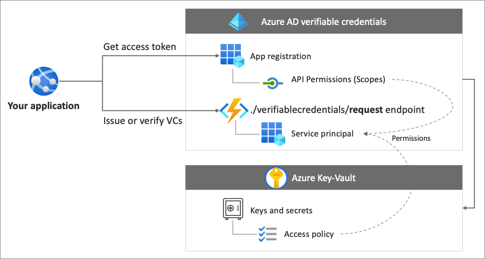
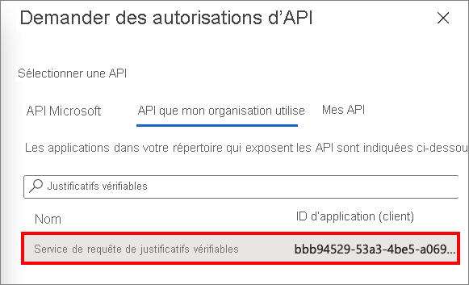
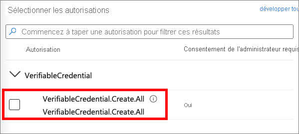

# <a name="configure-your-tenant-for-azure-ad-verifiable-credentials-preview"></a>Configurer votre locataire pour les justificatifs vérifiables Azure AD (préversion)

Le service Justificatifs vérifiables Azure Active Directory (Azure AD) vous permet d’émettre et de vérifier des justificatifs. Pour pouvoir émettre ou vérifier des justificatifs (ou les deux), suivez les instructions de ce tutoriel.

Dans ce tutoriel, nous passons en revue les étapes nécessaires à la configuration de votre locataire Azure AD afin qu’il puisse utiliser les justificatifs vérifiables Azure AD.

Dans cet article, vous apprendrez comment :

> [!div class="checklist"]
>
> - Configurer un principal de service
> - Créer un Azure Key Vault
> - Inscrire une application dans Azure AD
> - Configurer le service Justificatifs vérifiables en préversion

Le diagramme suivant illustre l’architecture des justificatifs vérifiables Azure AD et le composant que vous configurez.



## <a name="prerequisites"></a>Prérequis

- Si vous n’avez pas d’abonnement Azure, créez-en [un gratuit](https://azure.microsoft.comfree/?WT.mc_id=A261C142F).
- Prenez un abonnement aux [éditions Azure Active Directory Premium](../../active-directory/fundamentals/active-directory-get-started-premium.md) dans votre locataire.
- L’autorisation d’[administrateur général](../../active-directory/roles/permissions-reference.md#global-administrator) pour l’annuaire que vous souhaitez configurer.
- [PowerShell](/powershell/scripting/install/installing-powershell)7.0.6 LTS-x64, PowerShell 7.1.3-x64 ou une version ultérieure installée.

## <a name="step-1-set-up-a-service-principal"></a>Étape 1. Configurer un principal de service

Créez un principal de service pour l’API Request Service. L’API de service est le service Microsoft que vous utilisez pour émettre ou vérifier des justificatifs vérifiables Azure AD.

Pour créer le principal de service :

1. Exécutez les commandes PowerShell suivantes. Ces commandes installent le module AzureAD (s’il n’est pas déjà installé) et importent le [module AzureAD](/powershell/azure/install-az-ps#installation). Si vous rencontrez des problèmes lors de l’installation du module, consultez l’article [Installer le module PowerShell d’Azure Az](/powershell/azure/install-az-ps#installation).

    ```powershell
    if ((Get-Module -ListAvailable -Name "AzureAD") -eq $null) {  Install-Module "AzureAD" -Scope CurrentUser }  Import-Module AzureAD
    ```

1. Exécutez la commande PowerShell suivante pour vous connecter à votre locataire Azure AD. Remplacez \<*your-tenant-ID*> par votre [ID de locataire Azure AD](../../active-directory/fundamentals/active-directory-how-to-find-tenant.md).

    ```powershell
    Connect-AzureAD -TenantId <your-tenant-ID>
    ```

1. Dans la même session PowerShell, exécutez la commande suivante. L’AppId « bbb94529-53a3-4be5-a069-7eaf2712b826 » fait référence au service Microsoft des justificatifs vérifiables.

    ```powershell
    New-AzureADServicePrincipal -AppId "bbb94529-53a3-4be5-a069-7eaf2712b826" -DisplayName "Verifiable Credential Request Service" 
    ```

## <a name="step-2-create-a-key-vault"></a>Étape 2. Créer un coffre de clés

[Azure Key Vault](/azure/key-vault/general/basic-concepts) est un service cloud qui permet l’accès et le stockage sécurisés des secrets et des clés. Votre service des justificatifs vérifiables stocke les clés publiques et privées dans Azure Key Vault. Ces clés sont utilisées pour signer et vérifier les justificatifs.

Si vous n’avez pas d’instance d’Azure Key Vault, procédez comme suit pour créer un coffre de clés à l’aide du portail Azure.

>[!NOTE]
>Par défaut, le compte qui crée le coffre de clés est le seul à pouvoir y accéder. Le service de justificatifs vérifiables doit avoir accès au coffre de clés. Le coffre de clés doit être configuré avec une stratégie d’accès permettant au compte utilisé au cours de la configuration de **créer des clés** et de **supprimer des clés** si vous les refusez, et avec une autorisation pour **se connecter** afin de créer la liaison de domaine pour le service de justificatifs vérifiables. Si vous utilisez le même compte lors du test, veillez à modifier la stratégie par défaut pour permettre au compte de **Signer** en plus des autorisations par défaut accordées aux créateurs de coffre.

### <a name="step-21-set-access-policies-for-the-key-vault"></a>Étape 2.1 Définir des stratégies d’accès pour le coffre de clés

Après avoir intégré le service de justificatifs vérifiables Azure, le service génère un jeu de clés utilisé pour assurer la sécurité des messages. Ces clés sont stockées dans le coffre de clés. Dans le cadre d’une émission ou d’une vérification, un jeu de clés est encore utilisé pour la signature, la mise à jour et la récupération des justificatifs vérifiables.

Une [stratégie d’accès](/azure/key-vault/general/assign-access-policy) Key Vault détermine si un principal de sécurité donné, peut effectuer des opérations sur des clés et des secrets Key Vault. Définissez des stratégies d’accès dans votre coffre Azure Key Vault pour le compte d’administrateur du service de justificatifs vérifiables Azure AD et pour le principal d’API Request Service que vous avez créé.

1. Dans le [portail Azure](https://portal.azure.com/), accédez au **coffre de clés** que vous utilisez pour ce tutoriel.

1. Sous **Paramètres**, sélectionnez **Stratégies d’accès**.

1. Dans la page **Ajouter des stratégies d’accès**, sous **UTILISATEUR**, sélectionnez le compte que vous utilisez pour ce tutoriel.

1. Pour les **autorisations clés**, vérifiez que les autorisations suivantes sont sélectionnées. **Créer, Supprimer** et **Signer**. Par défaut, les paramètres Créer et Supprimer sont déjà activés. Signer doit être la seule autorisation de clé que vous devez mettre à jour.
    
    La capture d’écran suivante montre comment configurer la stratégie d’accès administrateur.

    

1. Pour enregistrer les modifications, sélectionnez **Enregistrer**.

1. Sélectionnez **+ Ajouter une stratégie d’accès** pour ajouter une autorisation au principal de service du service de demande de justificatifs vérifiables.

1. Dans la page **Ajouter une stratégie d’accès**

    1. Pour **Autorisations de clé**, sélectionnez **Obtenir** et **Signer**.

    1. Pour **Autorisations du secret**, sélectionnez **Obtenir**.

    1. Pour **Sélectionner le principal**, sélectionnez le **service de demande de justificatifs vérifiables**.

    1. Sélectionnez **Ajouter**.  
        
       La capture d’écran suivante montre comment ajouter une stratégie d’accès pour le service de demande de justificatifs vérifiables. 
    
       

1. Sélectionnez **Enregistrer** pour enregistrer la nouvelle stratégie que vous avez créée.

## <a name="step-3-register-an-application-in-azure-ad"></a>Étape 3. Inscrire une application dans Azure AD

Le service de demande de justificatifs vérifiables Azure AD doit être en mesure d’obtenir des jetons d’accès pour l’émission et le vérificateur. Pour obtenir des jetons d’accès, inscrivez une application web et accordez une autorisation d’API pour l’API du service de demande de justificatifs vérifiables que vous avez configurée à l’étape précédente.

1. Connectez-vous au [portail Azure](https://portal.azure.com/) avec votre compte d’administrateur.

1. Si vous avez accès à plusieurs locataires, sélectionnez l’icône **Répertoire + abonnement** :::image type="icon" source="media/verifiable-credentials-configure-tenant/portal-directory-subscription-filter.png" border="false":::. Ensuite, recherchez et sélectionnez votre instance **Azure Active Directory**.

1. Sous **Gérer**, sélectionnez **Inscriptions d’applications**, puis **Nouvelle inscription**.  

   

1. Entrez un **nom** d’affichage pour votre application. Par exemple, **verifiable-credentials-app**.

1. Pour **Types de comptes pris en charge**, sélectionnez **Comptes dans cet annuaire organisationnel uniquement (Annuaire par défaut uniquement – Locataire unique)** .

1. Sélectionnez **Inscrire** pour créer l’application.
  
   La capture d’écran suivante montre comment inscrire l’application.

   

### <a name="31-grant-permissions-to-get-access-tokens"></a>3.1 Accorder des autorisations pour obtenir des jetons d’accès

Dans cette étape, vous accordez des autorisations au principal du service de demande de justificatifs vérifiables créé à l’[étape 1](#step-1-set-up-a-service-principal).

Pour ajouter les autorisations requises, suivez ces étapes :

1. Restez dans la page des détails de l’application **verifiable-credentials-app**. Sélectionnez **Autorisations d’API**, puis **Ajouter une autorisation**.
    
    

1. Sélectionnez **API utilisées par mon organisation**.

1. Recherchez le principal de service que vous avez créé précédemment, **Service de demande de justificatifs vérifiables**, et sélectionnez-le.
    
    

1. Choisissez **Autorisation de l’application** et développez **VerifiableCredential.Create.All**.

    

1. Sélectionnez **Ajouter des autorisations**.

1. Sélectionnez **Accorder un consentement d’administrateur pour \<your tenant name\>.**

## <a name="step-4-set-up-verifiable-credentials-preview-service"></a>Étape 4. Configurer le service Justificatifs vérifiables en préversion

Le service des justificatifs vérifiables Azure AD protège votre organisation avec une solution d’identité décentralisée transparente. Pour les émetteurs, Azure AD fournit un service qu’ils peuvent personnaliser et utiliser pour émettre leurs propres justificatifs vérifiables. Pour les vérificateurs, le service des justificatifs vérifiables offre un service d’API REST gratuit permettant de demander et d’accepter facilement des justificatifs vérifiables dans vos applications et services.

Pour configurer vos justificatifs vérifiables Azure AD, suivez ces étapes :

1. Dans le [portail Azure](https://portal.azure.com/), recherchez des **justificatifs vérifiables**. Ensuite, sélectionnez **Justificatifs vérifiables (préversion)** .

1. Dans le menu de gauche, sélectionnez **Démarrage**.

1. Configurez votre organisation en fournissant les informations suivantes :

    1. **Nom de l’organisation** : entrez un nom pour faire référence à votre entreprise dans le cadre des justificatifs vérifiables. Cette valeur n’est pas destinée aux clients.

    1. **Domaine** : entrez un domaine ajouté à un point de terminaison de service dans votre document DID. Le domaine est ce qui lie votre DID à un élément tangible que l’utilisateur peut connaître sur votre entreprise. Microsoft Authenticator et d’autres portefeuilles numériques utilisent ces informations pour s’assurer que votre DID est lié à votre domaine. Si le portefeuille peut vérifier le DID, il affiche un symbole vérifié. Dans le cas contraire, il informe l’utilisateur que des justificatifs ont été émis par une organisation qu’il n’a pas pu valider.   
            
        >[!IMPORTANT]
        > Le domaine ne peut pas être une redirection. Dans le cas contraire, le DID et le domaine ne peuvent pas être liés. Veillez à utiliser le protocole HTTPS pour le domaine, par ex. <https://contoso.com>.

    1. **Coffre de clés** : entrez le nom du coffre de clés que vous avez créé précédemment.

1. Sélectionnez **Enregistrer et créer un justificatif**.  
    
    La capture d’écran suivante montre comment configurer les justificatifs vérifiables :  
    
    

## <a name="next-steps"></a>Étapes suivantes

- [Découvrez comment émettre des justificatifs vérifiables Azure AD à partir d’une application web](verifiable-credentials-configure-issuer.md).
- [Découvrez comment vérifier des justificatifs vérifiables Azure AD](verifiable-credentials-configure-verifier.md).
