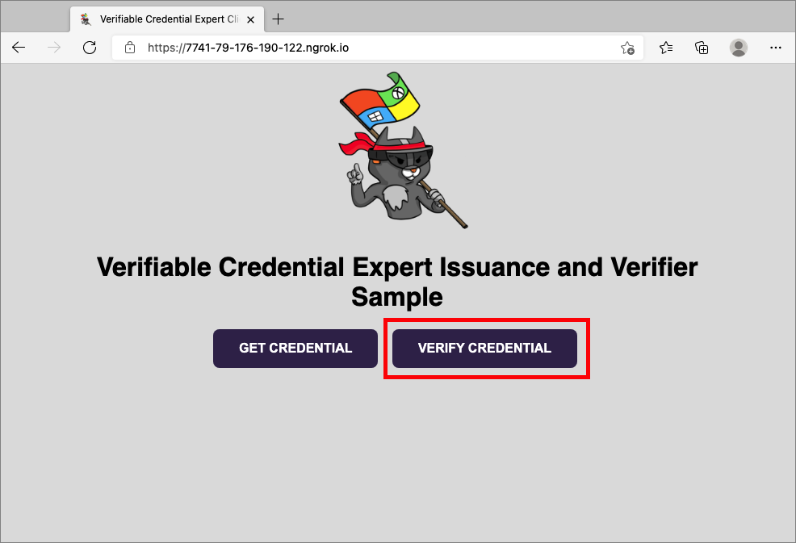
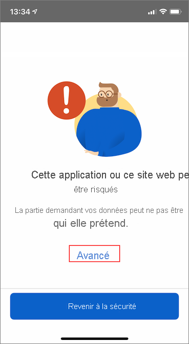
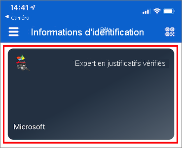
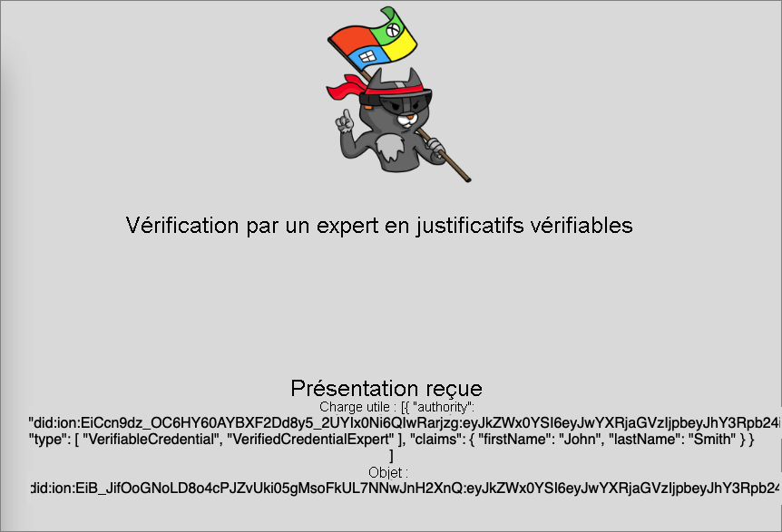

# <a name="configure-azure-ad-verifiable-credentials-verifier-preview"></a>Configurer un vérificateur de justificatifs vérifiables Azure AD (préversion)

Dans le [tutoriel précédent](verifiable-credentials-configure-issuer.md), vous apprenez à émettre et vérifier des justificatifs vérifiables à l’aide du même locataire Azure Active Directory (Azure AD). Dans ce tutoriel, nous allons passer en revue les étapes nécessaires à la présentation et à la vérification de votre premier justificatif vérifiable : une carte d’expert en justificatif vérifié.

En tant que vérificateur, vous déverrouillez des privilèges sur les personnes qui détiennent des cartes d’expert en justificatifs vérifiés. Dans ce tutoriel, vous exécutez un exemple d’application à partir de votre ordinateur local qui vous demande de présenter une carte d’expert en justificatif vérifié, puis qui vérifie cette dernière.

Dans cet article, vous apprendrez comment :

> [!div class="checklist"]
>
> - Télécharger l’exemple de code d’application sur votre ordinateur local
> - Configurer des justificatifs vérifiables Azure AD dans votre locataire Azure AD
> - Collecter les justificatifs vérifiables et les détails sur l’environnement pour configurer votre exemple d’application et le mettre à jour avec les détails de votre carte d’expert en justificatif vérifié
> - Exécuter l’exemple d’application et initialiser un processus d’émission de justificatifs vérifiables

## <a name="prerequisites"></a>Prérequis

- Avant de commencer, il est important de [configurer un locataire pour des justificatifs vérifiables Azure AD](verifiable-credentials-configure-tenant.md).
- Pour cloner le référentiel qui héberge l’exemple d’application, [GIT](https://git-scm.com/downloads) doit avoir été installé.
- [Visual Studio Code](https://code.visualstudio.com/Download) ou un éditeur de code similaire.
- [.NET 5.0](https://dotnet.microsoft.com/download/dotnet/5.0)
- [NGROK](https://ngrok.com/) gratuit.
- Un appareil mobile avec Microsoft Authenticator
  - Android version 6.2108.5654 ou ultérieure installé.
  - iOS version 6.5.82 ou ultérieure installé.

## <a name="gather-tenant-details-to-set-up-your-sample-application"></a>Rassembler les détails du locataire pour configurer votre exemple d’application

Maintenant que vous avez configuré votre service de justificatifs vérifiables Azure AD, vous allez collecter des informations sur votre environnement et les justificatifs vérifiables que vous avez définis. Vous utilisez ces informations lors de la configuration de votre exemple d’application.

1. Dans les justificatifs vérifiables, sélectionnez **Paramètres de l’organisation**.
1. Copiez l’**identificateur de locataire** et prenez-en note pour l’utiliser plus tard.
1. Copiez l’**identificateur décentralisé** et prenez-en note pour l’utiliser plus tard.

La capture d’écran suivante montre comment copier les valeurs requises :


## <a name="download-the-sample-code"></a>Télécharger l’exemple de code

L’exemple d’application est disponible dans .NET et le code est conservé dans un dépôt GitHub. Téléchargez notre exemple de code à partir du [dépôt GitHub](https://github.com/Azure-Samples/active-directory-verifiable-credentials-dotnet) ou clonez le dépôt sur votre ordinateur local :

```bash
git clone git@github.com:Azure-Samples/active-directory-verifiable-credentials-dotnet.git 
```

## <a name="configure-the-verifiable-credentials-app"></a>Configurer l’application de justificatifs vérifiables

Créez un secret client pour l’application inscrite que vous avez créée. L’exemple d’application utilise le secret client pour prouver son identité lorsqu’elle demande des jetons.

1. Accédez à la page **Inscriptions d’applications** située dans **Azure Active Directory**.

1. Sélectionnez l’application *verifiable-credentials-app* que vous avez créée précédemment.

1. Sélectionnez le nom à afficher dans les **détails des inscriptions d’applications**.

1. Copiez l’**ID d’application (client)** et stockez-le pour l’utiliser plus tard. 

    

1. Dans les détails d’inscription de l’application, dans le menu principal, sous **Gérer**, sélectionnez **Certificats et secrets**.

1. Sélectionnez **Nouveau secret client**.

    1. Dans la zone **Description**, entrez une description pour le secret client (par exemple, vc-sample-secret).

    1. Sous **Expire**, sélectionnez une durée pendant laquelle le secret est valide, par exemple 6 mois, puis sélectionnez **Ajouter**.

    1. Enregistrez la **Valeur** du secret. Vous utiliserez cette valeur pour la configuration dans une étape ultérieure. Cette valeur de secret ne sera plus jamais affichée et aucun autre moyen ne permettra de la récupérer. Prenez-en note dès qu’elle apparaît.

À ce stade, vous devez disposer de toutes les informations nécessaires pour configurer votre exemple d’application.

## <a name="update-the-sample-application"></a>Mettre à jour l’exemple d’application

À présent, vous apportez des modifications au code émetteur de l’exemple d’application pour le mettre à jour avec votre URL de justificatifs vérifiables. Vous pouvez ainsi émettre des justificatifs vérifiables à l’aide de votre propre abonné.

1. Dans le répertoire *active-directory-verifiable-credentials-dotnet-main*, ouvrez Visual Studio Code et sélectionnez le projet à l’intérieur du répertoire *1. asp-net-core-api-idtokenhint*.

1. Dans le dossier racine du projet, ouvrez le fichier appsettings.json. Ce fichier contient des informations sur vos justificatifs vérifiables Azure AD. Mettez à jour les propriétés suivantes avec les informations que vous avez enregistrées au cours des étapes ci-dessus :

    1. **ID de locataire** : votre ID de locataire
    1. **ID client** : votre ID client
    1. **Secret client** : votre secret client
    1. **VerifierAuthority** : votre identificateur décentralisé
    1. **CredentialManifest** : votre URL d’émission de justificatifs

1. Enregistrez le fichier *appsettings.json*.

Le code JSON suivant illustre un fichier appsettings.json complet :

```json
{

 "AppSettings": {
   "Endpoint": "https://beta.did.msidentity.com/v1.0/{0}/verifiablecredentials/request",
   "VCServiceScope": "bbb94529-53a3-4be5-a069-7eaf2712b826/.default",
   "Instance": "https://login.microsoftonline.com/{0}",
   "TenantId": "987654321-0000-0000-0000-000000000000",
   "ClientId": "555555555-0000-0000-0000-000000000000",
   "ClientSecret": "123456789012345678901234567890",
   "VerifierAuthority": "did:ion:EiDJzvzaBMb_EWTWUFEasKzL2nL-BJPhQTzYWjA_rRz3hQ:eyJkZWx0YSI6eyJwYXRjaGVzIjpbeyJhY3Rpb24iOiJyZXBsYWNlIiwiZG9jdW1lbnQiOnsicHVibGljS2V5cyI6W3siaWQiOiJzaWdfMmNhMzY2YmUiLCJwdWJsaWNLZXlKd2siOnsiY3J2Ijoic2VjcDI1NmsxIiwia3R5IjoiRUMiLCJ4IjoiZDhqYmduRkRGRElzR1ZBTWx5aDR1b2RwOGV4Q2dpV3dWUGhqM0N...",
   "CredentialManifest": " https://beta.did.msidentity.com/v1.0/987654321-0000-0000-0000-000000000000/verifiableCredential/contracts/VerifiedCredentialExpert"
 }
}
```

## <a name="run-and-test-the-sample-app"></a>Exécuter et tester l’exemple d’application

Vous êtes maintenant prêt à présenter et à vérifier votre première carte d’expert en justificatif vérifié en exécutant cet exemple d’application.

1. Dans Visual Studio Code, exécutez le projet Verifiable_credentials_DotNet. Ou, dans l’interpréteur de commandes, exécutez les commandes suivantes :

    ```bash
    cd active-directory-verifiable-credentials-dotnet/1. asp-net-core-api-idtokenhint  dotnet build "asp-net-core-api-idtokenhint.csproj" -c Debug -o .\bin\Debug\netcoreapp3.1  
    dotnet run
    ```

1. Dans un autre terminal, exécutez la commande ci-dessous. Cette commande exécute [ngrok](https://ngrok.com/) pour configurer une URL sur 3000 et la rendre disponible publiquement sur Internet.

    ```bash
    ngrok http 3000 
    ```
    
    >[!NOTE]
    > Sur certains ordinateurs, vous devrez peut-être exécuter la commande dans le format `./ngrok http 3000`

1. Ouvrez l’URL HTTPS générée par ngrok.

    

1. Dans le navigateur web, sélectionnez **Vérifier les informations d’identification**.

    

1. Utilisez l’application Authenticator pour scanner le code QR ou scannez-le directement avec votre appareil photo mobile.

1. Lorsque le message d’avertissement **Cette application ou ce site web peut être risqué(e)** s’affiche, sélectionnez **Avancé**. Cet avertissement s’affiche car votre domaine n’est pas vérifié. Pour vérifier votre domaine, suivez les instructions fournies dans l’article Lier votre domaine à votre identificateur décentralisé (DID). Pour ce tutoriel, vous pouvez ignorer l’inscription du domaine.  

    
    

1. Lors de l’avertissement concernant un site web risqué, sélectionnez **Continuer quand même (non sécurisé)** .  
 
    

1. Approuvez la demande en sélectionnant **Autoriser**.

    

1. Une fois que vous avez approuvé la demande, vous pouvez voir que la demande a été approuvée. Vous pouvez également vérifier le journal. Pour voir le journal, sélectionnez le justificatif vérifiable :

    

1. Ensuite, sélectionnez **Activité récente**.  

    

1. L’**activité récente** vous montre les activités récentes de votre justificatif vérifiable.

    

1. Revenez à l’exemple d’application. Il vous indique que la présentation des justificatifs vérifiables a été reçue.

    

## <a name="next-steps"></a>Étapes suivantes

Découvrez [comment personnaliser vos justificatifs vérifiables](credential-design.md).
