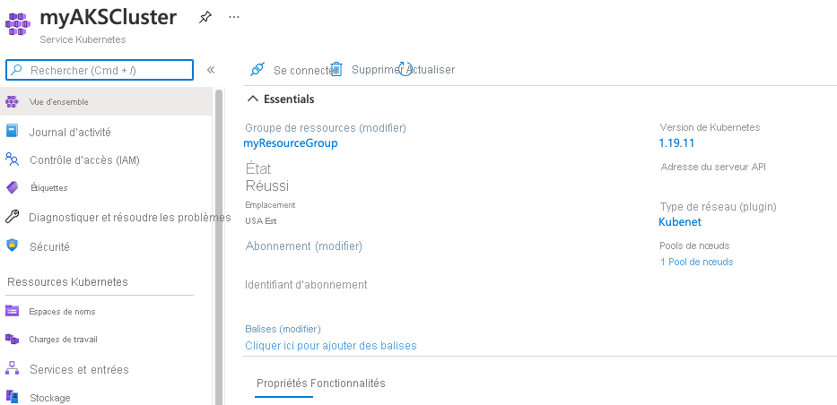
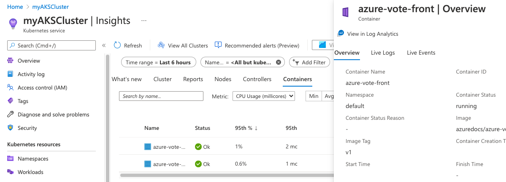

# <a name="quickstart-deploy-an-azure-kubernetes-service-aks-cluster-using-the-azure-portal"></a>Démarrage rapide : déployer un cluster AKS (Azure Kubernetes Service) à l’aide du portail Azure

AKS (Azure Kubernetes Service) est un service Kubernetes managé qui vous permet de déployer et de gérer rapidement des clusters. Dans ce guide de démarrage rapide, vous allez :
* Déployer un cluster AKS dans le portail Azure. 
* Exécutez une application à plusieurs conteneurs avec un serveur web frontal et une instance Redis dans le cluster. 
* Supervisez l’intégrité du cluster et des pods qui exécutent votre application.


Ce guide de démarrage rapide suppose une compréhension élémentaire des concepts liés à Kubernetes. Pour plus d’informations, consultez [Concepts de base de Kubernetes pour AKS (Azure Kubernetes Service)][kubernetes-concepts].

Si vous n’avez pas d’abonnement Azure, créez un [compte gratuit](https://azure.microsoft.com/free/?WT.mc_id=A261C142F) avant de commencer.

## <a name="prerequisites"></a>Prérequis

Connectez-vous au portail Azure sur [https://portal.azure.com](https://portal.azure.com).

## <a name="create-an-aks-cluster"></a>Créer un cluster AKS

1. Dans le menu du portail Azure ou dans la page **Accueil**, sélectionnez **Créer une ressource**.

2. Sélectionnez **Conteneurs** > **Kubernetes Service**.

3. Sur la page **Bases**, configurez les options suivantes :
    - **Détails du projet** : 
        * Sélectionnez un **abonnement** Azure.
        * Sélectionnez ou créez un **groupe de ressources** Azure, par exemple *myResourceGroup*.
    - **Détails du cluster** : 
        * Entrez un **nom du cluster Kubernetes**, tel que *myAKSCluster*. 
        * Sélectionnez une **région** et une **version de Kubernetes** pour le cluster AKS.
    - **Pool de nœuds principal** : 
        * Sélectionnez une **taille de nœud** de machine virtuelle pour les nœuds AKS. Elle ne sera *pas modifiable* une fois le cluster AKS déployé.
        * Sélectionnez également le nombre de nœuds à déployer dans le cluster. Pour effectuer ce démarrage rapide, définissez le **Nombre de nœuds** à *1*. Le nombre de nœuds est *modifiable* après le déploiement du cluster.
    
    

4. Sélectionnez **Suivant : Pools de nœuds** à l’issue du processus.

5. Conservez les options de **Pools de nœuds** par défaut. Au bas de la page, cliquez sur **Suivant : Authentification**.
    > [!CAUTION]
    > La propagation et la mise en disponibilité des nouveaux principaux de service Azure AD créés peuvent prendre plusieurs minutes, ce qui entraîne des erreurs « Principal du service introuvable » et des échecs de validation dans le portail Azure. Si vous rencontrez ce problème, consultez [notre article de résolution des problèmes](troubleshooting.md#received-an-error-saying-my-service-principal-wasnt-found-or-is-invalid-when-i-try-to-create-a-new-cluster) pour l’atténuation.

6. Sur la page **Authentification**, configurez les options suivantes :
    - Créez une identité de cluster en procédant d’une des façons suivantes :
        * En laissant le champ **Authentification** sur **Identité managée affectée par le système**, ou
        * En choisissant **Principal du service** pour utiliser un principal de service. 
            * Sélectionnez *(nouveau) principal de service par défaut* pour créer un principal de service par défaut ou
            * Sélectionnez *Configurer le principal de service* pour utiliser un principal de service existant. Vous devez indiquer l’ID client SPN et le secret associés du principal existant.
    - Activez l’option de contrôle d’accès en fonction du rôle Kubernetes (Kubernetes RBAC) pour fournir un contrôle plus précis de l’accès aux ressources Kubernetes déployées dans votre cluster AKS.

    Par défaut, le réseau *De base* est utilisé et Azure Monitor pour conteneurs est activé. 

7. Cliquez sur **Vérifier + créer**, puis **Créer** lorsque la validation est terminée. 


8. La création du cluster AKS ne prend que quelques minutes. Une fois votre déploiement terminé, accédez à votre ressource en procédant une des façons suivantes :
    * En cliquant sur **Accéder à la ressource**, ou
    * En accédant au groupe de ressources de cluster AKS et en sélectionnant la ressource AKS. 
        * Par exemple, pour le tableau de bord de cluster ci-dessous : accédez à *myResourceGroup* et sélectionnez la ressource *myAKSCluster*.

        

## <a name="connect-to-the-cluster"></a>Se connecter au cluster

Pour gérer un cluster Kubernetes, utilisez [kubectl][kubectl], le client de ligne de commande Kubernetes. Si vous utilisez Azure Cloud Shell, `kubectl` est déjà installé. 

1. Ouvrez Cloud Shell à l’aide du bouton `>_` situé en haut du portail Azure.

    

    > [!NOTE]
    > Pour effectuer ces opérations dans une installation Shell locale :
    > 1. Vérifiez que l’interface de ligne de commande Azure est installée.
    > 2. Connectez-vous à Azure à l’aide de la commande `az login`.

2. Configurez `kubectl` afin de vous connecter à votre cluster Kubernetes avec la commande [az aks get-credentials][az-aks-get-credentials]. La commande suivante télécharge les informations d’identification et configure l’interface CLI Kubernetes pour les utiliser.

    ```azurecli
    az aks get-credentials --resource-group myResourceGroup --name myAKSCluster
    ```

3. Vérifiez la connexion à votre cluster avec la commande `kubectl get` pour retourner une liste des nœuds du cluster.

    ```console
    kubectl get nodes
    ```

    La sortie montre le nœud unique créé au cours des étapes précédentes. Assurez-vous que l’état du nœud est *Prêt* :

    ```output
    NAME                       STATUS    ROLES     AGE       VERSION
    aks-agentpool-14693408-0   Ready     agent     15m       v1.11.5
    ```

## <a name="run-the-application"></a>Exécution de l'application

Un fichier manifeste Kubernetes définit un état souhaité d’un cluster, notamment les images conteneur à exécuter. 

Dans ce guide de démarrage rapide, un manifeste est utilisé afin de créer tous les objets nécessaires pour l’exécution de l’application de vote Azure. Ce manifeste comprend deux déploiements Kubernetes :
* Exemples d’applications Python pour Azure Vote.
* Une instance Redis. 

Deux services Kubernetes sont également créés :
* Un service interne pour l’instance Redis.
* Un service externe pour accéder à l’application Azure vote à partir d’Internet.

1. Dans le Cloud Shell, utilisez un éditeur pour créer un fichier nommé `azure-vote.yaml`, tel que :
    * `code azure-vote.yaml`
    * `nano azure-vote.yaml` ou 
    * `vi azure-vote.yaml`. 

1. Copiez-y la définition YAML suivante :

    ```yaml
    apiVersion: apps/v1
    kind: Deployment
    metadata:
      name: azure-vote-back
    spec:
      replicas: 1
      selector:
        matchLabels:
          app: azure-vote-back
      template:
        metadata:
          labels:
            app: azure-vote-back
        spec:
          nodeSelector:
            "beta.kubernetes.io/os": linux
          containers:
          - name: azure-vote-back
            image: mcr.microsoft.com/oss/bitnami/redis:6.0.8
            env:
            - name: ALLOW_EMPTY_PASSWORD
              value: "yes"
            resources:
              requests:
                cpu: 100m
                memory: 128Mi
              limits:
                cpu: 250m
                memory: 256Mi
            ports:
            - containerPort: 6379
              name: redis
    ---
    apiVersion: v1
    kind: Service
    metadata:
      name: azure-vote-back
    spec:
      ports:
      - port: 6379
      selector:
        app: azure-vote-back
    ---
    apiVersion: apps/v1
    kind: Deployment
    metadata:
      name: azure-vote-front
    spec:
      replicas: 1
      selector:
        matchLabels:
          app: azure-vote-front
      template:
        metadata:
          labels:
            app: azure-vote-front
        spec:
          nodeSelector:
            "beta.kubernetes.io/os": linux
          containers:
          - name: azure-vote-front
            image: mcr.microsoft.com/azuredocs/azure-vote-front:v1
            resources:
              requests:
                cpu: 100m
                memory: 128Mi
              limits:
                cpu: 250m
                memory: 256Mi
            ports:
            - containerPort: 80
            env:
            - name: REDIS
              value: "azure-vote-back"
    ---
    apiVersion: v1
    kind: Service
    metadata:
      name: azure-vote-front
    spec:
      type: LoadBalancer
      ports:
      - port: 80
      selector:
        app: azure-vote-front
    ```

1. Déployez l’application à l’aide de la commande `kubectl apply` et spécifiez le nom de votre manifeste YAML :

    ```console
    kubectl apply -f azure-vote.yaml
    ```

    La sortie affiche les déploiements et services créés avec succès :

    ```output
    deployment "azure-vote-back" created
    service "azure-vote-back" created
    deployment "azure-vote-front" created
    service "azure-vote-front" created
    ```

## <a name="test-the-application"></a>Test de l’application

Quand l’application s’exécute, un service Kubernetes expose le front-end de l’application sur Internet. L’exécution de ce processus peut prendre plusieurs minutes.

Pour surveiller la progression, utilisez la commande `kubectl get service` avec l’argument `--watch`.

```console
kubectl get service azure-vote-front --watch
```

La sortie **EXTERNAL-IP** pour le service `azure-vote-front` affiche initialement *En attente*.

```output
NAME               TYPE           CLUSTER-IP   EXTERNAL-IP   PORT(S)        AGE
azure-vote-front   LoadBalancer   10.0.37.27   <pending>     80:30572/TCP   6s
```

Quand l’adresse **EXTERNAL-IP** passe de l’état *pending* à une adresse IP publique réelle, utilisez `CTRL-C` pour arrêter le processus de surveillance `kubectl`. L’exemple de sortie suivant montre une adresse IP publique valide affectée au service :


```output
azure-vote-front   LoadBalancer   10.0.37.27   52.179.23.131   80:30572/TCP   2m
```

Pour voir l’application Azure Vote en action, ouvrez un navigateur web en utilisant l’adresse IP externe de votre service.


## <a name="monitor-health-and-logs"></a>Analyser le fonctionnement et les journaux d’activité

Azure Monitor pour conteneurs a été activé quand vous avez créé le cluster. Azure Monitor pour conteneurs fournit des indicateurs d’intégrité pour le cluster AKS et les pods en cours d’exécution sur le cluster.

Le remplissage des données de métriques prend quelques minutes dans le portail Azure. Pour afficher l’état d’intégrité, la durée de fonctionnement et l’utilisation des ressources actuels pour les pods Azure Vote :

1. Accédez à la ressource AKS dans le portail Azure.
1. Sous **Supervision** à gauche, choisissez **Insights**.
1. Dans la partie supérieure, choisissez **+ Ajouter un filtre**.
1. Sélectionnez **Espace de noms** en guise de propriété, puis choisissez *\<All but kube-system\>* .
1. Sélectionnez **Conteneurs** pour les afficher.

Les conteneurs `azure-vote-back` et `azure-vote-front` s’affichent, comme illustré dans l’exemple suivant :



Pour visualiser les journaux relatifs au pod `azure-vote-front`, sélectionnez **Afficher les journaux du conteneur** dans la liste déroulante de conteneurs. Vous pourrez voir les flux *stdout* et *stderr* du conteneur.


## <a name="delete-cluster"></a>Supprimer un cluster

Pour éviter les frais Azure, vous devez nettoyer les ressources non nécessaires. Sélectionnez le bouton **Supprimer** dans le tableau de bord du cluster AKS. Vous pouvez également utiliser la commande [az aks delete][az-aks-delete] dans Cloud Shell :

```azurecli
az aks delete --resource-group myResourceGroup --name myAKSCluster --no-wait
```
> [!NOTE]
> Lorsque vous supprimez le cluster, le principal de service Azure Active Directory utilisé par le cluster AKS n’est pas supprimé. Pour obtenir des instructions sur la façon de supprimer le principal de service, consultez [Considérations et suppression du principal de service AKS][sp-delete].
> 
> Si vous avez utilisé une identité managée, l’identité est managée par la plateforme et n’a pas besoin d’être supprimée.

## <a name="get-the-code"></a>Obtenir le code

Dans ce guide de démarrage rapide, des images conteneur existant au préalable ont été utilisées pour créer un déploiement Kubernetes. Le code de l’application associé, Dockerfile, et le fichier manifeste Kubernetes sont [disponibles sur GitHub][azure-vote-app].

## <a name="next-steps"></a>Étapes suivantes

Dans ce Démarrage rapide, vous avez déployé un cluster Kubernetes dans lequel vous avez ensuite déployé une application de plusieurs conteneurs. Découvrez comment accéder au tableau de bord web Kubernetes pour votre cluster AKS.


Pour en savoir plus sur AKS au travers d’un exemple complet, notamment sur la création d’une application, le déploiement à partir d’Azure Container Registry, la mise à jour d’une application en cours d’exécution ainsi que la mise à l’échelle et la mise à niveau de votre cluster, passez au tutoriel sur les clusters Kubernetes.

> [!div class="nextstepaction"]
> [Didacticiel AKS][aks-tutorial]

<!-- LINKS - external -->
[azure-vote-app]: https://github.com/Azure-Samples/azure-voting-app-redis.git
[kubectl]: https://kubernetes.io/docs/user-guide/kubectl/
[kubectl-apply]: https://kubernetes.io/docs/reference/generated/kubectl/kubectl-commands#apply
[kubectl-get]: https://kubernetes.io/docs/reference/generated/kubectl/kubectl-commands#get
[kubernetes-documentation]: https://kubernetes.io/docs/home/

<!-- LINKS - internal -->
[kubernetes-concepts]: concepts-clusters-workloads.md
[az-aks-get-credentials]: /cli/azure/aks#az-aks-get-credentials
[az-aks-delete]: /cli/azure/aks#az-aks-delete
[aks-monitor]: ../azure-monitor/containers/container-insights-overview.md
[aks-network]: ./concepts-network.md
[aks-tutorial]: ./tutorial-kubernetes-prepare-app.md
[http-routing]: ./http-application-routing.md
[sp-delete]: kubernetes-service-principal.md#additional-considerations