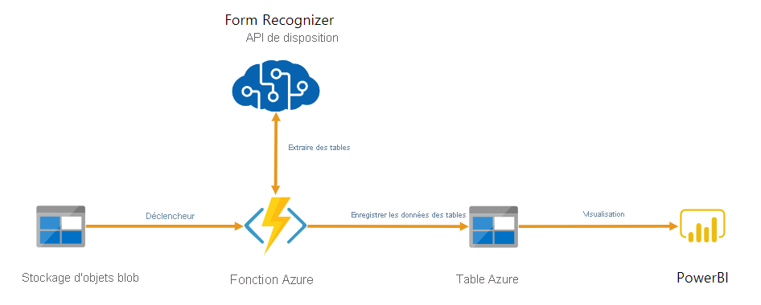
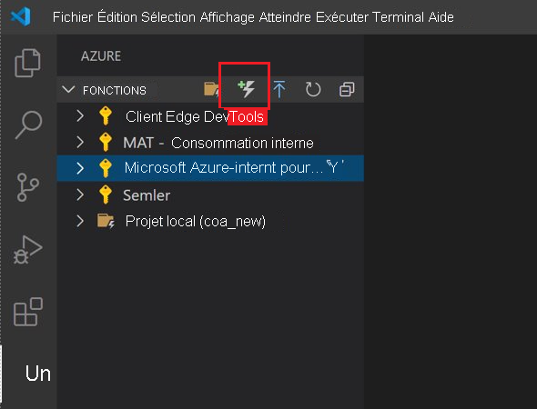
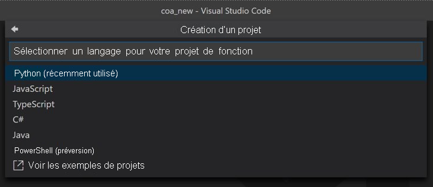

# <a name="tutorial-use-an-azure-function-to-process-stored-documents"></a>Tutoriel : Utiliser une fonction Azure pour traiter des documents stockés

Vous pouvez utiliser Form Recognizer dans le cadre d’un pipeline de traitement de données automatisé créé avec Azure Functions. Ce guide vous montre comment utiliser une fonction Azure pour traiter des documents chargés dans un conteneur de stockage de blob Azure. Ce workflow extrait des données de table à partir de documents stockés à l’aide du service Layout de Form Recognizer, et enregistre les données de table dans un fichier .csv dans Azure. Vous pouvez ensuite afficher les données à l’aide de Microsoft Power BI (non abordé ici).

> [!div class="mx-imgBorder"]
> 

Dans ce tutoriel, vous allez apprendre à :

> [!div class="checklist"]
> * Création d'un compte Azure Storage
> * Créer un projet Azure Functions
> * Extraire des données de disposition à partir de formulaires chargés
> * Charger des données de disposition vers le Stockage Azure

## <a name="prerequisites"></a>Prérequis

* Abonnement Azure - [En créer un gratuitement](https://azure.microsoft.com/free/cognitive-services)
* <a href="https://ms.portal.azure.com/#create/Microsoft.CognitiveServicesFormRecognizer"  title="Créez une ressource Form Recognizer"  target="_blank">créer une ressource Form Recognizer<span class="docon docon-navigate-external x-hidden-focus"></span></a> dans le portail Azure pour obtenir votre clé et votre point de terminaison Form Recognizer. Une fois le déploiement effectué, cliquez sur **Accéder à la ressource**.
  * Vous aurez besoin de la clé et du point de terminaison de la ressource que vous créez pour connecter votre application à l’API Form Recognizer. Vous collerez votre clé et votre point de terminaison dans le code ci-dessous plus loin dans le guide de démarrage rapide.
  * Vous pouvez utiliser le niveau tarifaire Gratuit (`F0`) pour tester le service, puis passer par la suite à un niveau payant pour la production.
* Un document PDF local à analyser. Vous pouvez télécharger cet [exemple de document](https://github.com/Azure-Samples/cognitive-services-REST-api-samples/blob/master/curl/form-recognizer/sample-layout.pdf) à utiliser.
* [Python 3.8.x](https://www.python.org/downloads/)
* [Explorateur Stockage Azure](https://azure.microsoft.com/features/storage-explorer/)
* [Azure Functions Core Tools](../../azure-functions/functions-run-local.md?tabs=windows%2ccsharp%2cbash#install-the-azure-functions-core-tools)
* Visual Studio Code avec les extensions suivantes :
  * [Extension Azure Functions](/azure/developer/python/tutorial-vs-code-serverless-python-01#visual-studio-code-python-and-the-azure-functions-extension)
  * [Extension Python](https://code.visualstudio.com/docs/python/python-tutorial#_install-visual-studio-code-and-the-python-extension)

## <a name="create-an-azure-storage-account"></a>Créer un compte de stockage Azure

[Créez un compte Stockage Azure](https://ms.portal.azure.com/#create/Microsoft.StorageAccount-ARM) dans le portail Azure. Sélectionnez **StorageV2** comme type de compte.

Dans le volet gauche, sélectionnez l’onglet **CORS** et supprimez toute stratégie CORS existante.

Une fois le déploiement effectué, créez deux conteneurs de stockage de blob vides, nommés **test** et **output**.

## <a name="create-an-azure-functions-project"></a>Créer un projet Azure Functions

Ouvrez Visual Studio Code. Si vous avez installé l’extension Azure Functions, un logo Azure doit être visible dans le volet de navigation gauche. Sélectionnez-le. Créez un projet et, à l’invite, créez un dossier local **coa_new** où stocker le projet.




Vous êtes invité à configurer un certain nombre de paramètres :
* À l’invite **Sélectionner un langage**, sélectionnez Python.
* À l’invite **Sélectionner un modèle**, sélectionnez Déclencheur Stockage Blob Azure. Ensuite, attribuez un nom au déclencheur par défaut.
* À l’invite **Sélectionnez un paramètre**, choisissez de créer des paramètres d’application locale.
* Sélectionnez votre abonnement Azure contenant le compte de stockage que vous avez créé. Vous devez ensuite entrer le nom du conteneur de stockage (en l’occurrence, `test/{name}`).
* Choisissez d’ouvrir le projet dans la fenêtre active. 



Une fois ces étapes terminées, VSCode ajoute un nouveau projet de fonction Azure avec un script Python *\_\_init\_\_.py*. Ce script est déclenché lorsqu’un fichier est chargé sur le conteneur de stockage **test**, mais il ne fait rien.

## <a name="test-the-function"></a>Tester la fonction

Appuyez sur F5 pour exécuter la fonction de base. VSCode vous invite à sélectionner un compte de stockage avec lequel interagir. Sélectionnez le compte de stockage que vous avez créé et continuez.

Ouvrez Explorateur Stockage Azure et chargez un exemple de document PDF dans le conteneur **Test**. Vérifiez ensuite le terminal VSCode. Le script doit indiquer qu’il a été déclenché par le chargement du document PDF.


Arrêtez le script avant de continuer.

## <a name="add-form-processing-code"></a>Ajouter du code de traitement de formulaire

Ensuite, vous allez ajouter votre propre code au script Python pour appeler le service Form Recognizer et analyser les documents chargés à l’aide de l’[API Layout](concept-layout.md) de Form Recognizer.

Dans VSCode, accédez au fichier *requirements.txt* de la fonction. Ceci définit les dépendances de votre script. Ajoutez les packages Python suivants au fichier :

```
cryptography
azure-functions
azure-storage-blob
azure-identity
requests
pandas
numpy
```

Ensuite, ouvrez le script *\_\_init\_\_.py*. Ajoutez les instructions `import` suivantes :

```Python
import logging
from azure.storage.blob import BlobServiceClient
import azure.functions as func
import json
import time
from requests import get, post
import os
from collections import OrderedDict
import numpy as np
import pandas as pd
```

Vous pouvez laisser la fonction `main` générée telle quelle. Vous ajouterez votre code personnalisé à l’intérieur de cette fonction.

```python
# This part is automatically generated
def main(myblob: func.InputStream):
    logging.info(f"Python blob trigger function processed blob \n"
    f"Name: {myblob.name}\n"
    f"Blob Size: {myblob.length} bytes")
```

Le bloc de code suivant appelle l’API [Analyze Layout](https://westus.dev.cognitive.microsoft.com/docs/services/form-recognizer-api-v2-1/operations/AnalyzeLayoutAsync) de Form Recognizer sur le document chargé. Renseignez vos valeurs de point de terminaison et de clé. 

```Python
# This is the call to the Form Recognizer endpoint
    endpoint = r"Your Form Recognizer Endpoint"
    apim_key = "Your Form Recognizer Key"
    post_url = endpoint + "/formrecognizer/v2.1/Layout/analyze"
    source = myblob.read()

    headers = {
    # Request headers
    'Content-Type': 'application/pdf',
    'Ocp-Apim-Subscription-Key': apim_key,
        }

    text1=os.path.basename(myblob.name)
```
---

> [!IMPORTANT]
> Accédez au portail Azure. Si la ressource Form Recognizer que vous avez créée dans la section **Prérequis** a été déployée, cliquez sur le bouton **Accéder à la ressource** sous **Étapes suivantes**. La clé et le point de terminaison se trouvent dans la page **Clé et point de terminaison** de la ressource, sous **Gestion des ressources**. 
>
> N’oubliez pas de supprimer la clé de votre code une fois que vous avez terminé, et ne la postez jamais publiquement. En production, utilisez des méthodes sécurisées pour stocker vos informations d’identification et y accéder. Pour plus d’informations, consultez l’article [Sécurité Azure Cognitive Services](../../cognitive-services/cognitive-services-security.md).

Ensuite, ajoutez du code pour interroger le service et obtenir les données retournées. 


```Python
resp = requests.post(url = post_url, data = source, headers = headers)
    if resp.status_code != 202:
        print("POST analyze failed:\n%s" % resp.text)
        quit()
    print("POST analyze succeeded:\n%s" % resp.headers)
    get_url = resp.headers["operation-location"]

    wait_sec = 25
    
    time.sleep(wait_sec)
    # The layout API is async therefore the wait statement
    
    resp =requests.get(url = get_url, headers = {"Ocp-Apim-Subscription-Key": apim_key})
    
    resp_json = json.loads(resp.text)
    
    
    status = resp_json["status"]
    
    
    if status == "succeeded":
        print("Layout Analysis succeeded:\n%s")
        results=resp_json
    else:
        print("GET Layout results failed:\n%s")
        quit()

    results=resp_json
```

Ajoutez ensuite le code suivant pour vous connecter au conteneur **output** du Stockage Azure. Renseignez vos propres valeurs pour le nom et la clé du compte de stockage. Vous trouverez la clé sous l’onglet **Clés d’accès** de votre ressource de stockage dans le portail Azure.

```Python
# This is the connection to the blob storage, with the Azure Python SDK
    blob_service_client = BlobServiceClient.from_connection_string("DefaultEndpointsProtocol=https;AccountName="Storage Account Name";AccountKey="storage account key";EndpointSuffix=core.windows.net")
    container_client=blob_service_client.get_container_client("output")
```

Le code suivant analyse la réponse Form Recognizer retournée, construit un fichier .csv et le charge dans le conteneur **output**. 


> [!IMPORTANT]
> Vous devrez probablement modifier ce code pour qu’il corresponde à la structure de vos propres documents de formulaire.

```Python
# The code below is how I extract the json format into tabular data 
    # Please note that you need to adjust the code below to your form structure
    # It probably won't work out-of-box for your specific form
    pages = results["analyzeResult"]["pageResults"]

    def make_page(p):
        res=[]
        res_table=[]
        y=0
        page = pages[p]
        for tab in page["tables"]:
            for cell in tab["cells"]:
                res.append(cell)
                res_table.append(y)
            y=y+1
    
        res_table=pd.DataFrame(res_table)
        res=pd.DataFrame(res)
        res["table_num"]=res_table[0]
        h=res.drop(columns=["boundingBox","elements"])
        h.loc[:,"rownum"]=range(0,len(h))
        num_table=max(h["table_num"])
        return h, num_table, p

    h, num_table, p= make_page(0)   

    for k in range(num_table+1):
        new_table=h[h.table_num==k]
        new_table.loc[:,"rownum"]=range(0,len(new_table))
        row_table=pages[p]["tables"][k]["rows"]
        col_table=pages[p]["tables"][k]["columns"]
        b=np.zeros((row_table,col_table))
        b=pd.DataFrame(b)
        s=0
        for i,j in zip(new_table["rowIndex"],new_table["columnIndex"]):
            b.loc[i,j]=new_table.loc[new_table.loc[s,"rownum"],"text"]
            s=s+1

```

Pour finir, le dernier bloc de code charge les données de table et de texte extraites dans votre élément de stockage de blob.

```Python
    # Here is the upload to the blob storage
    tab1_csv=b.to_csv(header=False,index=False,mode='w')
    name1=(os.path.splitext(text1)[0]) +'.csv'
    container_client.upload_blob(name=name1,data=tab1_csv)
```

## <a name="run-the-function"></a>Exécuter la fonction

Appuyez sur F5 pour réexécuter la fonction. Utilisez l’Explorateur Stockage Azure pour charger un exemple de formulaire PDF dans le conteneur de stockage **Test**. Cette action doit déclencher l’exécution du script. Vous devriez alors voir le fichier .csv qui en résulte (affiché sous forme de table) dans le conteneur **output**.

Vous pouvez connecter ce conteneur à Power BI afin de créer des visualisations riches des données qu’il contient.

## <a name="next-steps"></a>Étapes suivantes

Dans ce tutoriel, vous avez découvert comment utiliser une fonction Azure écrite en Python pour traiter automatiquement des documents PDF chargés, et générer leur contenu dans un format plus convivial. Maintenant, découvrez comment utiliser Power BI pour afficher les données.

> [!div class="nextstepaction"]
> [Microsoft Power BI](https://powerbi.microsoft.com/integrations/azure-table-storage/)

* [Qu’est-ce que Form Recognizer ?](overview.md)
* En savoir plus sur l’[API Layout](concept-layout.md)